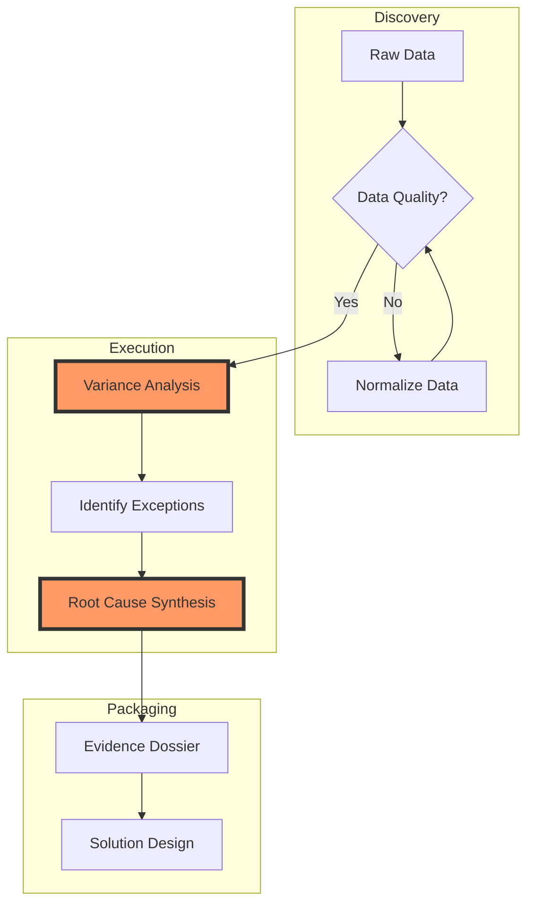

# Example: Complex Audit Process Flow

This diagram uses the professional styling defined in the Mermaid Expert skill to visualize a multi-departmental audit findings flow.

## Key Styling Features
- **Subgraphs**: Clear separation of audit phases.
- **Decision Nodes**: Explicit quality checks.
- **Highlights**: Important analysis nodes are colored for focus.
