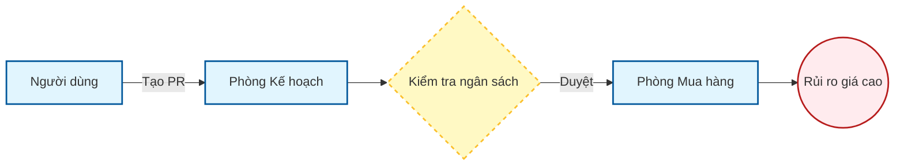

# Process Mapping Skill

Kỹ năng này hướng dẫn Agent cách chuyển đổi các văn bản quy trình phức tạp thành các cấu trúc dữ liệu trực quan và có thể kiểm chứng được.

## When to Use This Skill

- Khi nhận được các file SOP (Standard Operating Procedure) hoặc Policy từ khách hàng.
- Khi cần xác định kẽ hở giữa "Quy trình lý thuyết" và "Thực thi thực tế".
- Trước khi thiết kế các bài test dữ liệu (để biết cần lấy dữ liệu tại bước nào).

## Core Capabilities

### 1. Phân tách SOP (SOP Decomposition)
- Trích xuất các thực thể chính (Actors), hành động (Actions), và các điều kiện rẽ nhánh (Conditions).
- Nhận diện các "Điểm mù" trong quy trình (Các bước không rõ người chịu trách nhiệm hoặc không có bằng chứng đầu ra).

### 2. Trực quan hóa quy trình (Mermaid Visualization)
- Sử dụng Mermaid JS để vẽ Flowchart chính xác.
- Phân tách theo dạng "Swimlane" để thấy rõ sự phối hợp giữa các phòng ban.

### 3. Ma trận Điểm kiểm soát (Control Point Matrix)
- Xác định các điểm kiểm soát (Approval, Reconciliation, Verification).
- Phân loại kiểm soát: Manual (Người làm) vs Automated (Hệ thống làm).

## Key Patterns

### Pattern 1: The "Input-Process-Output" (IPO) Trace
Với mỗi bước trong quy trình, Agent phải xác định:
- **Input**: Tài liệu/Dữ liệu đầu vào là gì? Có được ký duyệt không?
- **Process**: Hành động cụ thể là gì? Có sử dụng công cụ hỗ trợ không?
- **Output**: Bằng chứng để lại là gì? (Phiếu, Log hệ thống, Email).

### Pattern 2: Separation of Duties (SoD) Check
Agent phải kiểm tra xem có sự xung đột lợi ích không:
- Người lập yêu cầu (PR) có đồng thời là người phê duyệt (Approve) không?
- Người nhận hàng (GRN) có đồng thời là người kiểm đếm chất lượng (QC) không?

## Quick Start (Mermaid Template)

## Best Practices
- **Verify Evidence**: Quy trình không có bằng chứng đầu ra (Output) được coi là "không kiểm soát được".
- **Identify Hand-offs**: Các điểm chuyển giao giữa 2 bộ phận thường là nơi xảy ra rủi ro cao nhất.
- **Complexity is a Risk**: Quy trình càng nhiều bước rẽ nhánh và ngoại lệ thì càng dễ bị bypass.

## Common Pitfalls
- **Copy-Paste SOP**: Chỉ liệt kê lại nội dung SOP mà không phân tích logic.
- **Bỏ qua ngoại lệ**: Chỉ vẽ luồng "Happy Path" (luồng đúng) mà bỏ qua các trường hợp sai lỗi/hủy bỏ.
- **Thiếu ID**: Không đánh mã ID cho các điểm kiểm soát (CP-xx) dẫn đến khó khăn khi đối chiếu dữ liệu sau này.

## Assistant Contract
- **Trigger**: Khi cần bóc tách SOP, handoff hoặc workflow vận hành.
- **Input**: SOP text/file, stakeholder notes, system screenshots nếu có.
- **Output**: process map, control point table, risk handoff notes.
- **Artifacts**: `Projects/<case_id>/working/process-map.md`, `control-point-table.md`.
- **Failure Modes**: nhầm SOP với thực tế, bỏ sót workaround, thiếu control owner.
- **Acceptance Checklist**: mọi handoff có owner; mọi critical control point có risk và evidence source.
