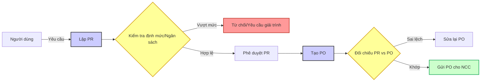

# GOLD STANDARD: SƠ ĐỒ QUY TRÌNH MUA HÀNG (STYLED MERMAID)

## 1. Sơ đồ quy trình (Flowchart)

## 2. Danh mục điểm kiểm soát (Mapping)

| ID CP | Tên điểm kiểm soát | Logic kiểm tra (Validation Rules) |
| --- | --- | --- |
| **CP1** | Budget Check | Tổng giá trị PR <= Ngân sách còn lại của bộ phận. |
| **CP2** | PR-PO Match | Mã vật tư, Số lượng và Đơn giá trên PO phải khớp với PR đã duyệt. |

## 3. Ghi chú chuyên gia (Expert Notes)
- Các điểm màu **Vàng** là nơi rủi ro rò rỉ (Leakage) cao nhất nếu không được thực thi nghiêm túc.
- Điểm **CP2** thường bị bỏ qua trong các doanh nghiệp vận hành thủ công, dẫn đến việc bộ phận Thu mua tự ý thay đổi số lượng/giá so với yêu cầu ban đầu.
