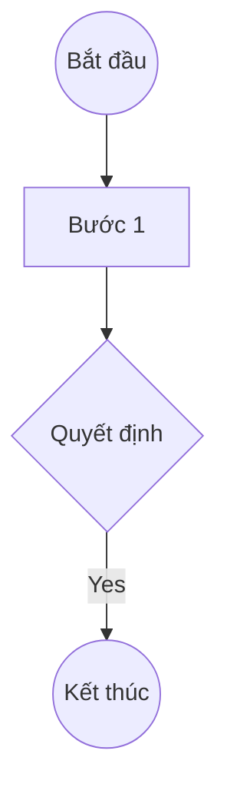

# TEMPLATE: PROCESS MAP (SƠ ĐỒ QUY TRÌNH)

## 1. THÔNG TIN CHUNG
- **Tên quy trình:**
- **Mục tiêu quy trình:**
- **Chủ quản (Process Owner):**

## 2. SƠ ĐỒ LUỒNG (FLOWCHART)

## 3. MÔ TẢ CÁC BƯỚC (PROCESS STEPS)
| STT | Tên bước | Trách nhiệm (Actor) | Input | Output |
| --- | --- | --- | --- | --- |
| 1 | | | | |

## 4. CÁC ĐIỂM RỦI RO DỰ KIẾN (POTENTIAL RISK POINTS)
- [ ] R-01: (Mô tả điểm có thể xảy ra sai sót hoặc gian lận)
- [ ] R-02: ...
