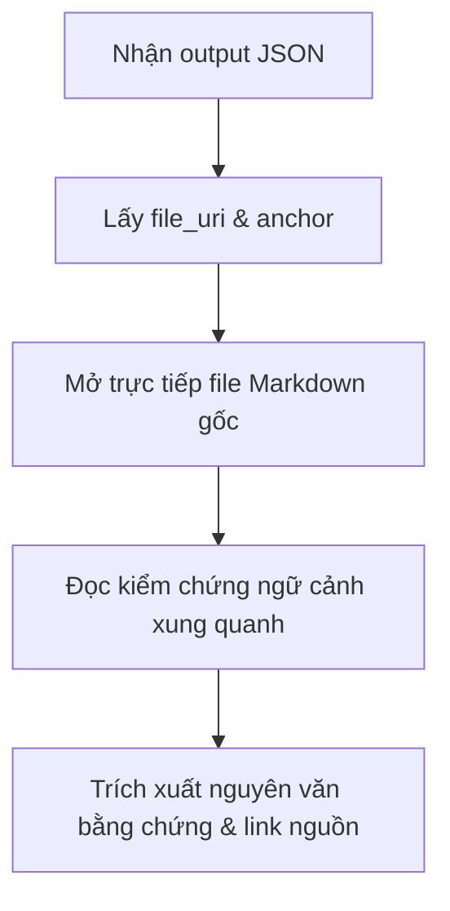

# Workflow: Hướng dẫn Truy vấn Đồ thị Tri thức Đầy đủ & Chính xác (query-graph-workflow)

Tài liệu này hướng dẫn cách sử dụng công cụ truy vấn `query_graph.py` để tìm kiếm thông tin, truy vết mối quan hệ đồ thị (Graph Traversal) và trích xuất dữ liệu tham chiếu (Citations) chính xác từ Knowledge Base.

---

## 1. Cấu trúc Lệnh Truy vấn Cơ bản

```powershell
uv run C:/Users/kira7/.gemini/config/skills/pdf-to-kb/scripts/query_graph.py \
  --kb-dir <duong_dan_kb> \
  --project-id <project_id> \
  [--id <concept_id>] \
  [--search "<tu_khoa>"] \
  [--mode <neighbors | paths | search>] \
  [--depth <1..4>] \
  [--full-json]
```

---

## 2. Các Chế độ Truy vấn (Modes) & Khi nào sử dụng

| Chế độ (`--mode`) | Mô tả | Tham số kết hợp | Ứng dụng thực tế |
| :--- | :--- | :--- | :--- |
| **`neighbors`** (Mặc định) | Tìm khái niệm trùng khớp và liệt kê các khái niệm lân cận trực tiếp. | `--id` hoặc `--search` | Tra cứu nhanh định nghĩa của một khái niệm và các khái niệm liên quan trực tiếp xung quanh nó. |
| **`paths`** | Trả về các đường đi liên kết đa tầng giữa khái niệm mục tiêu và các khái niệm khác. | `--id` hoặc `--search`, `--depth` | Phân tích quan hệ phụ thuộc sâu (ví dụ: tìm tất cả các nguồn dữ liệu bổ trợ cho một phương pháp tính). |
| **`search`** | Tập trung tìm kiếm toàn văn FTS5 trên các file Markdown KB, xếp hạng bằng thuật toán BM25 cải tiến. | `--search` | Dùng khi không nhớ rõ Concept ID, muốn tìm các đoạn văn bản chứa từ khóa cụ thể. |

---

## 3. Các Tham số Tối ưu hóa Độ chính xác

### A. Phân vùng phạm vi (Scoping Filters)
Để tránh lẫn lộn thông tin giữa các tài liệu khác nhau (như GHG Protocol và TCVN ISO 14064-1), bắt buộc phải sử dụng các bộ lọc phân vùng:
* `--project-id`: Luôn luôn đặt là `esg`.
* `--collection-id`: Giới hạn trong bộ sưu tập (ví dụ: `ghg_protocol` hoặc `tcvn_iso_14064_1_2025`).
* `--source-id`: Giới hạn trong nguồn tài liệu cụ thể (ví dụ: `tcvn_iso_14064_1_2025`).

### B. Độ sâu đồ thị (`--depth`)
* Mặc định là `1` (chỉ lấy các node nối trực tiếp).
* Hỗ trợ tối đa là `4`. Khuyên dùng độ sâu `2` khi cần phân tích luồng logic: `[EmissionSource] -> [Requirement] -> [ControlPoint]`.

### C. Xuất đầy đủ dữ liệu dẫn chứng (`--full-json`)
* Mặc định, output của command line sẽ được thu gọn (compacted) để dễ đọc.
* **BẮT BUỘC** truyền tham số `--full-json` khi bạn cần lấy toàn bộ dữ liệu nội dung thô (`matched_text`) và đường dẫn liên kết (`file_uri`) để phục vụ cho việc lập báo cáo kiểm toán hoặc nạp ngữ cảnh cho LLM.

---

## 4. Quy tắc Trực quan hóa Dẫn chứng trên Chat (Visual Chat Evidence Rule)
*   **Nguyên tắc**: Do giới hạn kỹ thuật của IDE chat không thể tự động cuộn dòng khi click link tuyệt đối từ cửa sổ chat, Agent **bắt buộc** phải trực quan hóa dẫn chứng ngay trên giao diện chat.
*   **Cách thực hiện**: Khi đưa ra bất kỳ trích dẫn nào, ngoài việc cung cấp liên kết tuyệt đối trỏ về file nguồn, Agent phải hiển thị một khối code block trích xuất nguyên văn văn bản thực tế kèm theo số dòng thực tế ở hai bên (tối thiểu 3 dòng trước và sau thẻ neo).
*   *Ví dụ định dạng hiển thị*:
    > 📖 **Dẫn chứng tại [filename.md: Dòng 29-32](file:///D:/...)**
    > ```markdown
    > 29: <a id="anchor_name"></a>
    > 30: ## Heading Text
    > 31: Actual content line 1...
    > 32: Actual content line 2...
    > ```

---

## 5. Quy trình Truy cập Nguồn và Trích xuất Dẫn chứng (Source Access & Extraction)

Sau khi có kết quả trả về từ `query_graph.py` hoặc `answer_question.py`, Agent **bắt buộc** thực hiện quy trình trích xuất sau để đảm bảo tính pháp lý/kiểm toán:



### Bước 1: Trích xuất đường dẫn vật lý (`file_uri` & `anchor`)
Từ kết quả JSON của truy vấn (yêu cầu bật `--full-json`), định vị trường `file_uri` hoặc `file_path` và `anchor` tương ứng của Concept hoặc kết quả tìm kiếm toàn văn.
* *Ví dụ trong JSON*:
  ```json
  "file_uri": "file:///D:/BusinessAnalyze/LS/LS_Auditor_System/Projects/ESG/kb/tcvn_iso_14064_1_2025/04_principles.md#tcvn_principles_relevance"
  ```

### Bước 2: Truy cập trực tiếp tài liệu gốc trên đĩa cứng
* **Độc giả/Kiểm toán viên**: Click trực tiếp vào đường link `file:///D:/...` được in trên giao diện chat hoặc báo cáo để IDE tự động mở tệp Markdown tương ứng và cuộn thẳng tới thẻ neo `id` (anchor).
* **AI Agent**: Sử dụng tool `view_file` để mở file vật lý tại đường dẫn `file_path` đó.

### Bước 3: Kiểm chứng ngữ cảnh (Context Verification)
* Tuyệt đối không chỉ tin tưởng vào đoạn trích tóm tắt (`matched_text` / `claim` trong JSON). 
* Đọc tối thiểu **5 dòng trước và 5 dòng sau** thẻ neo trong file Markdown gốc để nắm bắt toàn bộ ngữ cảnh, các điều kiện ràng buộc pháp lý (ví dụ: từ khóa "phải", "nên", "có thể", "ngoại trừ...").

### Bước 4: Trích xuất Dẫn chứng nguyên văn (Evidence Extraction)
1. Sao chép chính xác đoạn văn bản cần chứng minh (không tự dịch lại, không diễn dịch hoặc thay đổi từ ngữ).
2. Tạo liên kết vật lý trỏ trực tiếp đến anchor của file Markdown theo đúng chuẩn [CITATION_STANDARDS.md](file:///d:/BusinessAnalyze/LS/LS_Auditor_System/.agents/rules/CITATION_STANDARDS.md):
   * *Mẫu Markdown*: `Xem thêm tại [TCVN ISO 14064-1:2025 (Điều 4.2)](file:///D:/BusinessAnalyze/LS/LS_Auditor_System/Projects/ESG/kb/tcvn_iso_14064_1_2025/04_principles.md#tcvn_principles_relevance).`
3. Đóng gói đoạn trích nguyên văn này vào báo cáo hoặc tệp bằng chứng `evidence_pack`.

---
*Status: ACTIVE WORKFLOW*
