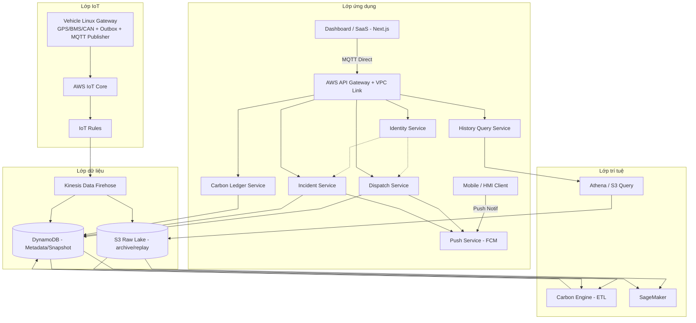

# LeOS Enterprise Architecture Blueprint

## Tài liệu gốc định vị thương hiệu, kiến trúc và nền tảng nhất quán

**Version:** 1.1  
**Date:** 2026-03-19  
**Trạng thái:** Nguồn chuẩn duy nhất

---

## 1. Định vị thương hiệu LeOS

### 1.1 Cốt lõi thương hiệu

**LeOS** là nền tảng **Industrial Mobility, Energy & Carbon Intelligence** cho doanh nghiệp vận hành đội xe công nghiệp (khởi đầu từ ngành mỏ), giúp:

- Vận hành đội xe theo thời gian thực.
- Kiểm soát năng lượng và hiệu suất.
- Chuẩn hóa đo lường phát thải carbon để sẵn sàng cho ESG (Môi trường - Xã hội - Quản trị) và các yêu cầu tuân thủ.

### 1.2 Giá trị cốt lõi

- **Độ tin cậy trong môi trường khắc nghiệt:** hoạt động ổn định khi mất sóng.
- **Ưu tiên hiệu quả vận hành:** tạo tác động trực tiếp lên vận hành trước.
- **Từ dữ liệu đến trí tuệ vận hành:** telemetry trở thành năng lực ra quyết định.
- **Sẵn sàng cho carbon ngay từ thiết kế:** tích hợp carbon engine từ kiến trúc lõi.

### 1.3 Tuyên bố vị thế

**Từ vận hành logistics đến nền tảng trí tuệ công nghiệp.**  
Mining là điểm vào thị trường; đích đến là nền tảng đa ngành cho mobility + energy + carbon.

---

## 2. Phạm vi nền tảng

### 2.1 Giai đoạn hiện tại (MVP - Minimum Viable Product)

- 1 site mining, khoảng 20 xe.
- GPS 2 giây, BMS (Battery Management System) 5 giây.
- Dashboard gần realtime (5-10 giây).
- Môi trường có khả năng mất sóng nhiều giờ.
- Mục tiêu bắt buộc: không mất dữ liệu telemetry.

### 2.2 Phạm vi theo Roadmap 36 tháng

- **Phase I (0-6 tháng):** vận hành ổn định cho 20-50 xe tại 1 site, hoàn thiện telemetry pipeline, tracking/dispatch/dashboard và data foundation (AWS RDS, Redis, Timestream, S3).
- **Phase II (6-18 tháng):** mở rộng multi-fleet, tăng tự động hóa vận hành, chuẩn hóa service boundary, nâng năng lực vận hành và bảo mật để sẵn sàng scale.
- **Phase III (18-36 tháng):** mở rộng multi-site, multi-tenant SaaS, bổ sung Energy/Carbon intelligence, và chuyển các runtime dịch vụ mục tiêu sang Kubernetes theo lộ trình.

### 2.3 Năng lực nền tảng (ổn định xuyên suốt các phase)

- Fleet Operating System: tracking, dispatch, trip lifecycle, alerts.
- Data Platform: realtime cache, time-series, raw lake và business database.
- Energy & Battery Intelligence: SOC, hiệu suất, cảnh báo vận hành pin.
- Carbon Intelligence Engine: Scope 1 triển khai từ Phase II; Scope 2 mở rộng theo phase; Scope 3 ngoài phạm vi roadmap hiện tại.
- AI/ML Intelligence: inference trước, training lifecycle và Generative AI mở rộng theo phase.

### 2.4 Quy tắc ưu tiên phạm vi

- Mọi quyết định `Must-have / Nice-to-have / Out-of-scope` phải bám theo ma trận `module-feature/phase` tại `7.1`.
- Nếu có xung đột giữa mô tả tổng quan và ma trận chi tiết, ưu tiên ma trận `7.1` làm nguồn chuẩn.

---

## 3. Architecture Principles

1. **Offline-first tại edge:** dùng cơ chế store-and-forward của T-Box nếu đã đạt chuẩn; nếu chưa đạt thì dùng SQLite outbox cục bộ.
2. **Kết nối thiết bị qua MQTT:** dùng MQTT (Message Queuing Telemetry Transport), bảo mật bằng TLS (Transport Layer Security) và chứng chỉ thiết bị.
3. **Idempotent mặc định:** mọi message có `message_id`, ingest có dedupe.
4. **Tách biệt trách nhiệm:** tách telemetry pipeline và business logic.
5. **Sẵn sàng multi-tenant:** tenant isolation từ mô hình dữ liệu, API và quyền truy cập.
6. **Ưu tiên nền tảng bảo mật:** X.509 (chứng chỉ thiết bị), IAM (Identity and Access Management) theo nguyên tắc least privilege, mã hóa khi truyền và khi lưu.
7. **Observability là bắt buộc:** phải có metrics/alerts để vận hành production ổn định.
8. **Mở rộng mà không phải rewrite:** nâng cấp theo từng phase, hạn chế thay đổi kiến trúc lõi.
9. **Blockchain là tùy chọn:** chỉ dùng cho verification/compliance khi có nhu cầu.

---

## 4. Target Architecture

### 4.1 System Overview

`Sensor/CAN/BMS/GPS -> Edge Device -> IoT Core -> Kinesis Firehose -> S3 / DynamoDB -> Application Layer -> Dashboard/SaaS`

## MVP Architecture Decision (Current)

- Device operational state is derived from **IoT Core MQTT Direct** and cached in **DynamoDB**.
- Public ingress đi theo `AWS API Gateway -> VPC Link -> ECS business containers`.
- ECS Fargate runs business containers cho:
  - `identity-service` (Authentication & User/Role management)
  - `history-query-service`
  - `dispatch-service`
  - `incident-service`
  - `carbon-ledger-service`
- Latest-state được cung cấp qua **MQTT Direct** từ IoT Core cho Dashboard. Khi khởi tạo, Dashboard gọi API qua Lambda để lấy snapshot từ **DynamoDB**.
- Mobile Push Notifications (New Trip/Alerts) được kích hoạt bởi `dispatch-service` hoặc `incident-service` qua **Firebase (FCM)**.
- Telemetry history is routed by **Kinesis Data Firehose** to S3 and DynamoDB.
- Raw archive is routed directly via **Kinesis Data Firehose** to S3.
- **DynamoDB** is the source of truth for business entities and workflow data.
- **Shared Cache & Lock:** Sử dụng DynamoDB (Conditional Writes) dành cho distributed locking.

**Runtime execution references**

- [04_MVP_Execution_Plan.md](./04_MVP_Execution_Plan.md): master document cho execution và tài liệu triển khai chi tiết của MVP.
- [services/](./services/): service logic docs cho từng business container.
- [apps/](./apps/): frontend app contracts cho `dashboard` và `mobile`.
- [infras/](./infras/): component docs chi tiết theo platform component và managed services.
    - [infras/06_ETL_and_History_Hub.md](./infras/06_ETL_and_History_Hub.md) (Raw Archive / History ETL)

### 4.2 Application Layer

- Web app: Next.js.
- Mobile / HMI app: Flutter (hoặc client tương đương ở phase triển khai cụ thể).
- Public application entrypoint: `AWS API Gateway` phía trước `ALB`.
- Domain runtime chạy trên ECS Fargate gồm:
  - `identity-service`
  - `latest-state-query-service`
  - `timeseries-query-service`
  - `longterm-records-service`
  - `dispatch-service`
  - `incident-service`
  - `carbon-ledger-service`
- Application clients chỉ đi qua `AWS API Gateway` và `VPC Link`; không gọi trực tiếp business containers.
- RBAC + tenant isolation thực thi theo 2 lớp:
  - Coarse guard tại access layer phía trước ALB (check token/tenant_id).
  - Domain-specific authorization rules tại từng service sở hữu nghiệp vụ (check x-leos-role).

Ghi chú:
- UI có thể tiếp tục triển khai trên Vercel hoặc hạ tầng web riêng.
- Next.js không còn là lớp API lõi trong kiến trúc MVP chuẩn; API lõi đi qua `AWS API Gateway + VPC Link` vào service runtime trên ECS Fargate.

### 4.3 IoT Layer

- Linux Gateway trên xe: Collector + Normalizer + Outbox (ưu tiên cơ chế sẵn có của T-Box; fallback SQLite) + MQTT Publisher + Health Monitor.
- AWS IoT Core (MQTT/TLS, X.509 auth).
- Hai luồng dữ liệu tách biệt:

  1. Telemetry / history data:
  - Edge ghi dữ liệu vào outbox cục bộ (T-Box native / SQLite).
  - Dữ liệu được đẩy lên AWS IoT Core, sau đó dùng **Kinesis Data Firehose** để lưu trữ vào S3 và DynamoDB.
  - Luồng này phục vụ history, audit, replay, analytics thông qua **Athena**.

  2. Operational state (Latest State):
  - Dashboard subscribe trực tiếp vào MQTT topics của IoT Core để nhận cập nhật real-time.
  - Khi khởi động, Dashboard gọi Lambda để lấy trạng thái mới nhất từ **DynamoDB**.

- Topic chuẩn telemetry (nếu dùng MQTT fallback hoặc non-telemetry events):
  - `t/{tenantId}/v/{vehicleId}/gps`
  - `t/{tenantId}/v/{vehicleId}/bms`
  - `t/{tenantId}/v/{vehicleId}/event`

- Shadow policy:
  - Chỉ chứa current operational state như `error_state`, `connectivity`, `trip_phase`, `charger_status`, `mode`, `last_summary`.
  - Không dùng Shadow làm nơi lưu telemetry lịch sử mật độ cao.

### 4.4 Data Layer

- **Operational state:** DynamoDB (Last Known State).
- **Near history:** DynamoDB / S3 (via Kinesis Firehose).
- **Raw long-term:** S3 Data Lake (replay/backfill/training/audit/history-reports).
- **Nguồn dữ liệu nghiệp vụ chuẩn:** DynamoDB (NoSQL Single-table design).
- **Shared Cache & State Store:** DynamoDB dành cho chống trùng (Idempotency) và task locking.

### 4.5 Intelligence Layer

- Energy/Battery analytics: SOC (State of Charge), degradation, charging efficiency.
- Carbon engine:
  - Scope 1 (CO2 trực tiếp từ nhiên liệu/hoạt động vận hành): `CO2 = Fuel_used x Emission_factor`
  - Scope 2 (CO2 từ điện mua vào): `CO2 = điện tiêu thụ (kWh) x grid emission factor (kgCO2/kWh)` theo khu vực và thời điểm.
- Năng lực `Verified Carbon Intelligence` (không phụ thuộc blockchain):
  - Emission factor versioning: lưu `fuel_type`, `region`, `valid_from`, `valid_to`, `source`, `version_id`; mọi kết quả carbon phải gắn `factor_version_id`.
  - Methodology versioning: lưu `name`, `boundary_rule`, `scope_type`, `version`; mọi kết quả carbon phải gắn `methodology_version_id`.
  - Carbon granularity: hỗ trợ `CO2 per shipment/customer/route/ton-km`, không chỉ theo xe; bắt buộc có mapping `trip -> shipment`, payload weight và distance allocation logic.
  - Carbon ledger + data lineage: lưu đủ khóa truy vết `input_snapshot_id`, `trip_id`, `fuel_data_id`, `payload_id`, `factor_version_id`, `methodology_version_id`; hỗ trợ replay phép tính phục vụ audit.
  - Evidence pack generator: xuất gói bằng chứng gồm raw telemetry reference, fuel log, trip record, factor/methodology version và timestamp; đầu ra JSON/PDF, hash là tùy chọn.
  - Carbon benchmark + optimization layer (theo phase): benchmark intensity theo tuyến/loại xe/percentile và gợi ý tối ưu vận hành để giảm phát thải.
- Carbon ledger theo trip/day/month/vehicle/shipment/tenant.
- Realtime inference: cảnh báo rủi ro/anomaly cho dashboard.
- Batch/continuous training: S3 + RDS labels -> Processing -> Training -> Registry -> Endpoint.
- Generative AI (trợ lý nghiệp vụ, không tự động ra quyết định):
  - `Dispatch Copilot`: gợi ý điều phối xe/vehicle_user theo vị trí, SOC, tải công việc.
  - `Incident Assistant`: tóm tắt sự cố, gợi ý RCA (Root Cause Analysis) và bước xử lý theo SOP (Standard Operating Procedure).
  - `Ops Copilot`: hỏi đáp vận hành tự nhiên, truy vấn nhanh KPI/trạng thái đội xe.
  - `Auto Report`: sinh tóm tắt ca/ngày/tuần và thuyết minh carbon/compliance.
- Chiến lược triển khai mô hình GenAI:
  - Ưu tiên `prompt engineering + RAG` (Retrieval-Augmented Generation) + guardrail trong giai đoạn đầu.
  - Không mặc định fine-tune ở MVP/Phase II.
  - Chỉ cân nhắc fine-tune khi đo lường cho thấy RAG không đạt chất lượng mục tiêu.
- Nguyên tắc an toàn:
  - AI chỉ ở chế độ `đề xuất + con người phê duyệt` cho các tác vụ điều phối/an toàn.
  - Bắt buộc lưu audit prompt/kết quả/quyết định cuối cùng.
- Bắt đầu nhỏ ở MVP, mở rộng theo nhu cầu accuracy và business value.

### 4.6 End-to-End Flow

1. Thiết bị trên xe (GPS/BMS/CAN) gửi dữ liệu vào Linux Gateway.
2. Gateway chuẩn hóa message, ghi vào outbox cục bộ.
3. Gateway publish telemetry qua MQTT/TLS lên AWS IoT Core.
4. IoT Rules kích hoạt **Kinesis Data Firehose** để stream dữ liệu vào S3 (Raw) và DynamoDB (Latest/History).
5. Dashboard subscribe vào MQTT Topic để nhận cập nhật tức thời (< 1 giây).
6. Khi Dashboard khởi tạo, nó gọi API Gateway -> Lambda để lấy snapshot trạng thái từ **DynamoDB**.
7. `history-query-service`, `dispatch-service`, `incident-service`, `carbon-ledger-service` xử lý nghiệp vụ theo domain tương ứng.
8. Application clients (web/mobile/HMI) truy cập thông qua `AWS API Gateway` và `VPC Link`.
9. Carbon Engine (ETL Pipeline) chạy trên S3 / Athena / Lambda.

### 4.7 Layer và dịch vụ chính

Bản đồ nhanh layer -> dịch vụ (tham chiếu):

- Lớp ứng dụng -> Next.js UI / Flutter app / HMI client + `AWS API Gateway` + `VPC Link` + business containers trên ECS Fargate.
- Lớp IoT -> Linux Gateway, AWS IoT Core, MQTT Broker.
- Lớp dữ liệu -> **DynamoDB**, **S3 Data Lake**, **Kinesis Firehose**.
- Lớp trí tuệ -> Carbon Engine (ETL), Athena, SageMaker.
- Năng lực dùng chung -> IAM, KMS, TLS, RBAC, CloudWatch/CloudTrail, DLQ/replay.

Chi tiết chức năng từng layer đã được mô tả tại `4.2`, `4.3`, `4.4`, `4.5`.

### 4.8 Primary Use Cases

**Kịch bản A - Giám sát thời gian thực**

- Mục tiêu: hiển thị trạng thái xe gần realtime (5-10 giây) trên Dashboard.

**Kịch bản B - Phân tích lịch sử**

- Mục tiêu: truy vấn lịch sử telemetry và hiển thị báo cáo/biểu đồ theo thời gian.

**Kịch bản C - Báo cáo carbon**

- Mục tiêu: tính toán và lưu `carbon_ledger`, đồng thời xuất `evidence pack` để chứng minh số liệu cho dashboard, khách hàng và báo cáo ESG.

**Kịch bản D - Cảnh báo ML (khi bật)**

- Mục tiêu: sinh cảnh báo từ ML và ghi kết quả vào Redis/RDS cho realtime + audit.

Luồng kỹ thuật chi tiết của toàn hệ thống đã được mô tả tại `4.6`.

### 4.9 Sơ đồ Mermaid

---

## 5. Core Data Model

### 5.1 Data Domains & Source of Truth

| Data domain | Source of truth | Mục đích chính |
|---|---|---|
| Current operational state | DynamoDB / MQTT | Hiển thị trạng thái xe gần realtime |
| Telemetry lịch sử gần | DynamoDB / S3 (Athena) | Truy vấn theo thời gian, báo cáo vận hành |
| Dữ liệu gốc (raw) | S3 Data Lake | Replay/backfill, audit, huấn luyện ML |
| Dữ liệu nghiệp vụ | DynamoDB | Quản trị tenant, người dùng, xe, chuyến, phân quyền |
| Carbon/ML nghiệp vụ | S3 / DynamoDB | Lưu kết quả carbon, prediction, incident |

### 5.2 Core Business Entities (DynamoDB)

Nhóm tenant và phân quyền:
- `tenants`, `users`, `roles` (không dùng permissions table)

Nhóm vận hành:
- `vehicles`, `vehicles`, `sites`
- `trips`, `trip_events`, `maintenance_events`

Nhóm carbon/ML:
- `emission_factors` (versioned)
- `carbon_methodologies` (versioned)
- `carbon_ledger`
- `shipment_carbon_allocations`
- `carbon_input_snapshots`, `evidence_packs`
- `carbon_benchmarks`
- `ml_predictions`, `incidents`

### 5.3 Data Keys and Required Relationships

- Mọi bảng nghiệp vụ phải có `tenant_id` để đảm bảo tenant isolation.
- Quan hệ lõi:
  - `vehicles.tenant_id -> tenants.id`
  - `trips.vehicle_id -> vehicles.id`
  - `trip_events.trip_id -> trips.id`
  - `carbon_ledger.vehicle_id/trip_id` liên kết về `vehicles/trips`.
  - `carbon_ledger.factor_version_id -> emission_factors.id`
  - `carbon_ledger.methodology_version_id -> carbon_methodologies.id`
  - `shipment_carbon_allocations.trip_id/shipment_id` dùng để phân bổ CO2 theo shipment/customer/route/ton-km.
  - `carbon_input_snapshots.id` liên kết `carbon_ledger.input_snapshot_id` để replay kiểm toán.
- Bảng log/sự kiện nghiệp vụ không overwrite; chỉ append hoặc update có audit.

### 5.4 Telemetry Contract tối thiểu

- Trường bắt buộc: `message_id`, `tenant_id`, `vehicle_id`, `ts`, `payload`, `schema_version`.
- Quy tắc idempotent:
  - `message_id` là duy nhất theo `tenant_id + vehicle_id` trong cửa sổ dedupe.
  - Cửa sổ dedupe tối thiểu: 24 giờ.
- Chu kỳ heartbeat gợi ý: 30 giây.

### 5.5 Indexing và Partition tối thiểu

DynamoDB (GSI tối thiểu khuyến nghị):
- `trips(tenant_id, created_at)`
- `trip_events(trip_id, ts)`
- `vehicles(tenant_id, external_code)`
- `ml_predictions(tenant_id, created_at)`

S3 (partitioning khuyến nghị):
- `s3://.../raw/tenant={id}/dt=YYYY-MM-DD/vehicle={id}/...`

DynamoDB / S3:
- Partition key tối thiểu: `tenant_id`, `vehicle_id`.
- Retention theo phase: DynamoDB cho snapshot, S3 cho lịch sử toàn bộ.

### 5.6 Retention & Data Quality

Retention tối thiểu theo nhóm dữ liệu:
- Raw telemetry (S3): >= 90 ngày (có thể dài hơn theo yêu cầu compliance).
- Near history (S3/Athena): theo nhu cầu dashboard và phân tích vận hành.
- Dữ liệu nghiệp vụ/chuyến: theo chính sách vận hành và yêu cầu pháp lý của từng tenant.
- Carbon ledger và audit: ưu tiên lưu dài hạn.

Quy tắc data quality:
- Không chấp nhận bản ghi thiếu `tenant_id`, `vehicle_id`, `ts`.
- Chuẩn hóa timezone và đơn vị đo ngay tại ingest.
- Bản ghi lỗi schema phải vào DLQ, không ghi thẳng vào bảng nghiệp vụ.

---

## 6. Reliability, Operations, and Security

### 6.1 SLO/SLI (Service Level Objective / Service Level Indicator) và ngưỡng cảnh báo (MVP)

Định nghĩa áp dụng cho SLO trong mục này:
- `Breakdown`: dịch vụ chính không phục vụ được.
- `Interrupt`: dịch vụ còn chạy nhưng vượt ngưỡng vận hành đã chốt (`telemetry delay > 60 giây`, `dashboard không usable > 5 phút`, hoặc `tỷ lệ lỗi API chức năng chính > 5% trong 5 phút`).
- Đơn vị đo uptime chuẩn: `vehicle-minute` (xe active x phút).
- Công thức: `Uptime = 1 - (Downtime quy đổi / Tổng vehicle-minute)`.
- Downtime khu vực được quy đổi theo số xe active bị ảnh hưởng trong thời gian sự cố.
- Quy ước liên quan `Vehicle no data`: ngưỡng `> 60 giây` là ngưỡng cảnh báo; chỉ tính vào downtime `Interrupt` khi mức ảnh hưởng vượt ngưỡng scope đã chốt trong SLA (Service Level Agreement).

| Chỉ số | Mục tiêu MVP | Cách đo | Nguồn đo |
|---|---|---|---|
| Uptime hệ thống | `>= 99.5%` theo `vehicle-minute` | `Uptime = 1 - (Downtime quy đổi / Tổng vehicle-minute)` theo kỳ tháng | Dashboard SLA + log incident |
| Vehicle no data | Cảnh báo khi `> 60 giây` | So sánh `now - last_seen` theo từng xe | DynamoDB snapshot hoặc MQTT availability |
| Ingest error rate | Cảnh báo khi `> 2%` trong cửa sổ 5 phút | `error_count / total_ingest_requests` theo rolling window | CloudWatch metrics/logs |
| RPO (Recovery Point Objective) | `<= 5 phút` | Khoảng dữ liệu tối đa có thể mất khi sự cố | S3 raw + timestamp đối soát |
| RTO (Recovery Time Objective) | `<= 1 giờ` | Thời gian từ lúc incident bắt đầu đến lúc phục hồi dịch vụ | Incident timeline + monitoring |

### 6.2 Required Operations

| Hạng mục vận hành bắt buộc | Mục tiêu | Yêu cầu triển khai tối thiểu |
|---|---|---|
| Retry policy + DLQ (Dead Letter Queue) cho message lỗi | Không mất dữ liệu khi ingest lỗi tạm thời | Có cơ chế retry theo backoff; message lỗi đưa vào DLQ để xử lý lại |
| Replay/backfill từ S3 raw | Khôi phục dữ liệu khi bug/schema change/rebuild | Lưu raw data theo partition thời gian; có job replay theo khoảng thời gian |
| Monitoring + Alerting | Phát hiện sớm sự cố trước khi ảnh hưởng diện rộng | Theo dõi và cảnh báo tối thiểu: ingest throughput/latency/error, DynamoDB health, Lambda execution, heartbeat/outbox size |
| Runbook xử lý sự cố | Giảm thời gian phản ứng và thống nhất cách xử lý | Có SOP cho các lỗi chính: mất dữ liệu xe, ingest backlog, Redis/RDS lỗi, và quy trình rollback |

### 6.3 Security baseline

| Yêu cầu bảo mật tối thiểu | Mục đích | Cách triển khai tối thiểu |
|---|---|---|
| Xác thực thiết bị theo xe (`X.509 per vehicle`) | Ngăn thiết bị lạ gửi dữ liệu giả mạo | Mỗi xe có certificate riêng; thu hồi certificate khi thiết bị bị compromise |
| Mã hóa đường truyền (`TLS 1.2+`) | Chống nghe lén và sửa dữ liệu khi truyền | Bắt buộc TLS cho mọi kết nối device-cloud và service-service |
| Mã hóa dữ liệu lưu trữ (`at-rest`) | Giảm rủi ro lộ dữ liệu khi truy cập trái phép hạ tầng | Bật mã hóa cho DynamoDB/S3 bằng KMS (Key Management Service) |
| Phân quyền tối thiểu (`IAM least privilege`) | Hạn chế phạm vi thiệt hại nếu một service bị lộ quyền | Mỗi service role chỉ có quyền cần thiết, tách role ingest/api/admin |
| Nhật ký kiểm toán (`Audit trail`) | Truy vết được ai làm gì, khi nào | Ghi log bắt buộc cho đổi trạng thái chuyến, đổi quyền, đổi emission factor, đổi methodology |

---

## 7. Platform Roadmap

### 7.1 MVP Scope Matrix (Module-Feature-Phase)

Quy ước:

- `🟢` = Must-have
- `🟡` = Nice-to-have
- `⚪` = Out-of-scope

| Mô-đun            | Tính năng                                                            | Phase I (0-6 tháng) | Phase II (6-18 tháng) | Phase III (18-36 tháng) |
| ----------------- | -------------------------------------------------------------------- | ------------------- | --------------------- | ----------------------- |
| Theo dõi          | GPS realtime 2s                                                      | 🟢                  | 🟢                    | 🟢                      |
| Theo dõi          | Lịch sử hành trình                                                   | 🟢                  | 🟢                    | 🟢                      |
| Theo dõi          | Geofencing nâng cao                                                  | ⚪                  | 🟡                    | 🟢                      |
| BMS               | SOC/Voltage/Current/Temp/Error                                       | 🟢                  | 🟢                    | 🟢                      |
| BMS               | Phân tích suy giảm pin                                               | ⚪                  | 🟡                    | 🟢                      |
| Điều phối         | Tạo chuyến, gán xe, trạng thái chuyến                                | 🟢                  | 🟢                    | 🟢                      |
| Điều phối         | Tối ưu điều phối tự động                                             | ⚪                  | 🟡                    | 🟢                      |
| Dashboard         | KPI vận hành realtime (5-10s)                                        | 🟢                  | 🟢                    | 🟢                      |
| Dashboard         | Drill-down đa site/đa tenant                                         | ⚪                  | 🟡                    | 🟢                      |
| IoT/Edge          | Offline-first (outbox native của T-Box hoặc SQLite fallback, retry) + Shadow state sync | 🟢                  | 🟢                    | 🟢                      |
| Nền tảng dữ liệu  | DynamoDB + S3 + Kinesis Firehose + Athena                           | 🟢                  | 🟢                    | 🟢                      |
| Nền tảng dữ liệu  | Streaming queue phức tạp (Kafka/Kinesis-first)                       | ⚪                  | 🟡                    | 🟡                      |
| Nền tảng vận hành | Chuẩn hóa container + CI/CD (Continuous Integration/Continuous Deployment) cho K8s (Kubernetes) | ⚪ | 🟡 | 🟢 |
| Nền tảng vận hành | Chuyển Ingest runtime từ Lambda sang K8s service                     | ⚪                  | 🟡                    | 🟢                      |
| Nền tảng vận hành | Chuyển public gateway + domain services runtime sang K8s service     | ⚪                  | 🟡                    | 🟢                      |
| Carbon            | Scope 1 (CO2 trực tiếp) theo trip/ngày/xe                            | ⚪                  | 🟢                    | 🟢                      |
| Carbon            | Scope 2 (CO2 từ điện mua vào; công thức: kWh x grid emission factor) | ⚪                  | 🟡                    | 🟡                      |
| Carbon            | Scope 3 (CO2 gián tiếp trong chuỗi giá trị)                          | ⚪                  | ⚪                    | ⚪                      |
| Carbon            | Emission factor versioning + provenance                               | ⚪                  | 🟢                    | 🟢                      |
| Carbon            | Methodology versioning + boundary rules                               | ⚪                  | 🟢                    | 🟢                      |
| Carbon            | Carbon ledger với lineage + replay                                    | ⚪                  | 🟢                    | 🟢                      |
| Carbon            | CO2 per shipment/customer/route/ton-km                                | ⚪                  | 🟡                    | 🟢                      |
| Carbon            | Evidence pack generator (JSON/PDF, hash optional)                     | ⚪                  | 🟡                    | 🟢                      |
| Carbon            | Carbon benchmark layer (route/vehicle percentile)                     | ⚪                  | ⚪                    | 🟡                      |
| Carbon            | Carbon optimization engine (route/dispatch simulation)                | ⚪                  | ⚪                    | 🟡                      |
| ML                | Cảnh báo rule-based + inference nhẹ                                  | 🟡                  | 🟢                    | 🟢                      |
| ML                | Continuous training tự động toàn phần                                | ⚪                  | 🟡                    | 🟡                      |
| Generative AI     | Ops Copilot (hỏi đáp vận hành)                                       | ⚪                  | 🟡                    | 🟢                      |
| Generative AI     | Dispatch Copilot (gợi ý điều phối)                                   | ⚪                  | 🟡                    | 🟢                      |
| Generative AI     | Incident Assistant (tóm tắt sự cố + gợi ý RCA)                       | ⚪                  | 🟡                    | 🟢                      |
| Generative AI     | Auto Report (ca/ngày/tuần + carbon narrative)                        | ⚪                  | 🟡                    | 🟢                      |
| Tuân thủ          | Audit trail nghiệp vụ cốt lõi                                        | 🟢                  | 🟢                    | 🟢                      |
| Tuân thủ          | Blockchain verification                                              | ⚪                  | ⚪                    | ⚪                      |

### 7.2 Phase I (0-6 tháng): Nền tảng điều hành mining

- Live telemetry 20-50 xe.
- Dispatch + dashboard đi vào vận hành.
- Offline-safe ingestion hoàn chỉnh.
- Phạm vi kỹ thuật trọng tâm:
  - Ổn định luồng `IoT Core -> Device Shadow/Timestream/S3`.
  - Hoàn thiện service runtime cho nghiệp vụ cốt lõi (history query, dispatch, incident, carbon ledger).
  - Chuẩn hóa model dữ liệu nghiệp vụ trong `DynamoDB` và hợp đồng telemetry.
- Vận hành bắt buộc:
  - Thiết lập monitoring/alert cơ bản, DLQ/replay và runbook sự cố chính.
  - Thiết lập CI/CD tối thiểu, tách môi trường dev/staging/prod.

### 7.3 Phase II (6-18 tháng): Mở rộng Fleet OS

- Mở rộng multi-fleet.
- Tăng module maintenance/fuel/alerts.
- Chuẩn hóa service boundaries cho SaaS.
- Phạm vi kỹ thuật trọng tâm:
  - Tách service theo domain rõ hơn, giảm coupling giữa ingest và nghiệp vụ.
  - Nâng cấp ingest khi cần (Lambda -> ECS/Fargate) theo ngưỡng tải thực tế.
  - Chuẩn bị nền tảng K8s-ready: container chuẩn, Helm/Kustomize, policy bảo mật cơ bản.
- Vận hành và dữ liệu:
  - Củng cố tenant isolation, RBAC, audit trail và governance dữ liệu.
  - Thiết lập chỉ số SLO/SLI theo service để làm gate chuyển sang Phase III.
- Deliverable Generative AI (mức thí điểm có kiểm soát):
  - `Ops Copilot` bản beta: hỏi đáp KPI/trạng thái đội xe trên dữ liệu đã cấp quyền.
  - `Incident Assistant` bản beta: tóm tắt incident + gợi ý bước xử lý theo SOP.
  - `Auto Report` bản beta: sinh tóm tắt ca/ngày để người vận hành rà soát trước khi phát hành.
  - Triển khai theo hướng `prompt + RAG + guardrail`; chưa fine-tune mặc định.
  - Thiết lập bộ đánh giá chất lượng output (độ đúng, độ hữu ích, tỷ lệ cần chỉnh sửa thủ công).
  - Tất cả output AI bắt buộc qua bước `human review` trước khi dùng chính thức.

### 7.4 Phase III (18-36 tháng): SaaS multi-tenant + Energy/Carbon

- Tenant provisioning automation.
- Billing, API-first, governance.
- Scale lên nhiều site và nhiều khách hàng.
- Energy optimization dashboard và carbon reporting/compliance engine.
- Nâng chất lượng ML, governance dữ liệu và độ sẵn sàng enterprise.
- Chuyển đổi runtime sang Kubernetes (trọng tâm):
  - Chuyển `Ingest Function` từ Lambda/ECS sang dịch vụ container chạy trên K8s.
  - Chuyển các business containers sang dịch vụ container trên K8s phía sau access layer (UI có thể tiếp tục ở Vercel).
  - Thiết lập chuẩn deploy K8s: image registry, Helm/Kustomize, rollout/rollback, autoscaling.
  - Thiết lập vận hành K8s: quan sát hệ thống, cảnh báo, bảo mật runtime, runbook sự cố.
- Giữ nguyên Data Layer managed services trong phase này:
  - Tiếp tục dùng `DynamoDB`, `S3`, `Athena`.
  - Không chuyển các dịch vụ dữ liệu này sang tự vận hành trên K8s.
- Chiến lược cutover:
  - Chạy song song dịch vụ cũ/mới, canary theo từng service.
  - Chỉ cutover hoàn toàn khi đạt SLO độ trễ, tỉ lệ lỗi, và ổn định vận hành.
- Deliverable Generative AI (production):
  - `Dispatch Copilot`: gợi ý điều phối theo ràng buộc vận hành (xe, SOC, vị trí, tải).
  - `Ops Copilot`: mở rộng sang đa tenant/site với phân quyền và audit đầy đủ.
  - `Incident Assistant`: tích hợp sâu với alert pipeline và kho tri thức runbook.
  - `Auto Report`: phát hành báo cáo vận hành + carbon narrative theo mẫu chuẩn doanh nghiệp.
  - Chỉ fine-tune khi kết quả đánh giá chứng minh `prompt + RAG` chưa đạt ngưỡng chất lượng mục tiêu.
  - Thiết lập guardrail production: policy prompt, lọc dữ liệu nhạy cảm, đánh giá chất lượng output định kỳ.

---

## 8. KPI nền tảng

### 8.1 KPI vận hành

- Trips/vehicle/day
- Idle ratio
- Energy per km
- CO2 per shipment
- CO2 per customer
- CO2 per route
- CO2 per ton-km

### 8.2 KPI nền tảng

- Ingest latency
- Message success rate
- Data completeness rate
- Tenant onboarding lead time

### 8.3 KPI kinh doanh

- Cost per trip
- Fuel/Energy savings
- Incident reduction rate
- ESG reporting turnaround time

---

## 9. Architecture Decision Summary

| Quyết định | Lý do chính | Tác động |
|---|---|---|
| Dùng AWS IoT Core thay vì broker tự vận hành | Giảm độ phức tạp vận hành và bảo mật thiết bị | Ship nhanh hơn, giảm gánh nặng DevOps, phụ thuộc AWS nhiều hơn |
| Dùng outbox tại edge (ưu tiên T-Box native, fallback SQLite) | Đảm bảo không mất dữ liệu khi mất sóng | Tăng độ tin cậy dữ liệu; cần kiểm chứng ACK (acknowledgement)/retry/dedupe của T-Box trước khi bỏ SQLite fallback |
| Dùng AWS ElastiCache / Redis | Chống trùng (Idempotency) và khóa (Locking) | Thay bằng **DynamoDB (Conditional Writes)** để tối ưu chi phí và tính sẵn sàng. |
| Dùng `AWS API Gateway + ALB` | Tách access layer và business runtime | Thay bằng **VPC Link** để loại bỏ chi phí ALB cố định. |
| Dùng Timestream for InfluxDB | Nhất quán công nghệ Influx | Thay bằng **DynamoDB + S3 (Athena)** để đơn giản hóa vận hành và dễ migrate sang Private DC. |
| Dùng S3 làm raw source | Cần nguồn dữ liệu gốc cho replay/audit/training | Tăng khả năng khôi phục và mở rộng ML, cần quản trị lifecycle dữ liệu |
| Chưa dùng blockchain trong lõi MVP | Tránh over-engineering giai đoạn đầu | Giảm rủi ro triển khai, giữ tùy chọn mở rộng ở phase sau |

---

## 10. Non-Goals (Out of MVP Scope)

| Ngoài phạm vi MVP | Lý do chưa làm ngay | Điều kiện mở khóa |
|---|---|---|
| Streaming phức tạp ngay từ đầu (Kinesis-first) | Chưa cần cho quy mô MVP, tăng độ phức tạp vận hành | Kích hoạt khi ingest tăng mạnh hoặc backlog xuất hiện thường xuyên |
| Infer ML cho mọi message GPS 2 giây | Chi phí cao, lợi ích thấp ở giai đoạn đầu | Kích hoạt khi mô hình chứng minh giá trị rõ và hạ tầng inference đủ ổn định |
| Blockchain trong telemetry ingest path | Không phải nhu cầu cốt lõi vận hành | Kích hoạt khi có yêu cầu pháp lý/compliance bắt buộc về xác thực bất biến |
| Mở rộng ngoài use case vận hành cốt lõi quá sớm | Dễ gây loãng nguồn lực và trễ tiến độ | Kích hoạt khi KPI vận hành MVP đạt mục tiêu ổn định theo roadmap |

---

## 11. Document Governance

- `01_Architecture_Blueprint.md` là blueprint chuẩn ở cấp nền tảng, định vị và roadmap.
- `04_MVP_Execution_Plan.md` là master document chuẩn cho execution và tài liệu triển khai chi tiết của MVP.
- Các tài liệu trong `services/` là source chuẩn cho logic, endpoint ownership và data access của từng container/service.
- Các tài liệu trong `infras/` là component docs chi tiết theo service/platform component.
- Khi có thay đổi lớn về kiến trúc runtime MVP:
  - cập nhật `04_MVP_Execution_Plan.md` trước,
  - sau đó cập nhật các `infras/*.md`,
  - chỉ cập nhật blueprint khi thay đổi ảnh hưởng tới định hướng nền tảng hoặc target architecture.

---

## 12. Kết luận

LeOS được xác định là một nền tảng công nghiệp theo lộ trình rõ ràng:

- **MVP vận hành hiệu quả trong môi trường thực địa khắc nghiệt.**
- **Scale kỹ thuật có kiểm soát, không rewrite toàn bộ.**
- **Tăng trưởng tự nhiên từ Fleet OS sang Energy và Carbon Intelligence.**

Trong kiến trúc MVP chuẩn hiện tại, current operational state của thiết bị được cập nhật qua **MQTT Direct**; telemetry history đi qua **Kinesis Firehose** sang S3/DynamoDB; public API đi qua `AWS API Gateway + VPC Link`; business logic được tách thành các business containers riêng trên ECS Fargate lưu trữ tại **DynamoDB**.

Đây là nền tảng nhất quán giữa thương hiệu, sản phẩm và kiến trúc kỹ thuật.
