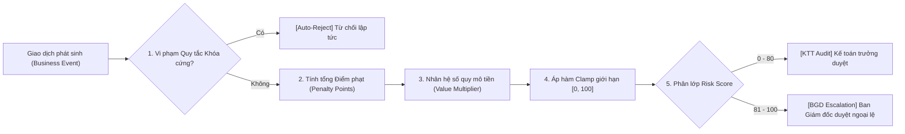

# ERP Smart Contract Blueprint - Financial & Operational Governance Framework

Tài liệu này là Bản thiết kế chuẩn (Blueprint) quy định cấu trúc và cơ chế vận hành của mô hình **Smart Contract Tài chính & Vận hành** trong hệ sinh thái ERP Portal (Next.js & ERPNext).

---

## I. ĐỊNH NGHĨA & NGUYÊN TẮC CỐT LÕI (DEFINITIONS & CORE PRINCIPLES)

### 1. Định nghĩa Smart Contract trong ERP
Smart Contract tài chính không phải là hợp đồng pháp lý thông thường, mà là **bộ quy tắc kiểm soát số hóa tự động chạy độc lập với ERP**. Nó đóng vai trò là một lớp bảo vệ (Governance Layer) giúp thu thập bằng chứng, chạy xác thực logic và đánh giá rủi ro định lượng nhằm **ngăn chặn các quyết định tài chính sai trước khi nghĩa vụ hoặc dòng tiền thực tế phát sinh**.

### 2. Các Nguyên tắc cốt lõi (Core Principles)
1. **Kiểm soát Quyết định, Không kiểm soát Chứng từ:** Ngăn chặn rủi ro từ chặng cam kết kinh tế (ký hợp đồng, cấp hạn mức) và chặng thiết lập định mức đầu vào, thay vì đối phó với chứng từ tĩnh sau khi sự việc đã xảy ra.
2. **Minh chứng lý do tồn tại (Why, not Who):** Mọi giao dịch hoặc thay đổi dữ liệu cấu hình phải tự chứng minh tính hợp lệ thông qua đối chiếu liên kết dữ liệu tự động, không dựa vào uy tín cá nhân người duyệt.
3. **Nguyên tắc Ưu tiên Bằng chứng số:** Hệ thống chỉ chấp nhận bằng chứng định lượng có thể xác minh độc lập (hóa đơn điện tử XML, tọa độ GPS, log chấm công thực tế), loại bỏ hoàn toàn các giải trình mang tính cảm tính.
4. **Quy trình 5 tầng chuẩn hóa:** Mọi luồng kiểm soát bắt buộc tuân thủ đúng pipeline khép kín:
   $$\text{Bằng chứng (Evidence)} \rightarrow \text{Xác thực (Validation)} \rightarrow \text{Chấm điểm (Risk Assessment)} \rightarrow \text{Quyết định (Decision)} \rightarrow \text{Lưu vết (Audit Trail)}$$
5. **Định tuyến động theo Điểm số Rủi ro:** Sử dụng thang điểm Risk Score (0-100) để phân lớp phê duyệt tự động. Giao dịch chuẩn (Risk Score thấp) do Kế toán trưởng duyệt; Giao dịch ngoại lệ rủi ro cao (Risk Score cao) leo thang lên Ban Giám đốc.
6. **Độc lập và ERP-Agnostic:** Logic Smart Contract chạy độc lập với cơ sở dữ liệu ERP, đảm bảo đóng vai trò lớp bảo vệ dữ liệu sạch trước khi đồng bộ chặng cuối.
7. ** Maker-Checker & Phân nhiệm (SoD):** Triệt tiêu hoàn toàn xung đột lợi ích bằng kiểm soát phân quyền (người lập không được duyệt đối soát, người thay đổi master data không được hạch toán chi).

## II. NGUYÊN TẮC VẬN HÀNH & CƠ CHẾ ĐÁNH GIÁ (GOVERNANCE MECHANICS & SCORING)

Mọi giao dịch khi đi qua Smart Contract sẽ được thẩm định qua 3 bước tự động: **(1) Kiểm tra Khóa cứng $\rightarrow$ (2) Tính Điểm phạt & Nhân hệ số $\rightarrow$ (3) Định tuyến phê duyệt**.

### 1. Quy tắc Khóa cứng chặng đầu (Hard-Block / Auto-Reject)
Nếu vi phạm một trong các quy tắc dưới đây, hệ thống sẽ **ngắt luồng xử lý và từ chối giao dịch lập tức** mà không cần chấm điểm rủi ro:
* **Double Payment:** Trùng hóa đơn $100\%$ (Mã số thuế + Số hóa đơn + Ngày hóa đơn + Số tiền).
* **MST Inactive:** Trạng thái mã số thuế của đối tác ngừng hoạt động, giải thể hoặc bỏ trốn (quét API Tổng cục Thuế).
* **SoD Violation:** Vi phạm phân nhiệm (User lập bút toán điều chỉnh trùng với User duyệt đối soát kho/tài sản).
* **Severe Overdue Debt:** Khách hàng nợ quá hạn nghiêm trọng ($>30$ ngày) cố tình đặt đơn hàng chịu mới.
* **Overdue Advance:** Nhân viên có khoản nợ tạm ứng cũ chưa hoàn ứng quá hạn $>15$ ngày yêu cầu tạm ứng thêm.

### 2. Công thức tính Risk Score ($RS$)

$$RS = \text{Clamp}\left(0, 100, \sum_{i=1}^{n} (P_i \times W_i) \times M_{\text{value}}\right)$$

* **$P_i$ (Penalty Points):** Điểm phạt của tiêu chí rủi ro thứ $i$ vi phạm (lấy trực tiếp từ cột Cách tính điểm).
* **$W_i$ (Weight):** Trọng số của tiêu chí đó trong Smart Contract của quyết định liên quan ($\sum W_i = 1$).
* **$M_{\text{value}}$ (Value Multiplier):** Hệ số nhân quy mô dòng tiền, giao dịch càng lớn thì mức độ nhạy cảm rủi ro càng nhân lên.
* **$\text{Clamp}(0, 100, x)$:** Hàm giới hạn điểm số luôn nằm trong đoạn $[0, 100]$.

### 3. Thiết lập các Hệ số

#### A. Hệ số nhân quy mô tiền ($M_{\text{value}}$)
* Giá trị giao dịch $< 20$ triệu VNĐ: $M_{\text{value}} = 1.0$
* Giá trị giao dịch từ $20$ triệu - $100$ triệu VNĐ: $M_{\text{value}} = 1.1$
* Giá trị giao dịch từ $100$ triệu - $500$ triệu VNĐ: $M_{\text{value}} = 1.25$
* Giá trị giao dịch $> 500$ triệu VNĐ: $M_{\text{value}} = 1.5$

#### B. Bảng Điểm phạt tiêu chuẩn ($P_i$)
* **Thiếu chứng từ bắt buộc loại 1** (Hóa đơn/Biên bản nghiệm thu): $+80$ điểm.
* **Thiếu chứng từ phụ loại 2** (Ảnh thực địa/Báo giá so sánh): $+30$ điểm.
* **Hóa đơn có rủi ro thuế cao** (doanh nghiệp nằm trong danh sách cảnh báo thuế): $+90$ điểm.
* **Vượt ngân sách tháng $\le 20\%$:** $+40$ điểm.
* **Vượt ngân sách tháng $>20\%$:** $+80$ điểm.
* **Đơn giá mua lệch so với lịch sử $5\% - 15\%$:** $+20$ điểm.
* **Đơn giá mua lệch so với lịch sử $>15\%$:** $+50$ điểm.
* **Tổng công nợ khách hàng đạt $90\% - 100\%$ hạn mức tín dụng:** $+40$ điểm.
* **Hao hụt kho vượt định mức kỹ thuật tiêu chuẩn:** $+60$ điểm.

### 4. Định tuyến Phê duyệt tích hợp Hệ sinh thái (Ecosystem Approval Routing)

Để tuân thủ thiết kế phân tầng của **LeOS Ecosystem** (Portkey SSO $\rightarrow$ Next.js Portal/Lark $\rightarrow$ Lele AI Agent $\rightarrow$ ERPNext/LeOS Backend), luồng phê duyệt và kiểm tra dựa trên Risk Score kết hợp phân vai trách nhiệm được quy định như sau:

### Phân vai Trách nhiệm (Role Definition)
* **Giám đốc bộ phận (GĐBP):** Phê duyệt nhu cầu nghiệp vụ thực tế (Business Need) và kiểm soát ngân sách nội bộ phòng ban ở chặng khởi tạo.
* **Giám đốc kiểm toán (GĐKT):** Thẩm định độc lập và kiểm soát tuân thủ quy trình đối với các giao dịch có độ rủi ro trung bình - cao, hoặc ký xác duyệt bỏ chặn kỹ thuật (Override) trước khi chuyển chặng cuối.
* **Ban Giám đốc (BGĐ):** Phê duyệt bảo lãnh hoặc duyệt ngoại lệ đối với các trường hợp vượt định mức lớn hoặc có rủi ro nghiêm trọng (Risk Score cao), hoặc ký phê duyệt ghi đè (Override) khóa cứng.
* **Người thực thi cuối (Final Sign-off):** Ký phê duyệt chặng cuối và chính thức ghi nhận giao dịch lên hệ thống (phụ thuộc vào loại nghiệp vụ).

### Ma trận Định tuyến Phê duyệt & Kiểm tra (Routing Matrix)

| Dải điểm Risk Score | Giám đốc bộ phận (GĐBP) | Giám đốc kiểm toán (GĐKT) | Ban Giám đốc (BGĐ) | Người thực thi cuối (Final Sign-off) |
| :--- | :--- | :--- | :--- | :--- |
| **0 - 20** *(Green)* | - | - | - | **Duyệt cuối & Thực thi** |
| **21 - 40** *(Orange)* | Duyệt nhu cầu | - | - | **Duyệt cuối & Thực thi** |
| **41 - 80** *(Orange)* | Duyệt nhu cầu | Kiểm soát tuân thủ | - | **Duyệt cuối & Thực thi** |
| **81 - 100** *(Red)* | Duyệt nhu cầu | Thẩm định kiểm toán | Duyệt ngoại lệ | **Duyệt cuối & Thực thi** |
| **Bất kỳ** *(Hard-Block)* | *Khóa tự động* | Duyệt bỏ chặn kỹ thuật | Duyệt giải trình Override | **Duyệt cuối & Thực thi** |

### Bảng định danh Người thực thi cuối theo phân hệ (Final Sign-off Mapping)

| Phân hệ nghiệp vụ | Phạm vi Quyết định | Nhân sự đảm nhiệm (Final Sign-off) |
| :--- | :--- | :--- |
| **Kế toán (Accounting)** | Đề xuất Thanh toán, Tạm ứng, Cam kết chi tiêu | **Kế toán trưởng (KTT)** |
| **Thủ kho & Kho (Warehouse)** | Điều chỉnh tồn kho, Xuất chuyển kho, Ghi nhận hao hụt | **Trưởng Ban Vận hành (COO)** |
| **Nhân sự & Chấm công (HR)** | Phê duyệt giờ OT, điều chỉnh chấm công | **Trưởng phòng Nhân sự (HRD)** |
| **Bán hàng & Tín dụng (Sales)** | Phê duyệt hạn mức tín dụng khách hàng, chiết khấu thương mại | **Giám đốc Thương mại (CCO)** |
| **Portal & Master Data** | Thay đổi tài khoản ngân hàng đối tác, thay đổi định mức cấu hình | **Portal Admin (IT)** |

---

## III. CHI TIẾT CÁC BẢNG KIỂM SOÁT PHÂN THEO NHÓM NGHIỆP VỤ ERP

### 1. Phân hệ Kế toán (Accounting Module)

Phân hệ này kiểm soát toàn bộ vòng đời cam kết chi tiêu và dòng ra của tiền tệ thông qua 8 gói quản trị đặc thù (Contract Packs):

#### A. Procurement Contract Pack (Mua sắm vật tư, hàng hóa)
* **Trọng tâm kiểm soát:** Đơn giá, số lượng, ngân sách phòng ban và rủi ro nhà cung cấp.

| Câu hỏi kiểm soát | Bằng chứng bắt buộc (Evidence) & Biến số (Variables) | Phương án kiểm soát số (Digital Control) | Cách tính điểm (Risk Scoring) |
| :--- | :--- | :--- | :--- |
| **1. Đơn giá mua có hợp lý so với lịch sử không?** | - Lịch sử giá mua vật tư 6 tháng (`historical_avg_price_6m`)  - Đơn giá trên hợp đồng/PO (`contract_unit_price`)  - Tỷ lệ lệch đơn giá (`price_deviation`) | - `historical_avg_price_6m = GetHistoricalAvgPrice(item_id, 6m)` - `price_deviation = (contract_unit_price - historical_avg_price_6m) / historical_avg_price_6m` | - `0.05 < price_deviation <= 0.15`: **+20 điểm** - `price_deviation > 0.15`: **+50 điểm** |
| **2. Ngân sách Cost Center có đủ khả dụng không?** | - Bảng dự toán ngân sách Cost Center (`cost_center_budget_available`)  - Tổng giá trị cam kết mua hàng (`contract_total_value`)  - Tỷ lệ vượt ngân sách dự kiến (`budget_overrun_ratio`) | - `cost_center_budget_available = budget_limit - budget_actual - budget_committed` - `budget_overrun_ratio = (contract_total_value - cost_center_budget_available) / cost_center_budget_available` | - `budget_overrun_ratio <= 0.20`: **+40 điểm** - `budget_overrun_ratio > 0.20`: **+80 điểm** |
| **3. Nhà cung cấp có đủ năng lực pháp lý không?** | - Trạng thái đăng ký MST đối tác từ Tổng cục Thuế (`tax_api_status`)  - Đánh dấu nhà cung cấp mới (`is_new_vendor`)  - Số lần giao hàng trễ lịch sử (`vendor_late_delivery_count`) | - `tax_api_status = GetTaxStatus(partner_tax_id)` - `is_new_vendor = CheckNewVendor(partner_tax_id)` - `vendor_late_delivery_count = GetLateDeliveries(partner_tax_id, 6m)` | - `tax_api_status != ACTIVE`: **[HARD-BLOCK]** - `is_new_vendor == True`: **+15 điểm** - `vendor_late_delivery_count > 3`: **+30 điểm** |
| **4. Quy trình lựa chọn nhà cung cấp có đủ báo giá so sánh không?** | - Số lượng báo giá của các NCC độc lập (`quotation_count`)  - Tờ trình chỉ định thầu được phê duyệt (`sole_source_approved`) | - `quotation_count = GetQuotationCount(contract_proposal_id)` - `sole_source_approved = CheckSoleSourceStatus(contract_proposal_id)` | - `quotation_count < 3` và `sole_source_approved == False`: **+40 điểm** |
| **5. Có rủi ro xung đột lợi ích hoặc vi phạm phân nhiệm (SoD) không?** | - Mã nhân viên đề xuất mua hàng (`requester_id`)  - Mã nhân viên duyệt thầu/chọn NCC (`purchaser_id`) | - `is_sod_violation = (requester_id == purchaser_id)` | - `is_sod_violation == True`: **[HARD-BLOCK]** |

#### B. Service Contract Pack (Thuê dịch vụ ngoài)
* **Trọng tâm kiểm soát:** Nghiệm thu thực tế, đơn giá dịch vụ phát sinh ngoài, kiểm soát cột mốc bàn giao.

| Câu hỏi kiểm soát | Bằng chứng bắt buộc (Evidence) & Biến số (Variables) | Phương án kiểm soát số (Digital Control) | Cách tính điểm (Risk Scoring) |
| :--- | :--- | :--- | :--- |
| **1. Cột mốc nghiệm thu dịch vụ có rõ ràng không?** | - Hồ sơ định nghĩa cột mốc nghiệm thu (`milestone_deliverables_defined`) | - `milestone_deliverables_defined = CheckMilestoneConfig(contract_id)` | - `milestone_deliverables_defined == False`: **+50 điểm** |
| **2. Đơn giá dịch vụ có vượt định mức lịch sử không?** | - Đơn giá dịch vụ thỏa thuận (`service_rate`)  - Đơn giá dịch vụ lịch sử cùng nhóm (`historical_avg_rate`) | - `price_deviation = (service_rate - historical_avg_rate) / historical_avg_rate` | - `0.10 < price_deviation <= 0.20`: **+30 điểm** - `price_deviation > 0.20`: **+60 điểm** |
| **3. Có thỏa thuận mức độ dịch vụ (SLA) và điều khoản phạt chậm trễ không?** | - Tài liệu SLA cam kết đính kèm (`sla_attached`)  - Điều khoản phạt vi phạm tiến độ/chất lượng (`penalty_clause_defined`) | - `sla_attached = CheckAttachment(contract_id, 'SLA')` - `penalty_clause_defined = CheckPenaltyClause(contract_id)` | - `sla_attached == False` hoặc `penalty_clause_defined == False`: **+30 điểm** |
| **4. Có bằng chứng xác minh sản lượng nghiệm thu thực tế để chống nghiệm thu khống?** | - Nhật ký công việc điện tử hoặc biên bản bàn giao (`work_log_attached`)  - Bằng chứng hình ảnh/tọa độ nghiệm thu thực tế (`execution_evidence_attached`) | - `work_log_attached = CheckAttachment(contract_id, 'WORK_LOG')` - `execution_evidence_attached = CheckAttachment(contract_id, 'SERVICE_EVIDENCE')` | - `work_log_attached == False` hoặc `execution_evidence_attached == False`: **+50 điểm** |

#### C. Asset Contract Pack (CAPEX / Đầu tư tài sản)
* **Trọng tâm kiểm soát:** Phê duyệt dự án đầu tư, ROI và tổng hạn mức CAPEX được cấp.

| Câu hỏi kiểm soát | Bằng chứng bắt buộc (Evidence) & Biến số (Variables) | Phương án kiểm soát số (Digital Control) | Cách tính điểm (Risk Scoring) |
| :--- | :--- | :--- | :--- |
| **1. Dự án đầu tư tài sản có nằm trong hạn mức phê duyệt không?** | - Hạn mức dự án CAPEX được duyệt (`capex_approved_limit`)  - Giá trị tài sản đầu tư đề xuất (`asset_value`) | - `capex_overrun = (asset_value - capex_approved_limit)` | - `capex_overrun > 0`: **[HARD-BLOCK]** |
| **2. Có hồ sơ chứng minh hiệu quả đầu tư không?** | - Báo cáo nghiên cứu khả thi / ROI (`business_case_attached`) | - `business_case_attached = CheckAttachment(contract_id, 'BUSINESS_CASE')` | - `business_case_attached == False`: **+80 điểm** |

#### D. Utility Contract Pack (Tiện ích định kỳ: Điện, Nước, Cloud)
* **Trọng tâm kiểm soát:** Chỉ số tiêu thụ thực tế và độ lệch chi phí định kỳ trung bình.

| Câu hỏi kiểm soát | Bằng chứng bắt buộc (Evidence) & Biến số (Variables) | Phương án kiểm soát số (Digital Control) | Cách tính điểm (Risk Scoring) |
| :--- | :--- | :--- | :--- |
| **1. Chi phí tiện ích có tăng đột biến so với lịch sử không?** | - Hóa đơn tiền điện/nước/cloud thực tế (`current_bill_amount`)  - Chi phí trung bình 3 tháng gần nhất (`utility_avg_cost_3m`) | - `cost_deviation = (current_bill_amount - utility_avg_cost_3m) / utility_avg_cost_3m` | - `cost_deviation > 0.30`: **+40 điểm** |
| **2. Chỉ số tiêu thụ trên hóa đơn có khớp số liệu thực tế không?** | - Chỉ số tiêu thụ thực tế đo từ IoT/địa bàn (`meter_reading_actual`)  - Chỉ số tiêu thụ ghi trên hóa đơn (`meter_reading_billed`) | - `usage_deviation = (meter_reading_billed - meter_reading_actual) / meter_reading_actual` | - `usage_deviation > 0.05`: **+60 điểm** |

#### E. Financial Contract Pack (Vay, bảo lãnh, thuê tài chính)
* **Trọng tâm kiểm soát:** Khung lãi suất thị trường, tỷ lệ đảm bảo tài sản nợ và nghĩa vụ thanh khoản.

| Câu hỏi kiểm soát | Bằng chứng bắt buộc (Evidence) & Biến số (Variables) | Phương án kiểm soát số (Digital Control) | Cách tính điểm (Risk Scoring) |
| :--- | :--- | :--- | :--- |
| **1. Lãi suất vay cam kết có vượt khung trần thị trường không?** | - Lãi suất vay thỏa thuận (`loan_interest_rate`)  - Trần lãi suất trần công bố (`market_interest_cap`) | - `rate_overrun = (loan_interest_rate - market_interest_cap)` | - `rate_overrun > 0`: **[HARD-BLOCK]** |
| **2. Tài sản đảm bảo có đủ tỷ lệ an toàn không?** | - Giá trị tài sản đảm bảo kiểm định (`collateral_value`)  - Dư nợ vay phát sinh (`loan_principal_amount`) | - `collateral_ratio = collateral_value / loan_principal_amount` | - `collateral_ratio < 1.20`: **+50 điểm** |

#### F. Payroll Contract Pack (Chi lương, thưởng, phúc lợi)
* **Trọng tâm kiểm soát:** Khớp danh sách nhân sự thực tế (ngăn chặn Ghost Employee) và ngân sách lương.

| Câu hỏi kiểm soát | Bằng chứng bắt buộc (Evidence) & Biến số (Variables) | Phương án kiểm soát số (Digital Control) | Cách tính điểm (Risk Scoring) |
| :--- | :--- | :--- | :--- |
| **1. Có nhân sự ngoài danh sách chính thức được tính lương không?** | - Số lượng nhân sự trong bảng lương trình duyệt (`payroll_staff_count`)  - Số lượng nhân sự hoạt động thực tế trên Keycloak/HR (`active_staff_count`) | - `staff_mismatch = (payroll_staff_count - active_staff_count)` | - `staff_mismatch > 0`: **[HARD-BLOCK]** |
| **2. Tổng quỹ lương chi trả có vượt ngân sách tháng không?** | - Tổng số tiền bảng lương đề xuất (`payroll_total_amount`)  - Ngân sách lương tháng được duyệt (`payroll_budget_available`) | - `payroll_overrun = (payroll_total_amount - payroll_budget_available)` | - `payroll_overrun > 0`: **+80 điểm** |

#### G. Tax Contract Pack (Nghĩa vụ Thuế, BHXH)
* **Trọng tâm kiểm soát:** Mã hạch toán tiểu mục thuế và thời hạn nộp tránh phát sinh tiền phạt chậm nộp.

| Câu hỏi kiểm soát | Bằng chứng bắt buộc (Evidence) & Biến số (Variables) | Phương án kiểm soát số (Digital Control) | Cách tính điểm (Risk Scoring) |
| :--- | :--- | :--- | :--- |
| **1. Có rủi ro quá hạn nộp thuế dẫn đến bị cưỡng chế/phạt không?** | - Ngày nộp thuế đề xuất (`tax_payment_date`)  - Hạn cuối nộp thuế theo luật định (`tax_deadline`) | - `overdue_days = tax_payment_date - tax_deadline` | - `overdue_days > 0`: **+80 điểm** |
| **2. Mã hạch toán tiểu mục thuế có chính xác không?** | - Mã mục/tiểu mục hạch toán thuế (`tax_code_category`) | - `is_valid_tax_code = ValidateTaxCode(tax_code_category)` | - `is_valid_tax_code == False`: **+40 điểm** |

#### H. Intercompany Contract Pack (Giao dịch các bên liên kết)
* **Trọng tâm kiểm soát:** Giá thị trường (Arm's length principle) và hồ sơ phê duyệt giao dịch bên liên kết của HĐQT.

| Câu hỏi kiểm soát | Bằng chứng bắt buộc (Evidence) & Biến số (Variables) | Phương án kiểm soát số (Digital Control) | Cách tính điểm (Risk Scoring) |
| :--- | :--- | :--- | :--- |
| **1. Đơn giá giao dịch nội bộ có bị lệch giá thị trường không?** | - Đơn giá giao dịch liên kết (`intercompany_unit_price`)  - Đơn giá độc lập so sánh (`arms_length_price`) | - `transfer_price_deviation = abs(intercompany_unit_price - arms_length_price) / arms_length_price` | - `transfer_price_deviation > 0.10`: **+50 điểm** |
| **2. Thỏa thuận giao dịch đã được phê duyệt đúng thẩm quyền chưa?** | - Biên bản họp HĐQT được đính kèm (`bod_resolution_attached`) | - `bod_resolution_attached = CheckAttachment(contract_id, 'BOD_RESOLUTION')` | - `bod_resolution_attached == False`: **[HARD-BLOCK]** |

---

### 2. Phân hệ Thủ kho & Quản lý Kho (Warehouse Management Module)

Phân hệ này kiểm soát các rủi ro liên quan đến sự hao hụt, dịch chuyển và điều chỉnh hàng tồn kho vật lý.

#### A. Quyết định Điều chỉnh tài sản & Hao hụt kho (Asset & Stock Adjustment Contract)
* **Nghiệp vụ:** Điều chỉnh số liệu kho, ghi nhận hao hụt/hỏng hóc hàng hóa, thanh lý tài sản cố định, xóa sổ công nợ (Write-off).

| Câu hỏi kiểm soát | Bằng chứng bắt buộc (Evidence) | Phương án kiểm soát số (Digital Control) | Cách tính điểm (Risk Scoring) |
| :--- | :--- | :--- | :--- |
| **1. Tỷ lệ điều chỉnh hao hụt có nằm trong định mức kỹ thuật cho phép không?** | - Bảng định mức hao hụt kỹ thuật theo danh mục ngành hàng (Portal Config). | Tính toán tỷ lệ hao hụt đề xuất trên tổng lượng lưu kho. | - **Vượt định mức hao hụt tiêu chuẩn:** $+35$ điểm. |
| **2. Có sự xác nhận độc lập về sự hao hụt/thất thoát vật chất không?** | - Biên bản kiểm kê kho thực tế. - Ảnh chụp/Video bằng chứng hư hỏng tại hiện trường có gắn GPS và Timestamp. | Kiểm tra sự tồn tại của Biên bản kiểm kê và đa phương tiện đính kèm. | - **Thiếu ảnh chụp/video hiện trường:** $+30$ điểm. - **Metadata ảnh chụp không khớp thời gian/GPS thực địa:** $+50$ điểm. |
| **3. Bút toán điều chỉnh có được kiểm tra chéo không?** | - Phân nhiệm quyền hạn (Segregation of Duties). | Kiểm tra User ID thực hiện bước tạo và bước duyệt trên hệ thống. | - **Người lập trùng với người duyệt:** **[HARD-BLOCK]**. |

#### B. Quyết định Xuất chuyển kho & Tiêu dùng nội bộ (Stock Issue & Transfer Contract)
* **Nghiệp vụ:** Chuyển kho nội bộ (Stock Transfer), Xuất kho tiêu dùng nội bộ (Stock Issue).

| Câu hỏi kiểm soát | Bằng chứng bắt buộc (Evidence) | Phương án kiểm soát số (Digital Control) | Cách tính điểm (Risk Scoring) |
| :--- | :--- | :--- | :--- |
| **Lệnh xuất kho tiêu dùng nội bộ có thực sự hợp lệ không?** | - Yêu cầu cấp phát vật tư/thiết bị được duyệt bởi Trưởng BP. - Incident ID (nếu xuất để khắc phục sự cố vận hành). | So khớp mã yêu cầu cấp phát với mã phiếu xuất trên kho dữ liệu. | - **Thiếu liên kết mã yêu cầu:** $+40$ điểm. - **Xuất kho vượt định mức cấp phát cho phép:** $+50$ điểm. |

---

### 3. Phân hệ Bán hàng & Tín dụng (Sales & Commercial Module)

Phân hệ này bảo vệ dòng tiền phải thu, quản lý hạn mức tín dụng và chính sách giá thương mại bán ra.

#### A. Quyết định Chấp nhận bán chịu & Tín dụng thương mại (Credit & Credit Limit Contract)
* **Nghiệp vụ:** Phê duyệt đơn đặt hàng của khách hàng (Sales Order) trả sau, cấp hạn mức công nợ cho đại lý/đối tác.

| Câu hỏi kiểm soát | Bằng chứng bắt buộc (Evidence) | Phương án kiểm soát số (Digital Control) | Cách tính điểm (Risk Scoring) |
| :--- | :--- | :--- | :--- |
| **1. Khách hàng này có đang nợ quá hạn vượt mức cho phép không?** | - Báo cáo tuổi nợ phải thu (AR Aging Report) từ ERPNext. - Lịch sử thanh toán của khách hàng. | Kiểm tra nhóm tuổi nợ (Aging bucket) của khách hàng trên sổ công nợ. | - **Nợ quá hạn $>30$ ngày:** **[HARD-BLOCK]**. - **Lịch sử thanh toán trễ trung bình $>10$ ngày:** $+20$ điểm. |
| **2. Giá trị đơn hàng mới có làm vượt hạn mức tín dụng được cấp không?** | - Hợp đồng nguyên tắc bán hàng quy định hạn mức tín dụng. - Số dư nợ hiện tại trên sổ cái công nợ phải thu. | Tính toán và so khớp: $\text{Dư nợ hiện tại} + \text{SO mới} > \text{Hạn mức được cấp}$. | - **Tổng dư nợ vượt hạn mức $\le 20\%$:** $+40$ điểm. - **Tổng dư nợ vượt hạn mức $> 20\%$:** $+70$ điểm. |
| **3. Biên bản đối chiếu công nợ có được ký nhận định kỳ không?** | - File biên bản đối chiếu công nợ quý/tháng có ký đóng dấu số của hai bên. | Kiểm tra sự tồn tại của file đối chiếu công nợ kỳ gần nhất trên database. | - **Thiếu biên bản đối chiếu công nợ kỳ gần nhất:** $+30$ điểm. |

#### B. Quyết định Duyệt chiết khấu thương mại (Commercial Pricing Contract)
* **Nghiệp vụ:** Áp dụng mức chiết khấu trên báo giá (Quotation) hoặc đơn hàng (Sales Order).

| Câu hỏi kiểm soát | Bằng chứng bắt buộc (Evidence) | Phương án kiểm soát số (Digital Control) | Cách tính điểm (Risk Scoring) |
| :--- | :--- | :--- | :--- |
| **Mức chiết khấu đơn hàng có nằm trong thẩm quyền cho phép?** | - Bảng giá khung ban hành của công ty. - Phê duyệt chính sách giá đặc thù của Giám đốc Kinh doanh. | Tự động tính toán tỷ lệ chiết khấu đề xuất trên Quotation/Sales Order so với bảng giá chuẩn. | - **Chiết khấu vượt khung quy định:** $+45$ điểm. - **Chiết khấu $> 30\%$ giá trị đơn hàng:** **[HARD-BLOCK] - Yêu cầu CEO trực tiếp duyệt**. |

---

### 4. Phân hệ Quản trị Nhân sự & Chấm công (HR & Timekeeping Module)

Kiểm soát tính chính xác của giờ công, bù giờ và tăng ca để bảo vệ quỹ lương không bị chi khống.

#### A. Quyết định Duyệt tăng ca và Chốt công (OT & Attendance Approval Contract)
* **Nghiệp vụ:** Phê duyệt tăng ca (OT Approval), điều chỉnh giờ công (Attendance Correction).

| Câu hỏi kiểm soát | Bằng chứng bắt buộc (Evidence) | Phương án kiểm soát số (Digital Control) | Cách tính điểm (Risk Scoring) |
| :--- | :--- | :--- | :--- |
| **Yêu cầu phê duyệt OT có khớp với dữ liệu thực tế tại thực địa?** | - Dữ liệu check-in/check-out vân tay hoặc định vị GPS trên app vận hành. - Kế hoạch làm việc ngoài giờ được duyệt trước 24h. | Tự động đối chiếu chênh lệch giữa giờ đề xuất OT và dữ liệu quét vân tay thực tế từ máy chấm công. | - **Lệch giờ đề xuất $>1$ giờ so với chấm công:** $+30$ điểm. - **Đề xuất OT không có kế hoạch duyệt trước:** $+40$ điểm. |

---

### 5. Cổng Cấu hình & Dữ liệu gốc (Portal Admin & Master Data Module)

Kiểm soát việc chỉnh sửa các tham số tĩnh nhạy cảm có thể tạo tiền đề cho hành vi gian lận tài chính.

#### A. Quyết định Thay đổi thông tin ngân hàng thụ hưởng (Master Data Bank Info Contract)
* **Nghiệp vụ:** Tạo mới/Chỉnh sửa thông tin Nhà cung cấp, tài khoản ngân hàng thụ hưởng của đối tác.

| Câu hỏi kiểm soát | Bằng chứng bắt buộc (Evidence) | Phương án kiểm soát số (Digital Control) | Cách tính điểm (Risk Scoring) |
| :--- | :--- | :--- | :--- |
| **Thay đổi thông tin tài khoản ngân hàng của NCC có hợp lệ?** | - Văn bản đề nghị thay đổi tài khoản ngân hàng có đóng dấu đỏ của NCC. - Email xác nhận từ địa chỉ chính thức đã đăng ký. | Kiểm tra quy trình Maker-Checker hai lớp và đối sánh chéo tài khoản. | - **Thay đổi số tài khoản NCC mà không đính kèm văn bản xác nhận:** **[HARD-BLOCK]**. - **Tài khoản mới trùng với tài khoản nhân sự công ty:** **[HARD-BLOCK]**. |
