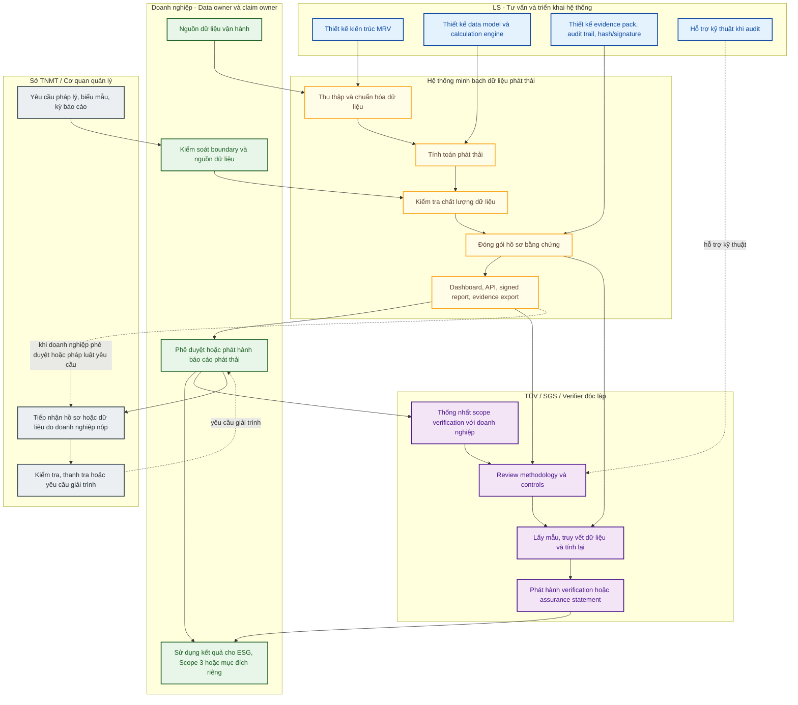

# ESG MRV Blueprint

## 0. Định vị chiến lược

LS là **neutral infrastructure and methodology partner** cho hệ thống minh bạch dữ liệu phát thải.

LS không giữ vai trò pháp lý, dữ liệu hoặc xác minh của bất kỳ stakeholder nào. Điểm an toàn chiến lược của LS là có thể làm việc đồng thời với doanh nghiệp, Sở TNMT/cơ quan quản lý và VVB như TÜV, SGS mà không thay thế vai trò của bên nào.

Mô hình vai trò cốt lõi:

```text
Doanh nghiệp: sở hữu dữ liệu, vận hành quy trình báo cáo và chịu trách nhiệm claim.
Sở TNMT / cơ quan quản lý: tiếp nhận, kiểm tra, hướng dẫn hoặc yêu cầu giải trình theo thẩm quyền.
VVB / TÜV / SGS: xác minh độc lập theo scope được ký với doanh nghiệp.
LS: tư vấn, thiết kế, triển khai hạ tầng dữ liệu, phương pháp tính và evidence trail.
```

Nguyên tắc này giúp LS tránh xung đột lợi ích:

- Không sở hữu dữ liệu phát thải của doanh nghiệp.
- Không phát hành tuyên bố phát thải thay doanh nghiệp.
- Không xác minh độc lập kết quả.
- Không phê duyệt báo cáo thay Sở TNMT hoặc cơ quan quản lý.
- Không cấp chứng chỉ carbon hoặc carbon credit.
- Không bảo đảm doanh nghiệp đạt ESG rating, Net-Zero, CBAM hoặc lợi ích pháp lý cụ thể.
- Không làm suy yếu tính độc lập của VVB.

Giá trị LS cung cấp là hạ tầng và phương pháp để các bên có thể làm đúng vai trò của mình trên cùng một nền dữ liệu minh bạch, có thể truy xuất và kiểm tra.

### 0.1 Lý do tách vai trò tính toán và xác minh

Nếu doanh nghiệp thuê VVB như TÜV, SGS hoặc đơn vị tương đương để trực tiếp tính toán phát thải và lập báo cáo, VVB đó có thể không còn đủ độc lập để xác minh chính kết quả do họ tạo ra. Điều này tạo rủi ro conflict-of-interest và làm yếu giá trị của verification statement.

Điểm này đã được xác nhận trong trao đổi chuyên môn với phía TÜV: nếu VVB là bên thực hiện tính toán/lập kết quả, họ không nên đồng thời là bên verify chính kết quả đó. Doanh nghiệp cần giữ vai trò chủ dữ liệu và chủ báo cáo; bên tư vấn/hệ thống có thể hỗ trợ phương pháp và evidence; VVB giữ vai trò xác minh độc lập.

Vì vậy, mô hình khuyến nghị là:

```text
Doanh nghiệp giữ quyền kiểm soát dữ liệu và báo cáo.
LS tham vấn phương pháp, xây hệ thống, hỗ trợ tính toán và đóng gói bằng chứng.
VVB giữ vai trò độc lập để review, kiểm toán và xác minh kết quả.
Sở TNMT/cơ quan quản lý tiếp nhận, kiểm tra hoặc yêu cầu giải trình theo thẩm quyền.
```

Trong mô hình này, doanh nghiệp không phải tự xoay sở toàn bộ về kỹ thuật, nhưng vẫn là bên chịu trách nhiệm báo cáo. LS hỗ trợ doanh nghiệp bằng kinh nghiệm làm việc với VVB và cơ quan quản lý, đồng thời không làm mất tính độc lập của VVB.

Nguyên tắc vận hành:

- LS có thể tư vấn cách tính, thiết kế công thức, rule engine và data quality checks.
- LS có thể hỗ trợ doanh nghiệp chuẩn bị báo cáo, calculation log và evidence pack.
- Doanh nghiệp phê duyệt báo cáo và chịu trách nhiệm về dữ liệu nguồn.
- VVB không nên verify kết quả mà chính VVB đã lập thay doanh nghiệp.
- Khi cần verification, VVB nên đứng ở vai trò review/xác minh trên hồ sơ do doanh nghiệp kiểm soát.

## 1. Mục tiêu

Tài liệu này xác định ranh giới vai trò giữa LS, doanh nghiệp sử dụng hệ thống, cơ quan quản lý nhà nước như Sở Tài nguyên và Môi trường (Sở TNMT), và tổ chức kiểm toán/xác minh độc lập như TÜV, SGS hoặc đơn vị tương đương.

Mục tiêu của hệ thống là hỗ trợ doanh nghiệp thu thập, chuẩn hóa, tính toán, lưu vết và đóng gói dữ liệu phát thải để phục vụ báo cáo nội bộ, Scope 3, ESG, chuỗi cung ứng hoặc hồ sơ xác minh độc lập. Việc doanh nghiệp sử dụng dữ liệu vào mục đích nào, công bố ra sao và chịu trách nhiệm trước bên thứ ba như thế nào không thuộc trách nhiệm vận hành của LS, trừ khi có hợp đồng tư vấn riêng quy định rõ phạm vi.

## 2. Nguyên tắc boundary

### 2.1 LS là bên tư vấn và triển khai hệ thống

LS có thể thực hiện các công việc sau:

- Tư vấn kiến trúc hệ thống minh bạch dữ liệu phát thải.
- Thiết kế data model, calculation engine, evidence pack và audit trail.
- Tích hợp dữ liệu từ IoT, ERP, OCPP, SCADA, GPS, CAN Bus, phiếu cân, e-waybill hoặc nguồn dữ liệu khác của doanh nghiệp.
- Ánh xạ phương pháp tính với các khung như ISO 14083, TCVN ISO 14083, GLEC Framework, GHG Protocol Scope 2 và Scope 3.
- Xây dựng dashboard, API, báo cáo kỹ thuật, kiểm tra chất lượng dữ liệu và cơ chế truy xuất bằng chứng.
- Hỗ trợ kỹ thuật khi doanh nghiệp làm việc với auditor hoặc verifier.

LS không phải là:

- Chủ sở hữu dữ liệu phát thải.
- Bên vận hành nghiệp vụ phát thải của doanh nghiệp.
- Bên phát hành tuyên bố phát thải chính thức thay doanh nghiệp.
- Bên xác minh độc lập.
- Bên cấp chứng chỉ carbon hoặc carbon credit.
- Bên bảo đảm lợi ích pháp lý, thuế, CBAM, ESG rating hoặc Net-Zero claim của doanh nghiệp.

### 2.2 Doanh nghiệp là data owner và claim owner

Doanh nghiệp chịu trách nhiệm:

- Xác định organizational boundary và operational boundary.
- Cung cấp, kết nối hoặc phê duyệt nguồn dữ liệu đầu vào.
- Đảm bảo tính hợp pháp và đầy đủ của dữ liệu nghiệp vụ.
- Xác nhận phương pháp tính, hệ số phát thải, kỳ báo cáo và phạm vi báo cáo.
- Phát hành hoặc phê duyệt báo cáo phát thải.
- Quyết định sử dụng kết quả cho Scope 1, Scope 2, Scope 3, ESG, supplier reporting, product carbon footprint hoặc mục đích khác.
- Chịu trách nhiệm với khách hàng, nhà đầu tư, cơ quan quản lý hoặc bên thứ ba về mọi tuyên bố phát thải do doanh nghiệp công bố.

### 2.3 TÜV/SGS là verifier độc lập

Tổ chức xác minh độc lập có thể thực hiện:

- Review methodology.
- Kiểm tra boundary, data quality, calculation logic và emission factors.
- Lấy mẫu dữ liệu và truy vết evidence trail.
- Kiểm tra báo cáo, chữ ký số, hash, nguồn dữ liệu và hồ sơ hiệu chuẩn.
- Phát hành assurance statement hoặc verification report theo phạm vi đã thỏa thuận với doanh nghiệp.

Tổ chức xác minh độc lập không nên bị đặt vào vai trò:

- Vận hành hệ thống của doanh nghiệp hoặc của LS.
- Chạy validator node hoặc trở thành hạ tầng sản xuất.
- Đồng sở hữu dữ liệu phát thải.
- Co-sign realtime cho mọi giao dịch dữ liệu.
- Bảo chứng các claim ngoài phạm vi verification report.

### 2.4 Sở TNMT là cơ quan quản lý/tiếp nhận theo thẩm quyền

Sở TNMT hoặc cơ quan nhà nước có thẩm quyền có thể tham gia ở vai trò:

- Ban hành, hướng dẫn hoặc tiếp nhận yêu cầu quản lý dữ liệu môi trường/khí nhà kính theo quy định áp dụng.
- Tiếp nhận hồ sơ, báo cáo hoặc dữ liệu do doanh nghiệp nộp nếu pháp luật yêu cầu.
- Kiểm tra, thanh tra hoặc yêu cầu giải trình về dữ liệu phát thải trong phạm vi thẩm quyền.
- Sử dụng dashboard, API hoặc evidence export nếu có cơ chế chia sẻ dữ liệu được doanh nghiệp phê duyệt và phù hợp quy định.

Sở TNMT không phải là:

- Bên vận hành hệ thống của LS hoặc doanh nghiệp.
- Bên xác minh độc lập thay cho TÜV/SGS, trừ khi pháp luật hoặc quyết định có thẩm quyền quy định rõ.
- Bên sở hữu dữ liệu phát thải của doanh nghiệp.
- Bên bảo chứng thương mại cho claim ESG, Scope 3, Net-Zero hoặc carbon credit của doanh nghiệp.

## 3. Flow vai trò tổng thể



## 4. Responsibility matrix

| Hoạt động | LS | Doanh nghiệp | TÜV/SGS hoặc verifier | Sở TNMT / Cơ quan quản lý |
| --- | --- | --- | --- | --- |
| Thiết kế hệ thống MRV | Responsible | Consulted | Not involved | Not involved |
| Cung cấp dữ liệu vận hành | Not responsible | Responsible | Not involved | May request by law |
| Xác định reporting boundary | Consulted | Responsible | Reviewed if in scope | May define regulatory requirements |
| Chọn phương pháp tính | Consulted | Accountable | Reviewed if in scope | May prescribe or accept methods by regulation |
| Vận hành hệ thống hằng ngày | Optional by contract | Accountable | Not responsible | Not responsible |
| Kiểm tra chất lượng dữ liệu tự động | Responsible for tooling | Accountable for data | Reviewed if in scope | May inspect submitted records |
| Phát hành báo cáo phát thải | Not responsible | Responsible | Not responsible | May receive if legally required |
| Tuyên bố ESG/Scope 3/Net-Zero | Not responsible | Responsible | Only within assurance scope | Not a commercial guarantor |
| Xác minh độc lập | Not responsible | Requests and provides evidence | Responsible | May recognize or require verification under law |
| Cấp carbon credit/chứng chỉ carbon | Not responsible | Depends on carbon program | Only if accredited and contracted | Only under applicable state mechanism/authority |

## 5. Data boundary

Hệ thống có thể xử lý các nhóm dữ liệu sau, nhưng quyền sở hữu và trách nhiệm về dữ liệu thuộc doanh nghiệp:

- Dữ liệu vận hành: shipment, tuyến đường, thời gian, tải trọng, hàng hóa, khách hàng.
- Dữ liệu phương tiện: GPS, odometer, CAN Bus, fuel, battery, SoC.
- Dữ liệu năng lượng: OCPP session, công tơ, SCADA, điện lưới, điện tự phát, storage.
- Dữ liệu chứng từ: phiếu cân, e-waybill, lệnh vận chuyển, hóa đơn, biên bản giao nhận.
- Dữ liệu hệ số: emission factors, grid factor, fuel factor, electricity factor, upstream factor.
- Dữ liệu kiểm soát: log hệ thống, chữ ký số, hash, timestamp, quyền truy cập, hồ sơ hiệu chuẩn.

LS có thể thiết kế nơi lưu trữ, chuẩn hóa schema, quy tắc kiểm tra và logic tính toán. LS không mặc nhiên trở thành chủ sở hữu dữ liệu hoặc bên chịu trách nhiệm về tính đúng đắn nghiệp vụ của dữ liệu nguồn.

## 6. Verification boundary

Verifier chỉ xác minh những gì nằm trong scope hợp đồng verification. Một verification statement không nên bị diễn giải thành bảo chứng toàn bộ hệ thống, toàn bộ doanh nghiệp hoặc mọi claim thương mại.

Ví dụ diễn đạt đúng:

> Báo cáo phát thải logistics kỳ 2026 của doanh nghiệp được xác minh theo phạm vi X, phương pháp Y, mức đảm bảo Z, dựa trên dữ liệu và bằng chứng được cung cấp trong hồ sơ kiểm toán.

Ví dụ diễn đạt sai:

> Hệ thống được TÜV/SGS bảo chứng toàn bộ.

> Mọi dữ liệu phát thải phát sinh từ hệ thống đều mặc nhiên được xác minh.

> LS/TÜV/SGS chịu trách nhiệm cho mọi claim ESG hoặc Net-Zero của doanh nghiệp.

## 7. Cách diễn đạt khuyến nghị

Nên dùng:

> LS tư vấn và triển khai hệ thống minh bạch dữ liệu phát thải cho doanh nghiệp. Doanh nghiệp là bên sở hữu dữ liệu, vận hành quy trình báo cáo và chịu trách nhiệm về mọi tuyên bố phát thải. Việc nộp báo cáo cho Sở TNMT hoặc cơ quan quản lý được thực hiện bởi doanh nghiệp theo quy định áp dụng. Việc kiểm toán hoặc xác minh, nếu cần, do tổ chức độc lập như TÜV, SGS hoặc đơn vị được công nhận thực hiện theo phạm vi riêng.

Không nên dùng:

> LS cấp chứng chỉ phát thải.

> LS xác minh phát thải cho doanh nghiệp.

> Hệ thống được TÜV/SGS verified mặc định.

> Dữ liệu từ hệ thống mặc nhiên giúp doanh nghiệp đạt Net-Zero, giảm thuế hoặc đáp ứng CBAM.

> Sở TNMT vận hành hoặc bảo chứng hệ thống của LS/doanh nghiệp.

## 8. Ghi nhận trao đổi sơ bộ với Sở TNMT Quảng Ninh

LS đã có một cuộc trao đổi ngắn với Phó Giám đốc Sở TNMT tỉnh Quảng Ninh để giới thiệu định hướng LS đang triển khai: xây dựng hạ tầng dữ liệu, phương pháp luận và công cụ hỗ trợ doanh nghiệp kiểm kê, tính toán, minh bạch và chuẩn bị hồ sơ kiểm toán khí nhà kính.

Nội dung trao đổi được hiểu ở mức:

- LS giới thiệu năng lực và định hướng giải pháp đang phát triển.
- LS bày tỏ mong muốn hỗ trợ Sở TNMT và các doanh nghiệp có nhu cầu trong quá trình chuẩn hóa dữ liệu phát thải.
- Đại diện Sở TNMT ghi nhận đây là một giải pháp đúng lúc trong bối cảnh cơ quan quản lý và doanh nghiệp đều đang cần cách tiếp cận thực tế hơn cho báo cáo khí nhà kính.
- Cuộc trao đổi chưa cấu thành cam kết hợp tác, chỉ định, phê duyệt, bảo chứng, endorsement hoặc xác nhận chính thức từ Sở TNMT đối với LS hoặc hệ thống của LS.

Cách diễn đạt an toàn:

> LS đã có trao đổi sơ bộ với đại diện Sở TNMT tỉnh Quảng Ninh về nhu cầu xây dựng hạ tầng dữ liệu và phương pháp hỗ trợ doanh nghiệp kiểm kê, tính toán và chuẩn bị hồ sơ phát thải khí nhà kính. Đại diện Sở ghi nhận định hướng này là phù hợp với nhu cầu thực tế hiện nay. Nội dung trao đổi không phải là cam kết hợp tác, chỉ định, phê duyệt hoặc bảo chứng chính thức.

Không nên diễn đạt:

> Sở TNMT Quảng Ninh đã phê duyệt giải pháp của LS.

> LS là đơn vị được Sở TNMT chỉ định.

> Sở TNMT bảo chứng hệ thống kiểm toán khí nhà kính của LS.

> Doanh nghiệp sử dụng hệ thống LS sẽ được Sở TNMT chấp thuận báo cáo.
