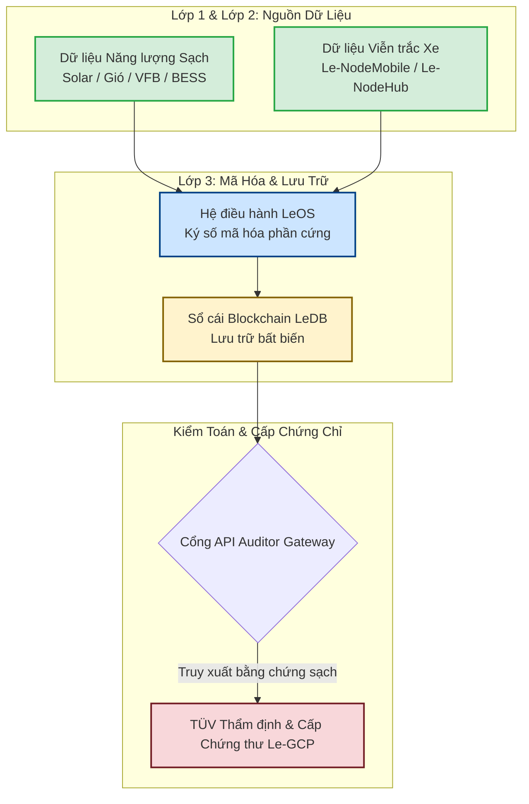

# MÔ HÌNH HỘ CHIẾU HÀNG HÓA XANH LeTRON
## (LeTRON Green Cargo Passport - Le-GCP)

### 1. MÔ HÌNH XÁC THỰC BA LỚP (THREE-LAYER VERIFICATION MODEL)
Để triệt tiêu hoàn toàn rủi ro "Tẩy xanh" (Greenwashing), dữ liệu chứng minh phát thải bằng 0 (**0.00kg CO2**) sẽ được thẩm định qua 3 tầng rào chắn công nghệ được điều phối bởi hệ điều hành **LeOS** và Bộ não số **LeTRON DIGITAL BRAIN (LeDB)**.

*   **Lớp 1: Xác thực Nguồn Năng lượng gốc (Primary Source - Net-Zero Grid)**
    *   *TÜV sẽ kiểm toán đầu vào của dòng điện sạc. Chúng ta không dùng điện lưới than thông thường.*
    *   **Dữ liệu thu thập:** Chỉ số phát điện (kWh) từ Hệ thống Solar, điện gió và Máy phát RMFC sinh học tại Hub Dịch vụ.
    *   **Chứng minh lưu trữ:** Toàn bộ sản lượng điện tái tạo này được định tuyến nạp vào bể Pin dòng chảy Vanadium VFB và BESS.
    *   **Bằng chứng kiểm toán:** Hệ thống SCADA kết nối API trực tiếp với LeOS sẽ xuất log dữ liệu nhằm chứng minh 100% dòng điện bơm vào súng sạc Megawatt đều là điện sạch (Green Electrons).
*   **Lớp 2: Xác thực Viễn trắc Thiết bị Biên (Telemetry Edge - Vehicle Physics)**
    *   *TÜV sẽ kiểm toán quá trình tiêu thụ năng lượng thực tế của hạm đội.*
    *   **Thiết bị thực thi:** Hộp đen Le-NodeMobile và Le-NodeHub chạy hệ điều hành LeOS được cấy trên xe tải điện Farizon, xe đầu kéo CAMC và Hub Dịch vụ.
    *   **Thông số đo lường thực thời (Real-time Telemetry):**
        *   Trọng lượng xe thực tế ($W_{cargo}$ - tránh gian lận tải trọng).
        *   Quãng đường di chuyển bằng GPS ($D_{km}$).
        *   Mức tiêu hao điện năng thực tế tính theo chu kỳ giây ($\Delta P_{kWh}$).
    *   **Thuật toán đối soát kép:** Tổng điện năng sạc vào tại Hub phải khớp với tổng điện năng tiêu hao trên đường trường của hạm đội với sai số cho phép $< 2\%$.
*   **Lớp 3: Mã hóa Bất biến & Giao thức Zero Trust (Data Trust Layer)**
    *   *Đây là "lưỡi dao" quyết định để TÜV cấp chứng nhận tự động hóa quy trình MRV.*
    *   **Nguyên lý an ninh:** Áp dụng mô hình **Zero Trust** của LeOS. Dữ liệu từ thiết bị biên (Lớp 2) và trạm sạc (Lớp 1) được ký số (Digital Signature) bằng chip bảo mật mã hóa phần cứng ngay tại thời điểm phát sinh.
    *   **Sổ cái Blockchain:** Dữ liệu sau đó được đẩy thẳng lên Sổ cái Blockchain bất biến của LeDB. Không ai – kể cả kỹ sư của LeTRON – có quyền sửa đổi hay can thiệp vào các con số này.

---

### 2. SƠ ĐỒ ĐỊNH TUYẾN DỮ LIỆU VÀ THẨM ĐỊNH

---

### 3. CẤU TRÚC PHÁP LÝ & CHUẨN ISO ÁP DỤNG TRONG GCP
Để tài liệu làm việc với TÜV đạt chuẩn ngôn ngữ quốc tế, chúng ta đóng gói mô hình Le-GCP dựa trên các bộ khung tiêu chuẩn sau:

*   **ISO 14064-1 & 2:** Tiêu chuẩn quốc tế về định lượng và báo cáo phát thải/giảm thiểu khí nhà kính cho cấp độ tổ chức và dự án.
*   **ISO 14067:** Đánh giá Dấu chân Carbon của Sản phẩm (Product Carbon Footprint) – chứng minh hàm lượng carbon dịch vụ logistics đóng góp vào mỗi sản phẩm điện tử của FDI bằng 0.
*   **ISO/IEC 27001 & TISAX:** Bảo chứng an ninh thông tin cho dữ liệu chuỗi cung ứng công nghệ cao.

---

### 4. QUY TRÌNH HÀNH ĐỘNG ĐỂ TÜV PHÊ DUYỆT TRONG QUÝ 4/2026
Để kịp mốc thời gian chốt chứng nhận trong Quý 4/2026, Khối Công nghệ LeDB và Khối Kỹ thuật cần kích hoạt ngay quy trình 3 bước sau với TÜV:

1.  **Bước 1: Mở cổng "Auditor Access Gateway" (Tháng 8/2026)**
    *   Chúng ta mời các chuyên gia kiểm toán của TÜV vào trận trước khi xe lăn bánh. Mở một tài khoản riêng trên hệ điều hành LeOS dành cho họ.
    *   TÜV sẽ tiến hành kiểm toán trước:
        *   Mã nguồn (Source Code) của thuật toán tính toán lượng phát thải trên LeOS.
        *   Độ an toàn của chip mã hóa dữ liệu phần cứng trên Le-NodeMobile và Le-NodeHub.
    *   *Mục tiêu:* TÜV cấp chứng nhận phê duyệt trước cho **"Phương pháp luận đo lường tự động (Pre-approved MRV Methodology)"**.
2.  **Bước 2: Chạy Pilot Thực Địa & Thu Hoạch Bằng Chứng (Tháng 9 - Tháng 10/2026)**
    *   Khi hạm đội 5 xe chính thức chạy thực địa tại các khu Công nghiệp và kết nối với Hub Dịch vụ, hệ thống LeOS sẽ tự động "đúc" dữ liệu lên Blockchain liên tục trong 60 ngày.
    *   TÜV không cần xuống thực địa, họ ngồi tại văn phòng vẫn có thể giám sát dòng dữ liệu sạch đang chảy về hệ thống.
3.  **Bước 3: Đóng dấu & Ban hành Chứng thư Tự động (Tháng 10/2026)**
    *   Kết thúc giai đoạn Pilot, LeOS xuất báo cáo trích xuất tự động bằng một cú click chuột.
    *   TÜV chỉ việc đối soát mã Hash trên Blockchain và ký điện tử xác thực (Co-sign).
    *   Kể từ thời điểm này, mỗi chuyến xe của LeSM hoàn thành, hệ thống sẽ tự động tạo ra một **Le-GCP** hợp lệ có giá trị pháp lý quốc tế để bàn giao cho khách hàng FDI.