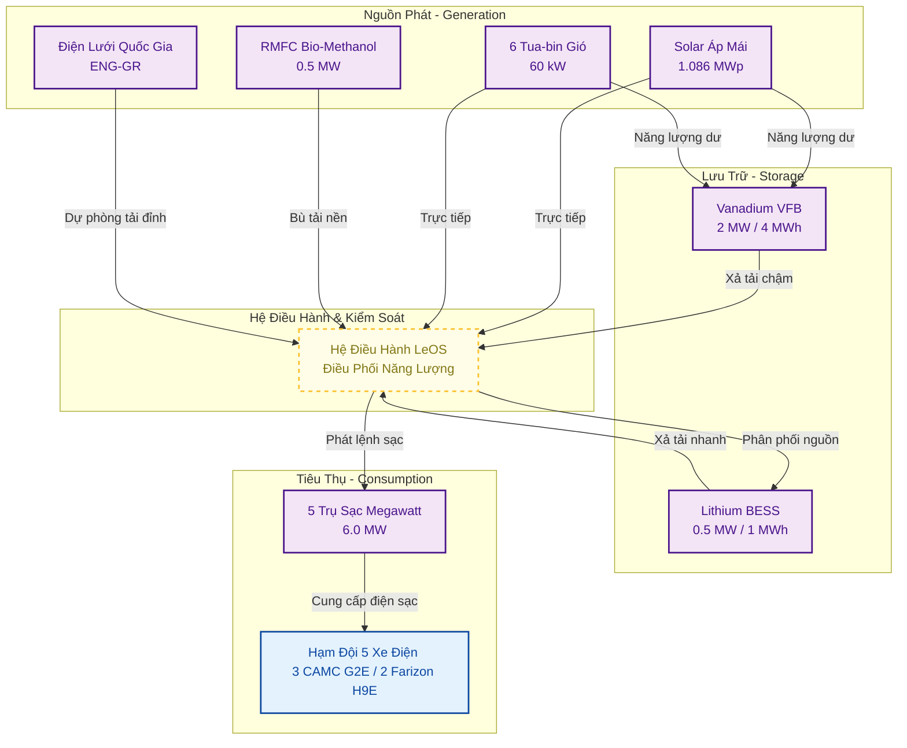
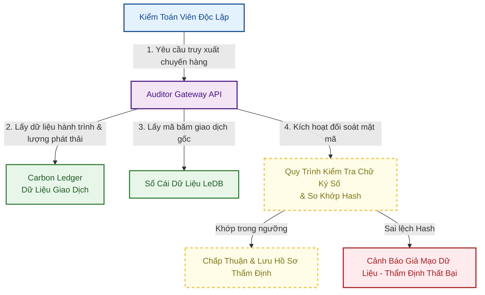

# LeTRON Green Logistics Project Design Document (PDD)

## 1. Executive Summary

### 1.1 Project Overview

Dự án thí điểm vận tải xanh kết nối các KCN trọng điểm bằng xe điện nặng, sạc Megawatt và nguồn năng lượng tái tạo tại Service Hub; đồng thời thiết lập hệ thống dữ liệu chuẩn hóa để sẵn sàng đáp ứng các tiêu chuẩn carbon quốc tế tự nguyện như Verra VCS / Gold Standard.

### 1.2 Business Objectives

* Thử nghiệm hạm đội xe điện nặng và trạm sạc Megawatt trong điều kiện tải thực tế.
* Kiểm chứng LeOS, LeDB và quy trình hỗ trợ cấp chứng thư Le-GCP.
* Chuẩn bị phương pháp luận MRV để làm việc với đơn vị kiểm toán và đối tác FDI.

### 1.3 Sustainability Objectives

* Đạt tỷ lệ năng lượng tái tạo tự cung cấp mục tiêu **60%** tại Hub dịch vụ.
* Giảm phát thải ròng cho hạm đội pilot so với kịch bản xe diesel.
* Thiết lập Digital MRV phục vụ kiểm toán, CBAM và báo cáo ESG của khách hàng FDI.

### 1.4 Expected Deliverables

* **Le-GCP:** Chứng thư số giảm phát thải kèm chữ ký số và mã băm lưu vết.
* **Carbon Ledger & Energy Ledger:** Theo dõi phát thải và dòng chảy năng lượng.
* **Green Logistics Dashboard:** Trực quan hóa phát thải, năng lượng và hiệu suất vận hành.
* **Auditor Gateway:** Cổng truy cập dữ liệu phục vụ đối soát độc lập.

### 1.5 Intended Verification Scope

* **ISO 14064-2:** Định lượng lượng giảm phát thải khí nhà kính cấp độ dự án vận tải xanh.
* **ISO 14067:** Đánh giá dấu chân carbon tích lũy gán cho từng tấn sản phẩm vận chuyển (Scope 3 của FDI).
* **Audit Trail:** Thiết lập chuỗi bằng chứng số liên tục từ thiết bị biên phục vụ hoạt động kiểm toán độc lập.
* **CBAM Support:** Chuẩn hóa dữ liệu phát thải đáp ứng báo cáo biên giới carbon của EU.
* **ISO/IEC 27001 & TISAX:** Định hướng kiểm soát an ninh thông tin và an toàn dữ liệu chuỗi cung ứng công nghệ cao.
* **Verra & Gold Standard Readiness:** Định hình dữ liệu chuẩn hóa phục vụ việc đóng gói chứng chỉ carbon theo cơ chế quốc tế tự nguyện (VCS/GS) trong tương lai.

## 2. Project Scope & Boundary

### 2.1 Physical Boundary (Ranh giới vật lý)

Ranh giới vật lý gồm 3 nhóm tài sản vận hành:

* **Energy Assets (Tài sản năng lượng tại Hub Dịch vụ Hiệp Hoà - Quảng Ninh):**
  * Hệ thống điện mặt trời áp mái: **1.086 MWp**.
  * Hệ thống tuabin gió trục đứng: **6 trụ x 10 kW/trụ**, tổng công suất **60 kW**.
  * Máy phát điện Pin nhiên liệu RMFC sử dụng Bio-Methanol: **01 máy x 0.5 MW**.
  * Trạm biến áp đấu nối điện lưới quốc gia (dự phòng bù tải đỉnh).
  * Trạm siêu sạc Megawatt: **5 trụ sạc x 1.2 MW/trụ**, tổng công suất thiết kế **6.0 MW**.
  * Hệ thống lưu trữ năng lượng tích hợp: Bể pin dòng chảy Vanadium VFB **2 MW / 4 MWh** và Lithium-ion BESS **0.5 MW / 1 MWh**.
* **Mobility Assets (Tài sản di động):**
  * Hạm đội xe điện nặng: **3 xe đầu kéo CAMC G2E** với pin **440 kWh/xe** và **2 xe Farizon H9E** với pin **100 kWh/xe**.
  * Tuyến vận hành: các tuyến vận chuyển giữa các KCN trọng điểm, bắt đầu/kết thúc tại Hub sạc LeTRON.
* **Facility Assets (Tài sản hạ tầng):**
  * Service Hub: **Hub Dịch vụ Hiệp Hoà - Quảng Ninh**, tích hợp hệ thống sạc Megawatt công suất lớn và khu vực quản lý kỹ thuật.
  * Maintenance Hub: bảo trì phương tiện và kiểm định cảm biến IoT.

### 2.2 Digital Boundary (Ranh giới số)

Ranh giới số xác định dữ liệu được thu thập, xử lý và kiểm toán:

* **Hệ thống thiết bị biên (Edge IoT Systems):**
  * Le-NodeMobile: thiết bị IoT trên xe, đọc CAN Bus và cảm biến tải trọng trục.
  * Le-NodeHub: gateway tại trạm sạc, đọc công tơ điện và SCADA nguồn phát.
* **Nền tảng xử lý dữ liệu trung tâm (Platform Systems):**
  * LeOS: tính điện sạc hiệu dụng, phân bổ nguồn và phát thải theo thời điểm vận hành.
  * Hệ thống Sổ cái (Ledgers): Energy Ledger (sổ cái năng lượng) và Carbon Ledger (sổ cái phát thải).
  * LeDB: lưu mã băm (Hash) của giao dịch dữ liệu gốc để phát hiện chỉnh sửa hồi tố và phục vụ kiểm toán.
* *Ngoài phạm vi:* dữ liệu kế toán nội bộ, lịch lái xe chi tiết và thông tin cá nhân của tài xế.

### 2.3 Organizational Boundary (Ranh giới tổ chức)

* **Mô hình kiểm kê khí nhà kính:** Áp dụng phương pháp kiểm soát vận hành trực tiếp (Direct Operational Control) theo hướng dẫn của GHG Protocol và ISO 14064-1.
* **Ranh giới báo cáo trách nhiệm phát thải:**
  * Toàn bộ lượng điện năng tiêu thụ và phát thải trực tiếp (Scope 1) từ hạm đội xe điện và máy phát RMFC sinh học thuộc quyền sở hữu của LeTRON.
  * Lượng phát thải gián tiếp (Scope 2) từ điện lưới quốc gia nhập vào trạm sạc thuộc quyền kiểm soát vận hành trực tiếp của LeTRON.
  * Dữ liệu sau khi thẩm định được xuất dưới dạng Le-GCP để đối tác FDI sử dụng làm dữ liệu hỗ trợ báo cáo Scope 3, kèm cơ chế hạn chế tính trùng lặp (double counting).

## 3. Stakeholder Definition

### 3.1 Internal Stakeholders (Nội bộ LeTRON)

* **LeTRON Holding:** Chỉ đạo chiến lược và phê duyệt phân bổ tài chính.
* **LeSM:** Quản lý lịch chạy xe, phân bổ hàng hóa và vận hành trạm sạc.
* **LeDB:** Vận hành LeOS, Le-NodeMobile/Hub, phần cứng IoT và lớp dữ liệu LeDB.
* **LeSE:** Giám sát nguồn phát sạch, RMFC và hệ thống lưu trữ.

### 3.2 External Stakeholders (Bên ngoài)

* **FDI Customers:** Nhận dịch vụ vận tải xanh và chứng thư Le-GCP cho dữ liệu Scope 3.
* **Independent Auditors:** Truy cập Auditor Gateway để rà soát phương pháp luận và dữ liệu.

## 4. Asset Register (Danh mục Tài sản dự án)

Danh mục tài sản dùng để theo dõi phương tiện, nguồn phát, lưu trữ và thiết bị đo lường:

| Nhóm tài sản          | Tên / Định danh tài sản  | Dòng xe / Model thiết bị   | Thông số / Công suất thiết kế                         | Thiết bị đo lường & IoT tích hợp                      | Vai trò vận hành                           |
| :----------------------- | :---------------------------- | :---------------------------- | :---------------------------------------------------------- | :----------------------------------------------------------- | :-------------------------------------------- |
| **Phương tiện** | Le-Truck-01 (Xe đầu kéo điện nặng)   | CAMC G2E             | Pin **440 kWh**                                   | Le-NodeMobile, Cảm biến tải trục                         | Vận chuyển nguyên liệu nặng              |
| **Phương tiện** | Le-Truck-02 (Xe đầu kéo điện nặng)   | CAMC G2E             | Pin **440 kWh**                                   | Le-NodeMobile, Cảm biến tải trục                         | Vận chuyển nguyên liệu nặng              |
| **Phương tiện** | Le-Truck-03 (Xe đầu kéo điện nặng)   | CAMC G2E             | Pin **440 kWh**                                   | Le-NodeMobile, Cảm biến tải trục                         | Vận chuyển nguyên liệu nặng              |
| **Phương tiện** | Le-Truck-04 (Xe tải điện trung)   | Farizon H9E             | Pin **100 kWh**                                   | Le-NodeMobile, Cảm biến tải trục                         | Vận chuyển thành phẩm FDI                 |
| **Phương tiện** | Le-Truck-05 (Xe tải điện trung)   | Farizon H9E             | Pin **100 kWh**                                   | Le-NodeMobile, Cảm biến tải trục                         | Vận chuyển thành phẩm FDI                 |
| **Trạm sạc**     | Trạm siêu sạc Megawatt tại Hub Hiệp Hoà | Súng sạc Megawatt (MCS)     | **5 trụ x 1.2 MW/trụ**; tổng **6.0 MW** (OCPP 2.0.1) | Công tơ thông minh 3 pha (Class 0.5S), Gateway Le-NodeHub | Sạc nhanh công suất lớn cho hạm đội xe |
| **Nguồn phát**   | Hệ thống Điện mặt trời  | Solar áp mái | **1.086 MWp**                                    | Cảm biến bức xạ (Pyranometer), SCADA kết nối LeOS      | Nguồn phát sạch tự dùng chính           |
| **Nguồn phát**   | Hệ thống Điện gió        | Tua-bin gió trục đứng     | **6 trụ x 10 kW/trụ**; tổng **60 kW**                                     | Cảm biến tốc độ gió, SCADA kết nối LeOS              | Nguồn phát sạch bổ trợ                   |
| **Nguồn phát**   | Pin nhiên liệu RMFC         | RMFC chạy Bio-Methanol       | **01 máy x 0.5 MW**              | SCADA giám sát nhiên liệu kết nối LeOS                 | Nguồn phát sạch bù tải nền              |
| **Pin lưu trữ**  | Bể pin dòng chảy Vanadium  | Vanadium Flow (VFB)           | **2 MW / 4 MWh**                                   | Hệ thống quản lý pin BMS & SCADA                         | Lưu trữ năng lượng sạch dài hạn       |
| **Pin lưu trữ**  | Hệ thống pin Lithium BESS   | Lithium-ion BESS              | **0.5 MW / 1 MWh**                                   | Hệ thống quản lý pin BMS & SCADA                         | Điều hòa công suất đỉnh trạm sạc     |

## 5. System Architecture

### 5.1 Energy Architecture

* **Nguồn phát (Generation):** Hub Dịch vụ Hiệp Hoà - Quảng Ninh tích hợp Solar áp mái **1.086 MWp**, tua-bin gió trục đứng **60 kW** và RMFC Bio-Methanol **0.5 MW** để bổ trợ nguồn sạch tại chỗ.
* **Lưu trữ (Storage):** Pin dòng chảy Vanadium VFB **2 MW / 4 MWh** sạc trực tiếp từ nguồn phát dư thừa. Lithium-ion BESS **0.5 MW / 1 MWh** tham gia điều hòa công suất và hỗ trợ các phiên sạc công suất cao.
* **Tiêu thụ (Consumption):** Trạm siêu sạc Megawatt gồm **5 trụ x 1.2 MW/trụ** truyền tải năng lượng cho hạm đội **3 xe CAMC G2E** và **2 xe Farizon H9E** thông qua sự kiểm soát công suất của LeOS để tránh sụt áp lưới điện.

### 5.2 Digital Architecture (Kiến trúc Dữ liệu số)

Hệ thống sử dụng luồng xử lý và truyền dữ liệu thời gian thực qua ba tầng để tăng khả năng truy xuất và đối soát độc lập:

* **Telemetry (Viễn trắc):** Dữ liệu từ xe và súng sạc được đẩy về gateway biên theo tần suất 5 giây/lần.
* **Ký số bảo mật:** Mọi gói tin trước khi gửi lên đám mây đều được ký số bằng khóa riêng (Private Key) được lưu trữ an toàn trong chip bảo mật phần cứng tại thiết bị biên.
* **Lưu vết chống sửa đổi:** Các chỉ số năng lượng và phát thải được tổng hợp và ghi nhận mã băm (Hash) vào LeDB nhằm hỗ trợ phát hiện chỉnh sửa số liệu hồi tố.

## 6. Energy Ledger Design

### 6.1 Energy Source Classification & Coding

Hệ thống năng lượng được phân loại nguồn rõ ràng để theo dõi dòng chảy năng lượng xanh:

* **Solar (Mã nguồn: ENG-PV):** Điện mặt trời tự sản tự tiêu từ hệ thống áp mái **1.086 MWp**.
* **Wind (Mã nguồn: ENG-WD):** Điện gió tự sản tự tiêu từ **6 trụ tua-bin gió trục đứng**, tổng công suất **60 kW**.
* **Bio-Methanol (Mã nguồn: ENG-BM):** Điện từ pin nhiên liệu RMFC sinh học, công suất **0.5 MW**.
* **Grid (Mã nguồn: ENG-GR):** Điện lưới quốc gia bù tải cho các thời điểm nguồn tại chỗ không đủ đáp ứng nhu cầu sạc.

### 6.2 Energy Balance & Flow Model

Quy trình cân bằng năng lượng thời gian thực thực thi trên hệ điều hành LeOS tại Hub dịch vụ tuân thủ nguyên tắc:

Tổng năng lượng cung cấp đầu vào:

$$
E_{Supply}(t) = E_{Solar}(t) + E_{Wind}(t) + E_{RMFC}(t) + E_{Grid}(t)
$$

Sự thay đổi dung lượng pin lưu trữ tại thời điểm *t*:

$$
SOC_{Storage}(t) = SOC_{Storage}(t-1) + \eta_{in} \cdot E_{Surplus}(t) - \frac{E_{Deficit}(t)}{\eta_{out}}
$$

Cân bằng tại đầu súng sạc:

$$
\sum E_{Charger\_Output} \cdot \eta_{charge} = \sum \Delta P_{kWh} + L_{Transmission}
$$

### 6.3 Energy Balance Reconciliation Example (Ví dụ đối soát cân bằng năng lượng thực tế)

LeOS đối soát dòng điện theo ngày. Ví dụ dưới đây minh họa 1 ngày vận hành trung bình của hạm đội pilot 5 xe, chưa phải sản lượng đo đạc chính thức.

| Hạng mục | Giá trị minh họa |
| :-- | --: |
| Điện mặt trời tự phát (ENG-PV) | 390 kWh |
| Điện gió tự phát (ENG-WD) | 24 kWh |
| Điện RMFC Bio-Methanol (ENG-BM) | 150 kWh |
| Điện lưới bù tải (ENG-GR) | 376 kWh |
| **Tổng năng lượng phát ra** | **940 kWh** |
| Nạp vào pin VFB/BESS | 80 kWh |
| Xả từ pin ra đầu sạc sau hiệu suất | 61.2 kWh |
| Điện sạc đo tại đầu súng | 840 kWh |
| Hao hụt truyền dẫn và điều phối | 81.2 kWh |

**Quy tắc đối soát khớp sổ cái năng lượng (Energy Ledger Reconciliation Rule):**

$$
\text{Năng lượng phát ra} + \text{Năng lượng xả} = \text{Năng lượng sạc xe} + \text{Năng lượng nạp pin} + \text{Hao hụt}
$$

$$
940 \text{ kWh (Phát)} + 61.2 \text{ kWh (Xả)} = 840 \text{ kWh (Sạc)} + 80 \text{ kWh (Nạp)} + 81.2 \text{ kWh (Hao hụt)}
$$

*Kết quả đối soát:* Hai vế khớp trong ví dụ minh họa **(1,001.2 kWh = 1,001.2 kWh)**. LeOS ký số và ghi nhận giao dịch vào LeDB.

## 7. Carbon Accounting & Baseline Methodology

### 7.1 Baseline vs. Project Comparison Table (Bảng đối chiếu Trước và Sau dự án)

Dưới đây là bảng đối chiếu định hướng giữa kịch bản vận tải truyền thống và kịch bản Le-GCP. Kết luận cuối cùng phụ thuộc dữ liệu vận hành đã xác minh.

| Khía cạnh so sánh                            | Kịch bản Trước dự án (Before - Baseline)                                                                                   | Kịch bản Sau dự án (After - Project Le-GCP)                                                                                                                               |
| :---------------------------------------------- | :------------------------------------------------------------------------------------------------------------------------------- | :---------------------------------------------------------------------------------------------------------------------------------------------------------------------------- |
| **Nguồn năng lượng**                  | Dầu diesel hoặc điện lưới thông thường.                            | Ưu tiên Solar, Gió, RMFC Bio-Methanol; phần còn lại đối soát theo nguồn thực tế.                                                   |
| **Phát thải**         | Phát thải trực tiếp từ diesel và gián tiếp từ điện lưới.                   | Không có phát thải ống xả; phát thải gián tiếp phụ thuộc tỷ lệ điện sạch thực tế.                                         |
| **MRV** | Hóa đơn dầu, công tơ cơ học hoặc log sạc ghi tay.                         | Le-NodeMobile/Hub ghi nhận tải trọng, quãng đường và điện năng sạc. |
| **Liêm chính dữ liệu**          | Dữ liệu thủ công, khó truy xuất nguồn điện. | Thiết bị biên ký số, LeDB lưu mã băm để phát hiện chỉnh sửa hồi tố.                                            |
| **Thẩm định**               | Kiểm toán dựa nhiều vào chứng từ giấy.  | Auditor Gateway hỗ trợ truy xuất, đối soát hash và rà soát trước khi phát hành chứng thư.                                |

### 7.2 Phát thải Đường cơ sở của xe dầu tương đương (Baseline Emissions)

Với mỗi chuyến xe chạy bằng dầu diesel, lượng phát thải được tính theo công thức:

$$
GHG_{Baseline, i} = D_i \times FE_{Diesel, i} \times EF_{Diesel}
$$

Trong đó, định mức tiêu hao dầu thực tế $FE_{Diesel, i}$ (lít/km) phụ thuộc vào tải trọng chở hàng của chuyến xe $i$:

$$
FE_{Diesel, i} = FE_{Base} + \alpha \times W_i
$$

Thông số chính: $D_i$ là quãng đường GPS, $W_i$ là tải trọng, $EF_{Diesel}=2.68$ kg CO2/lít. $FE_{Base}$ áp dụng **0.25 lít/km** cho xe đầu kéo và **0.18 lít/km** cho xe tải trung; $\alpha=0.005$ lít/(km · tấn).

#### Ví dụ tính toán minh họa cho Hạm đội Pilot 5 xe chạy trong 1 năm:

Giả định minh họa, sẽ thay bằng dữ liệu pilot đã xác minh:

| Nhóm xe diesel tương đương | Quãng đường | Tải TB | FE tính toán | Dầu tiêu thụ | Phát thải |
| :-- | --: | --: | --: | --: | --: |
| 3 xe đầu kéo CAMC | 180,000 km/năm | 25 tấn | 0.375 lít/km | 67,500 lít | 180.90 tCO2/năm |
| 2 xe tải trung Farizon | 120,000 km/năm | 8 tấn | 0.220 lít/km | 26,400 lít | 70.75 tCO2/năm |

$$
GHG_{Baseline} = 180.90 + 70.75 = 251.65 \text{ tấn } CO_2\text{/năm}
$$

### 7.3 Phát thải thực tế của dự án xe điện LeTRON (Project Emissions)

Với mỗi chuyến xe điện sạc hỗn hợp tại Hub, lượng phát thải thực tế được tính theo công thức:

$$
GHG_{Project, i} = E_i \times EF_{Hub}
$$

Trong đó, hệ số phát thải trung bình của trạm sạc tại thời điểm sạc $EF_{Hub}$ (kg CO2/kWh) được tính dựa trên tỷ lệ sạc thực tế của 4 nguồn cấp:

$$
EF_{Hub} = S_{Grid} \times EF_{Grid} + S_{Solar} \times EF_{Solar} + S_{Wind} \times EF_{Wind} + S_{Methanol} \times EF_{Methanol}
$$

Thông số chính: $E_i$ là điện sạc đo tại đầu súng; $S_{Grid}, S_{Solar}, S_{Wind}, S_{Methanol}$ là tỷ lệ nguồn. $EF_{Grid}=0.7228$ kg CO2/kWh; Solar/Wind/Bio-Methanol tạm tính 0.00 khi có hồ sơ nguồn gốc và đánh giá vòng đời phù hợp.

#### Ví dụ tính toán minh họa cho Hạm đội Pilot 5 xe điện chạy trong 1 năm:

Định mức tiêu thụ và tỷ lệ nguồn dưới đây là giả định minh họa, cần hiệu chỉnh bằng dữ liệu đo tại Hub.

| Nhóm xe điện | Quãng đường | Định mức điện | Điện sạc |
| :-- | --: | --: | --: |
| 3 xe CAMC G2E | 180,000 km/năm | 1.30 kWh/km | 234,000 kWh/năm |
| 2 xe Farizon H9E | 120,000 km/năm | 0.60 kWh/km | 72,000 kWh/năm |
| **Tổng hạm đội** | **300,000 km/năm** |  | **306,000 kWh/năm** |

Kiểm tra nhanh với dung lượng pin: $(3 \times 440) + (2 \times 100) = 1,520$ kWh; mức sạc bình quân $306,000 \div 365 \approx 838.36$ kWh/ngày, tương đương khoảng **0.55 vòng sạc đầy toàn hạm đội/ngày**.

Với giả định 60% năng lượng sạch tự cấp và 40% điện lưới:

$$
GHG_{Project} = (306,000 \times 40\%) \times 0.7228 = 88,470.72 \text{ kg } CO_2 \approx 88.47 \text{ tấn } CO_2\text{/năm}
$$

### 7.4 Lượng phát thải giảm thiểu ròng (Net Carbon Reduction)

Lượng giảm phát thải khí nhà kính ròng $\Delta GHG_i$ cho chuyến xe $i$:

$$
\Delta GHG_i = GHG_{Baseline, i} - GHG_{Project, i}
$$

#### Ví dụ tính toán minh họa giảm phát thải ròng hàng năm của hạm đội pilot:

$$
\Delta GHG = GHG_{Baseline} - GHG_{Project} = 251.65 - 88.47 = 163.18 \text{ tấn } CO_2\text{/năm}
$$

$$
\text{Tỷ lệ giảm phát thải} = \frac{163.18}{251.65} \times 100\% \approx 64.84\%
$$

### 7.5 Bảng tổng hợp các chỉ số định mức và hệ số phát thải áp dụng

Bảng dưới đây tổng hợp các chỉ số nền dùng trong thuật toán LeOS:

| Ký hiệu                   | Tên chỉ số                                      | Nguồn tham chiếu / Cơ sở áp dụng                | Giá trị áp dụng | Đơn vị           |
| :-------------------------- | :------------------------------------------------- | :-------------------------------------------------------- | :------------------ | :------------------ |
| **EF_Grid**           | Hệ số phát thải của Lưới điện Việt Nam   | Quyết định của Cục Biến đổi khí hậu (Bộ TN&MT) | **0.7228**    | kg CO2 / kWh        |
| **EF_Diesel**         | Hệ số phát thải của dầu Diesel               | Hướng dẫn kiểm kê khí nhà kính IPCC 2006          | **2.68**      | kg CO2 / lít       |
| **EF_Solar**          | Hệ số phát thải của Điện mặt trời         | Mặc định nguồn sạch tự sản tự tiêu               | **0.00**      | kg CO2 / kWh        |
| **EF_Wind**           | Hệ số phát thải của Điện gió               | Mặc định nguồn sạch tự sản tự tiêu               | **0.00**      | kg CO2 / kWh        |
| **EF_Methanol**       | Hệ số phát thải của Điện Methanol sinh học | Đánh giá vòng đời (LCA) và chứng nhận nguồn gốc của Bio-Methanol           | **0.00**      | kg CO2 / kWh        |
| **FE_Base (CAMC)**    | Tiêu thụ dầu cơ bản xe đầu kéo rỗng       | Thông số đăng kiểm của nhà sản xuất              | **0.25**      | lít / km           |
| **FE_Base (Farizon)** | Tiêu thụ dầu cơ bản xe tải trung rỗng       | Quy chuẩn thống kê vận tải đường bộ Việt Nam    | **0.18**      | lít / km           |
| **Alpha_Load**        | Hệ số tăng tiêu thụ dầu theo tải trọng     | Quy chuẩn thống kê vận tải đường bộ Việt Nam    | **0.005**     | lít / (km · tấn) |
| **Eff_Charge**        | Hiệu suất truyền dẫn sạc vật lý tại Hub    | Thiết kế kỹ thuật của trạm sạc nhanh Megawatt      | **94.00**     | %                   |

## 8. Monitoring, Reporting & Verification (MRV) Framework

### 8.1 Quy trình thu thập dữ liệu (Monitoring Process)

* **Tần suất mục tiêu:** Le-NodeMobile và Le-NodeHub thu thập dữ liệu mỗi 5 giây khi thiết bị và kết nối hoạt động bình thường.
* **Tham số theo dõi:** GPS (kinh độ, vĩ độ), Pin SoC (%), Dòng điện sạc (A), Điện áp sạc (V), Cảm biến tải trọng trục (kg).
* **Đóng gói dữ liệu:** Thiết bị biên lưu đệm dữ liệu thô và đồng bộ lên Carbon/Energy Ledger khi có kết nối 4G/5G ổn định.

### 8.2 Khung báo cáo và Bằng chứng (Reporting & Evidence Register)

* **Báo cáo chuyến hàng:** Tạo Le-GCP sau khi xe hoàn thành lộ trình và dữ liệu được xác nhận bằng geofence.
* **Nhật ký bằng chứng (Evidence Dossier):** Mỗi chuyến xe được liên kết với một hồ sơ bằng chứng số bao gồm:
  * Mã định danh thiết bị biên (Device ID).
  * Mã băm dữ liệu gốc trước khi gửi (Raw Data Hash).
  * Mã băm giao dịch ghi nhận trong LeDB (TxID).
  * Biên bản sạc điện sạch lưu trữ trên Energy Ledger.

### 8.3 Quy trình kiểm toán (Verification Process)

* Đơn vị kiểm toán độc lập truy cập thông qua tài khoản Auditor Access Gateway độc lập.
* Kiểm toán viên chọn một chuyến xe, hệ thống truy xuất chữ ký số thiết bị biên và đối soát mã Hash trong LeDB.

## 9. Data Quality & Governance Framework

### 9.1 Kiểm soát chất lượng dữ liệu (Data Quality Rules)

* **Completeness:** Dữ liệu viễn trắc mục tiêu đạt tối thiểu 95% thời gian di chuyển trước khi xét cấp Le-GCP.
* **Accuracy:** Sai lệch đối soát giữa điện xả từ lưu trữ Hub và điện nạp vào xe qua CAN Bus mục tiêu dưới 2%.

### 9.2 Quy trình xử lý lỗi cảm biến và Mất dữ liệu (Fallback Procedure)

* **Mất kết nối:** Le-NodeMobile lưu dữ liệu cục bộ trên bộ nhớ mã hóa; khi có kết nối, thiết bị đồng bộ bù kèm chữ ký số và timestamp gốc.
* **Lỗi cảm biến tải trọng:** Nếu cảm biến trục xe lỗi hoặc bất thường, hệ thống dùng trọng lượng từ phiếu cân hoặc E-Waybill đã ký số để thay thế $W_i$.

## 10. Le-GCP & Auditor Gateway Implementation

### 10.1 Cấp Chứng thư Le-GCP (Passport Generation Logic)

* **Trigger:** Xe hoàn tất giao hàng theo geofence và tắt máy.
* **Tạo chứng thư:** LeOS tổng hợp dữ liệu, tạo JSON chứng thư và ghi mã hash giao dịch vào LeDB.
* **Bàn giao:** Chứng thư được mã hóa và gửi qua API đến hệ thống ERP của đối tác FDI.

### 10.2 Thiết kế cổng kiểm toán Auditor Gateway

* **Giao diện Web:** Cổng 2FA cho kiểm toán viên bên thứ ba.
* **Truy xuất:** Tìm chứng thư theo Shipment ID hoặc biển số, xem nguồn điện sạc và trạng thái toàn vẹn dữ liệu trong LeDB.

### 10.3 Lộ trình triển khai (Roadmap)

* **Giai đoạn 1 (Tháng 8 - Tháng 10/2026):** Chạy thử nghiệm pilot hạm đội 5 xe chạy thực địa. Hoàn thiện tích hợp LeOS/LeDB và rà soát thuật toán nền với đơn vị kiểm toán.
* **Giai đoạn 2 (Quý 1/2027):** Chuẩn bị mở rộng mạng lưới lên 20 xe điện nặng, nâng cấp công suất Hub sạc và triển khai thương mại theo kết quả pilot và thẩm định dữ liệu.
