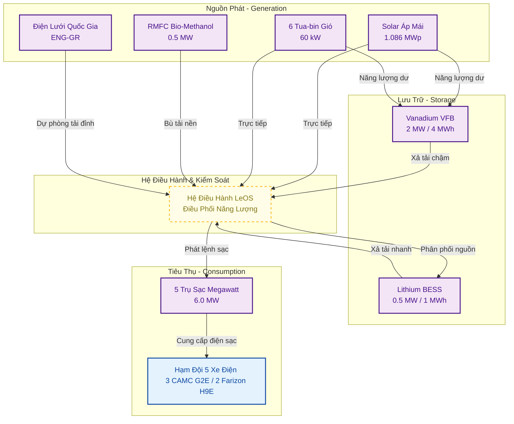
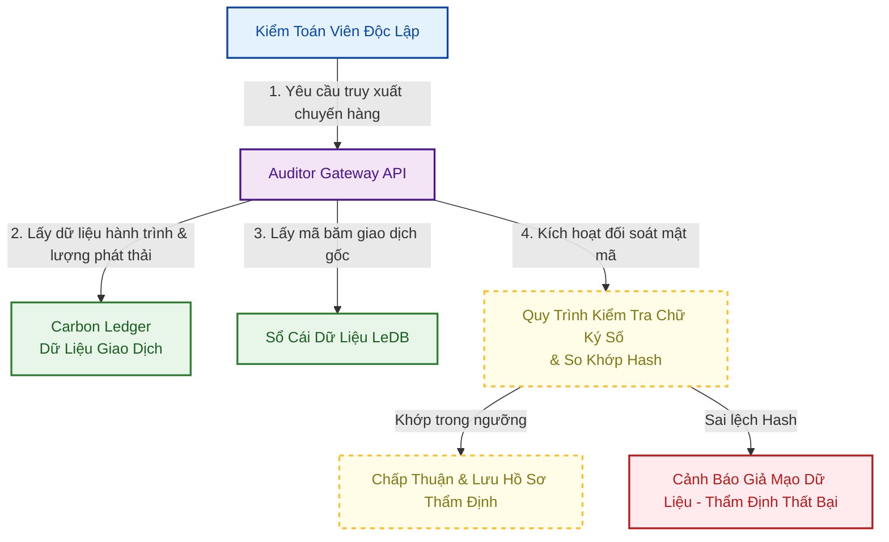

# LeTRON Green Logistics Project Design Document (PDD)

## 1. Executive Summary

### 1.1 Project Overview

Dự án thí điểm vận tải xanh kết nối các KCN trọng điểm bằng xe điện nặng, sạc Megawatt và nguồn năng lượng tái tạo tại Service Hub; đồng thời thiết lập hệ thống dữ liệu chuẩn hóa để sẵn sàng đáp ứng các yêu cầu kiểm kê phát thải và báo cáo carbon quốc tế như ISO 14064-2 và ISO 14067.

### 1.2 Business Objectives

* Thử nghiệm hạm đội xe điện nặng và trạm sạc Megawatt trong điều kiện tải thực tế.
* Kiểm chứng LeOS, LeDB và quy trình hỗ trợ cấp chứng thư Le-GCP.
* Chuẩn bị phương pháp luận MRV để làm việc với đơn vị kiểm toán và đối tác FDI.

### 1.3 Sustainability Objectives

* Đạt tỷ lệ năng lượng tái tạo tự cung cấp mục tiêu **60%** tại Hub dịch vụ.
* Giảm phát thải ròng cho hạm đội pilot so với kịch bản xe diesel.
* Thiết lập Digital MRV phục vụ kiểm toán, CBAM và báo cáo ESG của khách hàng FDI.

### 1.4 Expected Deliverables

* **Le-GCP:** Chứng thư số giảm phát thải kèm chữ ký số và mã băm lưu vết.
* **Carbon Ledger & Energy Ledger:** Theo dõi phát thải và dòng chảy năng lượng.
* **Green Logistics Dashboard:** Trực quan hóa phát thải, năng lượng và hiệu suất vận hành.
* **Auditor Gateway:** Cổng truy cập dữ liệu phục vụ đối soát độc lập.

### 1.5 Intended Verification Scope

* **ISO 14064-2:** Định lượng lượng giảm phát thải khí nhà kính cấp độ dự án vận tải xanh.
* **ISO 14067:** Đánh giá dấu chân carbon tích lũy gán cho từng tấn sản phẩm vận chuyển (Scope 3 của FDI).
* **Audit Trail:** Thiết lập chuỗi bằng chứng số liên tục từ thiết bị biên phục vụ hoạt động kiểm toán độc lập.
* **CBAM Support:** Chuẩn hóa dữ liệu phát thải đáp ứng báo cáo biên giới carbon của EU.
* **ISO/IEC 27001 & TISAX:** Định hướng kiểm soát an ninh thông tin và an toàn dữ liệu chuỗi cung ứng công nghệ cao.
* **Data Integrity & Traceability:** Thiết lập quy trình quản lý dữ liệu đảm bảo tính toàn vẹn; dữ liệu sau khi thẩm định được cấp dưới dạng chứng thư số Le-GCP cho khách hàng FDI phục vụ báo cáo Scope 3 và CBAM.

### 1.6 Commercial Model & Value Proposition (Mô hình Thương mại & Giá trị đề xuất)

Dự án vận hành theo mô hình B2B "Green Logistics as a Service" (Vận tải Xanh tích hợp), trong đó:
* **Sản phẩm thương mại:** LeTRON cung cấp dịch vụ vận tải vật lý bằng xe điện nặng tích hợp kèm chứng thư số giảm phát thải **Le-GCP**.
* **Định giá giá trị (Value-based Pricing):** Dịch vụ vận tải được định giá ở mức cao (premium cước vận tải) dựa trên giá trị tài chính thực tế mà khách hàng FDI tiết kiệm được từ việc giảm/né thuế biên giới carbon (CBAM) của EU nhờ sử dụng chỉ số phát thải carbon thấp được chứng nhận trong Le-GCP.
* **Chuyển giao tài sản carbon:** Quyền sở hữu lượng giảm phát thải (Emission Reduction Rights) của mỗi chuyến hàng được chuyển giao tự động và hoàn toàn cho khách hàng mua dịch vụ để họ báo cáo Scope 3 và CBAM.

## 2. Project Scope & Boundary

### 2.1 Physical Boundary (Ranh giới vật lý)

Ranh giới vật lý gồm 3 nhóm tài sản vận hành:

* **Energy Assets (Tài sản năng lượng tại Hub Dịch vụ Hiệp Hoà - Quảng Ninh):**
  * Hệ thống điện mặt trời áp mái: **1.086 MWp**.
  * Hệ thống tuabin gió trục đứng: **6 trụ x 10 kW/trụ**, tổng công suất **60 kW**.
  * Máy phát điện Pin nhiên liệu RMFC sử dụng Bio-Methanol: **01 máy x 0.5 MW**.
  * Trạm biến áp đấu nối điện lưới quốc gia (dự phòng bù tải đỉnh).
  * Trạm siêu sạc Megawatt: **5 trụ sạc x 1.2 MW/trụ**, tổng công suất thiết kế **6.0 MW**.
  * Hệ thống lưu trữ năng lượng tích hợp: Bể pin dòng chảy Vanadium VFB **2 MW / 4 MWh** và Lithium-ion BESS **0.5 MW / 1 MWh**.
* **Mobility Assets (Tài sản di động):**
  * Hạm đội xe điện nặng: **3 xe đầu kéo CAMC G2E** với pin **440 kWh/xe** và **2 xe Farizon H9E** với pin **100 kWh/xe**.
  * Tuyến vận hành: các tuyến vận chuyển giữa các KCN trọng điểm, bắt đầu/kết thúc tại Hub sạc LeTRON.
* **Facility Assets (Tài sản hạ tầng):**
  * Service Hub: **Hub Dịch vụ Hiệp Hoà - Quảng Ninh**, tích hợp hệ thống sạc Megawatt công suất lớn và khu vực quản lý kỹ thuật.
  * Maintenance Hub: bảo trì phương tiện và kiểm định cảm biến IoT.

### 2.2 Digital Boundary (Ranh giới số)

Ranh giới số xác định dữ liệu được thu thập, xử lý và kiểm toán:

* **Hệ thống thiết bị biên (Edge IoT Systems):**
  * Le-NodeMobile: thiết bị IoT trên xe, đọc CAN Bus và cảm biến tải trọng trục.
  * Le-NodeHub: gateway tại trạm sạc, đọc công tơ điện và SCADA nguồn phát.
* **Nền tảng xử lý dữ liệu trung tâm (Platform Systems):**
  * LeOS: tính điện sạc hiệu dụng, phân bổ nguồn và phát thải theo thời điểm vận hành.
  * Hệ thống Sổ cái (Ledgers): Energy Ledger (sổ cái năng lượng) và Carbon Ledger (sổ cái phát thải).
  * LeDB: lưu mã băm (Hash) của giao dịch dữ liệu gốc để phát hiện chỉnh sửa hồi tố và phục vụ kiểm toán.
* *Ngoài phạm vi:* dữ liệu kế toán nội bộ, lịch lái xe chi tiết và thông tin cá nhân của tài xế.

### 2.3 Organizational Boundary (Ranh giới tổ chức)

* **Mô hình kiểm kê khí nhà kính:** Áp dụng phương pháp kiểm soát vận hành trực tiếp (Direct Operational Control) theo hướng dẫn của GHG Protocol và ISO 14064-1.
* **Ranh giới báo cáo trách nhiệm phát thải:**
  * Toàn bộ lượng điện năng tiêu thụ và phát thải trực tiếp (Scope 1) từ hạm đội xe điện và máy phát RMFC sinh học thuộc quyền sở hữu của LeTRON.
  * Lượng phát thải gián tiếp (Scope 2) từ điện lưới quốc gia nhập vào trạm sạc thuộc quyền kiểm soát vận hành trực tiếp của LeTRON.
  * Dữ liệu sau khi thẩm định được xuất dưới dạng Le-GCP để đối tác FDI sử dụng làm dữ liệu hỗ trợ báo cáo Scope 3, kèm cơ chế hạn chế tính trùng lặp (double counting).

## 3. Stakeholder Definition

### 3.1 Internal Stakeholders (Nội bộ LeTRON)

* **LeTRON Holding:** Chỉ đạo chiến lược và phê duyệt phân bổ tài chính.
* **LeSM:** Quản lý lịch chạy xe, phân bổ hàng hóa và vận hành trạm sạc.
* **LeDB:** Vận hành LeOS, Le-NodeMobile/Hub, phần cứng IoT và lớp dữ liệu LeDB.
* **LeSE:** Giám sát nguồn phát sạch, RMFC và hệ thống lưu trữ.

### 3.2 External Stakeholders (Bên ngoài)

* **FDI Customers:** Nhận dịch vụ vận tải xanh và chứng thư Le-GCP cho dữ liệu Scope 3.
* **Independent Auditors:** Truy cập Auditor Gateway để rà soát phương pháp luận và dữ liệu.

## 4. Asset Register (Danh mục Tài sản dự án)

Danh mục tài sản dùng để theo dõi phương tiện, nguồn phát, lưu trữ và thiết bị đo lường:

| Nhóm tài sản          | Tên / Định danh tài sản  | Dòng xe / Model thiết bị   | Thông số / Công suất thiết kế                         | Thiết bị đo lường & IoT tích hợp                      | Vai trò vận hành                           |
| :----------------------- | :---------------------------- | :---------------------------- | :---------------------------------------------------------- | :----------------------------------------------------------- | :-------------------------------------------- |
| **Phương tiện** | Le-Truck-01 (Xe đầu kéo điện nặng)   | CAMC G2E             | Pin **440 kWh**                                   | Le-NodeMobile, Cảm biến tải trục                         | Vận chuyển nguyên liệu nặng              |
| **Phương tiện** | Le-Truck-02 (Xe đầu kéo điện nặng)   | CAMC G2E             | Pin **440 kWh**                                   | Le-NodeMobile, Cảm biến tải trục                         | Vận chuyển nguyên liệu nặng              |
| **Phương tiện** | Le-Truck-03 (Xe đầu kéo điện nặng)   | CAMC G2E             | Pin **440 kWh**                                   | Le-NodeMobile, Cảm biến tải trục                         | Vận chuyển nguyên liệu nặng              |
| **Phương tiện** | Le-Truck-04 (Xe tải điện trung)   | Farizon H9E             | Pin **100 kWh**                                   | Le-NodeMobile, Cảm biến tải trục                         | Vận chuyển thành phẩm FDI                 |
| **Phương tiện** | Le-Truck-05 (Xe tải điện trung)   | Farizon H9E             | Pin **100 kWh**                                   | Le-NodeMobile, Cảm biến tải trục                         | Vận chuyển thành phẩm FDI                 |
| **Trạm sạc**     | Trạm siêu sạc Megawatt tại Hub Hiệp Hoà | Súng sạc Megawatt (MCS)     | **5 trụ x 1.2 MW/trụ**; tổng **6.0 MW** (OCPP 2.0.1) | Công tơ thông minh 3 pha (Class 0.5S), Gateway Le-NodeHub | Sạc nhanh công suất lớn cho hạm đội xe |
| **Nguồn phát**   | Hệ thống Điện mặt trời  | Solar áp mái | **1.086 MWp**                                    | Cảm biến bức xạ (Pyranometer), SCADA kết nối LeOS      | Nguồn phát sạch tự dùng chính           |
| **Nguồn phát**   | Hệ thống Điện gió        | Tua-bin gió trục đứng     | **6 trụ x 10 kW/trụ**; tổng **60 kW**                                     | Cảm biến tốc độ gió, SCADA kết nối LeOS              | Nguồn phát sạch bổ trợ                   |
| **Nguồn phát**   | Pin nhiên liệu RMFC         | RMFC chạy Bio-Methanol       | **01 máy x 0.5 MW**              | SCADA giám sát nhiên liệu kết nối LeOS                 | Nguồn phát sạch bù tải nền              |
| **Pin lưu trữ**  | Bể pin dòng chảy Vanadium  | Vanadium Flow (VFB)           | **2 MW / 4 MWh**                                   | Hệ thống quản lý pin BMS & SCADA                         | Lưu trữ năng lượng sạch dài hạn       |
| **Pin lưu trữ**  | Hệ thống pin Lithium BESS   | Lithium-ion BESS              | **0.5 MW / 1 MWh**                                   | Hệ thống quản lý pin BMS & SCADA                         | Điều hòa công suất đỉnh trạm sạc     |

## 5. System Architecture

### 5.1 Energy Architecture

* **Nguồn phát (Generation):** Hub Dịch vụ Hiệp Hoà - Quảng Ninh tích hợp Solar áp mái **1.086 MWp**, tua-bin gió trục đứng **60 kW** và RMFC Bio-Methanol **0.5 MW** để bổ trợ nguồn sạch tại chỗ.
* **Lưu trữ (Storage):** Pin dòng chảy Vanadium VFB **2 MW / 4 MWh** sạc trực tiếp từ nguồn phát dư thừa. Lithium-ion BESS **0.5 MW / 1 MWh** tham gia điều hòa công suất và hỗ trợ các phiên sạc công suất cao.
* **Tiêu thụ (Consumption):** Trạm siêu sạc Megawatt gồm **5 trụ x 1.2 MW/trụ** truyền tải năng lượng cho hạm đội **3 xe CAMC G2E** và **2 xe Farizon H9E** thông qua sự kiểm soát công suất của LeOS để tránh sụt áp lưới điện.

### 5.2 Digital Architecture (Kiến trúc Dữ liệu số)

Hệ thống sử dụng luồng xử lý và truyền dữ liệu thời gian thực qua ba tầng để tăng khả năng truy xuất và đối soát độc lập:

* **Telemetry (Viễn trắc):** Dữ liệu từ xe và súng sạc được đẩy về gateway biên theo tần suất 5 giây/lần.
* **Ký số bảo mật:** Mọi gói tin trước khi gửi lên đám mây đều được ký số bằng khóa riêng (Private Key) được lưu trữ an toàn trong chip bảo mật phần cứng tại thiết bị biên.
* **Lưu vết chống sửa đổi:** Các chỉ số năng lượng và phát thải được tổng hợp và ghi nhận mã băm (Hash) vào LeDB nhằm hỗ trợ phát hiện chỉnh sửa số liệu hồi tố.

## 6. Energy & Carbon Accounting Model

### 6.1 Energy Ledger & Reconciliation

**Energy Balance & Flow Model**

Quy trình cân bằng năng lượng thời gian thực thực thi trên hệ điều hành LeOS tại Hub dịch vụ tuân thủ nguyên tắc:

Tổng năng lượng cung cấp đầu vào:

$$
E_{Supply}(t) = E_{Solar}(t) + E_{Wind}(t) + E_{RMFC}(t) + E_{Grid}(t)
$$

Sự thay đổi dung lượng pin lưu trữ tại thời điểm *t*:

$$
SOC_{Storage}(t) = SOC_{Storage}(t-1) + \eta_{in} \cdot E_{Surplus}(t) - \frac{E_{Deficit}(t)}{\eta_{out}}
$$

Cân bằng tại đầu súng sạc:

$$
\sum E_{Charger\_Output} \cdot \eta_{charge} = \sum \Delta P_{kWh} + L_{Transmission}
$$

**Energy Balance Reconciliation Example**

Sổ cái năng lượng ghi nhận theo giao dịch/sự kiện vận hành như phát điện, nạp pin, xả pin và phiên sạc. Bảng dưới đây là ví dụ đối soát năng lượng phân bổ cho hạm đội pilot 5 xe trong 1 ngày tại Hub Hiệp Hoà - Quảng Ninh; số minh họa chưa phải sản lượng đo đạc chính thức.

| Phân loại | Hạng mục | Công suất tối đa/ngày | Kế hoạch năng lượng/ngày | Hiệu suất / Hệ số sử dụng (%) |
| :-- | :-- | --: | --: | --: |
| **Nguồn phát** | Điện mặt trời tự phát | 26,064 kWh (1,086 kWp x 24h) | 3,800.0 kWh | 14.6% |
| **Nguồn phát** | Điện gió tự phát | 1,440 kWh (60 kW x 24h) | 0.0 kWh | 0.0% |
| **Nguồn phát** | Điện RMFC Bio-Methanol | 12,000 kWh (500 kW x 24h) | 0.0 kWh | 0.0% |
| **Nguồn phát** | Điện lưới bù tải | N/A | 0.0 kWh | 0.0% |
| *Cộng phát* | **Tổng nguồn phát (A)** | | **3,800.0 kWh** | |
| **Lưu trữ** | VFB (Pin dòng chảy) | 4,000 kWh (Dung lượng pin) | 0.0 kWh | 0.0% |
| **Lưu trữ** | BESS (Lithium-ion) | 1,000 kWh (Dung lượng pin) | 840.0 kWh | 84.0% |
| **Lưu trữ** | Hao hụt tại pin lưu trữ | 100 kWh (1,000x10%) | 84.0 kWh (840 x 10%) | 84.0% |
| **Tiêu thụ** | Điện sạc đo tại đầu súng | 1,520 kWh (3x440kWh + 2x100kWh) | 840.0 kWh | 55.3% |
| **Tiêu thụ** | Năng lượng sạch chưa phân bổ | 26,064 kWh (Hệ thống Solar) | 2,676.0 kWh | 10.3% |
| **Tiêu thụ** | Hao hụt truyền dẫn hệ thống | 190.0 kWh (5% x 3,800) | 200.0 kWh | 5.3% |
| *Cộng nhận* | **Tổng tiêu thụ + Hao hụt (B)** | | **3,800.0 kWh** | |

**Quy tắc đối soát khớp sổ cái năng lượng (Energy Ledger Reconciliation Rule):**

$$
\text{Tổng nguồn phát (A)} = \text{Điện sạc xe} + \text{Chưa phân bổ} + \text{Hao hụt truyền dẫn} + \text{Hao hụt lưu trữ pin}
$$

$$
3,800.0 \text{ kWh} = 840.0 \text{ kWh} + 2,676.0 \text{ kWh} + 200.0 \text{ kWh} + 84.0 \text{ kWh}
$$

*Kết quả đối soát:* Kế hoạch ngày khớp hoàn toàn **(A = B = 3,800.0 kWh)**. LeOS ký số và ghi nhận giao dịch vào LeDB.

### 6.2 Carbon Accounting & Baseline Methodology

Phát thải đường cơ sở và phát thải dự án được tính theo các công thức:

$$
GHG_{Baseline} = D \times (FE_{Base} + \alpha \times W) \times EF_{Diesel}
$$

$$
GHG_{Project} = E_{Charge} \times S_{Grid} \times EF_{Grid}
$$

$$
\Delta GHG = GHG_{Baseline} - GHG_{Project}
$$

Trong đó, $D$ là quãng đường GPS, $W$ là tải trọng, $E_{Charge}$ là điện sạc đo tại đầu súng, $S_{Grid}$ là tỷ lệ điện lưới trong phiên sạc. Các bảng dưới đây áp dụng công thức cho ví dụ minh họa 1 năm vận hành; kết quả cuối cùng sẽ thay bằng dữ liệu đã xác minh.

**Bảng 6.2A - 3 xe đầu kéo CAMC G2E**

| Chỉ tiêu | Before - xe diesel tương đương | After - CAMC G2E điện |
| :-- | --: | --: |
| Số lượng xe | 3 xe đầu kéo diesel | 3 xe CAMC G2E |
| Quãng đường năm | 180,000 km | 180,000 km |
| Tải trọng giả định | 25 tấn/chuyến | 25 tấn/chuyến |
| Định mức năng lượng | $0.25 + (0.005 \times 25) = 0.375$ lít/km | 1.30 kWh/km |
| Nhiên liệu / điện năng năm | 67,500 lít diesel | 234,000 kWh |
| Phát thải tính toán | $67,500 \times 2.68 = 180.90$ tCO2 | $(234,000 \times 40\%) \times 0.7228 = 67.65$ tCO2 |
| Giảm phát thải |  | **113.25 tCO2/năm** |

**Bảng 6.2B - 2 xe Farizon H9E**

| Chỉ tiêu | Before - xe diesel tương đương | After - Farizon H9E điện |
| :-- | --: | --: |
| Số lượng xe | 2 xe tải trung diesel | 2 xe Farizon H9E |
| Quãng đường năm | 120,000 km | 120,000 km |
| Tải trọng giả định | 8 tấn/chuyến | 8 tấn/chuyến |
| Định mức năng lượng | $0.18 + (0.005 \times 8) = 0.220$ lít/km | 0.60 kWh/km |
| Nhiên liệu / điện năng năm | 26,400 lít diesel | 72,000 kWh |
| Phát thải tính toán | $26,400 \times 2.68 = 70.75$ tCO2 | $(72,000 \times 40\%) \times 0.7228 = 20.82$ tCO2 |
| Giảm phát thải |  | **49.93 tCO2/năm** |

**Bảng 6.2C - Tổng hợp hạm đội pilot**

| Chỉ tiêu | Before - Baseline | After - Project Le-GCP |
| :-- | --: | --: |
| Số lượng xe | 5 xe diesel tương đương | 5 xe điện |
| Quãng đường năm | 300,000 km | 300,000 km |
| Nhiên liệu / điện năng năm | 93,900 lít diesel | 306,000 kWh |
| Phát thải năm | **251.65 tCO2** | **88.47 tCO2** |
| Giảm phát thải ròng |  | **163.18 tCO2/năm** |
| Tỷ lệ giảm phát thải |  | **64.84%** |
| Kiểm tra dung lượng pin |  | 1,520 kWh danh định; sạc bình quân 838.36 kWh/ngày, khoảng 0.55 vòng sạc/ngày |

Thông số áp dụng: $EF_{Diesel}=2.68$ kg CO2/lít, $EF_{Grid}=0.7228$ kg CO2/kWh. Solar/Wind/Bio-Methanol tạm tính 0.00 khi có hồ sơ nguồn gốc và đánh giá vòng đời phù hợp.

**Bảng 6.2D - Thông số định mức và hệ số phát thải áp dụng**

| Ký hiệu                   | Tên chỉ số                                      | Nguồn tham chiếu / Cơ sở áp dụng                | Giá trị áp dụng | Đơn vị           |
| :-------------------------- | :------------------------------------------------- | :-------------------------------------------------------- | :------------------ | :------------------ |
| **EF_Grid**           | Hệ số phát thải của Lưới điện Việt Nam   | Quyết định của Cục Biến đổi khí hậu (Bộ TN&MT) | **0.7228**    | kg CO2 / kWh        |
| **EF_Diesel**         | Hệ số phát thải của dầu Diesel               | Hướng dẫn kiểm kê khí nhà kính IPCC 2006          | **2.68**      | kg CO2 / lít       |
| **EF_Solar**          | Hệ số phát thải của Điện mặt trời         | Mặc định nguồn sạch tự sản tự tiêu               | **0.00**      | kg CO2 / kWh        |
| **EF_Wind**           | Hệ số phát thải của Điện gió               | Mặc định nguồn sạch tự sản tự tiêu               | **0.00**      | kg CO2 / kWh        |
| **EF_Methanol**       | Hệ số phát thải của Điện Methanol sinh học | Đánh giá vòng đời (LCA) và chứng nhận nguồn gốc của Bio-Methanol           | **0.00**      | kg CO2 / kWh        |
| **S_Grid**            | Tỷ lệ điện lưới mục tiêu trong sạc         | Kịch bản phân bổ nguồn sạc mục tiêu năm           | **40.00**     | %                   |
| **FE_Base (CAMC)**    | Tiêu thụ dầu cơ bản xe đầu kéo rỗng       | Thông số đăng kiểm của nhà sản xuất              | **0.25**      | lít / km           |
| **FE_Base (Farizon)** | Tiêu thụ dầu cơ bản xe tải trung rỗng       | Quy chuẩn thống kê vận tải đường bộ Việt Nam    | **0.18**      | lít / km           |
| **Alpha_Load**        | Hệ số tăng tiêu thụ dầu theo tải trọng     | Quy chuẩn thống kê vận tải đường bộ Việt Nam    | **0.005**     | lít / (km · tấn) |
| **EC_Electric (CAMC)** | Tiêu thụ điện năng xe đầu kéo CAMC G2E    | Thiết kế kỹ thuật của nhà sản xuất               | **1.30**      | kWh / km           |
| **EC_Electric (Farizon)**| Tiêu thụ điện năng xe tải trung Farizon H9E | Thiết kế kỹ thuật của nhà sản xuất               | **0.60**      | kWh / km           |
| **Eff_VFB**           | Hiệu suất nạp/xả pin dòng chảy VFB          | Thiết kế kỹ thuật của pin dòng chảy Vanadium     | **80.00**     | %                   |
| **Eff_BESS**          | Hiệu suất nạp/xả pin Lithium-ion BESS       | Thiết kế kỹ thuật của hệ thống pin Lithium       | **90.00**     | %                   |
| **CF_Solar**          | Hệ số công suất điện mặt trời Quảng Ninh  | Bản đồ bức xạ và khí tượng Quảng Ninh            | **14.60**     | %                   |
| **CF_Wind**           | Hệ số công suất điện gió Quảng Ninh       | Bản đồ khí tượng và tài nguyên gió Uông Bí       | **29.90**     | %                   |
| **Loss_Transmission** | Tỷ lệ hao hụt truyền dẫn thiết kế của Hub  | Thiết kế hệ thống phân phối điện nội bộ Hub      | **5.00**      | %                   |
| **Eff_Charge**        | Hiệu suất truyền dẫn sạc vật lý tại Hub    | Thiết kế kỹ thuật của trạm sạc nhanh Megawatt      | **94.00**     | %                   |

## 7. Monitoring, Reporting & Verification (MRV) Framework

### 7.1 Quy trình thu thập dữ liệu (Monitoring Process)

* **Tần suất mục tiêu:** Le-NodeMobile và Le-NodeHub thu thập dữ liệu mỗi 5 giây khi thiết bị và kết nối hoạt động bình thường.
* **Tham số theo dõi:** GPS (kinh độ, vĩ độ), Pin SoC (%), Dòng điện sạc (A), Điện áp sạc (V), Cảm biến tải trọng trục (kg).
* **Đóng gói dữ liệu:** Thiết bị biên lưu đệm dữ liệu thô và đồng bộ lên Carbon/Energy Ledger khi có kết nối 4G/5G ổn định.

### 7.2 Khung báo cáo và Bằng chứng (Reporting & Evidence Register)

* **Báo cáo chuyến hàng:** Tạo Le-GCP sau khi xe hoàn thành lộ trình và dữ liệu được xác nhận bằng geofence.
* **Nhật ký bằng chứng (Evidence Dossier):** Mỗi chuyến xe được liên kết với một hồ sơ bằng chứng số bao gồm:
  * Mã định danh thiết bị biên (Device ID).
  * Mã băm dữ liệu gốc trước khi gửi (Raw Data Hash).
  * Mã băm giao dịch ghi nhận trong LeDB (TxID).
  * Biên bản sạc điện sạch lưu trữ trên Energy Ledger.

### 7.3 Quy trình kiểm toán (Verification Process)

* Đơn vị kiểm toán độc lập truy cập thông qua tài khoản Auditor Access Gateway độc lập.
* Kiểm toán viên chọn một chuyến xe, hệ thống truy xuất chữ ký số thiết bị biên và đối soát mã Hash trong LeDB.

## 8. Data Quality & Governance Framework

### 8.1 Kiểm soát chất lượng dữ liệu (Data Quality Rules)

* **Completeness:** Dữ liệu viễn trắc mục tiêu đạt tối thiểu 95% thời gian di chuyển trước khi xét cấp Le-GCP.
* **Accuracy:** Sai lệch đối soát giữa điện xả từ lưu trữ Hub và điện nạp vào xe qua CAN Bus mục tiêu dưới 2%.

### 8.2 Quy trình xử lý lỗi cảm biến và Mất dữ liệu (Fallback Procedure)

* **Mất kết nối:** Le-NodeMobile lưu dữ liệu cục bộ trên bộ nhớ mã hóa; khi có kết nối, thiết bị đồng bộ bù kèm chữ ký số và timestamp gốc.
* **Lỗi cảm biến tải trọng:** Nếu cảm biến trục xe lỗi hoặc bất thường, hệ thống dùng trọng lượng từ phiếu cân hoặc E-Waybill đã ký số để thay thế $W_i$.

## 9. Le-GCP & Auditor Gateway Implementation

### 9.1 Cấp Chứng thư Le-GCP (Passport Generation Logic)

* **Trigger:** Xe hoàn tất giao hàng theo geofence và tắt máy.
* **Tạo chứng thư:** LeOS tổng hợp dữ liệu, tạo JSON chứng thư và ghi mã hash giao dịch vào LeDB.
* **Bàn giao:** Chứng thư được mã hóa và gửi qua API đến hệ thống ERP của đối tác FDI.

### 9.2 Thiết kế cổng kiểm toán Auditor Gateway

* **Giao diện Web:** Cổng 2FA cho kiểm toán viên bên thứ ba.
* **Truy xuất:** Tìm chứng thư theo Shipment ID hoặc biển số, xem nguồn điện sạc và trạng thái toàn vẹn dữ liệu trong LeDB.

### 9.3 Lộ trình triển khai (Roadmap)

* **Giai đoạn 1 (Tháng 8 - Tháng 10/2026):** Chạy thử nghiệm pilot hạm đội 5 xe chạy thực địa. Hoàn thiện tích hợp LeOS/LeDB và rà soát thuật toán nền với đơn vị kiểm toán.
* **Giai đoạn 2 (Quý 1/2027):** Chuẩn bị mở rộng mạng lưới lên 20 xe điện nặng, nâng cấp công suất Hub sạc và triển khai thương mại theo kết quả pilot và thẩm định dữ liệu.
