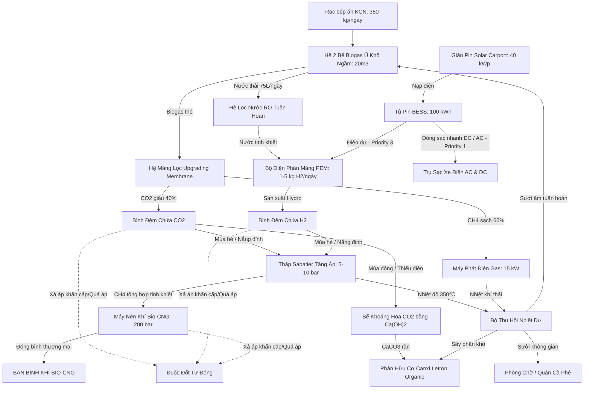

# THIẾT KẾ HỆ THỐNG: TỔ HỢP TRẠM SẠC XE ĐIỆN NGHỈ DƯỠNG & TỔNG HỢP METHANE TUẦN HOÀN (CHP & PEM)

Tài liệu đặc tả hệ thống tích hợp công nghệ chuyển hóa năng lượng tuần hoàn, tối ưu hóa cho mô hình trạm Flagship mẫu trên lô đất diện tích 500m² tại Khu công nghiệp (KCN) miền Bắc, sử dụng nguồn vốn đầu tư phân bổ từ vốn điều lệ của doanh nghiệp.

------------------------------
## I. SƠ ĐỒ ĐIỀU PHỐI NĂNG LƯỢNG TỔNG THỂ (MICROGRID TUẦN HOÀN KÍN CARBON)

Hệ thống vận hành theo chu trình khép kín carbon, tích hợp thu hồi CO2 trực tiếp từ Biogas bằng công nghệ màng lọc khô (Membrane Upgrading) để tái tổng hợp thành Methane sinh học:



------------------------------
## II. CẤU TRÚC PHÂN VÙNG MẶT BẰNG LÔ ĐẤT 500m² (TỐI ƯU DIỆN TÍCH BẰNG HẦM NGẦM)

Bằng cách chuyển đổi các bể ủ biogas và hệ lọc mùi sinh học xuống lòng đất, diện tích chiếm dụng mặt đất của khu kỹ thuật sinh học giảm từ 200m² xuống còn 20m², tối ưu hóa tối đa diện tích dành cho khu vực sạc xe thương mại và dịch vụ:

1. **Phân vùng 1 (Khu trải nghiệm dịch vụ mặt đất - 380m²):**
   * Mái che pin mặt trời (Solar Carport) rộng khoảng 250m² che chắn cho 6-8 vị trí đỗ sạc ô tô điện (tăng gấp đôi công suất phục vụ).
   * Phòng chờ nghỉ dưỡng kiêm Quán Cà phê cao cấp (130m²): Mở rộng không gian xanh trong nhà và ngoài trời, tích hợp cổng sạc nhanh, điều hòa trung tâm và bảng hiển thị giảm phát thải CO2 thời gian thực.
2. **Phân vùng 2 (Khu kỹ thuật điều phối mặt đất - 100m²):** Nơi đặt tủ pin BESS 100 kWh, tháp Sabatier vỏ bọc dầu truyền nhiệt, máy điện phân màng PEM, bộ màng lọc Biogas Membrane, các bình đệm chứa khí trung gian, máy phát điện chạy gas cách âm, hệ thống khoáng hóa CO2 và hệ thống nén Bio-CNG.
3. **Phân vùng 3 (Phân khu ngầm kỹ thuật chịu lực dưới lòng đất - ngầm hóa 180m²):**
   * Hệ thống 2 bể ủ biogas khô composite ngầm song song (tổng dung tích 20m³) và cột lọc H2S bằng hạt Fe2O3, bể lọc mùi sinh học xơ dừa ẩm được lắp đặt dưới lòng đất (bên dưới nền bê tông chịu lực của bãi đỗ sạc xe điện).
   * Mặt đất chỉ để lại các nắp hầm kỹ thuật chịu tải bằng gang đúc phục vụ công tác kiểm tra và cabin nạp rác băm khép kín áp suất âm (diện tích chiếm dụng mặt đất khoảng 20m²).

------------------------------
## III. CẤU TRÚC PHẦN CỨNG SẢN XUẤT NĂNG LƯỢNG LÕI (Trọng tâm R&D)

Chiến lược triển khai tập trung vào việc tích hợp các mô-đun cốt lõi thương mại chất lượng cao kết hợp tự thiết kế vỏ bọc cơ khí và mạch điều khiển:

1. **Hệ thống 2 bể phân hủy sinh học composite ngầm hóa (10m³ x 2 bể):**
   * 2 bể composite đúc sẵn lắp đặt ngầm chịu lực tốt, bọc lớp bọt cách nhiệt polyurethane (PU foam) dày 100mm để giữ ấm.
   * Chạy hệ thống ống trao đổi nhiệt bằng đồng tuần hoàn dầu nóng từ bộ thu hồi nhiệt Sabatier (CHP) quanh thân các bể ngầm để duy trì nhiệt độ ủ ấm ổn định từ 35 - 55 độ C.
   * Tích hợp hệ thống nạp rác tự động bằng phễu kín và trục vít tải đẩy rác từ cabin tiếp nhận trên mặt đất xuống bể ngầm.
2. **Hệ thống màng lọc nâng cấp sinh học (Biogas Membrane Upgrading):**
   * Sử dụng các modul màng sợi rỗng (Hollow Fiber Membrane) chọn lọc cao, phân tách trực tiếp Biogas thô thành dòng CH4 tinh khiết (>96%) đi vào máy phát điện và dòng CO2 giàu khí (>98%) đi vào bình đệm để tái tổng hợp hoặc khoáng hóa.
   * Không sử dụng hóa chất lỏng MEA ăn mòn, giảm 90% độ phức tạp vận hành và bảo trì, hoàn toàn an toàn khi đặt cạnh quán cafe dịch vụ.
3. **Hệ thống kiểm soát mùi và rò rỉ khí áp suất âm:**
   * Các bể ủ ngầm duy trì trạng thái áp suất âm nhẹ bằng cách liên tục hút khí biogas thô về bình chứa đệm, ngăn chặn hoàn toàn khí tự thoát ra môi trường.
   * Khí thải thoát ra tại cabin băm rác được gom qua quạt hút cưỡng bức đưa qua tháp lọc sinh học ẩm đặt ngầm dưới lòng đất trước khi thải ra khí quyển.
4. **Tháp Sabatier tích hợp hệ thống đồng phát Nhiệt - Điện (CHP):**
   * Tháp Inox 316L dày, thiết kế nhiều tầng chứa xúc tác hạt nano Ruthenium (Ru) để duy trì hoạt chất lâu dài và ngăn ngừa coking.
   * Kẹp các modul nhiệt điện TEG (gốc Lead Telluride) chịu nhiệt cao tại tầng đỉnh lò để thu hồi điện DC tự nuôi hệ cảm biến và mạch điều khiển.
5. **Bộ điện phân màng trao đổi Proton (PEM Electrolyzer Modular):**
   * Công suất sản xuất đạt 1 - 5 kg H2/ngày, tích hợp sạc theo chế độ hấp thụ điện dư (Surplus Power Mode).
   * Ưu điểm: Phản ứng động học cực nhanh, tắt bật tức thì để bám sát độ trồi sụt của Solar Carport. Có đầy đủ chứng chỉ ATEX, PCCC công nghiệp và dễ dàng mua trực tiếp từ các vendor uy tín.
   * Sử dụng nước lọc tinh khiết cấp từ vòng tuần hoàn nước ZLD.
6. **Hệ thống khoáng hóa CO2 bằng vôi tôi (Ca(OH)2):**
   * Bể phản ứng sục khí tích hợp cánh khuấy nhẹ để dẫn khí CO2 dư thừa (từ cả biogas thô và đường khí thải máy phát điện) vào dung dịch vôi tôi ($Ca(OH)_2$), kết tủa Canxi Cacbonat ($CaCO_3$) rắn làm phụ gia khử chua trộn trực tiếp vào phân bón hữu cơ vi sinh thương mại.
7. **Hệ nén Bio-CNG áp suất cao & Đuốc đốt tự động bảo vệ áp suất:**
   * Máy nén piston đa cấp nén khí Methane tinh khiết sau tháp Sabatier đạt áp suất 200 bar để nạp bình chứa thương mại.
   * Lắp đặt đuốc đốt tự động (Flare Stack) bọc chống cháy nổ để xả và đốt cháy an toàn khí gas dư khi xảy ra sự cố quá áp hoặc dừng khẩn cấp (ESD).

------------------------------
## IV. KIẾN TRÚC PHẦN MỀM, TỰ ĐỘNG HÓA & ĐIỀU PHỐI NĂNG LƯỢNG

1. **Thuật toán điều phối ưu tiên năng lượng (Energy Priority Engine):**
   Mạch điều phối nguồn điện từ Solar Carport và tủ pin BESS tuân theo quy tắc ưu tiên nghiêm ngặt để tối đa hóa hiệu suất kinh tế:
   * **Priority 1 (EV Charging):** Ưu tiên số một cấp cho các trụ sạc nhanh DC và AC phục vụ khách hàng sạc xe.
   * **Priority 2 (BESS Charging):** Ưu tiên thứ hai nạp cho tủ pin lưu trữ BESS đến khi đạt đầy dung lượng ($SOC \ge 95\%$) để dự phòng phụ tải ban đêm.
   * **Priority 3 (PEM Electrolyzer):** Khi BESS đã đầy và Solar vẫn dư thừa (Solar Curtailment), dòng điện dư được chuyển hướng sang cụm điện phân PEM để tạo Hydro ($H_2$) lưu trữ đệm.
   * **Priority 4 (Grid Export/Curtailment):** Phát lưới (nếu được phép) hoặc giảm công suất phát của Inverter để bảo vệ hệ thống.

2. **Dòng thác nhiệt phân tầng (Thermal Cascade):**
   Nhiệt lượng tỏa ra từ tháp Sabatier và máy phát điện được thu hồi và phân phối tuần hoàn theo các tầng nhiệt độ giảm dần để tối ưu hiệu quả nhiệt động học:
   * **Tier 1 (Sabatier Reaction Heat - 350°C):** Thu hồi trực tiếp từ vỏ lò phản ứng bằng dầu truyền nhiệt silicone để gia nhiệt sơ cấp cho hơi nước và buồng phản ứng.
   * **Tier 2 (Water Preheating - 80 - 150°C):** Gia nhiệt sơ bộ dòng nước cấp cho bộ điện phân và nước dịch ép tuần hoàn.
   * **Tier 3 (Digester Heating - 38 - 55°C):** Sưởi ấm duy trì nhiệt độ tối ưu cho hệ thống 2 bể ủ biogas khô ngầm hóa.
   * **Tier 4 (Organic Fertilizer Drying - 60 - 75°C):** Sấy khô cưỡng bức bánh bùn phân thải sau ép trục vít giảm độ ẩm xuống 25%.
   * **Tier 5 (Space Heating - 25 - 40°C):** Cấp nhiệt sưởi ấm sàn và không gian phòng chờ quán cà phê vào mùa lạnh miền Bắc.

3. **Vòng tuần hoàn nước kín (Water Loop ZLD):**
   Đảm bảo trạm sạc tự chủ 100% tài nguyên nước, không xả nước thải ra môi trường:
   ```text
   Biogas Digestate (Nước thải dịch ép) 
          ↓
   Hệ lọc Màng RO (Hiệu suất thu hồi 80%) 
          ↓
   Nước tinh khiết cấp PEM (PEM Feed Water)
          ↓
   Thu hồi nước ngưng Sabatier (Sabatier Water Recovery)
          ↓
   Bồn đệm tuần hoàn (Buffer Tank) 
          ↓
   Tái sử dụng làm ẩm bể ủ/Tưới cảnh quan (Reuse)
   ```

4. **Hệ thống LeOS Digital Twin & Carbon Ledger:**
   * Liên kết trực tiếp toàn bộ dữ liệu cảm biến đo lưu lượng khí ($CH_4$, $CO_2$, $H_2$), dòng điện sạc xe, điện năng Solar và khối lượng phân bón sản xuất.
   * Số hóa thời gian thực thành mô hình **Digital Twin** phục vụ giám sát trực quan trên Cloud.
   * Lưu trữ các giao dịch năng lượng và lượng giảm phát thải lên **Carbon Ledger (Sổ cái Carbon)** theo tiêu chuẩn MRV của LeOS phục vụ kiểm toán và thương mại tín chỉ Carbon quốc tế.

------------------------------
## V. KPI HIỆU SUẤT TUẦN HOÀN CARBON (CCUI)

Thay vị áp dụng các chỉ số hiệu suất chuyển hóa nhiệt động học thông thường (dễ bị phản biện do tổn thất năng lượng cao của quy trình Power-to-Gas), trạm sạc sử dụng chỉ số **Carbon Circular Utilization Index (CCUI)** làm thước đo hiệu quả cốt lõi:

$$CCUI = \frac{CH_4\ \text{Stored} + \text{Heat Recovered} + CO_2\ \text{Mineralized}}{\text{Solar Surplus} + \text{Biogas Carbon Input}}$$

Chỉ số này phản ánh tỷ lệ phần trăm năng lượng dư thừa và lượng Carbon đầu vào được chuyển hóa thành các sản phẩm hữu ích có giá trị thương mại (Khí nén Bio-CNG, Nhiệt lượng CHP tái sử dụng, và Canxi Cacbonat cố định trong phân bón), cam kết đạt **CCUI > 85%** vào mùa hè và **CCUI > 78%** vào mùa đông.

------------------------------
## VI. BẢNG PHÂN TÍCH TÀI CHÍNH (SEGMENTED FINANCIAL MODEL)

Tổng mức đầu tư dự án (CAPEX): **1.650.000.000 VNĐ**.
Mô hình tài chính được phân rã thành 3 cấu phần kinh doanh độc lập để tăng độ tin cậy đối với các nhà đầu tư (VCs):

### 1. Base Business (Kinh doanh cốt lõi - Điểm hòa vốn nhanh)
* **Dịch vụ cung cấp:** Sạc xe điện AC/DC thương mại và khai thác dịch vụ Quán cà phê nghỉ dưỡng.
* **Doanh thu hàng năm:** ~720.000.000 VNĐ.
* **OPEX vận hành:** ~80.000.000 VNĐ.
* **Vai trò:** Đảm bảo dòng tiền dương ổn định ngay từ năm đầu tiên, gánh toàn bộ chi phí vận hành cố định của trạm.

### 2. Circular Business (Kinh doanh tuần hoàn - Giá trị gia tăng xanh)
* **Dịch vụ cung cấp:** Thu phí xử lý rác thải hữu cơ KCN và bán phân hữu cơ vi sinh giàu Canxi Letron Organic.
* **Doanh thu hàng năm:** ~142.000.000 VNĐ.
* **OPEX vận hành:** ~25.000.000 VNĐ (Mua vôi tôi và chế phẩm sinh học).
* **Vai trò:** Tận dụng tối đa nguồn thải hữu cơ tại chỗ để tạo sản phẩm phân bón thương mại chất lượng cao, đồng thời hỗ trợ cải tạo cảnh quan KCN.

### 3. DeepTech Business (Công nghệ sâu - Định giá tương lai)
* **Dịch vụ cung cấp:** Sản xuất bình khí nén Bio-CNG thương mại nhờ tháp Sabatier & màng PEM và bán tín chỉ Carbon số hóa (MRV Carbon Ledger).
* **Doanh thu hàng năm:** ~121.000.000 VNĐ.
* **OPEX vận hành:** ~35.000.000 VNĐ (Bảo trì tháp phản ứng và thiết bị nén áp lực).
* **Vai trò:** Tạo đột phá công nghệ "Power-to-Gas", nâng cao định giá thương hiệu Letron trong mắt các nhà đầu tư ESG toàn cầu và tích lũy công nghệ nền tảng cho tương lai.

**Thời gian hoàn vốn tổng thể (ROI):** Khoảng **1.96 năm** nhờ sự phối hợp chặt chẽ giữa 3 cấu phần kinh doanh.
