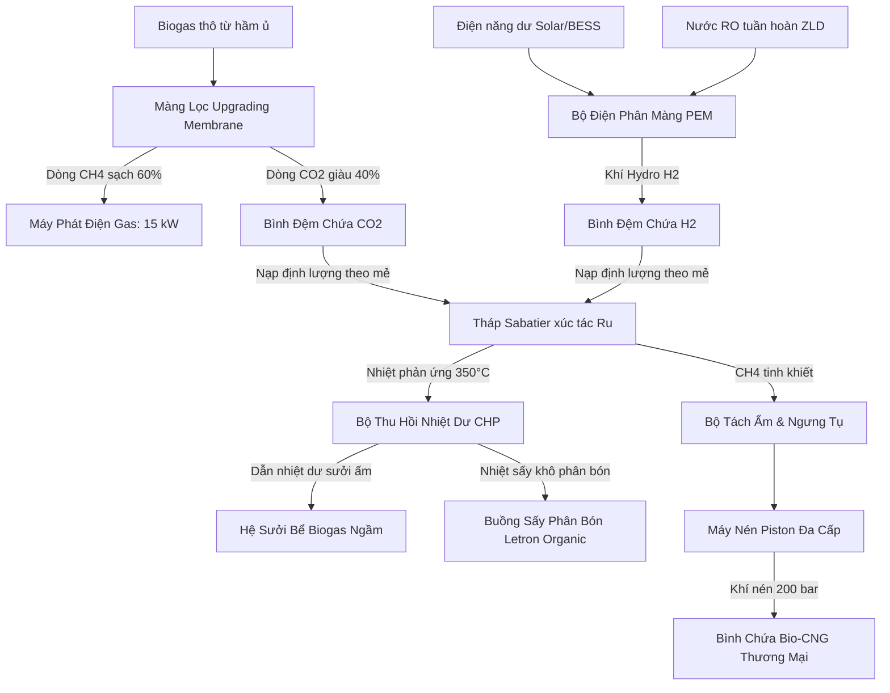

# TÀI LIỆU THIẾT KẾ KỸ THUẬT & TÍNH TOÁN CÔNG SUẤT CỤM TÁI TỔNG HỢP METHANE (CH4)
**Dự án:** Trạm Sạc Xe Điện Tuần Hoàn Năng Lượng Flagship (Quy mô KCN)  
**Tác giả:** Đội ngũ Nghiên cứu & Phát triển (R&D) Letron  

---

## I. NGUYÊN LÝ HOẠT ĐỘNG CỦA CỤM CÔNG NGHỆ LÕI (POWER-TO-GAS & MEMBRANE)

Cụm tái tổng hợp Methane (CH4) chịu trách nhiệm tách lọc khí CO2 từ Biogas thô bằng màng lọc khô (Membrane) và kết hợp với Hydro ($H_2$) từ bộ điện phân PEM để tái tổng hợp thành khí Methane sinh học tinh khiết. Chu trình hoạt động gồm 4 công đoạn khép kín:

---

## II. TÍNH TOÁN CÂN BẰNG VẬT CHẤT & NĂNG LƯỢNG (MASS & ENERGY BALANCE)

Các số liệu tính toán dưới đây được thiết lập cho công suất xử lý định mức của **Trạm Flagship (Tùy chọn B)** xử lý 350 kg rác hữu cơ/ngày:

### 1. Sản lượng CO2 nạp vào tháp phản ứng hàng ngày (V_CO2)
* **CO2 tách lọc từ Biogas thô bằng Membrane:** **18.0 m³/ngày** (tương đương 40% sản lượng khí biogas thô từ hầm ủ ngầm).
* **CO2 từ khí thải động cơ phát điện:** Không thu hồi qua MEA (để giảm hóa chất ăn mòn độc hại và đơn giản hóa hệ thống). Khí thải động cơ được xả thường hoặc chuyển hướng qua bể khoáng hóa vôi tôi $Ca(OH)_2$ vào mùa đông/sự cố để đạt zero-emission.
* **Tổng thể tích CO2 nạp vào lò Sabatier:** **18.0 m³/ngày** (tương đương khoảng 803 mol CO2/ngày).

### 2. Nhu cầu Hydrogen, lượng nước sinh ra và Mạch vòng tuần hoàn nước
Phản ứng hóa học Sabatier: $CO_2 + 4H_2 \rightarrow CH_4 + 2H_2O$
* **Lưu lượng H2 cần thiết:** 18.0 m³ CO2 x 4 = **72.0 m³ H2/ngày** (tương đương 3,214 mol H2/ngày, khối lượng xấp xỉ **6.4 kg H2/ngày**).
* **Nhu cầu nước ban đầu của bộ điện phân màng PEM:** Để sản xuất 6.4 kg H2 cần phân tách khoảng **57.6 kg (lít) nước tinh khiết/ngày**.
* **Lượng nước ngưng tụ sinh ra từ lò Sabatier:** 
   * Theo phương trình phản ứng, cứ 1 mol CO2 phản ứng sinh ra 2 mol H2O.
   * Với 803 mol CO2/ngày, lượng nước sinh ra dạng hơi là: $803 \times 2 = 1,606 \text{ mol H2O/ngày}$.
   * Quy đổi khối lượng nước ngưng tụ: $1,606 \text{ mol} \times 18 \text{ g/mol} \approx \mathbf{28.8 \text{ kg (lít) nước/ngày}}$.
   * Lượng nước này được ngưng tụ và tách ra tại **Bộ Tách Ẩm & Ngưng Tụ (Gas Dryer)** dưới dạng nước cất siêu tinh khiết.
* **Hiệu quả tuần hoàn nước đóng kín (Closed-loop Water Recycling):** 
   * Toàn bộ 28.8 lít nước ngưng tụ từ lò phản ứng được bơm tuần hoàn ngược lại bồn cấp của bộ điện phân PEM.
   * **Kết quả:** Giảm lượng nước sạch cấp ngoài thực tế xuống chỉ còn: $57.6 - 28.8 = \mathbf{28.8 \text{ lít/ngày}}$ (tiết kiệm chính xác **50%** lượng nước tiêu thụ và dễ dàng đáp ứng hoàn toàn bằng hệ lọc nước RO xử lý dịch ép biogas).

### 3. Công suất tiêu thụ điện của bộ điện phân PEM
* Bộ điện phân màng PEM vận hành ở hiệu suất thông thường **53 kWh cho mỗi 1 kg H2**.
* **Tổng điện năng tiêu thụ cho PEM:** 6.4 kg H2 x 53 kWh/kg = **339.2 kWh điện/ngày**.
* **Phân bổ công suất thiết bị:** 
   * Bộ PEM hoạt động linh hoạt (Surplus Power Mode) theo điều phối của EMS, chủ yếu hoạt động vào ban ngày khi công suất phát Solar Carport dư thừa lớn và pin BESS đạt SOC đầy (>95%). Công suất định mức của bộ PEM là **10 kW**.

### 4. Công suất tỏa nhiệt của lò Sabatier và Phân phối nhiệt dư (Thermal Cascade)
* **Nguồn nhiệt:** Phản ứng Sabatier tỏa nhiệt mạnh ($\Delta H = -165 \text{ kJ/mol}$).
   * Với lượng CO2 chuyển hóa là 803 mol/ngày, lượng nhiệt tỏa ra định mức: 803 mol x 165 kJ/mol $\approx$ **37 kWh nhiệt/ngày** (thu hồi thông qua vỏ áo dầu truyền nhiệt silicone tuần hoàn quanh tháp phản ứng ở nhiệt độ 300 - 350 độ C).
* **Biểu đồ phân phối nhiệt dư tuần hoàn chủ động (Thermal Cascade Tiers):**
   * **Tier 1 (Sabatier Heat - 350°C):** Nhiệt phản ứng thu hồi trực tiếp duy trì nhiệt độ lò ấm và làm nóng sơ cấp dòng nước/khí nạp.
   * **Tier 2 (Water Preheating - 80 - 150°C):** Làm nóng nước cấp đầu vào cho bộ điện phân PEM và dịch ép biogas tuần hoàn.
   * **Tier 3 (Digester Heating - 38 - 55°C):** Dẫn qua hệ thống ống đồng quanh thân hầm ủ ngầm để giữ ấm ổn định 38 độ C cho vi sinh vật kỵ khí.
   * **Tier 4 (Organic Fertilizer Drying - 60 - 75°C):** Dẫn nhiệt dư sấy khô cưỡng bức bánh bùn phân sau ép xuống ẩm độ 25% chuẩn hữu cơ vi sinh.
   * **Tier 5 (Space Heating - 25 - 40°C):** Cấp nhiệt sưởi sàn và giữ ấm không gian phòng chờ quán cà phê nghỉ dưỡng.

### 5. Sản lượng nén Bio-CNG thương mại
* Khí Methane tổng hợp sau lò Sabatier đạt độ tinh khiết trên 98%.
* Thể tích CH4 thu hồi: **18.0 m³/ngày**.
* Quy đổi đóng bình Bio-CNG áp suất 200 bar (loại bình 50 lít chứa được 10 m³ khí tiêu chuẩn):
   * **Sản lượng đầu ra:** 18.0 m³ / 10 m³/bình = **~1.8 bình khí nén Bio-CNG/ngày** (đóng vỏ thương mại Letron Bio-CNG).

---

## III. THIẾT KẾ CHI TIẾT THIẾT BỊ PHẦN CỨNG

1. **Bộ điện phân màng trao đổi Proton (PEM):**
   * Module điện phân công nghệ màng PEM thương mại sẵn có, công suất 10 kW, xúc tác Pt/Ir đắt tiền, chạy dải áp suất 30 bar.
   * Tích hợp tủ rack cách điện, hệ thống làm mát bằng quạt cưỡng bức và cảm biến kiểm soát dòng điện.
2. **Tháp phản ứng Sabatier Inox 316L:**
   * Tháp phản ứng dạng ống chùm (tubular reactor) bằng thép không gỉ Inox 316L, đường kính ống phản ứng 76mm, chiều dài tháp 1.8m.
   * Chất xúc tác: Hạt xúc tác Ruthenium (Ru) phân tán 0.5% trên hạt mang Oxit nhôm Al2O3.
   * **Vỏ áo gia nhiệt (Heating Jacket):** Vỏ bọc kép ngoài tháp chứa dầu truyền nhiệt tuần hoàn liên tục kết nối với van điều khiển lưu lượng để giải nhiệt cho lò phản ứng khi nhiệt độ vượt quá 350 độ C.
3. **Bình đệm khí áp suất trung bình:**
   * 01 bình đệm chứa H2 và 01 bình đệm chứa CO2 bằng thép carbon chịu áp lực 10 bar, dung tích 500 lít mỗi bình.
   * Lắp cảm biến áp suất kỹ thuật số truyền tín hiệu về bộ điều khiển trung tâm.
4. **Máy nén Piston đa cấp Bio-CNG:**
   * Máy nén piston 3 cấp hành trình khép kín, bọc chống cháy nổ tiêu chuẩn ATEX Zone 1.
   * Áp suất nén tối đa 200 bar, tích hợp bộ tách dầu và bộ sấy hạt hút ẩm khí Methane tự động hoàn nguyên.

---

## IV. HỆ THỐNG ĐIỀU KHIỂN & TỰ ĐỘNG HÓA VẬN HÀNH

1. **Vòng điều khiển PID nhiệt độ lò Sabatier:**
   * Bộ điều khiển PLC Siemens S7-1200 đọc giá trị cảm biến nhiệt độ Thermocouple loại K dọc thân lò.
   * Tự động điều chỉnh độ mở van để giữ nhiệt độ lò ổn định ở điểm ngọt 310 độ C.
2. **Cơ chế vận hành theo mẻ tự động (Dynamic Batch Controller):**
   * Hệ thống tự động theo dõi áp suất bình chứa H2 và CO2.
   * Khi áp suất đạt ngưỡng 8 bar (đủ khối lượng khí cho một mẻ phản ứng), PLC sẽ kích hoạt mở đồng thời van điện từ nạp khí vào tháp phản ứng với tỷ lệ lưu lượng H2/CO2 luôn duy trì chính xác ở mức 4.0.
   * Tự động ngắt van xả nạp khi áp suất bình chứa giảm xuống mức 1.5 bar, kết thúc mẻ và bắt đầu chu kỳ tích áp mới.
3. **Chế độ kiểm soát nguồn nạp Hydro thông minh theo mùa (Seasonal H2 Feed Automation):**
   * **Chế độ On-site Solar (Mùa hè):** PLC đồng bộ với bộ EMS, chỉ kích hoạt máy điện phân PEM vào ban ngày khi công suất phát Solar dư thừa và pin BESS đạt mức lưu trữ an toàn (SOC > 95%).
   * **Chế độ Vận hành Cơ bản & Khoáng hóa CO2 (Mùa đông/Bão):** Khi thiếu hụt Solar, EMS tắt hoàn toàn cụm điện phân PEM và lò Sabatier. Khí $CO_2$ thu hồi từ biogas sẽ được dẫn sang bể khoáng hóa sục nước vôi tôi $Ca(OH)_2$ để kết tủa thành $CaCO_3$ bột bổ sung vào phân bón Letron Organic. Trạm sạc chỉ nén dòng Biomethan tự nhiên (27 m3/ngày) thành Bio-CNG. Nếu dự báo ngày tiếp theo thừa điện Solar (BESS đầy sớm), EMS tự động chạy thanh gia nhiệt lò Sabatier trước 45 phút và khởi động máy điện phân để chuyển hóa điện thừa thành Bio-CNG.

---

## V. BẢNG SO SÁNH CHI PHÍ ĐẦU TƯ (CAPEX) CỤM CH4

Dưới đây là dự toán chi phí đầu tư (CAPEX) cho cụm thiết bị tái tổng hợp Methane (CH4), so sánh giữa đơn vị tối thiểu (Tùy chọn A) và quy mô thương mại Flagship (Tùy chọn B):

| STT | Hạng mục thiết bị / Chi phí | Tùy chọn A (Minimum Unit - 01 Bốt sạc kép) | Tùy chọn B (Trạm Flagship 500m² - 04 Bốt sạc kép) | Nhận xét quy mô |
| :--- | :--- | :--- | :--- | :--- |
| 1 | **Bộ điện phân màng PEM** | 50,000,000 *(Modul PEM mini 2 kW)* | 160,000,000 *(Hệ thống PEM công nghiệp 10 kW)* | PEM bám tải nhanh, vận hành linh hoạt, bám sát Solar |
| 2 | **Tháp phản ứng Sabatier** | 35,000,000 *(Tháp R&D tự chế + xúc tác Ru)* | 90,000,000 *(Tháp chùm Inox 316L + xúc tác Ru)* | Tùy chọn B sử dụng tháp chùm đa ống công suất lớn |
| 3 | **Hệ thống thu hồi nhiệt CHP** | 20,000,000 *(Bộ trao đổi nhiệt mini)* | 55,000,000 *(CHP tích hợp đường dầu truyền nhiệt)* | Thu hồi nhiệt dư sưởi bể biogas và sấy khô phân bón |
| 4 | **Bình đệm khí trung áp** | 15,000,000 *(Bình thép chịu lực 10 bar, 200L)* | 40,000,000 *(Bình thép chịu lực 10 bar, 500L x 2)* | Lưu trữ đệm Hydro và CO2 phục vụ chạy theo mẻ |
| 5 | **Bộ lọc màng Biogas Membrane** | 25,000,000 *(Tháp lọc màng thô)* | 75,000,000 *(Màng sợi rỗng Upgrading Membrane)* | Tách CO2 từ Biogas thô khô ráo, không dùng hóa chất |
| 6 | **Hệ nén đóng bình Bio-CNG** | 50,000,000 *(Máy nén mini + bình chứa)* | 120,000,000 *(Máy nén piston 3 cấp + bình chứa)* | Đóng bình Bio-CNG áp suất 200 bar thương mại |
| 7 | **Hệ van & Đường ống chịu áp** | 15,000,000 *(Hệ van Inox 316)* | 35,000,000 *(Hệ van tuyến tính tự động Swagelok)* | Van Swagelok chịu áp lực cao và chống rò rỉ khí |
| 8 | **Tủ điện điều khiển tự động** | 20,000,000 *(PLC điều khiển PID cơ bản)* | 55,000,000 *(PLC Siemens S7-1200 + SCADA)* | Quản lý đóng cắt van tự động và chạy mẻ Dynamic Batch |
| 9 | **Lắp đặt & Kiểm định an toàn** | 15,000,000 *(Lắp đặt cơ khí cơ bản)* | 30,000,000 *(Lắp đặt, kiểm định PCCC công nghiệp)* | Đạt các chứng chỉ an toàn thiết bị áp lực và PCCC |
| | **TỔNG CỘNG CAPEX CỤM CH4** | **245,000,000 VNĐ** | **660,000,000 VNĐ** | *Chi phí thiết bị chưa bao gồm giàn Solar và pin BESS* |
