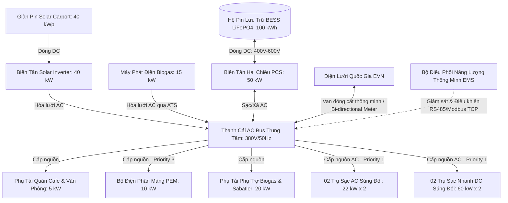
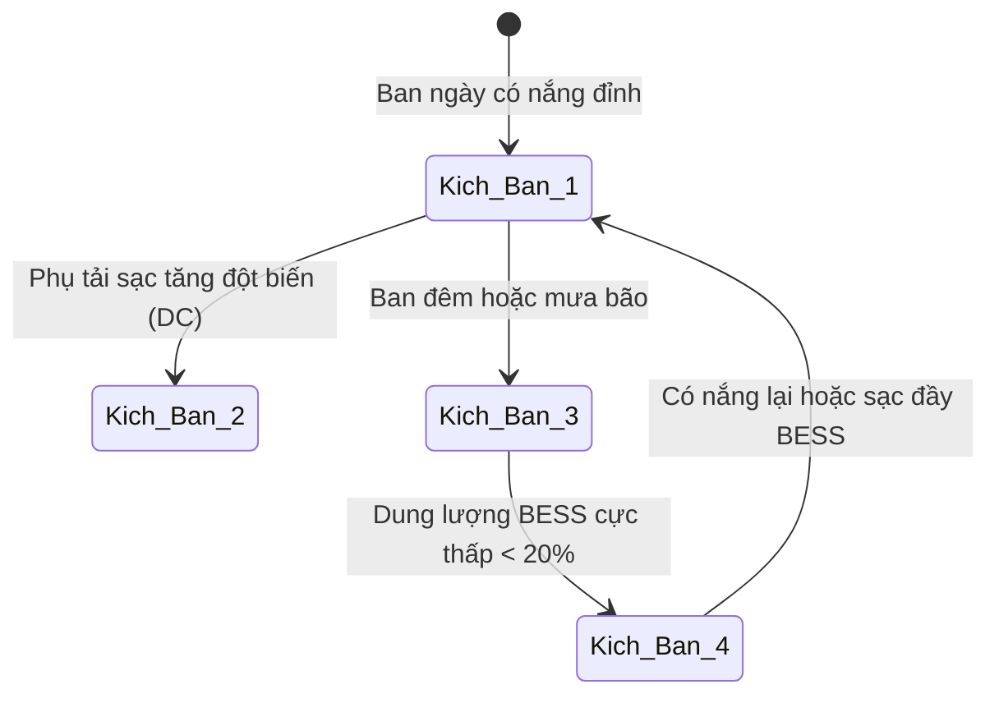

# TÀI LIỆU THIẾT KẾ KỸ THUẬT & TÍNH TOÁN CÔNG SUẤT CỤM MICROGRID & TRẠM SẠC XE ĐIỆN
**Dự án:** Trạm Sạc Xe Điện Tuần Hoàn Năng Lượng Flagship (Quy mô KCN)  
**Tác giả:** Đội ngũ Nghiên cứu & Phát triển (R&D) Letron  

---

## I. NGUYÊN LÝ HOẠT ĐỘNG CỦA VI LƯỚI ĐIỆN (MICROGRID SYSTEM)

Cụm Microgrid & Trạm Sạc là trái tim năng lượng của Trạm Flagship, điều phối nguồn điện từ các nguồn phát tại chỗ (Solar Carport, Máy phát điện chạy Biogas) và hệ thống lưu trữ năng lượng (BESS) để cung cấp dòng sạc ổn định, công suất lớn cho các phương tiện giao thông điện.

Sơ đồ nguyên lý cấu trúc lưới điện tích hợp AC/DC Hybrid Microgrid (Tích hợp màng nâng cấp sinh học và điện phân PEM):

---

## II. TÍNH TOÁN CÔNG SUẤT VÀ LỰA CHỌN THIẾT BỊ LÕI

Tính toán được thực hiện cho **Trạm Flagship (Tùy chọn B)** có tổng diện tích mái che Solar Carport 250 m², vận hành 04 bốt sạc súng đôi (tổng cộng 8 đầu sạc AC/DC).

### 1. Giàn Pin Solar Carport
* **Diện tích khả dụng:** 250 m² mái che bãi đỗ xe (đủ cho 8-10 vị trí đỗ xe ô tô).
* **Lựa chọn tấm pin:** Sử dụng tấm pin mặt trời công nghệ **Mono-Crystalline Half-cut cells** hiệu suất cao (21.5%), công suất định mức **450 Wp/tấm**.
  * Kích thước tấm pin: 2.1m x 1.05m $\approx$ 2.2 m²/tấm.
  * Số lượng tấm pin lắp đặt tối đa: 250 m² / 2.2 m² $\approx$ **90 tấm**.
  * **Tổng công suất giàn Solar:** 90 tấm x 450 Wp = **40.5 kWp** (lấy tròn thiết kế **40 kWp**).
* **Sản lượng điện năng trung bình ngày (E_solar):**
  * Theo số liệu khí tượng khu vực miền Bắc, số giờ nắng đỉnh trung bình năm (Peak Sun Hours - PSH) đạt **3.5 giờ/ngày** (mùa hè đạt 4.8 - 5.2 giờ/ngày, mùa đông giảm xuống 2.0 - 2.5 giờ/ngày).
  * Sản lượng điện trung bình ngày: $E_{\text{solar}} = 40 \text{ kWp} \times 3.5 \text{ PSH} \times 0.85 \text{ (Hao phí hệ thống)} \approx \mathbf{119 \text{ kWh/ngày}}$.

### 2. Tủ Pin Lưu Trữ Năng Lượng (BESS - Battery Energy Storage System)
* **Dung lượng lưu trữ định mức:** **100 kWh** (Dung lượng sử dụng thực tế đạt 85% DOD để tăng tuổi thọ pin, tương đương **85 kWh**).
* **Lựa chọn công nghệ:** Cell pin **Lithium Iron Phosphate (LiFePO4)** loại 3.2V - 280Ah.
  * Pack cấu hình nối tiếp (Series) tạo điện áp cao để giảm dòng điện hao phí: 128 cell nối tiếp ($128S1P$) tạo pack định mức **409.6 VDC**, dung lượng điện tích **280 Ah**.
  * Tổng năng lượng lưu trữ thực tế: $409.6\text{ V} \times 280\text{ Ah} = \mathbf{114.7 \text{ kWh}}$ (đáp ứng dư tải hao hao hiệu suất để đảm bảo cung cấp tròn 100 kWh định mức đầu ra).
* **Bộ chuyển đổi điện năng hai chiều (Power Conversion System - PCS):**
  * Lựa chọn tủ PCS công suất **50 kW** hỗ trợ hòa lưới và chạy độc lập (Off-grid). Tích hợp chức năng sạc/xả thông minh từ lưới hoặc Solar theo tín hiệu điều khiển của bộ EMS.
  * Hiệu suất chuyển đổi hai chiều (Round-trip efficiency) đạt **$\ge 90\%$**.

### 3. Hệ Thống Trụ Sạc Xe Điện (EV Chargers)
Để đáp ứng đa dạng nhu cầu của khách hàng dừng nghỉ tại KCN, trạm được thiết kế phân cấp thiết bị sạc:
* **02 Trụ sạc nhanh DC súng đôi (60 kW mỗi trụ):**
  * Mỗi trụ có 02 súng sạc chuẩn CCS2. Hỗ trợ cơ chế chia sẻ công suất thông minh (Dynamic Power Sharing): Khi sạc 01 xe đạt tối đa 60 kW, sạc đồng thời 2 xe tự động chia tải 30 kW + 30 kW.
  * Ưu tiên dành cho khách hàng đỗ xe ngắn hạn, sạc nhanh trong 30-45 phút tại bốt sạc.
* **02 Trụ sạc AC súng đôi (22 kW mỗi trụ):**
  * Mỗi trụ có 02 đầu cắm chuẩn Type 2. Chia tải tự động 11 kW + 11 kW khi sạc 2 xe đồng thời.
  * Phục vụ khách hàng sạc qua đêm (xe tải nhỏ KCN, xe nhân viên) hoặc khách nghỉ ngơi lâu tại quán cafe (2-4 tiếng).
* **Tổng công suất phụ tải đỉnh của các trụ sạc:**
  * Công suất danh định tối đa: 2 x 60 kW + 2 x 22 kW = **164 kW**.
  * Trong vận hành thực tế, bộ điều khiển EMS sẽ giới hạn công suất sạc tối đa của toàn trạm ở mức **100 kW** nhờ thuật toán quản lý phụ tải động (Dynamic Load Management - DLM) để bảo vệ hệ thống tủ điện và tránh quá tải BESS/máy phát.

---

## III. CÂN BẰNG NĂNG LƯỢNG HÀNG NGÀY & KỊCH BẢN VẬN HÀNH

### 1. Hạch toán nhu cầu tiêu thụ và nguồn cung cấp (Trung bình ngày)
* **Tổng nhu cầu phụ tải tiêu thụ trung bình hàng ngày:**
  * Sạc xe điện (Dự báo trung bình 8-10 xe ô tô sạc/ngày, mỗi xe nhận trung bình 20 kWh): ~180 kWh/ngày.
  * Hệ thống phụ trợ Biogas & tháp Sabatier: ~20 kWh/ngày.
  * Bộ điện phân màng PEM (hoạt động ở chế độ hấp thụ điện dư thừa): ~30-40 kWh/ngày.
  * Phụ tải chiếu sáng, điều hòa quán cafe nghỉ dưỡng: ~30 kWh/ngày.
  * **Tổng nhu cầu: ~260 - 270 kWh/ngày.**
* **Tổng năng lực cung cấp năng lượng tái tạo tại chỗ:**
  * Điện mặt trời (Solar Carport): **119 kWh/ngày** (Phát chủ yếu trong 8 giờ ban ngày).
  * Điện sinh học từ máy phát điện Biogas (15 kW chạy 8.5 giờ/ngày): 15 kW x 8.5 giờ x 0.9 (Hiệu suất hao phí máy phát) $\approx$ **115 kWh/ngày**.
  * **Tổng nguồn cung cấp: ~234 kWh/ngày.**
  * *Phần thiếu hụt nhỏ (~6 kWh/ngày)* hoặc biến động thời tiết được bù đắp hoàn hảo từ nguồn mua điện lưới vào khung giờ thấp điểm ban đêm (22:00 - 04:00 với giá điện rẻ chỉ bằng 1/3 giá giờ cao điểm).

### 2. Kịch bản vận hành chi tiết của hệ thống điều khiển EMS (Energy Priority Engine)

Bộ quản lý năng lượng thông minh EMS vận hành theo cơ chế ưu tiên đóng cắt phụ tải nghiêm ngặt:
* **Priority 1 (EV Charging):** Ưu tiên hàng đầu cho các trụ sạc EV.
* **Priority 2 (BESS Charging):** Ưu tiên thứ hai nạp đầy tủ pin BESS.
* **Priority 3 (PEM Electrolyzer):** Chỉ kích hoạt bộ điện phân màng PEM chạy công suất tối đa bằng năng lượng điện mặt trời dư thừa khi BESS đã đầy ($SOC \ge 95\%$) hoặc khi có tín hiệu điều phối sạc bù giờ thấp điểm ban đêm.
* **Priority 4 (Grid Export/Curtailment):** Bảo vệ quá áp hệ thống.

Sơ đồ chuyển trạng thái vận hành của trạm:

* **Kịch bản 1: Vận hành cơ bản ban ngày (08:00 - 16:00)**
  * Năng lượng Solar phát ra ưu tiên cấp trực tiếp cho phụ tải sạc xe điện và quán cafe tại chỗ (Priority 1).
  * Lượng điện dư thừa từ Solar được sạc trực tiếp vào tủ pin BESS (Priority 2).
  * Nếu BESS đã đầy và Solar vẫn dư thừa, EMS kích hoạt bộ điện phân màng PEM chạy ở công suất định mức để chuyển hóa điện năng dư thành Hydro ($H_2$) tích trữ đệm, chuẩn bị cho mẻ phản ứng Sabatier (Priority 3).
* **Kịch bản 2: Phụ tải sạc tăng đột biến (Cao điểm ban ngày)**
  * Khi nhiều xe sạc nhanh DC cùng lúc, công suất phụ tải vượt quá công suất phát của Solar.
  * EMS tự động điều phối tủ pin BESS xả bù công suất thiếu hụt thông qua bộ PCS.
  * Nếu công suất tổng vẫn tiệm cận ngưỡng quá tải hệ thống, thuật toán DLM sẽ tự động giảm công suất của các súng sạc AC xuống còn 3.7 kW và súng sạc DC xuống còn 25 kW để đảm bảo an toàn vận hành, tránh nhảy aptomat tổng.
* **Kịch bản 3: Vận hành ban đêm và những ngày mưa kéo dài (16:00 - 08:00 sáng hôm sau)**
  * Giàn pin Solar ngừng phát điện. Toàn bộ phụ tải trạm sạc và quán cafe được cấp nguồn từ tủ pin BESS.
  * Tận dụng nhiệt dư lưu trữ trong bể đệm từ ban ngày để duy trì sưởi ấm bể biogas ngầm.
* **Kịch bản 4: Dự phòng khẩn cấp & Sạc bù (BESS xuống mức giới hạn)**
  * Khi dung lượng tủ BESS xuống dưới $20\%$, hệ thống ATS kích hoạt khởi động máy phát điện chạy biogas (15 kW) để gánh tải trực tiếp và sạc bù cho pin BESS.
  * Đồng thời, vào khung giờ thấp điểm ban đêm (22:00 - 04:00), EMS đóng ngắt van thông minh cho phép nạp điện từ lưới điện quốc gia (EVN) vào BESS với công suất nhỏ (10 kW) để dự phòng dung lượng cho các đợt sạc ngày hôm sau với chi phí mua điện tối thiểu.

### 3. Chế độ vận hành Mùa đông / Thiếu hụt Solar kéo dài (Winter & Low-Solar Mode)
Vào mùa đông (giờ nắng đỉnh giảm xuống 2.0 - 2.5 giờ/ngày), sản lượng Solar Carport giảm mạnh chỉ còn ~75 kWh/ngày, không đủ gánh phụ tải sạc xe và duy trì điện phân tự sản xuất Hydro. Bộ EMS tự động kích hoạt chế độ vận hành mùa đông:
* **Ưu tiên phụ tải sạc (EV Charging Priority):** Toàn bộ điện mặt trời ban ngày được ưu tiên tuyệt đối cho các trụ sạc EV và phụ tải văn phòng/cafe.
* **Ngừng điện phân ban ngày:** Tạm thời tắt bộ điện phân PEM vào ban ngày để tránh cạnh tranh nguồn điện với xe sạc.
* **Chế độ Vận hành Cơ bản & Khoáng hóa CO2:** Để duy trì tính tự chủ xanh 100%, khi thiếu hụt Solar, EMS tắt hoàn toàn bộ điện phân PEM và tháp Sabatier. Khí $CO_2$ thu hồi từ biogas và đường khí thải máy phát điện được dẫn sang bể khoáng hóa sục nước vôi tôi $Ca(OH)_2$ để kết tủa thành $CaCO_3$ bột bổ sung vào phân bón Letron Organic. Trạm sạc chỉ nén dòng Biomethan tự nhiên (27 m3/ngày) thành Bio-CNG.
* **Kích hoạt tự động theo dự báo:** EMS liên tục cập nhật dự báo thời tiết và lịch sạc xe điện. Nếu dự báo ngày tiếp theo thừa điện Solar (BESS đầy sớm), EMS tự động chạy thanh gia nhiệt lò Sabatier trước 45 phút và khởi động máy điện phân để chuyển hóa điện thừa thành Bio-CNG, tránh lãng phí Solar Curtailment.

---

## IV. THIẾT KẾ ĐIỆN VÀ ĐẤU NỐI AN TOÀN

Để đảm bảo hệ thống vận hành an toàn trong điều kiện công nghiệp, các tiêu chuẩn bảo vệ thiết bị được thiết lập nghiêm ngặt:
1. **Bảo vệ chống sét lan truyền (SPD):**
   * Lắp đặt thiết bị bảo vệ chống sét lan truyền Type 1 + 2 tại đầu ra tủ kết hợp Solar (DC Combiner Box) và đầu vào tủ phân phối AC tổng của trạm.
2. **Hệ thống nối đất độc lập:**
   * Trạm thiết kế hệ thống nối đất an toàn điện độc lập với trị số điện trở nối đất $R_{nd} \le 4 \ \Omega$.
   * Toàn bộ vỏ tủ kim loại của BESS, khung đỡ thép Solar Carport, vỏ bốt sạc EV và máy phát điện được liên kết đẳng thế bằng cáp đồng trần M50 xuống bãi cọc tiếp địa.
3. **Tiêu chuẩn chống cháy nổ cho khu vực đỗ xe:**
   * Vì dưới nền bãi đỗ xe là hệ thống bể ủ biogas kỵ khí ngầm, toàn bộ tủ BESS và biến tần PCS phải đặt cách nắp hầm kỹ thuật gas tối thiểu **8 mét**.
   * Trụ sạc xe điện sử dụng cáp điện bọc giáp thép chịu lực chôn ngầm trong ống nhựa HDPE chịu lực để tránh hư hỏng cơ học do phương tiện di chuyển đè lên.

---

## V. BẢNG SO SÁNH CHI PHÍ ĐẦU TƯ (CAPEX) CỤM MICROGRID & TRẠM SẠC

Dưới đây là dự toán chi tiết chi phí đầu tư thiết bị vật tư cho cụm nguồn Microgrid & Trạm Sạc, so sánh giữa quy mô tối giản (Tùy chọn A) và quy mô Flagship thương mại (Tùy chọn B):

| STT | Thiết bị / Vật tư chính | Tùy chọn A (Minimum Unit - 01 Bốt sạc kép) | Tùy chọn B (Trạm Flagship - 04 Bốt sạc kép) | Nhận xét chi tiết kỹ thuật |
| :--- | :--- | :--- | :--- | :--- |
| 1 | **Tấm pin mặt trời (Solar)** | 40,000,000 *(Giàn Solar 10 kWp)* | 150,000,000 *(Giàn Solar 40 kWp)* | Tấm pin Mono-Crystalline Half-cut 450 Wp cao cấp |
| 2 | **Khung giá đỡ thép Carport** | 25,000,000 *(Mái che đỗ xe 2 vị trí)* | 85,000,000 *(Mái che đỗ xe 8 vị trí)* | Thép hộp mạ kẽm sơn tĩnh điện chống ăn mòn ngoài trời |
| 3 | **Biến tần năng lượng mặt trời** | 15,000,000 *(Inverter 10 kW)* | 45,000,000 *(Inverter 40 kW)* | Inverter hòa lưới 3 pha chất lượng cao tích hợp bảo vệ |
| 4 | **Hệ thống pin lưu trữ BESS** | 70,000,000 *(Tủ LiFePO4 30 kWh)* | 220,000,000 *(Tủ LiFePO4 100 kWh)* | Pack cell 3.2V/280Ah tích hợp hệ thống quản lý BMS |
| 5 | **Biến tần BESS (PCS)** | 25,000,000 *(Biến tần PCS 15 kW)* | 75,000,000 *(Biến tần PCS 50 kW)* | Biến tần hybrid hai chiều chuyên dụng cho hệ Microgrid |
| 6 | **Bốt sạc nhanh DC** | 0 VNĐ *(Chỉ sử dụng sạc AC)* | 240,000,000 *(02 Trụ sạc nhanh DC 60 kW)* | Trụ sạc DC súng đôi chia sẻ công suất thông minh |
| 7 | **Bốt sạc chậm AC** | 35,000,000 *(01 Trụ sạc AC kép 7kW x 2)* | 70,000,000 *(02 Trụ sạc AC kép 22kW x 2)* | Trụ sạc AC Type 2 gắn tường hoặc chân đế kim loại |
| 8 | **Tủ điện phân phối & Cáp ngầm** | 20,000,000 *(Cáp và tủ điện đóng cắt cơ bản)* | 65,000,000 *(Tủ điện ATS, ATS bypass, cáp động lực)* | Cáp bọc giáp chống cháy, hệ tủ điện ATS công nghiệp |
| 9 | **Hệ EMS & Thiết bị giám sát** | 15,000,000 *(Giám sát qua ứng dụng Inverter)* | 40,000,000 *(Bộ EMS Letron + HMI + IoT gateway)* | Thuật toán điều phối tải động DLM và giám sát Modbus |
| 10 | **Nối đất, chống sét & PCCC** | 15,000,000 *(Hệ kim thu lôi & cọc tiếp địa)* | 45,000,000 *(Tiếp địa liên kết đẳng thế + dập lửa tủ BESS)* | Đạt tiêu chuẩn an toàn điện lực và kiểm định PCCC |
| | **TỔNG CỘNG CAPEX CỤM NGUỒN** | **260,000,000 VNĐ** | **995,000,000 VNĐ** | *Chưa bao gồm hệ thống bể ủ biogas và cụm Sabatier* |
