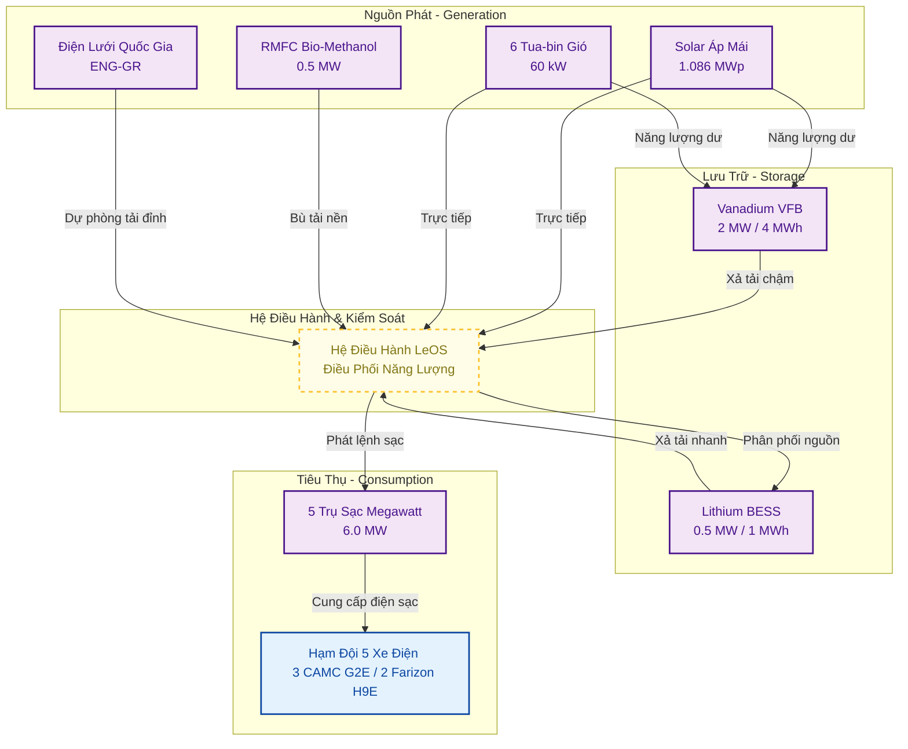
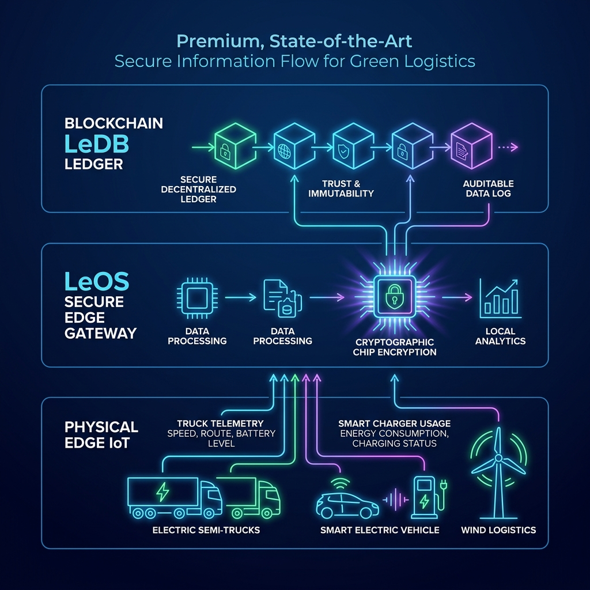
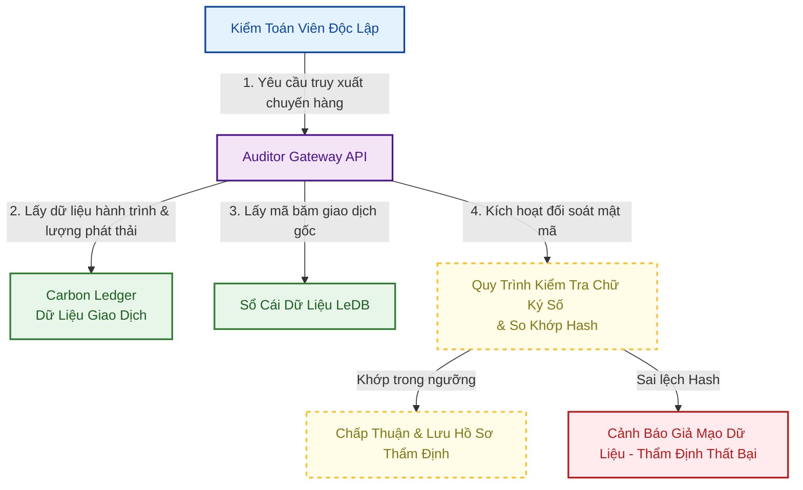

# LeTRON Green Logistics Project Design Document (PDD)

## 1. Executive Summary

### 1.1 Project Overview

Dự án thí điểm vận tải xanh kết nối các KCN trọng điểm bằng xe điện nặng, sạc Megawatt và nguồn năng lượng tái tạo tại Service Hub; đồng thời thiết lập hệ thống dữ liệu chuẩn hóa để sẵn sàng đáp ứng các yêu cầu kiểm kê phát thải và báo cáo carbon quốc tế như ISO 14064-2 và ISO 14067.

### 1.2 Business Objectives

* Thử nghiệm hạm đội xe điện nặng và trạm sạc Megawatt trong điều kiện tải thực tế.
* Kiểm chứng LeOS, LeDB và quy trình hỗ trợ cấp chứng thư Le-GCP.
* Chuẩn bị phương pháp luận MRV để làm việc với đơn vị kiểm toán và đối tác FDI.

### 1.3 Sustainability Objectives

* Đạt tỷ lệ năng lượng tái tạo tự cung cấp mục tiêu **60% -100%** tại Hub dịch vụ.
* Giảm phát thải ròng cho hạm đội pilot so với kịch bản xe diesel.
* Thiết lập Digital MRV phục vụ kiểm toán và báo cáo ESG của khách hàng.

### 1.4 Expected Deliverables

* **Le-GCP:** Chứng thư số giảm phát thải kèm chữ ký số và mã băm lưu vết.
* **Carbon Ledger & Energy Ledger:** Theo dõi phát thải và dòng chảy năng lượng.
* **Green Logistics Dashboard:** Trực quan hóa phát thải, năng lượng và hiệu suất vận hành.
* **Auditor Gateway:** Cổng truy cập dữ liệu phục vụ đối soát độc lập.

### 1.5 Intended Verification Scope

* **ISO 14064-2:** Định lượng lượng giảm phát thải khí nhà kính cấp độ dự án vận tải xanh.
* **Audit Trail:** Thiết lập chuỗi bằng chứng số liên tục từ thiết bị biên phục vụ hoạt động kiểm toán độc lập.
* **ISO/IEC 27001 & TISAX:** Định hướng kiểm soát an ninh thông tin và an toàn dữ liệu chuỗi cung ứng công nghệ cao.
* **Data Integrity & Traceability:** Thiết lập quy trình quản lý dữ liệu đảm bảo tính toàn vẹn; dữ liệu sau khi thẩm định được cấp dưới dạng hồ sơ bằng chứng số Le-GCP phục vụ đối soát và báo cáo phát thải.

## 2. Project Scope & Boundary

### 2.1 Physical Boundary (Ranh giới vật lý)

Ranh giới vật lý gồm 3 nhóm tài sản vận hành:

* **Energy Assets (Tài sản năng lượng tại Hub Dịch vụ Hiệp Hoà - Quảng Ninh):**
  * Hệ thống điện mặt trời áp mái: **1.086 MWp**.
  * Hệ thống tuabin gió trục đứng: **6 trụ x 10 kW/trụ**, tổng công suất **60 kW**.
  * Máy phát điện Pin nhiên liệu RMFC sử dụng Bio-Methanol: **01 máy x 0.5 MW**.
  * Trạm biến áp đấu nối điện lưới quốc gia (dự phòng bù tải đỉnh).
  * Trạm siêu sạc Megawatt: **5 trụ sạc x 1.2 MW/trụ**, tổng công suất thiết kế **6.0 MW**.
  * Hệ thống lưu trữ năng lượng tích hợp: Bể pin dòng chảy Vanadium VFB **2 MW / 4 MWh** và Lithium-ion BESS **0.5 MW / 1 MWh**.
* **Mobility Assets (Tài sản di động):**
  * Hạm đội xe điện nặng: **3 xe đầu kéo CAMC G2E** với pin **440 kWh/xe** và **2 xe Farizon H9E** với pin **106.95 kWh/xe**.
  * Tuyến vận hành: các tuyến vận chuyển giữa các KCN trọng điểm, bắt đầu/kết thúc tại Hub sạc LeTRON.
* **Facility Assets (Tài sản hạ tầng):**
  * Service Hub: **Hub Dịch vụ Hiệp Hoà - Quảng Ninh**, tích hợp hệ thống sạc Megawatt công suất lớn và khu vực quản lý kỹ thuật.
  * Maintenance Hub: bảo trì phương tiện và kiểm định cảm biến IoT.

### 2.2 Digital Boundary (Ranh giới số)

Ranh giới số xác định dữ liệu được thu thập, xử lý và kiểm toán:

* **Hệ thống thiết bị biên (Edge IoT Systems):**
  * Le-NodeMobile: thiết bị IoT trên xe, đọc CAN Bus và cảm biến tải trọng trục.
  * Le-NodeHub: gateway tại trạm sạc, đọc công tơ điện và SCADA nguồn phát.
* **Nền tảng xử lý dữ liệu trung tâm (Platform Systems):**
  * LeOS: tính điện sạc hiệu dụng, phân bổ nguồn và phát thải theo thời điểm vận hành.
  * Hệ thống Sổ cái (Ledgers): Energy Ledger (sổ cái năng lượng) và Carbon Ledger (sổ cái phát thải).
  * LeDB: lưu mã băm (Hash) của giao dịch dữ liệu gốc để phát hiện chỉnh sửa hồi tố và phục vụ kiểm toán.

### 2.3 Organizational Boundary (Ranh giới tổ chức)

* **Mô hình kiểm kê khí nhà kính:** Áp dụng phương pháp kiểm soát vận hành trực tiếp (Direct Operational Control) theo hướng dẫn của GHG Protocol Corporate Standard và ISO 14064-1. Tất cả tài sản thuộc danh mục kiểm soát vận hành được liệt kê trong [4. Asset Register](#4-asset-register-danh-muc-tai-san-du-an) đều thuộc phạm vi báo cáo.
* **Ranh giới báo cáo trách nhiệm phát thải:**
  * **Scope 1 (Phát thải trực tiếp):** Toàn bộ phát thải từ quá trình đốt nhiên liệu sinh học Bio-Methanol của máy phát RMFC (01 máy x 0.5 MW) thuộc quyền sở hữu và kiểm soát của LeTRON. Do tính chất sinh học, lượng phát thải CO2 này được báo cáo riêng biệt theo quy định của GHG Protocol, còn các chất khí khác (CH4, N2O) được tính vào Scope 1.
  * **Scope 2 (Phát thải gián tiếp từ điện năng mua ngoài):** Lượng điện lưới quốc gia nhập vào trạm siêu sạc Megawatt tại Hub Hiệp Hoà. Áp dụng song song hai phương pháp báo cáo theo GHG Protocol Scope 2 Guidance:
    * *Location-based:* Sử dụng hệ số phát thải lưới điện Việt Nam công bố chính thức theo năm (EF_Grid = 0.6592 kgCO2/kWh).
    * *Market-based:* Sử dụng hệ số phát thải thực tế bằng 0 cho phần năng lượng sạch tự cấp từ điện mặt trời và điện gió nội bộ tại Hub (khi có chứng từ lưu vết năng lượng sạch Energy Ledger), và áp dụng hệ số lưới điện quốc gia đối với lượng điện lưới tiêu thụ bổ sung không có EACs/REC.
  * Dữ liệu sau khi thẩm định được xuất dưới dạng Le-GCP để đối tác sử dụng làm hồ sơ bằng chứng phát thải chuỗi cung ứng (Scope 3 Category 4/9), kèm cơ chế đối soát chống tính trùng lặp (double counting).

## 3. Stakeholder Definition

### 3.1 Internal Stakeholders (Nội bộ LeTRON)

* **LeTRON Holding:** Chỉ đạo chiến lược và phê duyệt phân bổ tài chính.
* **LeSM:** Quản lý lịch chạy xe, phân bổ hàng hóa và vận hành trạm sạc.
* **LeDB:** Vận hành LeOS, Le-NodeMobile/Hub, phần cứng IoT và lớp dữ liệu LeDB.
* **LeSE:** Giám sát nguồn phát sạch, RMFC và hệ thống lưu trữ.

### 3.2 External Stakeholders (Bên ngoài)

* **Customers:** Nhận dịch vụ vận tải xanh và hồ sơ bằng chứng Le-GCP cho dữ liệu phát thải.
* **Independent Auditors:** Truy cập Auditor Gateway để rà soát phương pháp luận và dữ liệu.

## 4. Asset Register (Danh mục Tài sản dự án)

Danh mục tài sản dùng để theo dõi phương tiện, nguồn phát, lưu trữ và thiết bị đo lường:

| Nhóm tài sản | Tên / Định danh tài sản | Số lượng | Dòng xe / Model thiết bị | Thông số / Công suất thiết kế | Thiết bị đo lường & IoT tích hợp | Vai trò vận hành |
| :--- | :--- | :---: | :--- | :--- | :--- | :--- |
| **Phương tiện** | Xe đầu kéo điện nặng | 3 | CAMC G2E | Pin **440 kWh/xe** | Le-NodeMobile, Cảm biến tải trục | Vận chuyển nguyên liệu nặng |
| **Phương tiện** | Xe tải điện trung | 2 | Farizon H9E | Pin **106.95 kWh/xe** | Le-NodeMobile, Cảm biến tải trục | Vận chuyển thành phẩm FDI |
| **Trạm sạc** | Trạm siêu sạc Megawatt tại Hub Hiệp Hoà | 5 | Súng sạc Megawatt (MCS) | **1.2 MW/trụ**; tổng **6.0 MW** (OCPP 2.0.1) | Công tơ thông minh 3 pha (Class 0.5S), Gateway Le-NodeHub | Sạc nhanh công suất lớn cho hạm đội xe |
| **Nguồn phát** | Hệ thống Điện mặt trời | 1 | Solar áp mái | **1.086 MWp** | Cảm biến bức xạ (Pyranometer), SCADA kết nối LeOS | Nguồn phát sạch tự dùng chính |
| **Nguồn phát** | Hệ thống Điện gió | 6 | Tua-bin gió trục đứng | **10 kW/trụ**; tổng **60 kW** | Cảm biến tốc độ gió, SCADA kết nối LeOS | Nguồn phát sạch bổ trợ |
| **Nguồn phát** | Pin nhiên liệu RMFC | 1 | RMFC chạy Bio-Methanol | **0.5 MW** | SCADA giám sát nhiên liệu kết nối LeOS | Nguồn phát sạch bù tải nền |
| **Pin lưu trữ** | Bể pin dòng chảy Vanadium | 1 | Vanadium Flow (VFB) | **2 MW / 4 MWh** | Hệ thống quản lý pin BMS & SCADA | Lưu trữ năng lượng sạch dài hạn |
| **Pin lưu trữ** | Hệ thống pin Lithium BESS | 1 | Lithium-ion BESS | **0.5 MW / 1 MWh** | Hệ thống quản lý pin BMS & SCADA | Điều hòa công suất đỉnh trạm sạc |

## 5. System Architecture

### 5.1 Energy Architecture

* **Nguồn phát (Generation):** Hub Dịch vụ Hiệp Hoà - Quảng Ninh tích hợp Solar áp mái **1.086 MWp**, tua-bin gió trục đứng **60 kW** và RMFC Bio-Methanol **0.5 MW** để bổ trợ nguồn sạch tại chỗ.
* **Lưu trữ (Storage):** Pin dòng chảy Vanadium VFB **2 MW / 4 MWh** sạc trực tiếp từ nguồn phát dư thừa. Lithium-ion BESS **0.5 MW / 1 MWh** tham gia điều hòa công suất và hỗ trợ các phiên sạc công suất cao.
* **Tiêu thụ (Consumption):** Trạm siêu sạc Megawatt gồm **5 trụ x 1.2 MW/trụ** truyền tải năng lượng cho hạm đội **3 xe CAMC G2E** và **2 xe Farizon H9E** thông qua sự kiểm soát công suất của LeOS để tránh sụt áp lưới điện.

### 5.2 Digital Architecture (Kiến trúc Dữ liệu số)

Hệ thống sử dụng luồng xử lý và truyền dữ liệu thời gian thực qua ba tầng để tăng khả năng truy xuất và đối soát độc lập:

* **Telemetry (Viễn trắc):** Dữ liệu từ xe và súng sạc được đẩy về gateway biên theo tần suất 5 giây/lần.
* **Ký số bảo mật:** Mọi gói tin trước khi gửi lên đám mây đều được ký số bằng khóa riêng (Private Key) được lưu trữ an toàn trong chip bảo mật phần cứng tại thiết bị biên.
* **Lưu vết chống sửa đổi:** Các chỉ số năng lượng và phát thải được tổng hợp và ghi nhận mã băm (Hash) vào LeDB nhằm hỗ trợ phát hiện chỉnh sửa số liệu hồi tố.

## 6. Energy & Carbon Accounting Model

### 6.1 Energy Ledger & Reconciliation

**Energy Balance & Flow Model**

Quy trình cân bằng năng lượng thời gian thực thực thi trên hệ điều hành LeOS tại Hub dịch vụ tuân thủ nguyên tắc:

Tổng năng lượng cung cấp đầu vào:

$$
E_{Supply}(t) = E_{Solar}(t) + E_{Wind}(t) + E_{RMFC}(t) + E_{Grid}(t)
$$

Sự thay đổi dung lượng pin lưu trữ tại thời điểm *t*:

$$
SOC_{Storage}(t) = SOC_{Storage}(t-1) + \eta_{in} \cdot E_{Surplus}(t) - \frac{E_{Deficit}(t)}{\eta_{out}}
$$

Cân bằng tại đầu súng sạc:

$$
\sum E_{Charger\_Output} \cdot \eta_{charge} = \sum \Delta P_{kWh} + L_{Transmission}
$$

**Giải thích ký hiệu**

| Ký hiệu | Đơn vị | Ý nghĩa |
| :-- | :-- | :-- |
| $t$ | timestamp / khoảng thời gian đo | Thời điểm hoặc khoảng thời gian đối soát trên Energy Ledger. |
| $E_{Supply}(t)$ | kWh | Tổng năng lượng khả dụng cấp vào hệ thống tại thời điểm/khoảng thời gian $t$. |
| $E_{Solar}(t)$ | kWh | Sản lượng điện mặt trời tự phát được đo bởi SCADA/công tơ nguồn phát. |
| $E_{Wind}(t)$ | kWh | Sản lượng điện gió tự phát được đo bởi SCADA/công tơ nguồn phát. |
| $E_{RMFC}(t)$ | kWh | Sản lượng điện từ RMFC Bio-Methanol được đo bởi SCADA/công tơ nguồn phát. |
| $E_{Grid}(t)$ | kWh | Điện lưới nhập vào Hub để bù tải hoặc dự phòng. |
| $SOC_{Storage}(t)$ | kWh | Năng lượng tồn trong hệ lưu trữ tại thời điểm $t$|
| $\eta_{in}$ | % | Hiệu suất nạp vào hệ lưu trữ. |
| $\eta_{out}$ | % | Hiệu suất xả từ hệ lưu trữ. |
| $E_{Surplus}(t)$ | kWh | Năng lượng dư được đưa vào lưu trữ sau khi đáp ứng tải tức thời. |
| $E_{Deficit}(t)$ | kWh | Năng lượng thiếu cần xả từ lưu trữ để đáp ứng tải tức thời. |
| $E_{Charger\_Output}$ | kWh | Điện năng đo tại đầu ra trụ/súng sạc trong từng phiên sạc. |
| $\eta_{charge}$ | % | Hiệu suất nạp từ đầu ra trụ sạc vào pin xe. |
| $\Delta P_{kWh}$ | kWh | Mức tăng năng lượng pin xe, tính từ thay đổi SoC và dung lượng pin danh định. |
| $L_{Transmission}$ | kWh | Hao hụt truyền dẫn, cáp, chuyển đổi và sai lệch đo lường trong phạm vi Hub. |

**Energy Balance Reconciliation Example**

Sổ cái năng lượng ghi nhận theo giao dịch/sự kiện vận hành như phát điện, nạp pin, xả pin và phiên sạc. Bảng dưới đây là ví dụ đối soát năng lượng theo kịch bản mô phỏng hạm đội **40 xe** tại Hub Hiệp Hoà - Quảng Ninh, gồm **24 xe CAMC G2E** và **16 xe Farizon H9E**. Kịch bản được tính bằng công cụ mô phỏng web nội bộ tại [LeTRON Energy & Emissions Simulator](https://ls-auditor-system.vercel.app/simulator/), sử dụng dữ liệu nguồn phát theo giờ từ Renewables.ninja và các hệ số phát thải đã xác nhận trong mục 10. Số liệu vẫn là mô phỏng thiết kế, chưa thay thế dữ liệu đo đạc SCADA/công tơ khi vận hành.

| Phân loại | Hạng mục | Công suất tối đa/ngày | Kế hoạch năng lượng/ngày | Hiệu suất / Hệ số sử dụng (%) |
| :-- | :-- | --: | --: | --: |
| **Nguồn phát** | Điện mặt trời tự phát | 26,064 kWh (1,086 kWp x 24h) | Theo profile giờ Renewables.ninja | CF năm **14.79%** |
| **Nguồn phát** | Điện gió tự phát | 1,440 kWh (60 kW x 24h) | Theo profile giờ Renewables.ninja | CF năm **18.12%** |
| **Nguồn phát** | Điện RMFC Bio-Methanol | 12,000 kWh (500 kW x 24h) | **1,330,000 kWh/năm** | Điều độ **100%**, hiệu suất điện **40%** |
| **Nguồn phát** | Điện lưới bù tải | N/A | 0.0 kWh | 0.0% |
| *Cộng phát* | **Tổng nguồn phát hữu ích cho mô phỏng (A)** | | **2.45 GWh/năm điện sạc xe** | |
| **Lưu trữ** | VFB (Pin dòng chảy) | 4,000 kWh (Dung lượng pin) | 0.0 kWh | 0.0% |
| **Lưu trữ** | BESS (Lithium-ion) | 1,000 kWh (Dung lượng pin) | Tham gia điều hòa theo giờ | |
| **Lưu trữ** | Nạp lưu trữ | VFB + BESS | **466.43 MWh/năm** | |
| **Lưu trữ** | Xả lưu trữ | VFB + BESS | **368.10 MWh/năm** | |
| **Lưu trữ** | Hao hụt tại pin lưu trữ | VFB/BESS round-trip loss | **98.33 MWh/năm** | |
| **Tiêu thụ** | Điện sạc xe | 24 CAMC + 16 Farizon | **2.45 GWh/năm** | |
| **Tiêu thụ** | Năng lượng sạch chưa phân bổ | Solar/Wind/RMFC sau sạc và lưu trữ | **0.0 kWh** | |
| **Tiêu thụ** | Hao hụt truyền dẫn hệ thống | 5% thiết kế | **130.21 MWh/năm** | |
| *Cộng nhận* | **Tổng tiêu thụ + Hao hụt (B)** | | Theo sổ cái mô phỏng giờ | |

**Quy tắc đối soát khớp sổ cái năng lượng (Energy Ledger Reconciliation Rule):**

$$
\text{Tổng nguồn phát (A)} = \text{Điện sạc xe} + \text{Nạp lưu trữ} + \text{Hao hụt truyền dẫn} + \text{Hao hụt lưu trữ pin} + \text{Chưa phân bổ}
$$

$$
2.45 \text{ GWh sạc xe/năm};\quad \text{điện lưới nhập} = 0.0 \text{ kWh};\quad \text{RMFC sử dụng} = 1.33 \text{ GWh/năm}
$$

*Kết quả đối soát:* Kịch bản 40 xe đạt **100.00% tỷ lệ năng lượng sạch**, không nhập điện lưới trong mô phỏng thiết kế. LeOS ký số và ghi nhận giao dịch vào LeDB khi triển khai vận hành thực tế.

### 6.2 Carbon Accounting & Baseline Methodology

Phương pháp luận định lượng phát thải tuân thủ tiêu chuẩn **TCVN ISO 14083:2025 (ISO 14083:2023)** và **GLEC Framework v3.2**, áp dụng phương pháp tiếp cận từ giếng đến bánh xe (Well-to-Wheel - WTW), phân rã hoạt động vận chuyển thành các thành phần chuỗi hành trình vận tải (Transport Chain Elements - TCE).

**1. Phát thải đường cơ sở (Baseline Emissions - Xe Diesel tương đương):**
Áp dụng cấu trúc WTW theo ISO 14083/GLEC bằng cách tách riêng phát thải vận hành (TTW) và phát thải cung ứng năng lượng/nhiên liệu (WTT):

$$
GHG_{Baseline,WTW} = GHG_{Baseline,TTW} + GHG_{Baseline,WTT}
$$

$$
GHG_{Baseline,TTW} = \frac{D \times FE_{Baseline}(VehicleClass, RouteClass, LoadClass) \times (1 + k_{empty}) \times Density_{Diesel} \times NCV_{Diesel} \times EF_{Diesel,combustion}}{10^9}
$$

$$
GHG_{Baseline,WTT} = \frac{D \times FE_{Baseline}(VehicleClass, RouteClass, LoadClass) \times (1 + k_{empty}) \times Density_{Diesel} \times NCV_{Diesel} \times EF_{Diesel,WTT}}{10^9}
$$

Trong đó:
* $D$ (km): Quãng đường hành trình đo từ định vị GPS.
* $FE_{Baseline}$ (lít/km): Định mức tiêu thụ dầu diesel đối chứng theo nhóm xe, nhóm tuyến và lớp tải; trong giai đoạn thiết kế sử dụng benchmark Ricardo HDV, sau pilot có thể hiệu chỉnh bằng dữ liệu vận hành thực tế.
* $W$ (tấn): Tải trọng hàng hóa thực tế được giám sát bởi cảm biến tải trọng trục xe, dùng để phân loại lớp tải và đối soát phân bổ hoạt động vận tải.
* $k_{empty}$ (%): Hệ số hiệu chỉnh cho các chuyến chạy rỗng phân bổ trên đội xe (áp dụng theo GLEC Framework).
* $Density_{Diesel}$ (kg/lít): Khối lượng riêng của dầu diesel dùng để quy đổi từ lít nhiên liệu sang khối lượng.
* $NCV_{Diesel}$ (TJ/Gg): Trị số tỏa nhiệt ròng của dầu diesel.
* $EF_{Diesel,combustion}$ (kg CO2/TJ): Hệ số phát thải CO2 từ đốt dầu diesel; sử dụng giá trị gốc **74,100 kg CO2/TJ** theo QĐ 226-BTNMT/IPCC.
* $EF_{Diesel,WTT}$ (kg CO2e/TJ): Hệ số phát thải thượng nguồn của dầu diesel từ khai thác, xử lý và cung ứng nhiên liệu; sử dụng giá trị GLEC default **22,500 kg CO2e/TJ** (tương đương **22.5 g CO2e/MJ**) suy ra từ diesel WTW `97.8 gCO2e/MJ` trừ TTW `75.3 gCO2e/MJ`.
* Hệ số $10^9$: Mẫu số quy đổi đồng thời từ kg nhiên liệu sang Gg nhiên liệu ($10^6$) và từ kg CO2 sang tCO2 ($10^3$), để kết quả $GHG_{Baseline}$ được biểu diễn bằng tCO2.
  
  *(Áp dụng mặc định: $Density_{Diesel} \approx 0.84$ kg/lít; $NCV_{Diesel} \approx 43.0$ TJ/Gg; $EF_{Diesel,combustion} = 74,100$ kg CO2/TJ; $EF_{Diesel,WTT} = 22,500$ kg CO2e/TJ theo GLEC default diesel.)*

**2. Phát thải dự án (Project Emissions - Hạm đội Xe điện LeTRON):**
Xác định phát thải gián tiếp từ quá trình sạc xe điện thông qua công thức tích hợp nguồn phát năng lượng sạch tại Hub:

$$
GHG_{Project,WTW} = GHG_{Project,Operation} + GHG_{Project,EnergyProvision}
$$

$$
GHG_{Project,Operation} = 0
$$

$$
GHG_{Project,EnergyProvision} = \frac{E_{Charge} \times \left( S_{Grid} \times EF_{Grid,location} + S_{SolarWind} \times EF_{SolarWind,EP} + S_{RMFC} \times EF_{RMFC,EP} \right)}{1000}
$$

Trong đó:
* $E_{Charge}$ (kWh): Tổng điện năng sạc đo tại đầu súng MCS được ghi nhận bởi công tơ thông minh (Class 0.5S) của Le-NodeHub.
* $S_{Grid}$ (%): Tỷ lệ điện lưới quốc gia sử dụng trong phiên sạc; theo ví dụ Energy Balance tại 6.1 là **0%**.
* $EF_{Grid,location}$ (kg CO2e/kWh): Hệ số phát thải điện lưới Việt Nam theo phương pháp location-based; sử dụng **0.6592 kgCO2/kWh** theo Công văn 1726/BĐKH-PTCBT cho năm 2023.
* $S_{SolarWind}$ (%): Tỷ lệ điện tự cấp từ Solar áp mái và Wind do LeOS phân bổ cho phiên sạc; theo ví dụ Energy Balance tại 6.1 là **100%**.
* $EF_{SolarWind,EP}$ (kg CO2e/kWh): Hệ số phát thải cung ứng năng lượng/vòng đời của điện Solar/Wind; sử dụng giá trị bảo thủ **0.040 kgCO2e/kWh** theo dải GLEC cho hạ tầng phát điện tái tạo.
* $S_{RMFC}$ (%): Tỷ lệ điện tự cấp từ máy phát RMFC Bio-Methanol do LeOS phân bổ cho phiên sạc; theo ví dụ Energy Balance tại 6.1 là **0%**.
* $EF_{RMFC,EP}$ (kg CO2e/kWh): Hệ số phát thải cung ứng năng lượng/vòng đời của điện RMFC Bio-Methanol. Trong giai đoạn thiết kế, sử dụng hệ số bảo thủ cho renewable methanol **40 gCO2e/MJ fuel**; quy đổi thành $EF_{RMFC,EP} = 0.144 / Eff_{RMFC}$ kgCO2e/kWh điện, trong đó $Eff_{RMFC}$ là hiệu suất điện của máy RMFC.
* Hệ số $1000$: Mẫu số quy đổi từ kg CO2e sang tCO2e cho cấu phần phát thải từ điện năng.

**3. Lượng giảm phát thải ròng (Emissions Reductions):**

$$
\Delta GHG_{WTW} = GHG_{Baseline,WTW} - GHG_{Project,WTW}
$$

Các bảng dưới đây áp dụng công thức cho ví dụ minh họa 1 năm vận hành theo kịch bản mô phỏng 40 xe trong [LeTRON Energy & Emissions Simulator](https://ls-auditor-system.vercel.app/simulator/); kết quả cuối cùng sẽ thay bằng dữ liệu thực tế đo đạc trực tiếp từ các thiết bị cảm biến IoT:

**Bảng 6.2A - 24 xe đầu kéo CAMC G2E**

| Chỉ tiêu | Before - xe diesel tương đương | After - CAMC G2E điện |
| :-- | --: | --: |
| Số lượng xe | 24 xe đầu kéo diesel | 24 xe CAMC G2E |
| Quãng đường năm | 1,440,000 km | 1,440,000 km |
| Tải trọng giả định | 25 tấn/chuyến | 25 tấn/chuyến |
| Định mức năng lượng | $FE_{Baseline} = 0.375$ lít/km | 1.30 kWh/km |
| Nhiên liệu / điện năng năm | 540,000 lít diesel | 1,872,000 kWh |
| Phát thải đã có nguồn xác nhận | $GHG_{TTW} = (540,000 \times 0.84 \times 43.0 \times 74,100) / 10^9 = 1,445.29$ tCO2 | Phân bổ theo nguồn sạc sạch trong mô phỏng |
| Cấu phần WTT/lifecycle đã xác định | $GHG_{WTT} = (540,000 \times 0.84 \times 43.0 \times 22,500) / 10^9 = 438.86$ tCO2e | Solar/Wind + RMFC Bio-Methanol theo Energy Ledger |
| Tổng phát thải WTW phần đã xác định | **1,884.15 tCO2e** | Phân bổ trong tổng dự án |
| Giảm phát thải WTW sơ bộ |  | Phân bổ trong tổng dự án |

**Bảng 6.2B - 16 xe Farizon H9E**

| Chỉ tiêu | Before - xe diesel tương đương | After - Farizon H9E điện |
| :-- | --: | --: |
| Số lượng xe | 16 xe tải trung diesel | 16 xe Farizon H9E |
| Quãng đường năm | 960,000 km | 960,000 km |
| Tải trọng giả định | 8 tấn/chuyến | 8 tấn/chuyến |
| Định mức năng lượng | $FE_{Baseline} = 0.220$ lít/km | 0.60 kWh/km |
| Nhiên liệu / điện năng năm | 211,200 lít diesel | 576,000 kWh |
| Phát thải đã có nguồn xác nhận | $GHG_{TTW} = (211,200 \times 0.84 \times 43.0 \times 74,100) / 10^9 = 565.27$ tCO2 | Phân bổ theo nguồn sạc sạch trong mô phỏng |
| Cấu phần WTT/lifecycle đã xác định | $GHG_{WTT} = (211,200 \times 0.84 \times 43.0 \times 22,500) / 10^9 = 171.66$ tCO2e | Solar/Wind + RMFC Bio-Methanol theo Energy Ledger |
| Tổng phát thải WTW phần đã xác định | **736.93 tCO2e** | Phân bổ trong tổng dự án |
| Giảm phát thải WTW sơ bộ |  | Phân bổ trong tổng dự án |

**Bảng 6.2C - Tổng hợp hạm đội mô phỏng 40 xe**

| Chỉ tiêu | Before - Baseline | After - Project Le-GCP |
| :-- | --: | --: |
| Số lượng xe | 40 xe diesel tương đương | 40 xe điện |
| Cơ cấu hạm đội | 24 xe đầu kéo + 16 xe tải trung | 24 CAMC G2E + 16 Farizon H9E |
| Quãng đường năm | 2,400,000 km | 2,400,000 km |
| Nhiên liệu / điện năng năm | 751,200 lít diesel | **2.45 GWh** |
| Phát thải đã có nguồn xác nhận | **2,010.56 tCO2** | **0.00 tCO2** từ điện lưới |
| Cấu phần WTT/lifecycle đã xác định | **610.52 tCO2e** | Solar/Wind EP + RMFC Bio-Methanol EP |
| Cấu phần RMFC | - | **RMFC sử dụng 1.33 GWh/năm**, $Eff_{RMFC}=40\%$ |
| Tổng phát thải WTW phần đã xác định | **2,621.08 tCO2e** | **479.21 tCO2e** |
| Giảm phát thải WTW sơ bộ |  | **2,141.87 tCO2e/năm** |
| Tỷ lệ giảm phát thải WTW sơ bộ |  | **81.72%** |
| Kiểm tra cân bằng năng lượng |  | Điện lưới nhập **0.0 kWh**; nạp lưu trữ **466.43 MWh**; xả lưu trữ **368.10 MWh**; hao hụt lưu trữ **98.33 MWh**; hao hụt truyền dẫn **130.21 MWh** |

Thông số áp dụng cho cấu phần đã có nguồn: $EF_{Diesel,combustion}=74,100$ kg CO2/TJ, $EF_{Diesel,WTT}=22,500$ kg CO2e/TJ theo GLEC default diesel, $Density_{Diesel}=0.84$ kg/lít, $NCV_{Diesel}=43.0$ TJ/Gg, $EF_{Grid,location}=0.6592$ kg CO2/kWh (theo Công văn số 1726/BĐKH-PTCBT), $EF_{SolarWind,EP}=0.040$ kg CO2e/kWh theo GLEC renewable electricity infrastructure, $EF_{BioMethanol,LCA}=40$ gCO2e/MJ fuel theo Methanol Institute conservative renewable methanol range. 

Kịch bản mô phỏng 40 xe sử dụng $Eff_{RMFC}=40\%$, tương đương $EF_{RMFC,EP}=0.144/0.40=0.36$ kgCO2e/kWh điện RMFC. 

Phần điện sạc được phân bổ theo kết quả mô phỏng giờ từ [LeTRON Energy & Emissions Simulator](https://ls-auditor-system.vercel.app/simulator/): $S_{Grid}=0\%$, phần còn lại từ Solar/Wind, lưu trữ và RMFC Bio-Methanol.

**Bảng 6.2D - Thông số định mức và hệ số phát thải áp dụng**

| Ký hiệu                   | Tên chỉ số                                      | Nguồn tham chiếu / Cơ sở áp dụng                | Giá trị áp dụng | Đơn vị           |
| :-------------------------- | :------------------------------------------------- | :-------------------------------------------------------- | :------------------ | :------------------ |
| **EF_Grid_location**  | Hệ số phát thải của lưới điện Việt Nam theo location-based | Công văn số 1726/BĐKH-PTCBT ban hành ngày 03/12/2024 của Cục Biến đổi khí hậu cho năm 2023 | **0.6592**    | kg CO2 / kWh        |
| **EF_Diesel_combustion** | Hệ số phát thải CO2 từ đốt dầu Diesel theo năng lượng | QĐ 226-BTNMT / IPCC 2006 | **74,100** | kg CO2 / TJ |
| **EF_Diesel_WTT**     | Hệ số phát thải thượng nguồn của dầu Diesel | GLEC default diesel: WTW 97.8 trừ TTW 75.3 | **22,500** | kg CO2e / TJ |
| **Density_Diesel**    | Khối lượng riêng dầu Diesel dùng cho quy đổi | Giả định kỹ thuật cần xác nhận theo nguồn nhiên liệu thực tế | **0.84** | kg / lít |
| **NCV_Diesel**        | Trị số tỏa nhiệt ròng của dầu Diesel | IPCC 2006 default / hồ sơ nhiên liệu | **43.0** | TJ / Gg |
| **EF_SolarWind_EP**   | Hệ số phát thải cung ứng năng lượng/vòng đời của Solar/Wind | GLEC conservative default cho hạ tầng phát điện tái tạo | **0.040** | kg CO2e / kWh |
| **EF_BioMethanol_LCA** | Hệ số vòng đời bảo thủ của renewable methanol | Methanol Institute paper: renewable methanol thường đạt 10-40 gCO2e/MJ | **40** | g CO2e / MJ fuel |
| **Eff_RMFC**          | Hiệu suất điện của máy RMFC Bio-Methanol | Giả định mô phỏng thiết kế; cần datasheet/vendor evidence để khóa khi thẩm định | **40.00** | % |
| **EF_RMFC_EP**        | Hệ số phát thải cung ứng năng lượng/vòng đời của điện RMFC Bio-Methanol | $EF_{BioMethanol,LCA} \times 3.6 / Eff_{RMFC}$ | **0.36** | kg CO2e / kWh |
| **S_Grid**            | Tỷ lệ điện lưới trong phiên sạc theo ví dụ 6.1 | Energy Balance Reconciliation Example | **0.00**     | %                   |
| **S_SolarWind**       | Tỷ lệ điện Solar/Wind trong phiên sạc theo ví dụ 6.1 | Energy Balance Reconciliation Example | **100.00** | % |
| **S_RMFC**            | Tỷ lệ điện RMFC Bio-Methanol trong phiên sạc theo ví dụ 6.1 | Energy Balance Reconciliation Example / Simulator | Theo mô phỏng giờ | % |
| **FE_Baseline (CAMC)**    | Định mức diesel đối chứng cho xe đầu kéo nặng theo lớp tải 25 tấn | Benchmark HDV Ricardo, kiểm tra theo dải tractor-trailer châu Âu | **0.375**      | lít / km           |
| **FE_Baseline (Farizon)** | Định mức diesel đối chứng cho xe tải trung theo lớp tải 8 tấn | Benchmark HDV Ricardo, kiểm tra theo dải rigid box-truck regional delivery | **0.220**      | lít / km           |
| **EC_Electric (CAMC)** | Tiêu thụ điện năng xe đầu kéo CAMC G2E    | Thiết kế kỹ thuật của nhà sản xuất               | **1.30**      | kWh / km           |
| **EC_Electric (Farizon)**| Tiêu thụ điện năng xe tải trung Farizon H9E | Thiết kế kỹ thuật của nhà sản xuất               | **0.60**      | kWh / km           |
| **Eff_VFB**           | Hiệu suất nạp/xả pin dòng chảy VFB          | Thiết kế kỹ thuật của pin dòng chảy Vanadium     | **68.00**     | %                   |
| **Eff_BESS**          | Hiệu suất nạp/xả pin Lithium-ion BESS       | Thiết kế kỹ thuật của hệ thống pin Lithium       | **85.00**     | %                   |
| **CF_Solar**          | Hệ số công suất điện mặt trời tại tọa độ khảo sát Hiệp Hoà - Quảng Ninh | Renewables.ninja MERRA2 2019, `21.015799563109237, 106.80087277197177` | **14.786** | % |
| **CF_Wind**           | Hệ số công suất điện gió tại tọa độ khảo sát Hiệp Hoà - Quảng Ninh | Renewables.ninja MERRA2 2019, `21.015799563109237, 106.80087277197177` | **18.117** | % |
| **Loss_Transmission** | Tỷ lệ hao hụt truyền dẫn thiết kế của Hub  | Thiết kế hệ thống phân phối điện nội bộ Hub      | **5.00**      | %                   |
| **Eff_Charge**        | Hiệu suất truyền dẫn sạc vật lý tại Hub    | Thiết kế kỹ thuật của trạm sạc nhanh Megawatt      | **94.00**     | %                   |

## 7. Monitoring, Reporting & Verification (MRV) Framework

### 7.1 Quy trình thu thập dữ liệu (Monitoring Process)

* **Tần suất mục tiêu:** Le-NodeMobile và Le-NodeHub thu thập dữ liệu mỗi 5 giây khi thiết bị và kết nối hoạt động bình thường.
* **Tham số theo dõi:** GPS (kinh độ, vĩ độ), Pin SoC (%), Dòng điện sạc (A), Điện áp sạc (V), Cảm biến tải trọng trục (kg).
* **Đóng gói dữ liệu:** Thiết bị biên lưu đệm dữ liệu thô và đồng bộ lên Carbon/Energy Ledger khi có kết nối 4G/5G ổn định.

### 7.2 Khung báo cáo và Bằng chứng (Reporting & Evidence Register)

* **Báo cáo chuyến hàng:** Tạo Le-GCP sau khi xe hoàn thành lộ trình và dữ liệu được xác nhận bằng geofence.
* **Nhật ký bằng chứng (Evidence Dossier):** Mỗi chuyến xe được liên kết với một hồ sơ bằng chứng số bao gồm:
  * Mã định danh thiết bị biên (Device ID).
  * Mã băm dữ liệu gốc trước khi gửi (Raw Data Hash).
  * Mã băm giao dịch ghi nhận trong LeDB (TxID).
  * Biên bản sạc điện sạch lưu trữ trên Energy Ledger.

### 7.3 Quy trình kiểm toán (Verification Process)

* Đơn vị kiểm toán độc lập truy cập thông qua tài khoản Auditor Access Gateway độc lập.
* Kiểm toán viên chọn một chuyến xe, hệ thống truy xuất chữ ký số thiết bị biên và đối soát mã Hash trong LeDB.

## 9. Le-GCP & Auditor Gateway Implementation

### 9.1 Cấp Chứng thư Le-GCP (Passport Generation Logic)

* **Trigger:** Xe hoàn tất giao hàng theo geofence và tắt máy.
* **Tạo chứng thư:** LeOS tổng hợp dữ liệu, tạo JSON chứng thư và ghi mã hash giao dịch vào LeDB.
* **Bàn giao:** Chứng thư được mã hóa và gửi qua API đến hệ thống ERP của đối tác FDI.

### 9.2 Thiết kế cổng kiểm toán Auditor Gateway

* **Giao diện Web:** Cổng 2FA cho kiểm toán viên bên thứ ba.
* **Truy xuất:** Tìm chứng thư theo Shipment ID hoặc biển số, xem nguồn điện sạc và trạng thái toàn vẹn dữ liệu trong LeDB.

### 9.3 Lộ trình triển khai (Roadmap)

* **Giai đoạn 1 (Tháng 8 - Tháng 10/2026):** Chạy thử nghiệm pilot hạm đội 5 xe chạy thực địa. Hoàn thiện tích hợp LeOS/LeDB và rà soát thuật toán nền với đơn vị kiểm toán.
* **Giai đoạn 2 (Quý 1/2027):** Chuẩn bị mở rộng mạng lưới lên 20 xe điện nặng, nâng cấp công suất Hub sạc và triển khai thương mại theo kết quả pilot và thẩm định dữ liệu.

## 10. References & Validation Matrix

Ma trận này chỉ giữ các mệnh đề cần kiểm chứng trong PDD hiện tại. Nội dung trích xuất được rút gọn, không thay thế tài liệu gốc hoặc ý kiến xác minh của VVB.

Ký hiệu: `Đã xác nhận`, `Xác nhận một phần`, `Chưa xác nhận`, `Cần dữ liệu dự án`, `Cần dữ liệu nhà cung cấp`, `Cần tiêu chuẩn có bản quyền`.

| ID | Nội dung cần xác nhận | Reference | Trích xuất / tóm tắt | Kết quả | Việc cần làm |
| --- | --- | --- | --- | --- | --- |
| REF-001 | ISO 14064-2 cho định lượng giảm phát thải cấp dự án. | [TCVN ISO 14064-2:2025](./ref/TCVN_ISO_14064-2-2025.md#tiêu-chuẩn-tcvn-iso-14064-22025-quy-định-kỹ-thuật-giảm-phát-thải-hoặc-tăng-cường-loại-bỏ-khí-nhà-kính-ở-cấp-độ-dự-án) | `quy định kỹ thuật và hướng dẫn định lượng, giám sát và báo cáo giảm phát thải hoặc tăng cường loại bỏ khí nhà kính ở cấp độ dự án`; phù hợp làm chuẩn xác nhận phương pháp luận dự án. | Đã xác nhận | Giữ TCVN ISO 14064-2:2025 làm chuẩn định lượng, giám sát và báo cáo giảm phát thải cấp dự án; để VVB review methodology khi thẩm định. |
| REF-002 | ISO/TCVN 14083 là chuẩn chính cho phát thải logistics. | [TCVN ISO 14083](./ref/TCVN_ISO_14083_2025.md#tiêu-chuẩn-tcvn-iso-140832025-định-lượng-phát-thải-khí-nhà-kính-phát-sinh-từ-hoạt-động-chuỗi-vận-chuyển), [GLEC p.2](./ref/GLEC_Framework_v3.2_2025-10-21.pdf#page=2), [CLECAT p.3](./ref/CLECAT_Guide_to_ISO_14083_GHG_Transport_Sector.pdf#page=3) | `ISO 14083`, `transport chain operations`; phù hợp làm chuẩn logistics. | Đã xác nhận | Giữ ISO/TCVN 14083 và GLEC làm khung methodology. |
| REF-003 | WTW phải tách thành TTW/operation và WTT/energy provision. | [TCVN ISO 14083](./ref/TCVN_ISO_14083_2025.md#tiêu-chuẩn-tcvn-iso-140832025-định-lượng-phát-thải-khí-nhà-kính-phát-sinh-từ-hoạt-động-chuỗi-vận-chuyển), [GLEC p.17](./ref/GLEC_Framework_v3.2_2025-10-21.pdf#page=17), [GLEC p.61](./ref/GLEC_Framework_v3.2_2025-10-21.pdf#page=61) | `WTW = WTT + TTW`; ISO 14083/GLEC yêu cầu total emissions của transport chain. | Đã xác nhận | Giữ công thức `WTW = TTW + WTT`; bổ sung hệ số WTT/lifecycle còn thiếu. |
| REF-004 | Điện lưới sạc xe dùng `EF_Grid_location = 0.6592 kgCO2/kWh`. | [Công văn 1726](./ref/1726_BĐKH-PTCBT.png) | `0,6592 tCO2/MWh`; tương đương `0.6592 kgCO2/kWh`. | Đã xác nhận | Dùng hệ số location-based này cho phần điện lưới năm 2023. |
| REF-005 | Diesel TTW dùng `74,100 kgCO2/TJ`. | [QĐ 226 p.2](./ref/226-QĐ-BTNMT.pdf#page=2), [IPCC p.12](./ref/V2_3_Ch3_Mobile_Combustion.pdf#page=12) | `dầu diesel`, `74.100 Kg CO2/TJ`; xác nhận phần combustion/TTW. | Đã xác nhận | Giữ `EF_Diesel_combustion = 74,100 kgCO2/TJ` cho cấu phần TTW. |
| REF-006 | Diesel WTT dùng GLEC default diesel. | [GLEC p.77](./ref/GLEC_Framework_v3.2_2025-10-21.pdf#page=77), [GLEC p.118](./ref/GLEC_Framework_v3.2_2025-10-21.pdf#page=118) | Diesel GLEC: `WTW 97.8`, `TTW 75.3 gCO2e/MJ`; WTT = `22.5 gCO2e/MJ`. | Đã xác nhận | Dùng `EF_Diesel_WTT = 22,500 kgCO2e/TJ`; nếu VVB yêu cầu, thay bằng hệ số địa phương/chuyên biệt hơn. |
| REF-007 | Solar/Wind EP dùng GLEC default `0.040 kgCO2e/kWh`. | [GLEC p.82](./ref/GLEC_Framework_v3.2_2025-10-21.pdf#page=82), [GLEC p.118](./ref/GLEC_Framework_v3.2_2025-10-21.pdf#page=118) | Renewable infrastructure ranges `10-40 gCO2e/kWh`; dùng mức bảo thủ `40 gCO2e/kWh`. | Đã xác nhận | Dùng `EF_SolarWind_EP = 0.040 kgCO2e/kWh`; thay bằng LCA dự án nếu có. |
| REF-008 | RMFC Bio-Methanol dùng hệ số renewable methanol bảo thủ. | [Methanol paper p.4](./ref/CARBON-FOOTPRINT-OF-METHANOL-PAPER_1-31-22.pdf#page=4), [Methanol paper p.12](./ref/CARBON-FOOTPRINT-OF-METHANOL-PAPER_1-31-22.pdf#page=12), [GLEC p.78](./ref/GLEC_Framework_v3.2_2025-10-21.pdf#page=78) | Renewable methanol thường `10-40 gCO2e/MJ`; dùng mức bảo thủ `40 gCO2e/MJ`. | Xác nhận một phần | Giữ `EF_BioMethanol_LCA = 40 gCO2e/MJ`; bổ sung `Eff_RMFC` hoặc suất tiêu hao nhiên liệu/kWh từ vendor. |
| REF-009 | Battery capacity CAMC/Farizon. | [CAMC p.1](./ref/Quotation%20of%20the%20CAMC%20G2%206X4%20tractor%20truck.pdf#page=1), [Farizon p.10](./ref/New%20Energy%20Light%20Truck%20Products.pdf#page=10) | `440kWh`, `106.95kWh CATL`; xác nhận dung lượng pin. | Đã xác nhận | Tách dung lượng pin khỏi claim tiêu thụ điện; kWh/km vẫn cần test/pilot nếu verify. |
| REF-010 | Diesel baseline `0.375` và `0.220 lít/km`. | [Ricardo p.4](./ref/HDV-Technology-Potential-and-Cost-Study_Ricardo_Consultant-Report_26052017_vF.pdf#page=4), [Ricardo p.31](./ref/HDV-Technology-Potential-and-Cost-Study_Ricardo_Consultant-Report_26052017_vF.pdf#page=31), [Ricardo p.32](./ref/HDV-Technology-Potential-and-Cost-Study_Ricardo_Consultant-Report_26052017_vF.pdf#page=32), [Ricardo p.102](./ref/HDV-Technology-Potential-and-Cost-Study_Ricardo_Consultant-Report_26052017_vF.pdf#page=102) | `35.7 L/100km`, `24.9 L/100km`; benchmark hỗ trợ baseline. | Đã xác nhận | Giữ như benchmark; pilot có thể dùng để hiệu chỉnh. |
| REF-011 | Capacity factor solar/wind tại tọa độ khảo sát Hiệp Hoà - Quảng Ninh. | [Renewables.ninja PV raw JSON](./data/ninja_pv_21.0158_106.8009_uncorrected.raw.json), [Renewables.ninja Wind raw JSON](./data/ninja_wind_21.0158_106.8009_uncorrected.raw.json), [Resource profile summary](./data/renewable_resource_profiles.csv) | Tọa độ `21.015799563109237, 106.80087277197177`, dữ liệu MERRA2 năm 2019, capacity basis `1 kW`; PV `1,295.225 kWh/kW/năm`, `CF_Solar = 14.786%`; Wind `1,587.008 kWh/kW/năm`, `CF_Wind = 18.117%`. | Đã xác nhận bằng mô phỏng | Dùng profile theo giờ để mô phỏng cân bằng năng lượng; thay bằng dữ liệu vận hành thực tế khi Hub có log SCADA/công tơ. |
| REF-012 | Hiệu suất VFB tổn thất truyền dẫn, hiệu suất sạc. | [U.S. DOE](https://www.pnnl.gov/sites/default/files/media/file/RedoxFlow_Methodology.pdf) | Eff_VFB = 68.00 | Đã xác nhận | "Nguồn dữ liệu hiệu suất thiết kế ban đầu đã được thay thế bằng thông số thực tế từ báo cáo Grid Energy Storage Technology Cost and Performance Assessment của U.S. DOE/PNNL. Dự án áp dụng mức hiệu suất AC-to-AC bảo thủ là 68.00% nhằm phản ánh đúng hao hụt thực tế từ hệ thống bơm tuần hoàn dung dịch và biến tần, tránh việc phóng đại kết quả tính toán năng lượng của mô hình.". |
| REF-013 | Hiệu suất BESS, tổn thất truyền dẫn, hiệu suất sạc. | [lazards-lcoeplus-june-2025](./ref/lazards-lcoeplus-june-2025.pdf) | Eff_BESS = 91.00 | Đã xác nhận | "Dựa trên bảng giả định Key Assumptions của Lazard LCOS (Trang 42), hiệu suất nền tảng của công nghệ pin lưu trữ được xác định ở mức 91%. Để đảm bảo tính bảo thủ tối đa theo yêu cầu của ISO 14064-2/GHG Protocol, dự án đã khấu trừ thêm các tổn thất thực tế do hệ thống phụ tải làm mát (HVAC), tổn thất biến áp và suy hao thiết bị theo thời gian, đưa hiệu suất chu trình AC-to-AC về mức 85.00% trong mô hình tính toán cân bằng năng lượng." |
