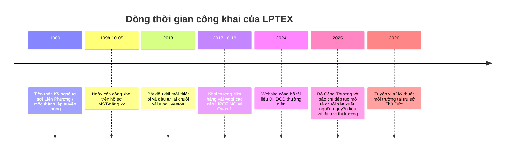

# Báo cáo hybrid về Công ty Dệt May Liên Phương

## Tóm tắt điều hành

Trong phạm vi chỉ gồm **Phase pháp lý** và **Phase vận hành cốt lõi**, thực thể được khóa với độ chắc chắn cao là **Công ty Cổ phần Dệt May Liên Phương**, tên tiếng Anh **LIEN PHUONG TEXTILE & GARMENT CORPORATION**, viết tắt **LPTEX**, mã số thuế **0301445891**, có website chính thức **lptex.vn** và trụ sở/nhà máy chính tại số **18 Tăng Nhơn Phú** ở khu vực **Phước Long B cũ, TP. Thủ Đức / Phường Phước Long sau sáp nhập, TP. Hồ Chí Minh**. Về hoạt động, LPTEX tự công bố là doanh nghiệp dệt may có chuỗi khá khép kín từ sợi–dệt–hoàn tất–may, tập trung vào **vải len chải kỹ 100% và len pha** cùng **mensuits/veston**, với công suất vải thành phẩm được nêu nhất quán khoảng **6 triệu mét/năm**, còn công suất may veston dao động **500.000–600.000 bộ/năm** tùy trang/nguồn. Hai điểm **chưa khóa dứt điểm** trong lượt nghiên cứu nhanh này là **người đại diện theo pháp luật hiện hành** do nguồn công khai đang lệch giữa **Lê Thanh Liêm** và **Trần Thị Thúy Hường**, và **bộ chứng nhận hiện hành** vì website có mục “Các chứng nhận” nhưng phần text crawl không cho ra tên chứng chỉ cụ thể. citeturn34view0turn37view1turn37view0turn3view1turn16view0turn12view3

## Phạm vi và phương pháp

Báo cáo này **chỉ dừng ở hai lớp thông tin**:  
**định danh pháp lý** và **thông tin vận hành cốt lõi**. Tôi ưu tiên nguồn **sơ cấp/chính thống** theo thứ tự: website doanh nghiệp, nguồn công khai gần với hồ sơ đăng ký–MST, cơ quan nhà nước/bộ ngành, hiệp hội/ngành, rồi mới đến nguồn tuyển dụng và cơ sở dữ liệu thứ cấp. Tôi **không mở rộng** sang tài chính, tranh chấp, ownership history, hay điều tra sâu supply-chain ngoài các fact vận hành tối thiểu cần có cho giai đoạn tiếp theo.

Để đọc bảng dưới đây, tôi dùng thang độ tin cậy như sau: **Cao** khi có website chính thức cộng thêm ít nhất một nguồn độc lập đáng tin; **Trung bình** khi có một nguồn sơ cấp nhưng còn lệch/thiếu ở nguồn thứ hai; **Thấp** khi dữ liệu còn mâu thuẫn hoặc mới chỉ nhìn thấy dấu vết gián tiếp.

## Xác minh định danh pháp lý

### Bảng định danh pháp lý

| Trường | Kết quả xác minh | URL nguồn | Mức độ chắc chắn |
|---|---|---|---|
| Tên pháp lý đầy đủ | **CÔNG TY CỔ PHẦN DỆT MAY LIÊN PHƯƠNG**. Website chính thức và hồ sơ MST công khai trùng khớp hoàn toàn. citeturn34view0turn37view1turn37view0 | `https://lptex.vn/vi/lien-he/` ; `https://thuvienphapluat.vn/ma-so-thue/cong-ty-co-phan-det-may-lien-phuong-mst-0301445891.html` ; `https://masothue.com/0301445891-cong-ty-co-phan-det-may-lien-phuong` | Cao |
| Tên tiếng Anh | **LIEN PHUONG TEXTILE & GARMENT CORPORATION**. Xuất hiện trên website chính thức và các nguồn tra cứu MST. citeturn34view0turn37view1turn37view0 | `https://lptex.vn/vi/lien-he/` ; `https://thuvienphapluat.vn/ma-so-thue/cong-ty-co-phan-det-may-lien-phuong-mst-0301445891.html` ; `https://masothue.com/0301445891-cong-ty-co-phan-det-may-lien-phuong` | Cao |
| MST | **0301445891**. Website chính thức ghi “Taxcode: 0301445891”; hai nguồn tra cứu MST công khai cũng ghi cùng mã. citeturn34view0turn37view1turn37view0 | `https://lptex.vn/vi/lien-he/` ; `https://thuvienphapluat.vn/ma-so-thue/cong-ty-co-phan-det-may-lien-phuong-mst-0301445891.html` ; `https://masothue.com/0301445891-cong-ty-co-phan-det-may-lien-phuong` | Cao |
| Số đăng ký doanh nghiệp | **Chưa tách xác minh riêng được một trường “mã số doanh nghiệp” độc lập**; các nguồn công khai đang dùng **0301445891** như mã nhận diện chính. Đây nhiều khả năng cũng là mã số doanh nghiệp công khai, nhưng tôi **chưa có bản GCNĐKDN tải được** để khóa tuyệt đối trường này. citeturn37view1turn37view2turn34view0 | `https://thuvienphapluat.vn/ma-so-thue/cong-ty-co-phan-det-may-lien-phuong-mst-0301445891.html` ; `https://thongtincongty.vn/ma-so-thue/0301445891-cong-ty-co-phan-det-may-lien-phuong-555491997?taxCode=0301445891` ; `https://lptex.vn/vi/lien-he/` | Trung bình |
| Địa chỉ trụ sở | Có **hai cách thể hiện cùng một địa chỉ**: website công ty dùng địa chỉ hoạt động là **18 Tăng Nhơn Phú, Phường Phước Long B, TP. Thủ Đức, TP. Hồ Chí Minh**; các nguồn tra cứu thuế sau cập nhật đơn vị hành chính ghi **18 Tăng Nhơn Phú, Phường Phước Long, Thành phố Hồ Chí Minh**. Đây là khác biệt do thay đổi địa giới, không phải hai trụ sở khác nhau. citeturn34view0turn37view1turn37view2turn37view0 | `https://lptex.vn/vi/lien-he/` ; `https://thuvienphapluat.vn/ma-so-thue/cong-ty-co-phan-det-may-lien-phuong-mst-0301445891.html` ; `https://thongtincongty.vn/ma-so-thue/0301445891-cong-ty-co-phan-det-may-lien-phuong-555491997?taxCode=0301445891` ; `https://masothue.com/0301445891-cong-ty-co-phan-det-may-lien-phuong` | Cao |
| Người đại diện theo pháp luật | **Chưa khóa được một cá nhân duy nhất từ nguồn công khai.** Thư Viện Pháp Luật ghi **hai người đại diện theo pháp luật** là **Lê Thanh Liêm** và **Trần Thị Thúy Hường**; MaSoThue hiển thị **Trần Thị Thúy Hường**; trong khi danh bạ HUBA và bài Vinatex công khai vẫn gắn **Lê Thanh Liêm** với vai trò **Chủ tịch HĐQT/Tổng giám đốc**, còn báo chí năm 2025 ghi **Trần Thị Thúy Hường** là **Phó Chủ tịch HĐQT**. Kết luận nghiêm ngặt ở Phase này là: **field này còn mở và cần đối chiếu bằng GCNĐKDN/công bố chính thức mới nhất**. citeturn37view1turn37view0turn31search4turn23view3turn23view2 | `https://thuvienphapluat.vn/ma-so-thue/cong-ty-co-phan-det-may-lien-phuong-mst-0301445891.html` ; `https://masothue.com/0301445891-cong-ty-co-phan-det-may-lien-phuong` ; `https://huba.vn/member_huba/cong-ty-co-phan-det-may-lien-phuong/` ; `https://vinatex.com.vn/cong-ty-co-phan-det-may-lien-phuong-khai-truong-cua-hang-vai-wool-cao-cap-lipofino/` ; `https://cafef.vn/ngan-hang-tro-luc-xanh-hoa-nganh-det-may-188250327232812071.chn` | Trung bình |
| Ngày thành lập | Cần tách **hai mốc**: **1960** là mốc lịch sử/tiền thân mà doanh nghiệp tự giới thiệu; còn **05/10/1998** là **ngày cấp công khai** trong hồ sơ MST/đăng ký công khai. Hai mốc này không mâu thuẫn, mà phản ánh **lịch sử doanh nghiệp** khác với **mốc đăng ký pháp lý hiện hành được công khai**. citeturn3view1turn23view3turn37view1turn37view2 | `https://lptex.vn/vi/gioi-thieu/` ; `https://vinatex.com.vn/cong-ty-co-phan-det-may-lien-phuong-khai-truong-cua-hang-vai-wool-cao-cap-lipofino/` ; `https://thuvienphapluat.vn/ma-so-thue/cong-ty-co-phan-det-may-lien-phuong-mst-0301445891.html` ; `https://thongtincongty.vn/ma-so-thue/0301445891-cong-ty-co-phan-det-may-lien-phuong-555491997?taxCode=0301445891` | Trung bình |
| Tình trạng hoạt động | **Đang hoạt động** theo các nguồn tra cứu MST; ngoài ra website đang vận hành và công ty còn đăng tuyển vị trí môi trường năm 2026 tại cùng địa chỉ trụ sở, củng cố tín hiệu operational continuity. citeturn37view1turn37view0turn34view0turn40view1 | `https://thuvienphapluat.vn/ma-so-thue/cong-ty-co-phan-det-may-lien-phuong-mst-0301445891.html` ; `https://masothue.com/0301445891-cong-ty-co-phan-det-may-lien-phuong` ; `https://lptex.vn/vi/lien-he/` ; `https://www.careerlink.vn/tim-viec-lam/chuyen-vien-ky-thuat-moi-truong/3469486` | Cao |
| Ngành nghề đăng ký | Nguồn công khai tổng hợp từ hồ sơ ĐKKD cho thấy lõi đăng ký gồm **Sản xuất vải dệt thoi**, **Sản xuất sợi**, cùng nhiều ngành mở rộng như **kinh doanh bất động sản**, **vận tải hàng hóa bằng đường bộ** và nhiều nhóm **bán buôn**. Do chưa truy xuất được trực tiếp bản ghi DKKD gốc, tôi xem đây là **ảnh chụp khá tốt nhưng vẫn là nguồn thứ cấp**. citeturn37view3turn32search8 | `https://dauthau.asia/businesslistings/detail/CONG-TY-CO-PHAN-DET-MAY-LIEN-PHUONG-111860/` ; `https://thongtincongty.vn/ma-so-thue/0301445891-cong-ty-co-phan-det-may-lien-phuong-555491997?taxCode=0301445891` | Trung bình |
| Website chính thức | **lptex.vn**; website có đủ trang giới thiệu, liên hệ, sản phẩm, đơn vị sản xuất và công bố tài liệu ĐHĐCĐ 2024. citeturn34view0turn4view0turn4view1 | `https://lptex.vn/` ; `https://lptex.vn/vi/lien-he/` ; `https://lptex.vn/vi/cong-bo-ket-qua-dhcd-2024/` ; `https://lptex.vn/vi/thong-bao-tham-du-dhdcd-nien-khoa-tai-chinh-2023/` | Cao |

Ngoại trừ trường **người đại diện theo pháp luật**, các trường định danh còn lại đã được khóa ở mức đủ tốt cho Phase đầu. Điểm pháp lý cần bổ sung ngay trong Phase sau là **bản GCNĐKDN hoặc bản ghi chính thức từ cổng ĐKKD/business.gov.vn có thể mở được**, để chốt dứt điểm đại diện pháp luật và mã đăng ký doanh nghiệp. citeturn37view1turn37view0turn34view0

## Thông tin vận hành cốt lõi

### Bảng vận hành và fact lõi

| Hạng mục | Kết quả xác minh | URL nguồn | Mức độ chắc chắn |
|---|---|---|---|
| Dấu chân nhà máy/cơ sở | Website mô tả LPTEX tọa lạc tại **18 Tăng Nhơn Phú** với **hơn 40.000 m² nhà xưởng** trên khuôn viên **gần 80.000 m²**. Các trang đơn vị sản xuất cho thấy tối thiểu có các khối **Dệt, Hoàn tất, May**, và một đơn vị sợi dưới tên **Dalat Worsted Spinning**. Trong lượt này, **địa chỉ tuyệt đối của Dalat Worsted Spinning không hiện trong page crawl**, nên chỉ coi là một footprint vận hành được doanh nghiệp công khai tên gọi, chưa khóa tọa độ. citeturn3view0turn12view0turn12view1turn12view2turn12view3 | `https://lptex.vn/vi/homepage-tieng-viet/` ; `https://lptex.vn/vi/nha-may-soi/` ; `https://lptex.vn/vi/nha-may-hoan-tat/` ; `https://lptex.vn/vi/nha-may-det/` ; `https://lptex.vn/vi/nha-may-may/` | Cao cho campus Thủ Đức; Trung bình cho footprint sợi |
| Chuỗi sản xuất | Công ty tự công bố sở hữu chuỗi **khép kín từ sợi, dệt, nhuộm, hoàn tất, may mặc**; đồng thời nhấn mạnh năng lực đáp ứng quy tắc xuất xứ **Yarn/Fabric Forward** để hưởng ưu đãi từ CPTPP, EVFTA, RCEP và FTA song phương. Đây là một operational fact quan trọng vì nó định vị LPTEX ở phân khúc vertically integrated hơn mức phổ thông của many garment-only players. citeturn3view0turn3view1turn16view0 | `https://lptex.vn/vi/homepage-tieng-viet/` ; `https://lptex.vn/vi/gioi-thieu/` ; `https://lptex.vn/vi/tong-quan/` | Cao |
| Công suất sản xuất | Các số liệu công khai hiện khá rõ ở tầng nhà máy: **4.000 tấn sợi/năm** cho Dalat Worsted Spinning; **7.000.000 m vải mộc/năm** cho Nhà máy Dệt; **6.000.000 m vải thành phẩm/năm** cho Nhà máy Hoàn tất. Công suất may có sai khác nhẹ theo nguồn/trang: trang Giới thiệu nêu **500.000 mensuits/năm**, còn trang Nhà máy May nêu **600.000 mensuits/năm**; nguồn tuyển dụng cũ hơn mô tả khoảng **1.500 bộ/ngày**. Vì vậy tôi xem **6 triệu mét vải/năm** là number ổn định nhất, còn **500–600 nghìn bộ veston/năm** là dải công suất hợp lý đang công khai. citeturn12view0turn12view1turn12view2turn12view3turn3view1turn40view0 | `https://lptex.vn/vi/nha-may-soi/` ; `https://lptex.vn/vi/nha-may-hoan-tat/` ; `https://lptex.vn/vi/nha-may-det/` ; `https://lptex.vn/vi/nha-may-may/` ; `https://lptex.vn/vi/gioi-thieu/` ; `https://www.careerlink.vn/viec-lam-cua/cong-ty-co-phan-det-may-lien-phuong/179461` | Cao cho vải; Trung bình cho may |
| Sản phẩm chính | Lõi sản phẩm là **vải len 100% và len pha**, cùng **mensuits/veston**; website tiếng Anh/Việt còn thể hiện product categories gồm **Fabric, Men suits, Lady suits**. Ở tầng kỹ thuật, nhà máy sợi công bố các nhóm sợi **Wool, Polywool, PTT, Lycra, Solotex**; website giới thiệu thêm các tính năng vải như **chống thấm nước, chống thấm dầu, kháng virus, chống nhăn, coolmax**. citeturn16view0turn12view0turn3view1turn35search5 | `https://lptex.vn/vi/tong-quan/` ; `https://lptex.vn/vi/nha-may-soi/` ; `https://lptex.vn/vi/gioi-thieu/` ; `https://lptex.vn/shop/` | Cao |
| Chứng nhận và giấy phép | Website có mục **“CÁC CHỨNG NHẬN”** nhưng phần text crawl **không lộ tên chứng chỉ cụ thể**. Hai trang nhà máy **Dệt** và **Hoàn tất** đều gắn link **“Giấy phép môi trường: Xem tại đây”**, cho thấy doanh nghiệp công khai hồ sơ môi trường ở cấp nhà máy. Một nguồn danh bạ ngành lịch sử năm 2018 bên thứ ba có gắn các nhãn **ISO9000, ISO14000, SA8000, WRAP, BSCI**, nhưng trong lượt này tôi **không xem đó là bằng chứng đủ** để kết luận các chứng nhận ấy đang còn hiệu lực năm 2026; riêng **GOTS** thì **không thấy bằng chứng công khai**. citeturn16view0turn41search2turn41search5turn15search1 | `https://lptex.vn/vi/tong-quan/` ; `https://lptex.vn/vi/nha-may-det/` ; `https://lptex.vn/vi/nha-may-hoan-tat/` ; `https://www.scribd.com/document/689849657/Vitas-Directory-2018` | Thấp cho tên chứng chỉ; Cao cho việc có mục chứng nhận/liên kết GPMT |
| Nhân sự | Website chính thức **chỉ lộ headcount ở cấp phân xưởng**: **300 người** tại Nhà máy Dệt và **200 người** tại Nhà máy Hoàn tất. Trong khi đó hồ sơ tuyển dụng trên CareerLink vẫn gắn size công ty ở mức **100–499 nhân viên**. Do hai lớp dữ liệu này không đồng nhất, **tổng headcount toàn công ty chưa xác minh được** trong Phase này. citeturn12view1turn12view2turn40view0turn40view1 | `https://lptex.vn/vi/nha-may-hoan-tat/` ; `https://lptex.vn/vi/nha-may-det/` ; `https://www.careerlink.vn/viec-lam-cua/cong-ty-co-phan-det-may-lien-phuong/179461` ; `https://www.careerlink.vn/tim-viec-lam/chuyen-vien-ky-thuat-moi-truong/3469486` | Thấp |
| Đối tác/khách hàng công khai | Ở tầng đối tác sản xuất, **Dalat Worsted Spinning** được công bố là **joint venture với Südwolle Group (Germany)**. Ở tầng thị trường đầu ra, một bài Vinatex năm 2017 công khai danh sách khách hàng/nhãn hàng và đối tác thương mại gồm **Berwin & Berwin, River Island, Slater Performance, Slater Fellini, Austin Reed, Next, Ted Baker, Lambretta, Moss Bros, Best, John Lewis, House of Fraser, Paul Costelloe** và nhà thương mại vải **Takisada–Nagoya**. Những tên này nên được đọc là **khách hàng/đối tác công khai mang tính lịch sử**, chưa xác nhận là vẫn active đến 2026. citeturn12view0turn23view3 | `https://lptex.vn/vi/nha-may-soi/` ; `https://vinatex.com.vn/cong-ty-co-phan-det-may-lien-phuong-khai-truong-cua-hang-vai-wool-cao-cap-lipofino/` | Trung bình |
| Thị trường xuất khẩu | Website công ty nêu các bộ mensuits của họ đã chinh phục các thị trường **Anh, Đức, Pháp, Nhật**; danh bạ hội viên HUBA công khai cũng ghi **thị trường chính: Anh, Đức, Pháp, Nhật**. Đây là một trong những fact vận hành được corroborate khá tốt. citeturn3view1turn32search5 | `https://lptex.vn/vi/gioi-thieu/` ; `https://huba.vn/member_huba/cong-ty-co-phan-det-may-lien-phuong/` | Cao |
| Nguồn cung nguyên liệu | Theo bài của **Bộ Công Thương**, với sản phẩm **100% wool** thì LPTEX nhập nguyên liệu từ **Úc**; với **sợi tái chế** doanh nghiệp nhập từ **Trung Quốc** do trong nước chưa đáp ứng được. Đây là fact hữu ích để hiểu core operations và mức độ phụ thuộc nguồn cung upstream. citeturn23view0turn23view1 | `https://moit.gov.vn/tin-tuc/phat-trien-cong-nghiep/cong-nghiep-ho-tro-nganh-det-may-tap-trung-lap-lo-hong-nguon-cung-thieu-hut.html` ; `https://moit.gov.vn/tin-tuc/phat-trien-cong-nghiep/uu-tien-phat-trien-cong-nghiep-ho-tro-nganh-det-may-da-giay.html` | Trung bình-Cao |
| Tuân thủ môi trường | Tín hiệu vận hành môi trường là khá rõ: website nhà máy Dệt/Hoàn tất đều công khai link **Giấy phép môi trường**; đồng thời tin tuyển dụng năm 2026 cho thấy công ty đang tuyển **Chuyên viên Kỹ thuật Môi trường** để làm **ĐTM, giấy phép xả thải, nước thải, khí thải, chất thải rắn**. Điều này phù hợp với profile của một doanh nghiệp có khâu **dệt/hoàn tất/nhuộm** đáng kể. citeturn41search2turn41search5turn40view1 | `https://lptex.vn/vi/nha-may-det/` ; `https://lptex.vn/vi/nha-may-hoan-tat/` ; `https://www.careerlink.vn/tim-viec-lam/chuyen-vien-ky-thuat-moi-truong/3469486` | Cao cho chức năng môi trường; Trung bình cho mức độ hệ thống |

Về operational picture, bức tranh chính đã khá rõ: **LPTEX là doanh nghiệp thiên về vải wool/wool-blend và veston**, có **chuỗi sản xuất sâu hơn garment-only**, đặt trọng tâm tại **cụm nhà xưởng ở Thủ Đức**, và có năng lực sản xuất vải được công bố nhất quán. Hai khoảng trống vận hành lớn nhất còn lại là **headcount hợp nhất hiện tại** và **bộ chứng nhận đang hiệu lực**. citeturn3view0turn16view0turn12view1turn12view2turn12view3turn41search2turn41search5

## Dòng thời gian công khai

Timeline dưới đây tổng hợp các mốc công khai trọng yếu nhất đã xác minh được từ website doanh nghiệp, hồ sơ MST công khai, bài ngành và tín hiệu hoạt động gần đây. citeturn3view1turn37view1turn23view3turn4view0turn4view1turn23view0turn40view1

Điểm cần đọc đúng ở timeline là: **1960** phản ánh **lịch sử doanh nghiệp tự giới thiệu**, còn **05/10/1998** phản ánh **ngày cấp công khai trên hồ sơ đăng ký/MST**; hai mốc này không nên bị gộp làm một. citeturn3view1turn37view1turn37view2

## Sổ nguồn

Bảng dưới đây là **source ledger** đã dùng để dựng báo cáo. Tôi giữ số lượng nguồn ở mức gọn, thiên về **primary/official** và dừng trong giới hạn yêu cầu.

| URL | Tên nguồn | Loại nguồn | Ngày truy cập | Claim hỗ trợ chính | Độ tin cậy |
|---|---|---|---|---|---|
| `https://lptex.vn/vi/lien-he/` | Liên hệ – LPTEX CORPORATION citeturn34view0 | Website chính thức | 2026-05-24 | Tên pháp lý, tên tiếng Anh, MST, địa chỉ, email, điện thoại | A |
| `https://lptex.vn/vi/gioi-thieu/` | Giới thiệu – LPTEX CORPORATION citeturn3view1 | Website chính thức | 2026-05-24 | Lịch sử 1960, quy mô campus, năng lực vải & may, thị trường Anh/Đức/Pháp/Nhật | A |
| `https://lptex.vn/vi/homepage-tieng-viet/` | Homepage – LPTEX CORPORATION citeturn3view0 | Website chính thức | 2026-05-24 | Chuỗi sản xuất khép kín, Yarn/Fabric Forward, 40.000/80.000 m² | A |
| `https://lptex.vn/vi/tong-quan/` | Tổng quan – LPTEX CORPORATION citeturn16view0 | Website chính thức | 2026-05-24 | Lõi sản phẩm vải len 100%/len pha, cấu phần tổ chức, mục “Các chứng nhận” | A |
| `https://lptex.vn/vi/nha-may-soi/` | Nhà máy Sợi – LPTEX CORPORATION citeturn12view0 | Website chính thức | 2026-05-24 | Dalat Worsted Spinning, JV với Südwolle, 4.000 tấn/năm | A |
| `https://lptex.vn/vi/nha-may-hoan-tat/` | Nhà máy hoàn tất – LPTEX CORPORATION citeturn12view1 | Website chính thức | 2026-05-24 | 200 nhân viên, 6.000.000 m vải thành phẩm/năm, link GPMT | A |
| `https://lptex.vn/vi/nha-may-det/` | Nhà máy Dệt – LPTEX CORPORATION citeturn12view2 | Website chính thức | 2026-05-24 | 300 nhân viên, 7.000.000 m vải mộc/năm, link GPMT | A |
| `https://lptex.vn/vi/nha-may-may/` | Nhà máy May – LPTEX CORPORATION citeturn12view3 | Website chính thức | 2026-05-24 | 600.000 mensuits/năm | A |
| `https://thuvienphapluat.vn/ma-so-thue/cong-ty-co-phan-det-may-lien-phuong-mst-0301445891.html` | Hồ sơ MST – Thư Viện Pháp Luật citeturn37view1 | Tra cứu MST/đăng ký công khai | 2026-05-24 | Legal type, ngày cấp 05/10/1998, trạng thái, địa chỉ, legal-rep discrepancy | B |
| `https://masothue.com/0301445891-cong-ty-co-phan-det-may-lien-phuong` | Hồ sơ MST – MaSoThue citeturn37view0 | Tra cứu MST/đăng ký công khai | 2026-05-24 | MST, tên tiếng Anh, tình trạng, địa chỉ, đại diện Trần Thị Thúy Hường | B |
| `https://thongtincongty.vn/ma-so-thue/0301445891-cong-ty-co-phan-det-may-lien-phuong-555491997?taxCode=0301445891` | Hồ sơ công ty – Thongtincongty.vn citeturn37view2 | Tra cứu MST/đăng ký công khai | 2026-05-24 | Ngày cấp 05/10/1998, địa chỉ theo CQT và sau sáp nhập | C |
| `https://dauthau.asia/businesslistings/detail/CONG-TY-CO-PHAN-DET-MAY-LIEN-PHUONG-111860/` | Hồ sơ doanh nghiệp – DauThau.asia citeturn37view3 | Nguồn tổng hợp hồ sơ doanh nghiệp | 2026-05-24 | Danh sách ngành nghề theo ĐKKD | C |
| `https://moit.gov.vn/tin-tuc/phat-trien-cong-nghiep/cong-nghiep-ho-tro-nganh-det-may-tap-trung-lap-lo-hong-nguon-cung-thieu-hut.html` | Bài Bộ Công Thương về CN hỗ trợ dệt may citeturn23view0 | Nguồn nhà nước | 2026-05-24 | Nguồn nguyên liệu wool từ Úc, sợi tái chế từ Trung Quốc | A |
| `https://moit.gov.vn/tin-tuc/phat-trien-cong-nghiep/uu-tien-phat-trien-cong-nghiep-ho-tro-nganh-det-may-da-giay.html` | Bài Bộ Công Thương về phát triển CN hỗ trợ citeturn23view1 | Nguồn nhà nước | 2026-05-24 | Corroboration cho sourcing raw materials | A |
| `https://vinatex.com.vn/cong-ty-co-phan-det-may-lien-phuong-khai-truong-cua-hang-vai-wool-cao-cap-lipofino/` | Bài Vinatex về LIPOFINO năm 2017 citeturn23view3 | Nguồn ngành/chính thống | 2026-05-24 | Lê Thanh Liêm, công suất 6 triệu m vải và >500.000 veston, historical clients | B |
| `https://huba.vn/member_huba/cong-ty-co-phan-det-may-lien-phuong/` | Danh bạ hội viên HUBA citeturn32search5 | Hiệp hội/doanh nghiệp | 2026-05-24 | Năm thành lập 1960, thị trường chính Anh/Đức/Pháp/Nhật | B |
| `https://www.careerlink.vn/viec-lam-cua/cong-ty-co-phan-det-may-lien-phuong/179461` | Hồ sơ nhà tuyển dụng CareerLink citeturn40view0 | Tuyển dụng công khai | 2026-05-24 | Company size 100–499, mô tả Saigon Worsted Mill & VITC Garment | C |
| `https://www.careerlink.vn/tim-viec-lam/chuyen-vien-ky-thuat-moi-truong/3469486` | Tin tuyển Chuyên viên Kỹ thuật Môi trường citeturn40view1 | Tuyển dụng công khai | 2026-05-24 | Dấu hiệu hoạt động 2026 và chức năng compliance môi trường | C |
| `https://cafef.vn/ngan-hang-tro-luc-xanh-hoa-nganh-det-may-188250327232812071.chn` | CafeF về “xanh hóa” dệt may citeturn23view2 | Báo chí chính thống | 2026-05-24 | Vai trò Trần Thị Thúy Hường, mô tả footprint nhà máy | B |
| `https://www.scribd.com/document/689849657/Vitas-Directory-2018` | VITAS Directory 2018 trên Scribd citeturn15search1 | Danh bạ ngành thứ cấp | 2026-05-24 | Chỉ dùng như dấu vết lịch sử về chứng nhận; không dùng để kết luận current certification | D |

## Điểm còn mở cho giai đoạn tiếp theo

- **Chốt người đại diện theo pháp luật hiện hành** bằng cách lấy được **GCNĐKDN/công bố chính thức mới nhất**; đây là gap pháp lý lớn nhất vì nguồn công khai hiện đang lệch giữa **Lê Thanh Liêm** và **Trần Thị Thúy Hường**. citeturn37view1turn37view0turn23view2turn23view3
- **Rút tên và hiệu lực của các chứng nhận** từ mục “Các chứng nhận”/link gốc trên website để xác minh xem doanh nghiệp hiện có hay không có **ISO/SA8000/WRAP/GOTS**. Ở thời điểm này, tôi chỉ xác minh được rằng website có mục chứng nhận và link giấy phép môi trường, chưa xác minh được tên chứng chỉ. citeturn16view0turn41search2turn41search5turn15search1
- **Khóa headcount hợp nhất hiện tại** vì website nhà máy lộ số người ở cấp phân xưởng, còn nguồn tuyển dụng lại gắn một company-size nhỏ hơn. Đây là gap cần được làm rõ nếu Phase sau đi vào quy mô và năng lực vận hành thực sự. citeturn12view1turn12view2turn40view0turn40view1
- **Xác nhận danh sách khách hàng/đối tác hiện hành** vì những tên lớn xuất hiện trong bài Vinatex là rất hữu ích nhưng mang tính **historical public disclosure**, chưa đủ để khẳng định là buyer list ở năm 2026. citeturn23view3
- **Đi tiếp sang Phase sau bằng trade/customs mapping và group structure mapping** nếu cần: khi đó mới nên mở rộng sang dấu vết xuất nhập khẩu, entity liên quan, khách hàng B2B và vai trò các công ty thành viên/liên kết. Trong báo cáo này tôi cố ý chưa mở rộng sang các lớp đó.