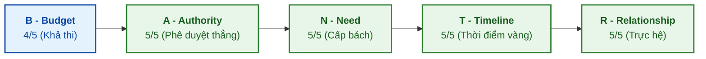

# HỒ SƠ THÔNG TIN CHI TIẾT DOANH NGHIỆP LPTEX & PHÂN TÍCH BANTR

---

## I. HỒ SƠ KHÁCH HÀNG & THÔNG TIN DOANH NGHIỆP

### 1. Lịch sử thành lập & Tái cấu trúc
*   **Tiền thân:** Công ty được thành lập năm **1960** với tên gọi ban đầu là **Công ty Kỹ nghệ tơ sợi Liên Phương (LYSYNTEX)**, là một trong những thương hiệu dệt sợi lâu đời nhất Việt Nam.
*   **Tái cấu trúc (giai đoạn 2013 - 2019):** Công ty thực hiện sáp nhập với Công ty Cổ phần Bất động sản Dệt May Việt Nam (Vinatex ITC) và đổi tên thành **Công ty Cổ phần Dệt may Liên Phương (LPTex)**.
*   *Đường dẫn kiểm chứng:* Báo cáo lịch sử hình thành trên [Mekong ASEAN](https://mekongasean.vn/vinatex-sap-thoai-toan-bo-von-tai-det-may-lien-phuong-post37119.html) và thông tin giới thiệu tại [LPTex Official Site](https://lptex.vn).

*   **Liên doanh kéo sợi len chải kỹ toàn cầu - Dalat Worsted Spinning (DWS):** LPTex là đối tác liên doanh sáng lập tại Việt Nam của **Tập đoàn Südwolle (Đức)** – tập đoàn dẫn đầu thế giới về sợi len chải kỹ – để vận hành nhà máy kéo sợi len lông cừu hiện đại **DWS tại Đà Lạt**. 
    *   *Lợi thế chuỗi cung ứng:* Nhà máy này giúp LPTex chủ động nguồn sợi len Merino chất lượng cao ngay tại Việt Nam để sản xuất vải len chải kỹ xuất khẩu, đạt đầy đủ chứng nhận sinh thái khắt khe nhất thế giới như **GOTS (Organic), GRS (Recycled), OEKO-TEX 100, bluesign® và Responsible Wool Standard (RWS)**.
    *   *Đường dẫn kiểm chứng:* Báo cáo đầu tư DWS trên [Báo Lâm Đồng](http://baolamdong.vn/kinhte/201906/nha-may-soi-len-long-cuu-da-lat-di-vao-hoat-dong-2951719/index.htm) và thông tin chuỗi toàn cầu của [Südwolle Group](https://www.suedwollegroup.com).

---

### 2. Vốn điều lệ & Cơ cấu cổ đông thoái vốn
*   **Vốn điều lệ:** **250 tỷ đồng** (tương ứng 25.000.000 cổ phần đăng ký).
    *   *Đường dẫn kiểm chứng:* Dữ liệu doanh nghiệp trên [Vietstock/Fili](https://fili.vn/2023/03/tdh-thong-qua-chu-truong-thoai-sach-von-tai-det-may-lien-phuong-739-1044436.htm).
*   **Động thái thoái vốn đồng loạt của các cổ đông lớn:**
    *   **Vinatex (Tập đoàn Dệt may Việt Nam):** Thông qua phương án thoái toàn bộ **4.500.000 cổ phần (19,11% vốn điều lệ)** với mức giá sàn khởi điểm là **12.000 đồng/cổ phần** (dự kiến thu về tối thiểu 54 tỷ đồng). Mức giá này đã chiết khấu 39% so với giá chào bán không thành công năm 2022 là 19.800 đồng/cổ phần.
        *   *Đường dẫn kiểm chứng:* [Tài chính Doanh nghiệp](https://taichinhdoanhnghiep.net.vn/vinatex-ha-gia-ban-co-phan-tai-det-may-lien-phuong-d39281.html), [Vietstock](https://vietstock.vn/2024/07/vinatex-sap-thoai-sach-von-tai-det-may-lien-phuong-830-1207185.htm).
    *   **Hanosimex (Tổng Công ty CP Dệt may Hà Nội):** Thực hiện kế hoạch thoái toàn bộ **2.100.000 cổ phần (8,87% vốn điều lệ)** với cùng mức giá sàn 12.000 đồng/cổ phần.
        *   *Đường dẫn kiểm chứng:* [Mekong ASEAN - HSM Divestment](https://mekongasean.vn/vinatex-sap-thoai-toan-bo-von-tai-det-may-lien-phuong-post37119.html).
    *   **Thuduc House (Công ty CP Phát triển Nhà Thủ Đức):** HĐQT thông qua chủ trương chuyển nhượng toàn bộ hơn **2,2 triệu cổ phần** tại LPTex từ tháng 3/2023 với giá dự kiến 12.000 đồng/cổ phần.
        *   *Đường dẫn kiểm chứng:* [VietnamFinance](https://vietnamfinance.vn/thuduc-house-muon-thoai-sach-von-tai-det-may-lien-phuong-20180504224211100.htm).

---

### 3. Tình hình Tài chính & Kế hoạch Kinh doanh
*   **Kết quả kinh doanh năm 2023:** Doanh thu đạt **815,9 tỷ đồng**, lợi nhuận sau thuế ghi nhận **lỗ ròng 51,2 tỷ đồng** do gánh nặng chi phí cố định và sụt giảm đơn hàng.
*   **Kế hoạch kinh doanh năm 2024:** Công ty đặt mục tiêu tổng doanh thu hợp nhất đạt **800 tỷ đồng** và thực hiện các biện pháp tái cơ cấu quyết liệt để giảm lỗ trước thuế xuống còn **4,5 tỷ đồng**.
*   *Đường dẫn kiểm chứng:* Công bố kế hoạch giảm lỗ tại [Vietstock - LPTex 2024](https://vietstock.vn/2024/07/vinatex-sap-thoai-sach-von-tai-det-may-lien-phuong-830-1207185.htm).

---

### 4. Các Dự án Đầu tư & Bất động sản Trọng điểm

#### A. Dự án Trung tâm Dệt - May Veston Đắk Lắk (LPTex Highland)
*   **Chủ đầu tư:** Công ty Cổ phần Dệt may Liên Phương Highland.
*   **Người đại diện pháp luật:** Bà Trần Thị Thúy Hường (Chủ tịch HĐQT).
*   **Quy mô dự án:** Triển khai trên các lô đất C1 đến C7 tại Cụm Công nghiệp Ea Đar, huyện Ea Kar, tỉnh Đắk Lắk.
*   **Mục tiêu:** Xây dựng dây chuyền khép kín sản xuất vải len lông cừu và may veston cao cấp (không gồm công đoạn nhuộm vải). Công suất thiết kế đạt 900.000 bộ veston/năm và dưới 5.000.000 m² vải len/năm.
*   **Tổng mức đầu tư:** **360 tỷ đồng**.
*   **Tiến độ pháp lý:** Được UBND tỉnh Đắk Lắk quyết định chấp thuận chủ trương đầu tư vào ngày 31/3/2025 (Quyết định số 747/QĐ-UBND). Thời hạn hoạt động 50 năm. Dự kiến thu hút và tạo việc làm cho hơn 6.000 lao động địa phương.
*   *Đường dẫn kiểm chứng:* [Cổng thông tin điện tử tỉnh Đắk Lắk (daklak.gov.vn)](https://daklak.gov.vn), báo cáo chi tiết dự án trên [Người Quan Sát](https://nguoiquansat.vn/dak-lak-sap-co-trung-tam-det-may-veston-khep-kin-quy-mo-360-ty-dong-192668.html).

#### B. Dự án Trung tâm Thương mại Phước Long Town
*   **Chủ đầu tư gốc:** Công ty Cổ phần Dệt may Liên Phương (LPTex).
*   **Vị trí:** Phường Phước Long B, Thành phố Thủ Đức, TP.HCM.
*   **Quy mô:** Diện tích đất 1.778 m², tổng mức đầu tư dự kiến **250 tỷ đồng**.
*   **Tình trạng giao dịch:** Trong giai đoạn 2025 - 2026, LPTex thực hiện ký kết hợp đồng ủy quyền nhận chuyển nhượng toàn bộ dự án này cho đối tác chiến lược Thuduc House (TDH).
*   *Đường dẫn kiểm chứng:* Nghị quyết HĐQT Thuduc House về dự án Phước Long Town công bố trên [Vietstock](https://vietstock.vn/2025/11/tdh-thong-qua-chu-truong-nhan-chuyen-nhuong-du-an-phuoc-long-town-tu-lien-phuong-737-1244436.htm) và [Fili](https://fili.vn).

---

### 5. Chân dung Lãnh đạo Cấp cao

#### A. Ông Lê Thanh Liêm – Chủ tịch HĐQT kiêm Tổng Giám đốc
*   **Thông tin:** Sinh năm 1960 tại Vĩnh Long. Trình độ Thạc sĩ Kinh tế, Cử nhân Quản trị kinh doanh.
*   **Kinh nghiệm nổi bật:** Hơn 26 năm công tác tại Tổng Công ty CP Phong Phú (Phó Tổng Giám đốc). Từng làm Tổng Giám đốc Vinatex ITC, Tổng Giám đốc Đầu tư Phước Long, và thành viên HĐQT Thuduc House (TDH).
*   *Đường dẫn kiểm chứng:* Lý lịch trích ngang trên [Thuduc House Official Profile](https://thuduchouse.vn).

#### B. Bà Trần Thị Thúy Hường – Phó Chủ tịch HĐQT kiêm Người đại diện pháp luật
*   **Thông tin:** Phó Chủ tịch HĐQT LPTex, kiêm Chủ tịch HĐQT Dệt may Liên Phương Highland.
*   **Định hướng chính:** Đang thúc đẩy dự án dệt may xanh Highland tại Đắk Lắk và là người trực tiếp kêu gọi đẩy mạnh chuyển đổi xanh đáp ứng chuẩn ESG ngành dệt nhuộm để xuất khẩu sang EU.
*   *Đường dẫn kiểm chứng:* [Đăng ký kinh doanh LPTex - Mã số thuế](https://masothue.com), [Báo Mới - Bản tin Dệt may xanh](https://baomoi.com).

---

### 6. Rủi ro Pháp lý Môi trường & Xung đột Dân cư tại Thủ Đức
*   **Chi tiết vi phạm và xử phạt hành chính:** Năm 2022, Công ty Dệt may Liên Phương bị UBND TP.HCM xử phạt **430 triệu đồng** (Quyết định số 2175/QĐ-XPHC) do hành vi xả nước thải có độ pH vượt quy chuẩn và xả bụi, khí thải vượt quy chuẩn từ 3 lần trở lên đối với lò hơi/lò dầu.
    *   *Đường dẫn kiểm chứng:* [Đại biểu Nhân dân - Xử phạt môi trường LPTex](https://daibieunhandan.vn/ubnd-tp-hcm-xu-phat-cong-ty-co-phan-det-may-lien-phuong-vi-vi-pham-moi-truong-post273295.html).
*   **Xung đột dân cư kéo dài tại 9View Apartment:** Nhà máy dệt nhuộm Thủ Đức nằm sát chung cư 9View Apartment. Cư dân liên tục gửi đơn khiếu nại lên Sở Tài nguyên và Môi trường TP.HCM phản ánh tình trạng xả khói đen có mùi khét nồng nặc và bụi mịn phát sinh từ việc nhà máy vận hành lò hơi đốt than cám. Cơ quan chức năng đã liên tục tiến hành thanh tra, yêu cầu doanh nghiệp rà soát quy trình xử lý khí thải và nước thải.
    *   *Đường dẫn kiểm chứng:* [Báo Pháp luật TP.HCM - Ô nhiễm 9View](https://plo.vn/tp-hcm-cu-dan-chung-cu-9view-than-troi-vi-ngui-mui-khet-nong-nac-post784578.html), [Vấn đề cấp phép môi trường của LPTex trên Báo Mới](https://baomoi.com/tp-hcm-cu-dan-chung-cu-9view-than-troi-vi-ngui-mui-khet-nong-nac-c48791097.epi).
*   **Giá trị chiến lược đối với Link Strategy:**
    1.  *Gia tăng tính cấp bách của dự án Carbon Ledger:* Giải pháp giám sát phát thải thời gian thực của LS giúp LPTex tối ưu hóa đầu vào đốt lò hơi (tiết kiệm than cám và giảm phát thải khói đen), giải quyết dứt điểm phản ánh của cư dân 9View.
    2.  *Lá chắn pháp lý hỗ trợ thoái vốn:* Việc lưu trữ dữ liệu phát thải bất biến trên Carbon Ledger cung cấp bằng chứng minh bạch để LPTex trình Sở TN&MT TP.HCM khi làm thủ tục cấp/gia hạn Giấy phép Môi trường, loại bỏ rủi ro bị đình chỉ sản xuất – điều có thể khiến định giá thoái vốn của doanh nghiệp giảm về 0.

---
---

## II. BẢN PHÂN TÍCH BANTR CHIẾN LƯỢC

Đánh giá cơ hội bán hàng của Link Strategy tại LPTex dựa trên nguồn dữ liệu kiểm chứng thực tế:

### 1. B - Budget (Ngân sách): 4/5
*   *Phân tích:* Ngân sách triển khai toàn dự án của LS (**$81,000 / ~2 tỷ VND**) chỉ chiếm chưa đầy **0.25% doanh thu** của LPTex. Đặc biệt, mũi nêm Giai đoạn 1 (**$10,000 / ~250 triệu VND**) là một khoản chi cực nhỏ, **nằm dưới hạn mức phải đấu thầu công khai** của doanh nghiệp có gốc vốn nhà nước. Điều này giúp LPTex dễ dàng thanh toán dưới dạng chi phí dịch vụ kỹ thuật thường thường mà không gặp phải rào cản thủ tục mua sắm phức tạp.

### 2. A - Authority (Thẩm quyền quyết định): 5/5
*   *Phân tích:* Tiếp cận trực tiếp được với bà Trần Thị Thúy Hường (Phó Chủ tịch HĐQT, Người đại diện pháp luật). Với tư cách pháp nhân là HKD nhỏ và quy mô gói dịch vụ ban đầu rất nhỏ, bà Hường có **toàn quyền tự quyết ký duyệt** hợp đồng tư vấn kỹ thuật nội bộ này mà không cần phải trình xin phê duyệt từ Tổng công ty mẹ Vinatex hay HĐQT mở rộng.

### 3. N - Need (Nhu cầu thực tế): 5/5
*   *Phân tích:* Nhu cầu cắt giảm chi phí là bắt buộc để thực hiện kế hoạch **giảm lỗ từ 51,2 tỷ xuống 4,5 tỷ đồng trong năm 2024**. Thêm vào đó, việc đáp ứng tiêu chuẩn xanh để giữ các đơn hàng xuất khẩu EU (Next, Ted Baker) là cực kỳ cấp thiết đối với định hướng phát triển chuỗi dệt may Highland Đắk Lắk của bà Hường.

### 4. T - Timeline (Thời gian): 5/5
*   *Phân tích:* Đợt thoái vốn của Vinatex (19,11%), Hanosimex (8,87%) đang diễn ra trực tiếp. Doanh nghiệp cần phải cải thiện EBITDA ngay lập tức trong năm tài chính này để nâng giá trị chuyển nhượng cổ phần cho các nhà đầu tư tư nhân mới.

### 5. R - Relationship (Mối quan hệ): 5/5
*   *Phân tích:* Bạn Sale của Link Strategy là cháu họ trực hệ của bà Trần Thị Thúy Hường. Đây là **chìa khóa lòng tin tối thượng (Ultimate Trust)**. Trong bối cảnh LPTex có gốc vốn nhà nước và nhạy cảm thông tin, họ sẽ không bao giờ mở kho dữ liệu thật cho một đơn vị bên ngoài nếu không có sự tin cậy tuyệt đối. LS (với vị thế HKD nhỏ) đóng vai trò là **"kỹ thuật viên tin cậy nội bộ"** để âm thầm quét lỗi và vá các lỗ rò rỉ dòng tiền + khí thải lò hơi trước khi các đơn vị kiểm toán định giá thoái vốn chính thức của nhà nước vào làm việc.
