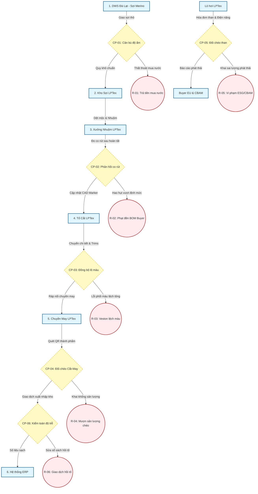
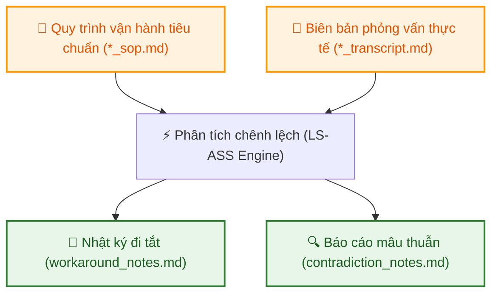

# QUY TRÌNH VÀ HỒ SƠ CAN THIỆP LPTEX (LS-ASS SPECIFICATION)

Tài liệu này hệ thống hóa các quy trình vận hành nhạy cảm tại LPTex (Phần I) và định nghĩa bộ hồ sơ tài liệu đầu vào chuẩn hóa phục vụ cho động cơ phân tích của Link Strategy Audit Support System - LS-ASS (Phần II).

---

## TRIẾT LÝ CAN THIỆP: LỖI HỆ THỐNG VS. NĂNG LỰC KỸ THUẬT (SYSTEMIC FAILURE VS. TECHNICAL CAPABILITY)

Một câu hỏi cốt lõi đặt ra là: *LPTex là một doanh nghiệp dệt may lâu đời (từ năm 1960), sở hữu đội ngũ kỹ sư và công nhân lành nghề hàng đầu Việt Nam, tại sao vẫn để xảy ra những tổn thất và rủi ro lớn như vậy?*

Triết lý **"Software-Defined Intervention"** của Link Strategy chỉ ra rằng, vấn đề không nằm ở **năng lực chuyên môn dệt may truyền thống**, mà nằm ở các **lỗi hệ thống (Systemic Failures)** tích tụ qua nhiều năm và sự quá tải trước các yêu cầu mới của thị trường toàn cầu:

1. **Xung đột KPI nội bộ (KPI Misalignment):** 
   - Đội ngũ kỹ thuật vận hành theo các KPI cục bộ bị xung đột trực tiếp. Tổ trưởng tổ cắt phải ưu tiên năng suất chuyền may (tốc độ cắt) hơn là dừng chuyền 45 phút để chỉnh co rút vải trên máy CAD để tiết kiệm 1.5% vải. Tổ lò hơi phải ưu tiên cấp đủ hơi cho xưởng nhuộm hơn là dừng lò báo cáo chất lượng than dơ (do thu mua mua rẻ).
2. **Sự cô lập dữ liệu (Information Silos):**
   - LPTex có ERP và thiết bị đo lường hiện đại, nhưng dữ liệu không liên thông thời gian thực. Dữ liệu co rút thực tế đo được ở xưởng nhuộm hoàn tất không tự động cập nhật về máy CAD của tổ cắt; dữ liệu cân than lò hơi ghi tay ở sổ xưởng không khớp nối thời gian thực với hóa đơn trên ERP.
3. **Tâm lý phòng vệ cựu quốc doanh (Defensive Workarounds):**
   - Trong môi trường cựu quốc doanh nhạy cảm, việc báo cáo sai lỗi (như cắt hỏng, khí thải vượt chuẩn) dẫn đến phạt thi đua cá nhân. Công nhân và tổ trưởng tự hình thành các "lối đi tắt" (workarounds) như mượn sản lượng chéo PO, ngắt cảm biến khí thải để che giấu lỗi vận hành, tạo ra các lỗ rò rỉ khổng lồ mà Ban giám đốc không thể thấy được.
4. **Sự tụt hậu trước các yêu cầu xuất khẩu thế hệ mới (Outpaced by Modern Export Requirements):**
   - Đội ngũ lâu năm dệt may cực kỳ lành nghề trong sản xuất hàng basic truyền thống, nhưng đang bị quá tải và tụt hậu trước 3 tiêu chuẩn mới của cuộc chơi toàn cầu:
     * *Hộ chiếu dữ liệu phát thải (Carbon Passport):* Yêu cầu báo cáo carbon bất biến (Scope 1, Scope 2) cho từng PO để vượt thuế CBAM châu Âu, thay thế hoàn toàn cho các báo cáo tĩnh viết tay định kỳ hàng năm.
     * *Vận hành nguyên vật liệu động (Dynamic BOM & Shrinkage):* Dòng vải Merino và vải lamination công nghệ mới có đặc tính co rút biến động mạnh theo nhiệt ẩm, đòi hỏi liên kết dữ liệu tự động giữa nhuộm và CAD thay vì áp tỷ lệ co rút tĩnh 5% kiểu cũ.
     * *Kiểm soát hao hụt trực tuyến (Inline Control):* Thay vì ghi nhận giá thành hồi tố (1-2 tháng sau khi PO hoàn thành), hệ thống đòi hỏi cảnh báo vượt định mức nguyên vật liệu (BOM depletion) ngay tại bàn cắt thời gian thực để ngăn chặn tiền phạt đền của Buyer.

Do đó, sự can thiệp của LS-ASS không phải là để đào tạo lại kỹ thuật cho LPTex, mà là cung cấp **hệ thống giám sát dữ liệu độc lập, liên thông** và các **chốt chặn tự động (Inline Controls)** để vá các điểm mù quản trị này.

---

## PHẦN I: CÁC USE CASES CAN THIỆP KỸ THUẬT (OPERATIONAL USE CASES)

Dưới đây là 8 quy trình nghiệp vụ nhạy cảm, dễ phát sinh hao hụt nhất trong chuỗi giá trị khép kín từ Yarn-to-Garment của LPTex, được thiết kế thành các Use Cases can thiệp kỹ thuật cho LS-ASS:

### 1. Use Case 1: Kiểm soát Hao hụt Vải cắt (Khâu Cắt & Trải vải)
*   **Hiện trạng & Nghiệp vụ:** Công nhân phòng cắt nhận lệnh sản xuất (PO) và thực hiện trải vải dệt thoi len chải kỹ thành nhiều lớp, áp sơ đồ cắt (CAD marker) để cắt thành các chi tiết bộ veston.
*   **Điểm đau (Pain Points):**
    *   Hao hụt vải thực tế vượt định mức thiết kế lý thuyết từ **1.5% - 2.0%** (tương đương tổn thất **7 - 10 tỷ đồng/năm**).
  *   **Lưu ý đặc thù LPTex (LS-ASS Focus):**
    *   **Định mức co rút động:** Thu thập dữ liệu độ co rút thực tế đo được sau khâu Hoàn tất của từng cây vải để tự động điều chỉnh sơ đồ cắt (CAD marker) trước khi trải cắt, thay vì áp dụng một tỷ lệ co rút tĩnh chung cho mọi lô vải len Merino.
    *   **Hỗ trợ bù đắp năng lực đội ngũ IE non trẻ:** Tự động hóa hoàn toàn việc cập nhật tỷ lệ co rút từ xưởng hoàn tất về máy cắt CAD. Việc này giúp loại bỏ rủi ro sai sót thủ công của các nhân viên kỹ thuật hệ thống (IE) trẻ chưa kinh nghiệm (như đã xác nhận từ dữ liệu tuyển dụng của LPTex).
    *   **Dự báo cạn kiệt định mức Buyer (BOM depletion warning):** Dự báo nguy cơ thiếu hụt vải của PO dựa trên hao hụt cắt lũy kế thực tế so với định mức cấp phát của Buyer (Ted Baker, Next), cảnh báo sớm COO để ngăn chặn rủi ro tự mua vải bù giá cao hoặc bị phạt khấu trừ (Chargeback).

### 2. Use Case 2: Thu hồi & Cấn trừ Phụ liệu cao cấp (Khâu Kho & Chuyền may)
*   **Hiện trạng & Nghiệp vụ:** Các phụ liệu may vest cao cấp (nút sừng nhập khẩu, lót lụa, khóa kéo, đệm vai) được kho xuất ra chuyền may theo định mức PO (thường được cộng dư 3-5% để bù hao hụt đường may).
*   **Điểm đau (Pain Points):**
    *   Kết thúc PO, lượng phụ liệu dư thừa tại các tổ may bị bỏ quên, đọng tại các giỏ rác kỹ thuật hoặc thất thoát tự do.
    *   Kế toán kho tiếp tục cấp mới 100% phụ liệu cho PO tiếp theo mà không cấn trừ lượng dư thừa hiện hữu, gây đọng vốn lưu động ước tính **1.2 - 2 tỷ đồng/năm**.
*   **Sự can thiệp của LS (Layer 2 - Module 2):**
    *   **Inline Trims Scanner:** Số hóa nhãn phụ liệu bằng mã QR theo từng PO/chuyền may.
    *   **Quy trình quét cấn trừ tự động:** Khi kết thúc PO, tổ trưởng may phải thực hiện quét mã QR lượng phụ liệu thừa để nhập kho trả lại hoặc chuyển nhượng số dư sang PO mới trên hệ thống.
    *   **Chốt chặn giải ngân kho:** Hệ thống LS tự động khóa lệnh xuất kho phụ liệu mới cho PO tiếp theo nếu lượng phụ liệu dư thừa ở PO cũ trên chuyền chưa được cấn trừ hoàn tất.
*   **Lưu ý đặc thù LPTex (LS-ASS Focus):**
    *   **Quản lý Mã lô màu phụ liệu (Trim Color Dye-lot):** Hệ thống chỉ cho phép cấn trừ tự động lượng phụ liệu dư thừa sang PO mới nếu hai PO có cùng mã lô màu và tiêu chuẩn phối màu, tránh lỗi lệch tông màu trên bộ vest thành phẩm.
    *   **Dự báo cạn kiệt phụ liệu Buyer:** Tương tự vải cắt, cảnh báo nguy cơ thiếu hụt trims cao cấp nhập khẩu trước khi kết thúc PO để kịp thời xử lý vận hành chuyền may.

### 3. Use Case 3: Vận hành Lò hơi & Giám sát Khí thải (Khâu Nhuộm & Hoàn tất, Mở rộng Carbon Ledger Scope 2)
*   **Hiện trạng & Nghiệp vụ:** Nhà máy Thủ Đức sử dụng lò hơi đốt than cám để cung cấp hơi nước nhiệt năng cho bể nhuộm, đồng thời tiêu thụ điện năng lớn cho máy dệt và máy may.
*   **Điểm đau (Pain Points):**
    *   Lượng khói đen và mùi khét phát sinh lớn gây xung đột nghiêm trọng với cư dân chung cư **9View Apartment** sát vách, dẫn đến việc bị phạt hành chính **430 triệu đồng** năm 2022 và nguy cơ bị Sở TN&MT định chỉ sản xuất.
    *   Các đối tác xuất khẩu EU (Ted Baker, Next) yêu cầu báo cáo phát thải carbon tích lũy "embedded carbon" của sản phẩm (bao gồm cả điện năng tiêu thụ dệt/may - Scope 2) để thông quan qua rào cản thuế CBAM.
*   **Sự can thiệp của LS (Layer 3 - Carbon Ledger & Energy Monitor):**
    *   **Cảm biến buồng đốt & Khói thải:** Lắp đặt cảm biến đo O2, CO, bụi mịn (PM2.5) tại ống khói lò hơi và đồng hồ đo lượng than cám nạp tự động để điều chỉnh tỷ lệ gió/nhiên liệu, triệt tiêu khói đen khét.
    *   **Smart Energy Meters:** Tích hợp đồng hồ điện thông minh đo điện năng tiêu thụ thời gian thực tại các phân xưởng Sợi, Dệt và May.
    *   **Immutable Carbon Ledger:** Lưu trữ dữ liệu phát thải Scope 1 (lò hơi) và Scope 2 (điện năng) bất biến trên đám mây, tự động xuất báo cáo dấu chân carbon sản phẩm (Product Carbon Footprint) đạt chuẩn CBAM của EU và làm bằng chứng trình Sở TN&MT xin Giấy phép Môi trường mới.
*   **Lưu ý đặc thù LPTex (LS-ASS Focus):**
    *   **Mối liên kết chất lượng sản phẩm công nghệ (Tech-textiles) & Ổn định hơi nước:** Bảo đảm sự ổn định áp suất và nhiệt độ hơi nước lò hơi cung cấp cho khâu nhuộm lamination (ép màng chống thấm/chống nhăn của Veston công nghệ). Biến động áp suất lò hơi trực tiếp gây lỗi bong màng lamination hoặc lệch màu vải sinh thái cao cấp.
    *   **Đồng bộ với mục tiêu chiến lược xanh 2030:** Dữ liệu Carbon Ledger trực tiếp làm bằng chứng đối soát để LPTex dán nhãn xanh sinh thái đạt chuẩn ISO 14064-3 phục vụ mục tiêu **30% sản lượng đạt chuẩn xanh đến năm 2030**.
    *   **Cảnh báo khói đen sớm:** Cảnh báo sớm tại buồng đốt lò hơi dựa trên tỷ lệ oxy tiêu chuẩn và bụi mịn ($PM2.5$) trước khi khói đen kịp phát tán ra ngoài ống khói gây khiếu nại từ cư dân chung cư 9View.
    *   **Đối chéo hóa đơn than & Phát thải (Cross-system Reconciliation):** Tự động đối chiếu lượng than cám mua vào trên hóa đơn VAT kế toán với dữ liệu IoT lò hơi để phát hiện chênh lệch phát thải carbon thực tế so với báo cáo CBAM, ngăn rủi ro trượt Compliance Audit của Buyer.
    *   **Carbon Ledger bất biến:** Khóa bất biến dữ liệu Scope 1 và Scope 2 trên đám mây (AWS Object Lock/DLT) để làm lá chắn pháp lý tin cậy khi làm việc với Sở TN&MT TP.HCM.

### 4. Use Case 4: Quản lý Chất lượng mẻ nhuộm & Rework (Khâu Nhuộm)
*   **Hiện trạng & Nghiệp vụ:** Vải mộc được đưa vào bể nhuộm áp suất cao theo công thức hóa chất (recipe) định sẵn để đạt màu chỉ định.
*   **Điểm đau (Pain Points):**
    *   Tỷ lệ lệch màu (Shade variation) cao dẫn đến việc phải nhuộm lại (rework) lần 2, lần 3, gây lãng phí hóa chất, tăng gấp đôi lượng điện/nước tiêu thụ và làm trễ tiến độ giao hàng (COPQ ước tính **5 - 8 tỷ đồng/năm**).
*   **Sự can thiệp của LS (Layer 2 - Module 3):**
    *   **Số hóa Nhật ký mẻ nhuộm (Digital Dyeing Log):** Ghi nhận thông số nhiệt độ, áp suất, độ pH và thời gian thực tế của từng mẻ nhuộm qua cảm biến kết nối IoT.
    *   **Lưu vết COPQ & Rework:** Khi phát hiện mẻ lỗi lệch màu, hệ thống bắt buộc QA nhập mã nguyên nhân gốc rễ và tự động tính toán chi phí năng lượng/hóa chất gia tăng do phải nhuộm lại.
    *   **Đồng bộ hóa Recipe nhuộm:** Thuật toán phân tích các mẻ nhuộm đạt chuẩn 100% (first-time-right) để chuẩn hóa công thức nhuộm tự động, giảm thiểu sai số do con người.
*   **Lưu ý đặc thù LPTex (LS-ASS Focus):** Tích hợp phân tích "Liên kết ngược chất lượng" (Reverse Quality Traceability). Liên kết chéo lịch sử lệch màu mẻ nhuộm với mã ID lô sợi Merino (DWS) và mã máy dệt mộc tương ứng để bóc tách xem lỗi màu thực sự do công thức nhuộm hay do khuyết tật vật lý của sợi gốc.

### 5. Use Case 5: Kiểm soát Lỗi may đầu chuyền (Khâu May mặc)
*   **Hiện trạng & Nghiệp vụ:** Các chi tiết vải sau cắt được ráp nối tại các chuyền may. Nhân viên QA/QC đầu chuyền thực hiện kiểm tra bán thành phẩm để phát hiện lỗi may.
*   **Điểm đau (Pain Points):**
    *   Việc ghi nhận lỗi may hiện nay được thực hiện bằng giấy hoặc bảng phấn thủ công. Thông tin lỗi không được đồng bộ tức thời dẫn đến lỗi hệ thống (ví dụ: lệch đường may do chỉnh máy sai) bị lặp lại hàng trăm sản phẩm trước khi phát hiện ở khâu ủi/đóng gói cuối cùng, tốn rất nhiều công sức tháo dỡ để sửa lại.
*   **Sự can thiệp của LS (Layer 2 - Module 3 - QC):**
    *   **QC điện tử đầu chuyền (Tablet-based QC):** QC đầu chuyền thực hiện chấm lỗi nhanh trên sơ đồ chi tiết ảo của áo/quần vest qua máy tính bảng.
    *   **Cảnh báo lỗi lặp lại (Systemic Alert):** Thuật toán tự động quét dữ liệu chấm lỗi. Nếu phát hiện một loại lỗi may cụ thể lặp lại quá **3 sản phẩm liên tục** trên cùng một chuyền, hệ thống sẽ phát cảnh báo khẩn cấp đến tổ trưởng để dừng chuyền và hiệu chỉnh máy may ngay lập tức, triệt tiêu hoàn toàn chi phí sửa lỗi hàng loạt.
*   **Lưu ý đặc thù LPTex (LS-ASS Focus):** Định vị lỗi trực quan trên sơ đồ chi tiết bộ veston phức tạp. Hỗ trợ QA chấm lỗi trên mô hình 2D/3D chi tiết bộ veston để xác định chính xác cụm lắp ráp nào (tay áo, cổ áo, đệm vai) đang gặp lỗi hệ thống, giúp sửa nhanh cự ly máy may.

### 6. Use Case 6: Chốt chặn Chất lượng Sợi & Vải mộc (Khâu Sợi & Dệt - Bổ sung)
*   **Hiện trạng & Nghiệp vụ:** Vải mộc được dệt từ sợi Merino (nhập từ liên doanh DWS Đà Lạt) trước khi chuyển qua công đoạn nhuộm và hoàn tất.
*   **Điểm đau (Pain Points):**
    *   Lỗi dệt (đứt sợi, ngang khổ) hoặc lỗi co rút sợi Merino không đạt chuẩn nếu không được phát hiện trước khi nhuộm sẽ gây lỗi mẻ nhuộm, dẫn đến lãng phí gấp đôi chi phí hóa chất, năng lượng và công sức dệt nhuộm (Lỗi dây chuyền tích lũy - Cascading Yield Loss).
*   **Sự can thiệp của LS (Layer 2 - Module 3 - Quality):**
    *   **Optical Inspection:** Lắp đặt thiết bị quét quang học tự động tại bàn kiểm vải mộc trước khi xuất sang khâu nhuộm.
    *   **Gắn nhãn cảnh báo co rút:** Tự động đo độ co rút của mẫu thử và ghi nhận số điểm lỗi/100m vải mộc lên hệ thống dữ liệu.
    *   **Điều chỉnh Recipe tự động:** Nếu vải mộc có tỷ lệ lỗi cao, hệ thống tự động cảnh báo điều chỉnh công thức nhuộm (recipe) tối ưu màu sắc phù hợp để che khuyết điểm sợi, giảm thiểu phế phẩm.
*   **Lưu ý đặc thù LPTex (LS-ASS Focus):**
    *   **Định giá quy đổi độ ẩm len (Moisture Regain Settlement):** Tự động quy đổi trọng lượng sợi Merino nhận từ liên doanh DWS Đà Lạt theo tỷ lệ độ ẩm tiêu chuẩn thương mại ($18.25\%$) để đối soát chênh lệch hóa đơn, tránh việc LPTex phải trả tiền cho khối lượng nước dư thừa trong sợi ẩm.
    *   **Cảnh báo khuyết tật sợi dệt:** Tự động gửi cảnh báo khuyết tật sợi/dệt mộc sang máy nhuộm để điều chỉnh công thức nhuộm (Recipe) tối ưu màu sắc che khuyết điểm vật lý của sợi gốc.

### 7. Use Case 7: Tối ưu hóa Vòng quay Bán thành phẩm (WIP Lead Time & Aging Tracker - Bổ sung)
*   **Hiện trạng & Nghiệp vụ:** Quy trình khép kín từ sợi đến vest thành phẩm có chu kỳ rất dài (90 - 180 ngày). Bán thành phẩm dở dang (WIP) di chuyển qua nhiều phân xưởng trung gian.
*   **Điểm đau (Pain Points):**
    *   Bán thành phẩm dở dang dễ bị tồn đọng và "nằm im" tại các khâu trung gian do thiếu phối hợp sản xuất hoặc mất dấu vết vật lý, gây đọng vốn lưu động lớn và gánh nặng chi phí lãi vay ngân hàng (Long Cash Conversion Cycle).
*   **Sự can thiệp của LS (Layer 3 - WIP Tracker):**
    *   **QR-based WIP Tracking:** Gán mã QR định danh cho từng lô bán thành phẩm (mẻ sợi, cuộn vải mộc, cây vải nhuộm, cụm chi tiết cắt) ngay khi kết thúc một khâu sản xuất.
    *   **Giám sát thời gian tồn lưu động:** Mỗi lần chuyển giao phân xưởng yêu cầu quét QR xác nhận. Hệ thống đo lường thời gian lưu kho của từng lô.
    *   **Cảnh báo đọng vốn (WIP Stagnation Alert):** Tự động phát cảnh báo đỏ lên dashboard của COO nếu một lô bán thành phẩm nằm im quá **48 giờ** không có hoạt động kế tiếp, giúp đẩy nhanh luân chuyển và rút ngắn CCC.
*   **Lưu ý đặc thù LPTex (LS-ASS Focus):** Xây dựng chuỗi dữ liệu Traceability Ledger đạt chuẩn "Yarn Forward" phục vụ kiểm tra xuất xứ của hải quan EU để hưởng ưu đãi thuế quan EVFTA, liên kết thông suốt từ xơ sợi đến veston xuất khẩu thành phẩm.

### 8. Use Case 8: Kiểm toán Đối chiếu Hệ thống & Chống Giao dịch Hồi tố (ERP Reconciliation - Bổ sung)
*   **Hiện trạng & Nghiệp vụ:** ERP ghi nhận số liệu xuất nhập kho định kỳ, tuy nhiên việc đối soát thủ công giữa Kho - Sản xuất - Kế toán thường có độ trễ lớn (1 - 3 ngày).
*   **Điểm đau (Pain Points):**
    *   Công nhân hoặc tổ trưởng có thể tự ý điều chỉnh số liệu, ghi nhận hồi tố (retro-active adjustments) hoặc "mượn" vật tư giữa các PO để che đậy hao hụt định mức thực tế tại xưởng.
*   **Sự can thiệp của LS (Layer 2 - Module 1 & 2):**
    *   **Real-time Physical vs System Reconciliation:** Tự động đối chiếu chéo số liệu tiêu hao thực tế từ thiết bị hiện trường (máy cắt CAD, Trims QR Scanner) với số liệu xuất kho ERP.
    *   **Gắn cờ giao dịch hồi tố:** Hệ thống tự động phát hiện và đánh dấu đỏ (Flag) đối với bất kỳ giao dịch điều chỉnh số dư kho hoặc xuất kho bù có khoảng cách thời gian ghi nhận hệ thống (System Timestamp) trễ hơn **24 giờ** so với sự kiện thực tế.
    *   **Báo cáo tỷ lệ đi tắt (Workaround Rate):** Dashboard cung cấp chỉ số phần trăm giao dịch phát sinh ngoài quy trình chuẩn để CFO kiểm soát tính liêm chính của dữ liệu.
*   **Lưu ý đặc thù LPTex (LS-ASS Focus):**
    *   **Kiểm toán Chống mượn sản lượng (Cross-PO Yield Borrowing):** Tự động đối chiếu chéo số lượng bàn cắt, số lượng quét QR bán thành phẩm và số thành phẩm hoàn tất theo PO thời gian thực để ngăn chặn tổ trưởng khai khống sản lượng nhằm trục lợi tiền thưởng năng suất tổ chuyền.
    *   **Phát hiện giao dịch hồi tố:** Tự động gắn cờ (Flag) đối với bất kỳ giao dịch điều chỉnh số dư kho hoặc ghi sổ ERP trễ hơn **24 giờ** so với sự kiện thực tế quét QR tại xưởng.

---

## PHẦN I.B: MẠNG LƯỚI ĐIỂM KIỂM SOÁT & RÀNG BUỘC WORKFLOW TÍCH HỢP

Chuỗi sản xuất "Yarn-to-Garment" của LPTex mang tính chất tích hợp dọc khép kín. Các Use Cases không hoạt động độc lập mà liên kết chặt chẽ với nhau thông qua mạng lưới điểm kiểm soát (Control Points) và các vòng lặp phản hồi dữ liệu (Data Loops):

### Các nguyên tắc tích hợp bắt buộc của Workflow:

1.  **CP-01: Cân bù độ ẩm len Merino (Moisture Regain Settlement):**
    *   *Mô tả:* Lượng sợi Merino nhập từ liên doanh DWS khi về kho LPTex (UC6) phải đi kèm phiếu đo độ ẩm điện tử để tính toán trọng lượng quy khô chuẩn ($18.25\%$), đối chiếu trực tiếp với hóa đơn thanh toán ERP (UC8) để ngăn chặn rủi ro thanh toán thừa cho phần nước dư (`R-01`).
2.  **CP-02: Vòng lặp phản hồi co rút ngược (Downstream-to-Upstream Loop):**
    *   *Mô tả:* Tỷ lệ co rút thực tế đo được sau khâu Hoàn tất (Finishing - UC6) phải được tự động chuyển qua API và ghi đè lên phần mềm sơ đồ cắt CAD Marker (UC1) của cây vải tương ứng trước khi trải cắt, triệt tiêu nguy cơ vượt định mức bị Buyer phạt đền (`R-02`).
3.  **CP-03: Đồng bộ lô màu nghiêm ngặt (Dye-lot Match Constraint):**
    *   *Mô tả:* Việc may ráp bộ vest (UC5) và cấn trừ trims phụ liệu dư thừa (UC2) bắt buộc phải kiểm tra trùng khớp mã lô màu (`Dye-lot ID`) từ khâu Nhuộm (UC4) để ngăn ngừa lỗi lệch màu ngoại quan bộ veston (`R-03`).
4.  **CP-04: Đối chéo năng suất Cắt - May (Cross-PO Yield & Handoff Check):**
    *   *Mô tả:* Tự động đối chiếu số lượng quét QR bán thành phẩm bàn cắt với số lượng may hoàn tất thực tế theo PO để phát hiện và ngăn chặn hành vi khai khống/mượn sản lượng chéo PO của tổ trưởng chuyền may nhằm trục lợi năng suất (`R-04`).
5.  **CP-05: Đối chéo lượng than và phát thải lò hơi (Carbon Emission & Boiler Input Audit):**
    *   *Mô tả:* Đối chéo hóa đơn than mua thực tế từ nhà cung cấp với dữ liệu đo điện tiêu thụ và phát thải thực tế của lò hơi dệt nhuộm (UC3) để phát hiện mâu thuẫn báo cáo ESG, bảo vệ doanh nghiệp trước rào cản CBAM (`R-05`).
6.  **CP-06: Kiểm toán độ trễ ghi sổ chống hồi tố (Time-gap Audit Logic):**
    *   *Mô tả:* Thuật toán liên tục so khớp thời gian thực tế quét QR tại xưởng với thời gian ghi sổ ERP để phát hiện và gắn cờ các giao dịch điều chỉnh số dư kho lùi ngày trễ hơn 24 giờ (`R-06`).

---

## PHẦN I.C: ĐÁNH GIÁ YÊU CẦU PHẦN CỨNG & HẠ TẦNG IT VẬN HÀNH

Để hỗ trợ các điểm kiểm soát của LS-ASS hoạt động trơn tru tại xưởng mà không phát sinh chi phí đầu tư thiết bị công nghiệp nặng nề (Capex), bộ phận IT của LPTex chỉ cần chuẩn bị và chuẩn hóa các hạ tầng cơ bản sau:

| Module can thiệp | Yêu cầu Phần cứng (Hardware) | Yêu cầu Hạ tầng mạng & IT (Network & Integration) |
| :--- | :--- | :--- |
| **Module 1 (BOM & ERP)** | Không yêu cầu mua mới phần cứng. | - Cấp quyền đọc (Read-only API/Replication) cơ sở dữ liệu kho và lệnh xuất ERP. - Cấu hình xuất file tự động (`.dxf` / `.xml`) từ máy chủ sơ đồ cắt CAD. |
| **Module 2 (Trims & WIP)** | Máy tính bảng Android giá rẻ (tận dụng camera quét QR) tại mỗi bàn cắt, tổ phụ liệu và đầu mỗi tổ may (ước tính 10-15 chiếc). | - Hệ thống mạng Wi-Fi phủ sóng ổn định tại khu vực chuyền may và kho. - Cấp phát nhãn in mã QR tự dán lên thùng bán thành phẩm (WIP). |
| **Module 3 (Quality & Boiler)** | - 01 camera giám sát USB (Full HD/4K) tại bàn kiểm vải mộc + 01 máy tính nhúng Mini PC (Intel N100 hoặc Raspberry Pi 5) chạy Edge AI phát hiện lỗi sợi. - 01 máy tính bảng tại phòng nhận sợi Merino. | - Kết nối Ethernet hoặc bộ chuyển RS485-to-Ethernet nối từ PLC/SCADA lò hơi về mạng LAN nội bộ. - Cung cấp file xuất dữ liệu tiêu thụ điện của nhà máy. |
| **Hệ thống SaaS Layer 3** | Không yêu cầu đầu tư máy chủ vật lý hay phòng server tại LPTex. | - Đường truyền Internet tại văn phòng để truy cập Web Dashboard của LS-ASS. - Cấu hình API gửi cảnh báo qua Telegram/Email cho COO/CFO. |

---

## PHẦN II: DANH SÁCH HỒ SƠ ĐẦU VÀO TIÊU CHUẨN CHO LS-ASS (STANDARD PRE-AUDIT DOSSIER)

Để hệ thống **LS-ASS (Link Strategy Audit Support System)** có thể phân tích thông minh, nhận diện kẽ hở vận hành và tự động đề xuất giải pháp, chúng ta cần cung cấp **100% dữ liệu đầu vào mô phỏng** theo cấu trúc tiêu chuẩn dưới đây. Bộ hồ sơ này được thiết kế như một khung mẫu dùng chung (Template) cho tất cả các case study và dự án audit của Link Strategy.

---

### A. BỘ HỒ SƠ QUY TRÌNH THÔ (GOVERNANCE DOSSIER - định dạng Markdown)

Mỗi quy trình nghiệp vụ cần kiểm toán bắt buộc phải có đầy đủ 4 cấu phần tài liệu nghiệp vụ mẫu sau để thực hiện đối chiếu chéo (Gaps Analysis):

1.  **Quy trình Vận hành Tiêu chuẩn (`*_sop.md`):**
    *   *Mô tả:* Văn bản quy chế, quy trình nghiệp vụ chính thức được ban hành (Baseline lý thuyết).
    *   *Nội dung cần có:* Định mức kỹ thuật cho phép, ma trận phê duyệt (Approval Matrix), thẩm quyền quyết định, và lưu đồ quy trình chuẩn.
2.  **Biên bản Phỏng vấn vai trò Vận hành (`*_transcript.md`):**
    *   *Mô tả:* Lời thoại phỏng vấn thô (Transcripts) ghi nhận các phản ánh, khó khăn và giải trình thực tế của từng nhân sự tham gia trực tiếp vào quy trình.
    *   *Nội dung cần có:* Các vai trò phỏng vấn từ cấp thực thi trực tiếp, cấp quản lý trung gian đến cấp phê duyệt tối cao.
3.  **Nhật ký Quy trình đi tắt (`workaround_notes.md`):**
    *   *Mô tả:* Tài liệu tổng hợp các lối đi tắt (Workarounds) mà nhân sự vận hành tự thực hiện ngoài thực tế để hoàn thành công việc hoặc đối phó với các hạn chế của hệ thống.
4.  **Báo cáo Mâu thuẫn Vận hành (`contradiction_notes.md`):**
    *   *Mô tả:* Bản đối chiếu chỉ ra sự lệch pha (Contradictions) trực tiếp giữa chính sách chính thức (SOP) và lời thoại vận hành thực tế (Transcript).

---

### B. BỘ DỮ LIỆU GIAO DỊCH & KỸ THUẬT (TECHNICAL DOSSIER)

Để chạy các thuật toán phân tích số liệu của LS-ASS (như `compute-risks`, `trace` bằng Python/SQL), chúng ta cần chuẩn bị các bộ dữ liệu mô phỏng dạng bảng sau:

1.  **Dữ liệu Giao dịch & Nhật ký vận hành thực tế (`*.csv` / `*.parquet`):**
    *   *Mô tả:* Dữ liệu số mô phỏng nhật ký hệ thống ghi nhận các hoạt động phát sinh hàng ngày của quy trình (Kế hoạch vs. Thực tế).
    *   *Yêu cầu:* Tối thiểu phải có dữ liệu định mức (Master Data/BOM), dữ liệu kế hoạch (Plan Data) và dữ liệu tiêu hao/vận hành thực tế (Actual/Transaction Data).
2.  **Từ điển Dữ liệu (`DATA_DICTIONARY.md`):**
    *   *Mô tả:* Định nghĩa cấu trúc dữ liệu cho tất cả các bảng giao dịch.
    *   *Yêu cầu:* Nêu rõ tên trường, kiểu dữ liệu, ràng buộc dữ liệu, khóa chính (Primary Key), khóa ngoại (Foreign Key) và sơ đồ quan hệ thực thể (ERD) để lập trình viên/Agent biết cách Join dữ liệu chính xác.
3.  **Tiêu chuẩn đối chiếu Tuân thủ (`compliance_criteria.md`):**
    *   *Mô tả:* Bảng định nghĩa các luật định, quy định của nhà nước hoặc các ngưỡng chính sách nội bộ làm thước đo (Benchmark) để phân tích sai lệch.
    *   *Yêu cầu:* Các ngưỡng giới hạn cho phép (Ví dụ: Ngưỡng phát thải CO2, tỷ lệ hao hụt dung sai, hạn mức phê duyệt tiền mặt tối đa).
