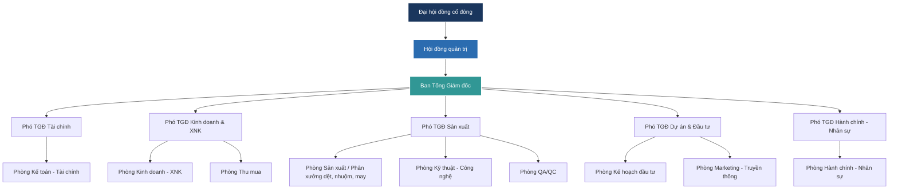

# TỔNG QUAN VỀ CÔNG TY CỔ PHẦN DỆT MAY LIÊN PHƯƠNG (LPTEX)

* **Nguồn tài liệu:** [Studocu - Đại học Kinh tế Quốc dân (NEU)](https://www.studocu.vn/vn/document/dai-hoc-kinh-te-quoc-dan/kinh-doanh-thuong-mai/chuong-1-tong-quan-ve-cong-ty-co-phan-det-may-lien-phuong-lptex/136208362)
* **Giai đoạn nghiên cứu:** 2022 - Q1/2025 (Cập nhật nhân sự tính đến tháng 5/2025)
* **Môn học:** Kinh doanh thương mại

---

## 1. THÔNG TIN CHUNG VÀ LỊCH SỬ PHÁT TRIỂN

### 1.1. Tổng quan doanh nghiệp
* **Tên quốc tế:** LIEN PHUONG TEXTILE & GARMENT CORPORATION
* **Tên viết tắt:** LPTEX
* **Mã số thuế:** 0301445891
* **Địa chỉ trụ sở:** 18 Tăng Nhơn Phú, Phường Phước Long B, Thành phố Thủ Đức, Thành phố Hồ Chí Minh, Việt Nam.
* **Người đại diện pháp luật:** Bà Trần Thị Thúy Hường (Phó Chủ tịch HĐQT)
* **Cơ quan quản lý thuế:** Văn phòng Chi cục Thuế Khu vực II – TP. Hồ Chí Minh
* **Loại hình doanh nghiệp:** Công ty cổ phần ngoài Nhà nước
* **Ngành nghề kinh doanh chính:** Sản xuất vải dệt thoi (Chi tiết: Sản xuất vải các loại)

### 1.2. Quá trình hình thành và phát triển
* **Giai đoạn sơ khởi (1960):** Tiền thân là hãng **Kỹ nghệ Tơ sợi Liên Phương**, thành lập năm 1960. Đây là một trong những đơn vị dệt may tư nhân tiên phong tại miền Nam Việt Nam, chuyên cung cấp vải dệt thoi từ sợi tổng hợp cho thị trường nội địa.
* **Giai đoạn tái cơ cấu (2013 - 2019):** LPTex thực hiện sáp nhập với Vinatex ITC, đầu tư nâng cấp toàn bộ dây chuyền công nghệ hiện đại từ Nhật Bản và Châu Âu. Bước đi này giúp công ty hoàn thiện mô hình **chuỗi sản xuất dọc khép kín (Vertical Integration)** từ kéo sợi, dệt, nhuộm, hoàn tất cho đến may veston cao cấp để xuất khẩu.
* **Giai đoạn mở rộng hạ tầng (Từ 2023):** Nhà máy mới tại TP. Thủ Đức đi vào vận hành với quy mô **gần 80.000 m²** (trong đó diện tích khu vực nhà xưởng sản xuất chiếm hơn 40.000 m²). Đạt năng lực thiết kế **6 triệu mét vải len** và **500.000 bộ veston/năm**. Sản phẩm được tích hợp các công nghệ hoàn tất cao cấp (chống nhăn, kháng khuẩn, chống tia UV) đáp ứng các tiêu chuẩn xuất xứ EVFTA, CPTPP, RCEP.
* **Giai đoạn tái cấu trúc sở hữu (2024 - 2025):** Sau khi Vinatex và Hanosimex thoái phần vốn nhà nước, LPTex thực hiện tái cơ cấu cổ phần. Định hướng phát triển bền vững dưới sự lãnh đạo của Chủ tịch HĐQT kiêm Tổng Giám đốc là ông Lê Thanh Liêm.

---

## 2. CHỨC NĂNG VÀ NHIỆM VỤ

* **Chức năng:** Tổ chức sản xuất, gia công, kinh doanh các loại vải len chải kỹ, vải pha sợi tổng hợp và các sản phẩm may mặc (đặc biệt là veston nam/nữ cao cấp). Cung ứng nguyên phụ liệu dệt may cho thị trường nội địa và quốc tế, giữ vai trò là doanh nghiệp công nghiệp hỗ trợ trọng điểm.
* **Nhiệm vụ:**
  * Quản lý nghiêm ngặt chuỗi sản xuất khép kín để đảm bảo quy tắc xuất xứ vải/sợi nhằm tận dụng ưu đãi thuế quan từ các hiệp định thương mại tự do (FTAs).
  * Tuân thủ pháp luật về bảo vệ môi trường, sử dụng hiệu quả nguồn vốn đầu tư và thực hiện đầy đủ nghĩa vụ thuế với nhà nước.
  * Nghiên cứu phát triển sản phẩm mới (vải sinh thái, dệt may xanh), nâng cấp trình độ tay nghề người lao động và xây dựng thương hiệu veston cao cấp "Made in Vietnam" trên thị trường quốc tế.

---

## 3. CƠ CẤU TỔ CHỨC VÀ PHÂN CÔNG PHÒNG BAN

### 3.1. Sơ đồ tổ chức quản trị LPTex

### 3.2. Chức năng chi tiết của các phòng ban cốt lõi
* **Đại hội đồng cổ đông:** Cơ quan quyền lực cao nhất; thông qua định hướng chiến lược dài hạn, phê duyệt phương án phân phối lợi nhuận và quyết định các dự án đầu tư mở rộng quy mô thiết bị.
* **Hội đồng quản trị:** Giám sát hoạt động của Ban điều hành, phê duyệt kế hoạch sản xuất kinh doanh hàng năm, quyết định các dự án đổi mới công nghệ dệt nhuộm và theo dõi hiệu quả dòng vốn.
* **Ban Tổng Giám đốc:** Điều hành sản xuất kinh doanh hàng ngày, lập kế hoạch chi tiết theo quý, kiểm soát chi phí OpEx và chịu trách nhiệm trước HĐQT về tiến độ các mục tiêu chiến lược.
* **Các khối chuyên môn:**
  * *Khối Sản xuất (Phó TGĐ Sản xuất):* Trực tiếp quản lý phân xưởng Dệt, Nhuộm, Hoàn tất và May; chịu trách nhiệm về năng suất máy móc, định mức kỹ thuật và xử lý sự cố quy trình.
  * *Khối Kinh doanh & XNK:* Tìm kiếm đơn hàng xuất khẩu, đàm phán hợp đồng gia công, làm thủ tục hải quan và điều phối hoạt động logistics.
  * *Khối Tài chính:* Quản trị dòng tiền, thu xếp vốn vay ngân hàng, kiểm soát chi phí giá vốn sản phẩm và quản lý sổ sách kế toán.
  * *Khối HC-NS:* Chịu trách nhiệm tuyển dụng lao động, tính lương thưởng, chế độ bảo hiểm và quản lý an toàn lao động.

---

## 4. TÌNH HÌNH NHÂN SỰ (SỐ LIỆU TÍNH ĐẾN THÁNG 5/2025)

Tổng số lao động tại nhà máy Thủ Đức là **420 nhân sự**. Cơ cấu nhân sự chi tiết như sau:

| Tiêu chí | Phân loại | Số lượng | Tỷ lệ (%) | Đặc điểm & Phân bổ |
| :--- | :--- | :---: | :---: | :--- |
| **Giới tính** | Nam | 250 | 59.5% | Tập trung ở khối vận hành máy sợi, dệt, nhuộm, bảo trì cơ điện và hạ tầng. |
| | Nữ | 170 | 40.5% | Tập trung ở khối may mặc, hoàn thiện sản phẩm, QA/QC ngoại quan và khối văn phòng. |
| **Độ tuổi** | Dưới 25 tuổi | 100 | 23.8% | Lao động trẻ, nhân viên thử việc, bổ sung cho dây chuyền may và văn phòng. |
| | 25 - 40 tuổi | 260 | 61.9% | Lực lượng nòng cốt, nắm giữ các vị trí vận hành máy chính và nghiệp vụ phòng ban. |
| | Trên 40 tuổi | 60 | 14.3% | Cán bộ kỹ thuật lâu năm, tổ trưởng chuyền may và quản lý cấp trung. |
| **Học vấn** | Lao động phổ thông | 250 | 59.5% | Công nhân đứng máy dệt, máy may, nhân viên kho vận và hậu cần. |
| | Trung cấp - Cao đẳng | 120 | 28.6% | Nhân viên kỹ thuật xưởng, giám sát chuyền và nhân viên QA/QC. |
| | Đại học & Trên ĐH | 50 | 11.9% | Bộ khung quản lý cấp trung, cấp cao và nhân viên nghiệp vụ văn phòng. |
| **Kinh nghiệm** | Dưới 5 năm | 260 | 61.9% | Nhân sự mới tuyển dụng phục vụ kế hoạch mở rộng quy mô (đang đào tạo). |
| | Từ 5 năm trở lên | 160 | 38.1% | Lực lượng chủ chốt giữ ổn định vận hành và kiểm soát chất lượng mẻ nhuộm/sợi. |

> [!WARNING]
> **Nhận xét quan trọng về nhân sự:**
> Tỷ lệ nhân sự dưới 5 năm kinh nghiệm chiếm tới **61.9%** và nhóm học vấn Lao động phổ thông chiếm **59.5%**. Điều này cho thấy LPTex đang tuyển dụng ồ ạt nhân sự trẻ/mới để bù đắp thiếu hụt lao động. Việc thiếu hụt nhân sự IE/kỹ thuật quy trình có kinh nghiệm dẫn đến rủi ro cao về việc kiểm soát định mức thủ công và dễ xảy ra lỗi vận hành tại phân xưởng.

---

## 5. KẾT QUẢ HOẠT ĐỘNG KINH DOANH (2022 - Q1/2025)

### 5.1. Báo cáo kết quả kinh doanh năm (2022 - 2024)
*Đơn vị tính: Tỷ đồng*

| Chỉ tiêu | Năm 2022 | Năm 2023 | Năm 2024 | Chênh lệch 2022 - 2023 (Tuyệt đối) | Chênh lệch 2022 - 2023 (%) | Chênh lệch 2023 - 2024 (Tuyệt đối) | Chênh lệch 2023 - 2024 (%) |
| :--- | :---: | :---: | :---: | :---: | :---: | :---: | :---: |
| **Doanh thu** | 820 | 816 | 780 | -4 | -0.5% | -36 | -4.4% |
| **Chi phí** | 780 | 867 | 775 | +87 | +11.2% | -92 | -10.6% |
| **Lợi nhuận** | +40 | -51 | +5 | -91 | -227.5% | +56 | +109.8% |

*Nhận xét:* Năm 2023 ghi nhận khoản lỗ ròng kỷ lục **51 tỷ đồng** do LPTex đầu tư mở rộng hạ tầng Thủ Đức làm phát sinh OpEx lớn đúng thời điểm đơn hàng xuất khẩu sụt giảm. Đến năm 2024, chi phí bắt đầu được siết chặt và kiểm soát tốt giúp kéo giảm lỗ và đưa lợi nhuận về mức dương nhẹ (+5 tỷ đồng).

---

### 5.2. Báo cáo kết quả kinh doanh Quý 1 (Q1/2022 - Q1/2025)
*Đơn vị tính: Tỷ đồng*

| Chỉ tiêu | Q1/2022 | Q1/2023 | Q1/2024 | Q1/2025 | Chênh lệch Q1/23 - Q1/22 | Chênh lệch Q1/24 - Q1/23 | Chênh lệch Q1/25 - Q1/24 |
| :--- | :---: | :---: | :---: | :---: | :---: | :---: | :---: |
| **Doanh thu** | 210 | 220 | 205 | 230 | +10 (+4.8%) | -15 (-6.8%) | +25 (+12.2%) |
| **Chi phí** | 195 | 202 | 193 | 208 | +7 (+3.6%) | -9 (-4.5%) | +15 (+7.8%) |
| **Lợi nhuận** | +15 | +18 | +12 | +22 | +3 (+20.0%) | -6 (-33.3%) | +10 (+83.3%) |

*Nhận xét:* Quý 1/2025 ghi nhận sự phục hồi mạnh mẽ cả về doanh thu (+12.2%) và lợi nhuận (+83.3% so với cùng kỳ 2024) nhờ có thêm các đơn hàng dệt sợi len và veston cao cấp từ hội chợ quốc tế, kết hợp với kiểm soát chi phí đầu vào tốt hơn.

---

### 5.3. Cơ cấu doanh thu theo dòng sản phẩm (2022 - 2024)
*Đơn vị tính: Tỷ đồng*

| Dòng sản phẩm / Dịch vụ | Doanh thu 2022 | Tỷ trọng | Doanh thu 2023 | Tỷ trọng | Doanh thu 2024 | Tỷ trọng |
| :--- | :---: | :---: | :---: | :---: | :---: | :---: |
| **1. Sợi & Vải** | 400 | 49% | 398 | 49% | 390 | 49% |
| **2. Veston Nam** | 160 | 19% | 159 | 19% | 156 | 19.5% |
| **3. Veston Nữ** | 120 | 14% | 119 | 14% | 117 | 14.5% |
| **4. Đồng phục (Uniform)** | 110 | 13% | 110 | 13% | 105 | 13% |
| **5. Gia công & dịch vụ khác**| 30 | 4% | 30 | 4% | 32 | 4% |
| **TỔNG CỘNG** | **820** | **100%** | **816** | **100%** | **800** | **100%** |

### 5.4. Cơ cấu doanh thu Quý 1 qua các năm
*Đơn vị tính: Tỷ đồng*

| Dòng sản phẩm / Dịch vụ | Q1/2022 | Tỷ trọng | Q1/2023 | Tỷ trọng | Q1/2024 | Tỷ trọng | Q1/2025 | Tỷ trọng |
| :--- | :---: | :---: | :---: | :---: | :---: | :---: | :---: | :---: |
| **1. Sợi & Vải** | 102 | 50% | 102 | 50% | 98 | 49% | 105 | 50% |
| **2. Veston Nam** | 40 | 19.5%| 39 | 19% | 39 | 19.5%| 41 | 19.5%|
| **3. Veston Nữ** | 30 | 14.5%| 29 | 14% | 29 | 14.5%| 30 | 14.5%|
| **4. Đồng phục (Uniform)** | 27 | 13.5%| 27 | 13% | 26 | 13% | 27 | 12.8%|
| **5. Gia công & dịch vụ khác**| 5 | 2.5% | 4 | 2% | 8 | 4% | 7 | 3.2% |
| **TỔNG CỘNG** | **204** | **100%** | **201** | **100%** | **200** | **100%** | **210** | **100%** |

*Đánh giá cơ cấu sản phẩm:*
* **Sợi & Vải** luôn giữ vai trò trụ cột chiếm khoảng 49-50% tổng doanh thu, tuy nhiên đây là mảng có biên lợi nhuận thấp, chủ yếu để duy trì công suất máy.
* **Veston (Nam & Nữ)** chiếm tổng cộng khoảng 34% doanh thu, là mảng mang lại giá trị gia tăng cao nhất cho LPTex nhờ tệp khách hàng xuất khẩu truyền thống tại EU và Nhật Bản.

---

## 6. ĐỊNH HƯỚNG CHIẾN LƯỢC ĐẾN NĂM 2030

1. **Chuyển đổi xanh & Vượt rào cản CBAM**:
   * Ưu tiên đầu tư sâu vào công nghệ nhuộm dệt thân thiện với môi trường, tối ưu hóa hệ thống xử lý nước thải.
   * Đặt mục tiêu nâng tỷ trọng các sản phẩm dệt may đạt chứng nhận xanh (Eco-certified) lên tối thiểu **30% tổng sản lượng** vào năm 2030 để bảo vệ đơn hàng xuất khẩu sang EU và các nước phát triển.
2. **Tự động hóa và Số hóa quản trị**:
   * Áp dụng các mô hình tự động hóa quy trình sản xuất dệt nhuộm để kiểm soát chất lượng mẻ nhuộm ổn định, giảm tỷ lệ hàng hỏng (COPQ).
   * Triển khai hệ thống quản trị dữ liệu tích hợp thời gian thực để thay thế các báo cáo thủ công bằng Excel, nâng cao độ chính xác của định mức tiêu hao nguyên vật liệu (BOM).
3. **Mở rộng năng lực hạ tầng**:
   * Dự kiến mở rộng thêm **1 - 2 nhà xưởng vệ tinh** với quy mô diện tích khoảng **5.000 - 7.000 m²** tập trung cho khâu dệt nhuộm và hoàn tất trong giai đoạn 2025 - 2030.
4. **Phát triển nguồn lực HC-NS & Thương mại**:
   * Đào tạo nâng cao năng lực ngoại ngữ và kiến thức thương mại quốc tế cho đội ngũ kỹ thuật và kinh doanh.
   * Đẩy mạnh tham gia các hội chợ xúc tiến thương mại quốc tế tại EU và Châu Á để thu hút thêm 2-3 khách hàng xuất khẩu mới hàng năm đối với dòng sản phẩm vải len cao cấp và veston công nghệ.
5. **Kiểm soát chi phí nghiêm ngặt**:
   * Giới hạn tỷ lệ đầu tư mới dưới **15% doanh thu hàng năm**.
   * Số hóa toàn diện quy trình kiểm soát hao hụt năng lượng (điện, than lò hơi), nguyên phụ liệu cắt may và hoàn thiện báo cáo ESG để tăng tính minh bạch tài chính.
