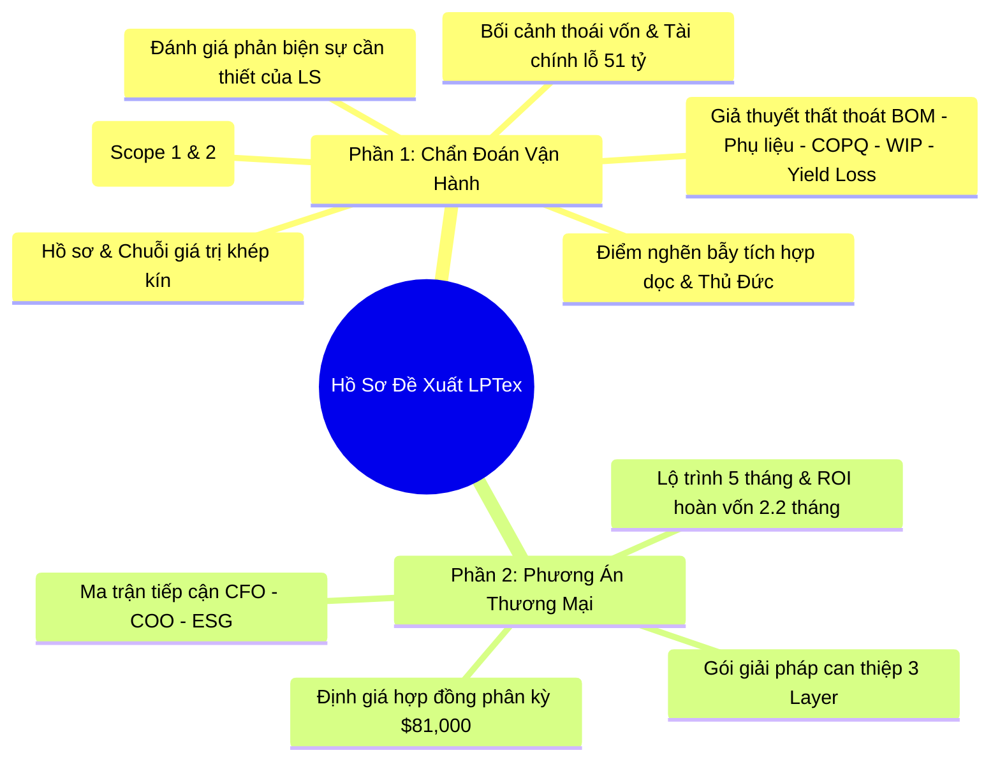

# HỒ SƠ ĐỀ XUẤT KIỂM TOÁN VẬN HÀNH & GIẢI PHÁP ESG: LPTEX CORPORATION



---

# PHẦN 1: CHẨN ĐOÁN VẬN HÀNH & SỨC ÉP CHIẾN LƯỢC

## 1. Hồ Sơ Khách Hàng & Chuỗi Giá Trị (Account Profile)
*   **Tên pháp lý:** Công ty Cổ phần Dệt May Liên Phương (LPTEX CORPORATION)
*   **Địa chỉ:** 18 Tăng Nhơn Phú, Phường Phước Long B, Thành phố Thủ Đức, TP. Hồ Chí Minh (quỹ đất rộng 80.000 m², nhà xưởng > 40.000 m²).
*   **Chuỗi giá trị dọc khép kín:** Tự chủ từ khâu **Sợi ➔ Dệt ➔ Nhuộm ➔ Hoàn tất ➔ May mặc**.
*   **Năng lực sản xuất:** Vải len chải kỹ (~6.000.000 mét/năm) và May Veston cao cấp (~500.000 - 600.000 bộ/năm).
*   **Khách hàng xuất khẩu chính:** Austin Reed, Ted Baker, Next, Moss Bros, River Island.
*   **Lợi thế thương mại:** Đáp ứng quy tắc xuất xứ **"Yarn/Fabric Forward"** để hưởng thuế suất 0% từ EVFTA, CPTPP.

---

## 2. Bối Cảnh Tài Chính & Tái Cấu Trúc Sở Hữu
*   **Tình trạng tài chính (2023):** Doanh thu đạt **816 tỷ đồng** nhưng lỗ ròng **51,2 tỷ đồng** (biên lợi nhuận gộp âm do chi phí vận hành cao và sụt giảm đơn hàng).
*   **Thoái vốn cổ đông lớn:**
    *   **Vinatex:** Thoái toàn bộ **19,11% vốn** (4,5 triệu cổ phần) với giá sàn chiết khấu 12.000 đồng/cổ phần (giảm 39% so với lần chào bán trước).
    *   **Hanosimex:** Thoái toàn bộ **8,87% vốn** (2,1 triệu cổ phần).
*   **Hiện trạng thoái vốn:** Kế hoạch đấu giá công khai được triển khai từ cuối năm 2024 nhưng **hiện vẫn chưa hoàn tất thành công**. Phần vốn nhà nước (gần 28%) vẫn bị mắc kẹt tại LPTex do doanh nghiệp liên tục thua lỗ.
*   **Tín hiệu phục hồi tài chính (Q1/2025):** Theo báo cáo nội bộ mới nhất, LPTex có dấu hiệu phục hồi tích cực trong Q1/2025 với doanh thu đạt **230 tỷ đồng** (+12.2% so với Q1/2024) và lợi nhuận ròng đạt **22 tỷ đồng** (+83.3% so với Q1/2024). Điều này chứng tỏ doanh nghiệp đang bước vào chu kỳ tăng trưởng mới, việc khẩn trương bịt các lỗ hổng thất thoát lúc này sẽ giúp tối đa hóa EBITDA và nâng cao giá trị định giá thoái vốn của nhà nước trong các quý tiếp theo.
*   **Áp lực lên Ban quản trị:** Việc chưa thể hoàn tất thoái vốn đặt Ban quản trị dưới áp lực rất lớn của các cơ quan quản lý vốn nhà nước (Vinatex) về trách nhiệm bảo toàn tài sản và bắt buộc phải đạt mục tiêu **giảm lỗ xuống dưới 4,5 tỷ đồng trong năm tài chính này** để tạo điều kiện thuận lợi cho đợt thoái vốn tiếp theo.

---

## 3. Điểm Nghẽn Trong Mô Hình Kinh Doanh (Business Model Bottlenecks)

### 📌 3.1. Bẫy Chi Phí Cố Định Cao (Vertical Integration Trap)
Việc tự chủ toàn bộ chuỗi sản xuất yêu cầu duy trì nhà xưởng khổng lồ và máy móc nhập khẩu hiện đại. Khi thị trường đi xuống và đơn hàng sụt giảm, khấu hao máy móc và OpEx nhân sự kỹ thuật cao vẫn phát sinh đầy đủ, đẩy LPTex vào thế "khó thu hẹp quy mô sản xuất".
*   **Lỗi dây chuyền tích lũy (Cascading Yield Loss):** Một sai sót chất lượng ở khâu trước (sợi lỗi, vải nhuộm lệch màu) sẽ lan truyền và nhân rộng thiệt hại khi đi vào khâu may vest đắt tiền, dẫn đến lãng phí gấp đôi.

### 📌 3.2. Chu Kỳ Quay Vòng Tiền Dài (Long Cash Conversion Cycle)
Quy trình kéo sợi vải len chải kỹ từ xơ len thô (Úc, Nam Phi), dệt, nhuộm hoàn tất đến khi may thành bộ vest xuất khẩu mất **90 - 180 ngày**. Việc này làm chôn chặt dòng vốn lưu động trong kho nguyên vật liệu và bán thành phẩm dở dang, gia tăng gánh nặng chi phí lãi vay ngân hàng.

### 📌 3.3. Nghịch Lý Chi Phí Tại Trung Tâm Đô Thị Thủ Đức
Nhà xưởng 80.000 m² đặt tại TP.HCM phải chịu mức lương tối thiểu vùng I cao nhất cả nước và thuế đất lớn. Trong khi các đối thủ đã di dời về các tỉnh miền Trung/Tây Nam Bộ để tận dụng lao động giá rẻ, LPTex gánh chi phí nhân công rất nặng nề, buộc phải nâng cao hiệu suất vận hành trên mỗi mét vuông đất nếu không muốn bị giải thể nhà xưởng làm bất động sản.

### 📌 3.4. Rủi Ro Đình Chỉ Hoạt Động Do Xung Đột Pháp Lý Môi Trường (9View Apartment)
*   **Thực trạng:** Nhà máy dệt nhuộm và hoàn tất tại Thủ Đức nằm sát chung cư **9View Apartment** (khu dân cư đông đúc). Việc vận hành lò hơi đốt than cám gây khói đen và mùi khét dẫn đến đơn khiếu nại liên tục của người dân lên Sở Tài nguyên và Môi trường TP.HCM. Doanh nghiệp từng bị xử phạt **430 triệu đồng** năm 2022 do vi phạm xả thải và khói bụi vượt chuẩn.
*   **Hậu quả hiện hữu:** Nếu LPTex không khắc phục triệt để và bị đình chỉ hoạt động khâu nhuộm do không được cấp Giấy phép Môi trường mới, toàn bộ chuỗi sản xuất khép kín sẽ bị tê liệt. Rủi ro pháp lý này trực tiếp đe dọa làm đóng băng tiến trình thoái vốn và làm sụt giảm nghiêm trọng định giá doanh nghiệp.

### 📌 3.5. Sự thiếu hụt năng lực kỹ thuật hệ thống (Industrial Engineering - IE)
Từ dữ liệu tuyển dụng thực tế (LPTex tuyển dụng liên tục nhân viên IE không yêu cầu kinh nghiệm, chấp nhận đào tạo từ đầu theo [tin đăng tuyển dụng chính thức trên cộng đồng Professional Merchandisers](https://www.facebook.com/groups/Professional.Merchandiser/posts/c%C3%B4ng-ty-cp-d%E1%BB%87t-may-li%C3%AAn-ph%C6%B0%C6%A1ng-tuy%E1%BB%83n-d%E1%BB%A5ng-nv-%C4%91i-l%C3%A0m-ngayv%E1%BB%8B-tr%C3%AD-nh%C3%A2n-vi%C3%AAn-ie-th%C3%A0n/9656258791078005/)), có thể nhận thấy rõ điểm nghẽn về năng lực quản trị quy trình:
*   **Phòng IE mỏng và biến động nhân sự lớn:** Bộ phận IE (chịu trách nhiệm đo đếm thời gian chế tạo SAM, cân bằng chuyền, kiểm soát hao phí Kaizen) đang thiếu hụt trầm trọng các nhân sự có chuyên môn sâu.
*   **Rủi ro từ đo đạc và báo cáo thủ công (Manual Control):** Quy trình kiểm soát năng suất hiện tại phụ thuộc hoàn toàn vào đo bấm giờ thủ công (stopwatch) và báo cáo Excel. Việc dựa vào các nhân sự trẻ chưa có kinh nghiệm thực tế khiến hệ thống dễ bị công nhân lành nghề "qua mặt" bằng cách thao tác chậm lại khi đo định mức nhằm xin SAM cao hơn. Đồng thời, phòng IE không thể tự phát hiện các lỗi hệ thống tinh vi như mượn sản lượng liên PO hay ngắt cảm biến phát thải lò hơi để kịp tiến độ.

---

## 4. Đánh Giá Rủi Ro Thất Thoát Vận Hành (Operational Leakage Assessment)

Dưới lăng kính kiểm toán dữ liệu, Link Strategy xác định 5 khu vực rò rỉ chính trong chuỗi sản xuất của LPTex (tổng tổn thất ước tính **18 - 28 tỷ đồng/năm**):

### 4.1. Hao hụt định mức vải cắt (BOM vs Actual Fabric Variance)
*   **Mô tả:** Chênh lệch giữa định mức thiết kế lý thuyết (CAD marker) và lượng vải xuất kho may thực tế do co rút vải khi dệt-nhuộm hoặc lãng phí khi trải vải cắt. Đặc biệt là rủi ro vượt định mức cấp phát của Buyer (Ted Baker, Next), dẫn đến việc phải tự bỏ tiền túi mua vải bù khẩn cấp hoặc chịu phạt khấu trừ (Chargeback) đền bù vật tư.
*   **Thiệt hại ước tính:** **1.5% - 2.0% giá trị vải** (tương đương **7 - 10 tỷ đồng/năm**).
*   **Nội dung rà soát đối chiếu:** Kiểm toán chênh lệch hao hụt vải từ lúc xuất kho nguyên liệu dệt cho đến khi hoàn tất một mã PO may veston theo thời gian thực và kích hoạt cảnh báo nguy cơ cạn kiệt định mức.

### 4.2. Đọng vốn và biến động tồn kho phụ liệu cao cấp (Trims Variance)
*   **Mô tả:** Phụ liệu nhập khẩu (nút sừng, đệm vai, lót lụa) thường được mua dư 3-5% mỗi PO. Khi kết thúc PO, lượng phụ liệu dư thừa không được thu hồi để cấn trừ cho PO sau, dẫn đến việc đọng vốn lưu động tại kho lẻ. Đồng thời tiềm ẩn nguy cơ thiếu hụt trims cao cấp nhập khẩu giữa chừng gây dừng chuyền may.
*   **Thiệt hại ước tính:** **1,2 - 2 tỷ đồng/năm** ($50,000 - $80,000).
*   **Nội dung rà soát đối chiếu:** Quy trình số hóa QR-code, thu hồi và cấn trừ phụ liệu dư thừa tại chuyền may cho các PO sau trên hệ thống quản lý có cùng mã lô màu (Dye-lot).

### 4.3. Chi Phí Chất Lượng Kém (COPQ) từ khâu Dệt - Nhuộm
*   **Mô tả:** Hiện tượng lệch màu nhuộm (Shade variation) dẫn đến việc phải nhuộm lại hoặc hạ cấp loại vải, gây ảnh hưởng tiến độ giao hàng và phát sinh chi phí vận chuyển phát sinh bổ sung.
*   **Thiệt hại ước tính:** **5 - 8 tỷ đồng/năm**.
*   **Nội dung rà soát đối chiếu:** Cách thức lưu vết lịch sử lỗi mẻ nhuộm và các lần xử lý lại (rework) để phục vụ việc tối ưu hóa công thức nhuộm tự động cho các mẻ sau.

### 4.4. Thất thoát do lỗi dây chuyền tích lũy (Cascading Yield Loss - Sợi & Dệt)
*   **Mô tả:** Lỗi sợi (đứt sợi, lẫn tạp chất) hoặc co rút sợi Merino không đạt tiêu chuẩn phát sinh từ khâu sợi/dệt nhưng không được phát hiện sớm, lan truyền sang khâu dệt-nhuộm làm hỏng mẻ nhuộm và lãng phí toàn bộ hóa chất, năng lượng dệt nhuộm đã thực hiện. Sợi Merino mộc chất lượng cao được cung cấp từ liên doanh **Dalat Worsted Spinning (DWS)** (hợp tác với tập đoàn sợi len hàng đầu nước Đức **Südwolle Group**), tuy nhiên do LPTex thiếu công cụ đo kiểm trực tuyến tại Thủ Đức nên các lỗi vật lý vẫn bị bỏ qua. Đồng thời là rủi ro thất thoát tài chính vô hình do mua bán sợi không quy chuẩn đo độ ẩm (Moisture Regain Settlement) với DWS.
*   **Thiệt hại ước tính:** **2 - 3 tỷ đồng/năm**.
*   **Nội dung rà soát đối chiếu:** Kiểm tra lỗi vải mộc ngoại quan, độ co rút sợi tại bàn kiểm vải mộc trước khi chuyển bể nhuộm và đối soát cân bù độ ẩm len Merino theo tiêu chuẩn thương mại (18.25%).

### 4.5. Đọng vốn lưu động do chu kỳ bán thành phẩm dở dang kéo dài (WIP Stagnation & Long CCC)
*   **Mô tả:** Chu kỳ kéo sợi từ xơ len thô dệt nhuộm may vest dài 90-180 ngày khiến dòng vốn lưu động bị nghẽn (WIP Stagnation) tại các phân xưởng trung gian do chênh lệch tiến độ sản xuất, gây tăng chi phí lãi vay và chi phí kho bãi.
*   **Thiệt hại ước tính:** **3 - 5 tỷ đồng/năm** (chi phí cơ hội vốn và lãi vay ngân hàng).
*   **Nội dung rà soát đối chiếu:** Theo dõi thời gian tồn kho tĩnh (WIP Aging) tại từng phân xưởng và phát hiện các điểm nghẽn luân chuyển bán thành phẩm dở dang.

---

## 5. Rào Cản Chuyển Đổi Xanh ESG & Giải Pháp Lá Chắn CBAM

Từ năm 2026, cơ chế điều chỉnh biên giới carbon (CBAM) của EU chính thức áp thuế carbon lên hàng nhập khẩu. Các đối tác lớn của LPTex (Ted Baker, Next) bắt buộc phải có báo cáo phát thải carbon "embedded carbon" minh bạch trong khâu dệt nhuộm để được thông quan.

Đòn bẩy đặc thù về nguồn cung và pháp lý môi trường của LPTex:
*   **Rủi ro xuất xứ nguyên liệu dệt:** Trong khi len 100% được nhập khẩu từ Úc, LPTex lại đang phụ thuộc vào **sợi tái chế nhập khẩu từ Trung Quốc** do nguồn cung nội địa thiếu hụt. Đây là điểm nhạy cảm cao mà Buyer EU sẽ kiểm tra gắt gao trong báo cáo nguồn gốc ESG/CBAM. Nếu LPTex không có hệ thống Carbon Ledger minh bạch để bóc tách rõ lượng carbon và chứng chỉ nguồn gốc từng lô sợi, nguy cơ bị treo đơn hàng là rất lớn.
*   **Áp lực pháp lý môi trường hiện hành:** Việc LPTex đăng tuyển gấp **Chuyên viên Kỹ thuật Môi trường** vào đầu năm 2026 chứng tỏ áp lực tuân thủ xả thải từ Sở TN&MT TP.HCM đối với nhà máy Thủ Đức là cực kỳ căng thẳng. Báo cáo phát thải thời gian thực từ lò hơi là lá chắn pháp lý thiết thực nhất để LPTex đối thoại với cơ quan quản lý.

Đồng thời, theo định hướng chiến lược đến năm 2030 của chính LPTex, doanh nghiệp đặt mục tiêu nâng tỷ trọng sản phẩm đạt chứng nhận xanh lên **ít nhất 30% tổng sản lượng** và hoàn thiện toàn bộ báo cáo ESG. Do đó, việc xây dựng năng lực giám sát carbon không chỉ là để đáp ứng yêu cầu của Buyer, mà là thực thi đúng lộ trình phát triển cốt lõi của công ty.

### 📌 Lợi ích từ Giải pháp Carbon Ledger bất biến của LS:
1.  **Hồ sơ bằng chứng sạch (Audit-Ready):** Tích hợp AWS Object Lock và DLT để khóa dữ liệu phát thải thực tế ngay từ tầng cảm biến vật lý. Cho phép các tổ chức kiểm toán quốc tế (SGS/Bureau Veritas) xác thực báo cáo ESG của LPTex trong **chưa đầy 1 giờ** thay vì hàng tuần đối soát thủ công.
2.  **Dữ liệu lưỡng dụng tối ưu hóa OpEx:** Giám sát điện năng tiêu thụ (Scope 2) và lò hơi/nước/than cám (Scope 1) vừa phục vụ báo cáo ESG/CBAM, vừa giúp phát hiện rò rỉ nhiệt năng dệt nhuộm và hao phí điện máy dệt/may để **tiết kiệm 10% - 15% chi phí năng lượng** cho nhà máy.
3.  **Hỗ trợ trực tiếp mục tiêu chiến lược 30% vải sinh thái:** Cung cấp định lượng minh bạch lượng carbon lưu vết trên từng mét vải len/veston, giúp LPTex dễ dàng đạt các chứng chỉ xanh và gia tăng định giá thoái vốn.

---

## 6. Phân Tích So Sánh Phương Án Triển Khai (Deployment Analysis)

### 6.1. Đối chiếu năng lực tự triển khai và tích hợp hệ thống
*   **So sánh với năng lực ERP hiện hữu:** Các hệ thống ERP truyền thống thực hiện ghi nhận giao dịch hồi tố sau khi phát sinh (độ trễ thông tin từ 1-3 ngày). Giải pháp của LS đóng vai trò là chốt chặn kiểm soát động (Inline Control) theo thời gian thực tại các trạm sản xuất vật lý, giúp phát hiện và ngăn chặn sai lệch ngay tại thời điểm xảy ra phát sinh.
*   **Kiểm soát biến động vật lý:** Hao hụt dệt nhuộm và co rút tuy mang đặc tính vật lý nhưng hoàn toàn có thể tối ưu hóa thông qua việc chuẩn hóa công thức pha nhuộm tự động, lưu vết lịch sử lỗi mẻ nhuộm và áp dụng phần mềm tối ưu sơ đồ cắt vải thay vì định mức ước tính tĩnh.
*   **Tích hợp tiêu chuẩn ESG:** So với việc lập báo cáo carbon hồi tố định kỳ hàng năm do các tổ chức tư vấn lớn thực hiện, giải pháp Carbon Ledger của LS cung cấp dữ liệu phát thải thực tế liên tục theo từng mẻ nhuộm. Điều này cho phép doanh nghiệp điều chỉnh kịp thời nguồn năng lượng tiêu thụ nhằm đáp ứng tiêu chuẩn thuế CBAM theo thời gian thực.

### 6.2. Phân tích khoảng trống kiểm soát quy trình
*   **Đồng bộ số liệu giữa các bộ phận:** Quy trình đối soát thủ công giữa bộ phận sản xuất, kho và kế toán dễ dẫn đến sự lệch pha số liệu. Việc áp dụng giải pháp của LS đóng vai trò là hệ thống đối chiếu độc lập, đảm bảo tính nhất quán của dữ liệu vận hành.
*   **Xung đột KPI giữa các khối phòng ban biệt lập (Siloed KPI Conflict):** Cơ cấu tổ chức của LPTex phân bổ Khối Sản xuất (quản lý phân xưởng), Khối Kinh doanh & XNK (quản lý mua hàng) và Khối Tài chính thành các nhánh độc lập. Sự tách biệt này dẫn đến mâu thuẫn lợi ích: Phân xưởng sản xuất có xu hướng che giấu lỗi chất lượng mẻ nhuộm hoặc hao hụt bàn cắt bằng các giao dịch hồi tố/mượn sản lượng chéo để bảo toàn KPI năng suất, trong khi Khối Tài chính và Kế toán không có công cụ để phát hiện sớm. Hệ thống của LS đóng vai trò là "trọng tài số liệu độc lập" giúp kết nối dữ liệu minh bạch xuyên suốt các khối.
*   **Rà soát lỗi hệ thống thay vì lỗi cá nhân:** Giải pháp tập trung nhận diện các điểm nghẽn hệ thống (Systemic Failures) thông qua tổng hợp các ngoại lệ, từ đó đề xuất giải pháp cải tiến quy trình thay vì quy trách nhiệm cá nhân.


### 6.3. Quản Trị Rủi Ro Dự Án (Project Risk Management)
*   **Rủi ro thích ứng quy trình (Process Adaptation):** Thao tác thủ công truyền thống của công nhân có thể tạo ra rào cản khi chuyển đổi số. LS giải quyết bằng cách thiết kế giao diện số hóa tối giản trên thiết bị cầm tay để giảm thiểu thao tác nhập liệu phức tạp.
*   **Sự chấp thuận của bên thứ ba (Third-party Verification):** Dữ liệu phát thải lưu trữ trên Carbon Ledger sẽ được chuẩn hóa theo định dạng báo cáo quốc tế để đảm bảo khả năng liên thông dữ liệu trực tiếp với các đơn vị xác thực độc lập như SGS hay Bureau Veritas.
*   **Rủi ro biến động cơ cấu sở hữu:** Lộ trình triển khai được phân kỳ rõ ràng thành từng giai đoạn ngắn hạn (4-12 tuần) để đảm bảo tính liên tục của dự án và bảo toàn giá trị đầu tư ngay cả khi có sự thay đổi về nhân sự và cơ cấu cổ đông.

### 📌 6.4. Đánh Giá Tác Động Hạ Tầng & Chi Phí Đầu Tư Thiết Bị (Capex Impact Assessment)
Giải pháp của LS đi theo triết lý **"Software-Defined Intervention" (Can thiệp định nghĩa bằng Phần mềm)** nhằm tối thiểu hóa chi phí đầu tư tài sản cố định (Capex) cho LPTex trong bối cảnh tái cấu trúc dòng tiền:
*   **Tận dụng tối đa thiết bị sẵn có:** 
    *   *Quét QR & Số hóa xưởng may:* Công nhân và QC sử dụng máy tính bảng Android phổ thông hoặc điện thoại thông minh cá nhân để quét QR-code thông qua ứng dụng Web (Progressive Web App - PWA), không yêu cầu mua súng quét mã vạch chuyên dụng đắt tiền.
    *   *Đo ẩm sợi Merino:* Sử dụng trực tiếp thiết bị đo độ ẩm cầm tay sẵn có tại phòng kiểm nghiệm của LPTex, chỉ số hóa quy trình nhập liệu và đối soát trên tablet thay vì đầu tư hệ thống cảm biến ẩm tự động trên băng chuyền.
*   **Thiết bị quang học Edge-AI chi phí thấp (Optical QC):** Thay vì mua máy quét quang học công nghiệp trị giá hàng chục nghìn USD, LS sử dụng camera độ phân giải cao tiêu chuẩn thương mại kết hợp máy tính nhúng mini (Edge PC) chạy thuật toán AI cục bộ (Local YOLO/OpenCV) để phát hiện lỗi dệt mộc với chi phí cực thấp.
*   **Tích hợp dữ liệu lò hơi không xâm lấn:** Kết nối trực tiếp vào bộ điều khiển PLC/SCADA lò hơi hiện tại của LPTex thông qua giao thức truyền thông tiêu chuẩn (Modbus TCP/IP, OPC UA) để trích xuất dữ liệu phát thải và điện năng, không mua thêm cảm biến đo đạc mới.
*   **Không đầu tư hạ tầng máy chủ Server nội bộ:** Toàn bộ động cơ tính toán và Carbon Ledger của LS-ASS vận hành trên nền tảng Cloud SaaS của LS. LPTex không cần mua server vật lý, không cần bản quyền hệ quản trị cơ sở dữ liệu lớn hay nhân sự IT vận hành phòng máy chủ.

---
---

# PHẦN 2: ĐỀ XUẤT THƯƠNG MẠI & KẾ HOẠCH HÀNH ĐỘNG

## 7. Gói Giải Pháp Dịch Vụ 3 Tầng Của LS

| Tầng dịch vụ | Chi tiết kỹ thuật | Sản phẩm bàn giao (Deliverables) |
| :--- | :--- | :--- |
| **Layer 1: Clarity** | **Kiểm toán Thất thoát Dữ liệu Vận hành** | - Khảo sát dữ liệu mộc, đối chiếu chéo kho sợi - nhuộm - cắt - may trên 5 mã PO xuất khẩu.<br>- Báo cáo chẩn đoán sai lệch định mức cắt (CAD/BOM Marker) thực tế.<br>- Hồ sơ rủi ro vận hành (Risk Register). |
| **Layer 2: Intervention** | **Hệ thống Can thiệp Vá lỗi Dòng tiền (Pilot)** | **Triển khai 3 Module chốt chặn tự động:**<br>- *Module 1 (BOM & ERP Reconciliation):* Tự động hóa đối soát Lệnh cắt ➔ Xuất kho vải ➔ Thành phẩm may thực tế (cảnh báo lệch >1% thời gian thực) + Đối chiếu chéo dữ liệu kho ERP, gắn cờ giao dịch hồi tố và **kiểm toán chống mượn sản lượng chéo PO (Cross-PO Yield Borrowing)**.<br>- *Module 2 (Trims):* Số hóa việc phân bổ phụ liệu theo PO, cảnh báo cạn kiệt BOM sớm và cấn trừ phụ liệu dư thừa cùng mã lô màu.<br>- *Module 3 (Quality):* QC điện tử đầu chuyền thay ghi chép tay + Công cụ phân tích tổn thất chất lượng mẻ nhuộm (COPQ Analyzer) + **Chốt chặn chất lượng dệt & sợi đầu vào (Optical QC) + Định giá quy đổi độ ẩm len Merino nhập từ DWS (Moisture Regain Settlement)**. |
| **Layer 3: SaaS Layer** | **Nền tảng Kiểm toán Liên tục** | - Dashboard giám sát chỉ số hấp thụ quy trình (*Manual Workaround Rate*).<br>- Carbon Ledger tích hợp lò hơi (Scope 1) và **đi năng lượng tiêu thụ (Scope 2)** chuẩn CBAM + Đối chiếu chéo lượng than cám mua vào và thực tế phát thải.<br>- Tự động gửi cảnh báo đọng vốn lưu động (Dead stock alerts) và **cảnh báo nghẽn bán thành phẩm dở dang (WIP Stagnation alerts)** cho CFO/COO. |

---

## 8. Khuyến Nghị Định Giá & Cấu Trúc Hợp Đồng (Pricing Options)

### 📍 Phương án 1: Hợp Đồng Phân Kỳ 2 Giai Đoạn (Khuyên Dùng)
*   **Giai đoạn 1 (Clarity Audit):** **$10,000 (khoảng 250 triệu VND)** - Cam kết chỉ ra tối thiểu **10 tỷ VND** giá trị rò rỉ trong dữ liệu thật của LPTex. Hoàn phí 50% nếu không tìm đủ.
*   **Giai đoạn 2 (Can thiệp & Bản quyền SaaS):** **$71,000 (khoảng 1.775 tỷ VND)**, trả làm 2 phần:
    *   *Phí triển khai cố định Phase 2 (3 Module):* **$35,000** (~875 triệu VND) thanh toán theo tiến độ nghiệm thu.
    *   *Phí thuê bao phần mềm giám sát (SaaS):* **$36,000/năm** (~900 triệu VND) trả trước 1 năm (tương đương $3,000/tháng).
*   💰 **Tổng giá trị hợp đồng năm đầu:** **$81,000** *(khoảng 2.025 tỷ VND)*.

### 📍 Phương án 2: Hợp Đồng Liên Kết Hiệu Quả (Performance-Share)
*   **Phí cố định tối thiểu (Giai đoạn 1 + Triển khai cơ bản Giai đoạn 2):** **$30,000** (~750 triệu VND) để bù đắp chi phí vận hành cơ bản của LS.
*   **Phí thưởng hiệu quả (Success Fee):** **12% giá trị dòng tiền thực tế thu hồi được** trong 12 tháng đầu tiên kể từ khi hệ thống can thiệp hoạt động.
*   💰 **Tổng giá trị thực tế dự phóng:** **$78,000** *(khoảng 1.95 tỷ VND)* (tính trên mức tiết kiệm mục tiêu tối thiểu $400,000/năm).

### 📍 8.3. Triết Lý Định Giá & Cam Kết Đồng Hành Thương Mại (Commercial Risk-Sharing Philosophy)
LS không cung cấp dịch vụ miễn phí 100% nhằm bảo vệ tính liêm chính, bảo mật dữ liệu nhạy cảm (ERP, CAD) và đảm bảo sự cam kết nguồn lực (Skin in the game) từ cấp lãnh đạo đến công nhân LPTex. Tuy nhiên, để đồng hành cùng LPTex vượt qua bối cảnh tái cấu trúc khó khăn, LS áp dụng cơ chế **Chia sẻ rủi ro thương mại**:
*   **Cam kết "Hoàn phí Giai đoạn 1" (Money-Back Guarantee):** Đối với Phương án 1, LS tự tin cam kết hoàn phí 50% nếu báo cáo Clarity Audit không chỉ ra tối thiểu **10 tỷ VND** giá trị thất thoát vận hành trong dữ liệu thật của LPTex. Điều này triệt tiêu hoàn toàn rủi ro phê duyệt ngân sách ban đầu của CFO.
*   **Gắn kết lợi ích trực tiếp (Performance Alignment):** Đối với Phương án 2, LS chấp nhận mức phí cố định tối thiểu ($30k) để đồng hành. Doanh thu chính của LS phụ thuộc trực tiếp vào kết quả giảm lỗ thực tế của LPTex (thắng cùng thắng, thua cùng chịu).

---

## 9. Phân Tích ROI & Lộ Trình Triển Khai (Timeline & Payback Schedule)

*   **Tổng mức đầu tư cho LS (Target Case):** **$81,000** (năm đầu).
*   **Giá trị thu hồi mục tiêu tối thiểu:** Tiết kiệm **$440,000/năm** (khoảng ~11 tỷ đồng/năm, tương đương khôi phục 50% lượng thất thoát mở rộng ~22 tỷ đồng nhờ kiểm soát thêm WIP và Cascading Yield Loss).
*   **Tỷ lệ hoàn vốn (ROI %):** **543.21%**
*   **Thời gian hoàn vốn (Payback Period):** **2.2 tháng** vận hành thực tế.

```mermaid
gantt
    title Lộ trình triển khai dự án & Dòng tiền LPTex
    dateFormat  YYYY-MM-DD
    section Triển khai của LS
    Giai đoạn 1: Clarity Audit (4 tuần)        :active, a1, 2026-06-01, 28d
    Giai đoạn 2: Pilot 3 Module (12 tuần)       : a2, 2026-06-29, 84d
    Giai đoạn 3: Bàn giao & Nghiệm thu (4 tuần) : a3, 2026-09-21, 28d
    section Dòng tiền LPTex
    Đầu tư cho LS (Lũy kế -$81k)               :crit, d1, 2026-06-01, 140d
    Vận hành thực tế & Hòa vốn (2.2 tháng)     : d2, 2026-10-19, 66d
    Tạo lợi nhuận ròng thuần                   :active, d3, 2026-12-25, 114d
```

*   **Thời gian triển khai:** 5 tháng (20 tuần).
*   **Thời gian hoàn vốn:** 2.2 tháng sau khi nghiệm thu bàn giao. Từ tháng thứ 3 vận hành trở đi, LPTex thu lợi nhuận thuần túy **~$36,600/tháng**.

---

## 10. Chiến Lược Tiếp Cận Khách Hàng (Access Strategy)

| Đối tượng tiếp cận | Trọng tâm thông điệp (Value Hook) | Đề xuất giải pháp can thiệp của LS |
| :--- | :--- | :--- |
| **CFO / Ban lãnh đạo (Thoái vốn)** | **Tối ưu hóa giá vốn & gia tăng EBITDA:** Tỷ lệ rò rỉ định mức và lỗi sản xuất trực tiếp bào mòn biên lợi nhuận gộp (đang âm 51,2 tỷ năm 2023). Bịt các lỗ hổng này sẽ gia tăng EBITDA ngay lập tức. **Rút ngắn chu kỳ quay vòng tiền (CCC)** từ 180 xuống 120 ngày. **Kiểm toán chống mượn sản lượng chéo PO** để chi trả lương khoán chính xác và **đối soát độ ẩm len Merino** tránh trả tiền mua nước dư thừa cho DWS. | Triển khai công cụ **LS-ASS** để đối soát dữ liệu kho vs sản xuất thực tế, tự động phát hiện giao dịch hồi tố, chống mượn sản lượng PO và đo lường tốc độ WIP dở dang. |
| **COO / Giám đốc Sản xuất** | **Giảm tải đối soát thủ công & Tránh trễ hạn giao hàng:** Tự động hóa theo dõi tiến độ và kiểm soát hao hụt tại từng khâu dệt-nhuộm-may, ngăn chặn lỗi dây chuyền tích lũy (Cascading Yield Loss) từ khâu Sợi/Dệt. **Cảnh báo sớm nguy cơ cạn kiệt BOM** để tránh bị Buyer phạt khấu trừ (Chargeback) hoặc phải mua vải bù gấp giá cao. | Tích hợp hệ thống theo dõi trực quan trạng thái PO, cảnh báo co rút, cảnh báo cạn kiệt BOM và tích hợp Optical QC tại khâu vải mộc. |
| **Export / ESG Manager** | **Lá chắn xanh CBAM vượt rào cản thuế EU:** Tự động hóa đóng gói Evidence Bundle đạt chuẩn ISO 14064-3 phục vụ kiểm toán carbon trong 1 giờ. Báo cáo carbon tích lũy sản phẩm toàn diện (gồm Scope 1 và Scope 2). Đối chéo hóa đơn than mua thực tế để triệt tiêu chênh lệch carbon phát sinh ngoài báo cáo. | Tích hợp công cụ đo đạc phát thải Carbon Ledger (lò hơi & năng lượng điện) tại Module 3. |
| **Trưởng phòng QA/QC** | **Số hóa lịch sử lỗi & Chuẩn hóa Recipe nhuộm:** Lưu vết các mẻ nhuộm lỗi lệch màu và lỗi dệt vải mộc để tối ưu công thức nhuộm tự động, giảm chi phí làm lại (COPQ). | Hệ thống Dashboard phân tích nguyên nhân gốc rễ (Root Cause Analysis) cho lỗi nhuộm và dệt. |
