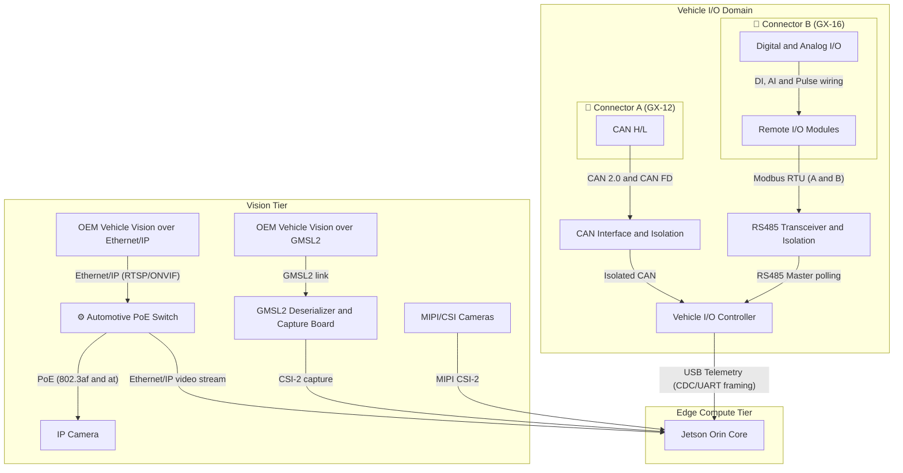
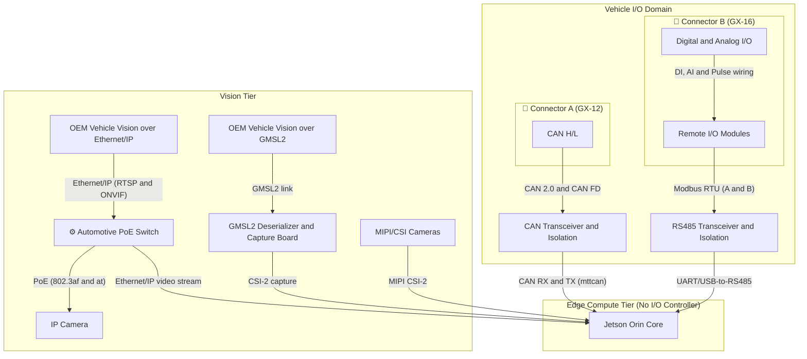
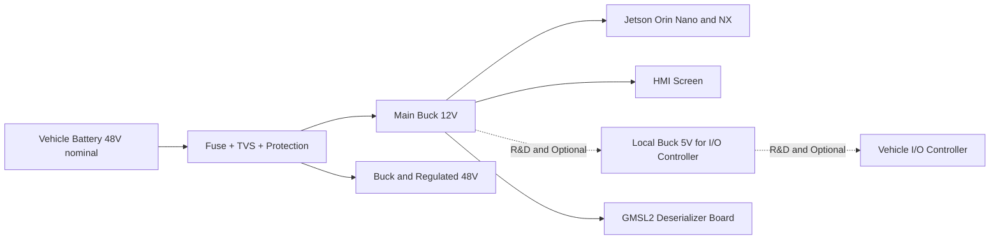

# LeOS Edge Vehicle Use Cases

Legend:

- `🟢 Jetson Orin Nano 8GB` = HMI, offline app, trip execution, battery logic, and lightweight AI.
- `🔵 Jetson Orin NX 16GB` = Production edge, multi-sensor, medium-level safety vision.
- `🧠 Advanced` = Multi-camera, heavy perception, and multiple concurrent AI pipelines.

<table>
  <tr>
    <th style="width: 14%;">Use Case</th>
    <th style="width: 30%;">Description</th>
    <th style="width: 12%;">Minimum Edge</th>
    <th style="width: 28%;">Edge I/O</th>
    <th style="width: 16%;">Notes</th>
  </tr>
  <tr>
    <td>Offline Trip Execution</td>
    <td>Vehicle operates normally when offline: view trips, execute tasks, save local events, and sync back when connection is restored.</td>
    <td>🟢 Jetson Orin Nano 8GB</td>
    <td></td>
    <td>Mandatory baseline.</td>
  </tr>
  <tr>
    <td>Smart Trip Execution</td>
    <td>Edge detects trip status transition points (such as loading, unloading...) from real-world context.</td>
    <td>🟢 Jetson Orin Nano 8GB</td>
    <td>
      <ul>
        <li>CSI Dashcam</li>
        <li>360 Camera System (GMSL2 Camera)</li>
        <li>IP Cargo Camera: Mounted at the highest position looking into the cargo bed.</li>
        <li>Door Sensor: Mounted on the cargo door.</li>
        <li>Load Cell: Mounted on the suspension system or vehicle chassis.</li>
        <li>Gyroscope</li>
      </ul>
    </td>
    <td>Automatic trip milestone detection.</td>
  </tr>
  <tr>
    <td>Incident Intelligence</td>
    <td>Edge collects on-site incident evidence including photos, videos, location, and operational context.</td>
    <td>🟢 Jetson Orin Nano 8GB</td>
    <td>
      <ul>
        <li>CSI Dashcam</li>
        <li>360 Camera System (GMSL2 Camera)</li>
        <li>IP Cargo Camera: Mounted at the highest position looking into the cargo bed.</li>
        <li>Emergency SOS Button: Mounted within driver's reach in the cabin.</li>
        <li>Accelerometer (G-Sensor)</li>
      </ul>
    </td>
    <td>Basic safety requirement for fleets. Uses crash data from Vehicle Accelerometer (G-Sensor) via CAN Bus.</td>
  </tr>
  <tr>
    <td>Vehicle HMI</td>
    <td>HMI displays trips, alerts, vehicle status, and next actions clearly with minimal driver interaction.</td>
    <td>🟢 Jetson Orin Nano 8GB</td>
    <td>
      <ul>
        <li>Audio System: External speaker and cabin alarm buzzer.</li>
      </ul>
    </td>
    <td>Primary interaction interface.</td>
  </tr>
  <tr>
    <td>Ready to Work Confirmation</td>
    <td>Automatically reports Battery SOC, Technical Health, and Location for Server dispatch commands.</td>
    <td>🟢 Jetson Orin Nano 8GB</td>
    <td>
      <ul>
        <li>GPS/GNSS Module</li>
        <li>Battery Management System (BMS)</li>
        <li>Shark Fin Antenna (4G and GPS)</li>
      </ul>
    </td>
    <td>Uses GPS and BMS data for reporting.</td>
  </tr>
  <tr>
    <td>Battery-aware Dispatch and Charging</td>
    <td>Edge converts BMS data into operational decisions such as sufficiency for trips, remaining range, and when to charge.</td>
    <td>🟢 Jetson Orin Nano 8GB</td>
    <td>
      <ul>
        <li>Battery Management System (BMS)</li>
        <li>GPS/GNSS Module</li>
        <li>Shark Fin Antenna (4G and GPS)</li>
      </ul>
    </td>
    <td>Converts BMS data and Location into operational decisions.</td>
  </tr>
  <tr>
    <td>Battery Health Intelligence</td>
    <td>Edge monitors battery risks, thermal stress, and degradation to support battery passports and lifecycle management.</td>
    <td>🟢 Jetson Orin Nano 8GB</td>
    <td>
      <ul>
        <li>Accelerometer (G-Sensor)</li>
        <li>Gyroscope</li>
      </ul>
    </td>
    <td>Uses CAN Bus data (BMS and Vehicle G-Sensor).</td>
  </tr>
  <tr>
    <td>Smart Charging Bay Coordination</td>
    <td>Edge coordinates with charging infrastructure to reduce queues and optimize charging queues within the site.</td>
    <td>🟢 Jetson Orin Nano 8GB</td>
    <td>
      <ul>
        <li>GPS/GNSS Module</li>
        <li>Shark Fin Antenna (4G and GPS)</li>
      </ul>
    </td>
    <td>Uses 4G and Location to coordinate with infrastructure.</td>
  </tr>
  <tr>
    <td>Battery Swap Decisioning</td>
    <td>Edge decides when the vehicle should swap batteries instead of continuing or charging, based on SOC, current trip, and next tasks.</td>
    <td>🟢 Jetson Orin Nano 8GB</td>
    <td>
      <ul>
        <li>Battery Management System (BMS)</li>
        <li>GPS/GNSS Module</li>
        <li>Shark Fin Antenna (4G and GPS)</li>
      </ul>
    </td>
    <td>Uses BMS data and Location for coordination.</td>
  </tr>
  <tr>
    <td>Charge and Swap Optimization</td>
    <td>Edge chooses between charging and swapping based on wait times, trip schedule, battery health, and energy infrastructure availability.</td>
    <td>🟢 Jetson Orin Nano 8GB</td>
    <td>
      <ul>
        <li>Battery Management System (BMS)</li>
        <li>GPS/GNSS Module</li>
        <li>Shark Fin Antenna (4G and GPS)</li>
      </ul>
    </td>
    <td>Optimizes based on battery and real-time Location data.</td>
  </tr>
  <tr>
    <td>Battery Pool Allocation</td>
    <td>Edge supports battery allocation within the pool by vehicle, route, shift, and task priority to avoid inefficient battery usage.</td>
    <td>🟢 Jetson Orin Nano 8GB</td>
    <td>
      <ul>
        <li>Battery Management System (BMS)</li>
      </ul>
    </td>
    <td>Uses Battery ID from BMS.</td>
  </tr>
  <tr>
    <td>Swap Traceability</td>
    <td>Edge records which battery was swapped for which vehicle, at which station, at what time, linked to the respective trip and shift.</td>
    <td>🟢 Jetson Orin Nano 8GB</td>
    <td>
      <ul>
        <li>Battery Management System (BMS)</li>
        <li>GPS/GNSS Module</li>
        <li>Shark Fin Antenna (4G and GPS)</li>
      </ul>
    </td>
    <td>Traces Battery ID via BMS data.</td>
  </tr>
  <tr>
    <td>Predictive Maintenance and Service Orchestration</td>
    <td>Edge detects early signs of failures and coordinates appropriate repairs, spare parts, and maintenance schedules.</td>
    <td>🟢 Jetson Orin Nano 8GB</td>
    <td>
      <ul>
        <li>Vibration Sensor: Mounted on the electric motor casing at the output shaft bearing position.</li>
        <li>Pressure and Temperature Sensor: Mounted on the Battery cooling system pipe.</li>
        <li>Flow Meter: Mounted on the Motor cooling pipe.</li>
        <li>Tire Pressure Monitoring System (TPMS): Mounted on the tire valves of each wheel.</li>
      </ul>
    </td>
    <td>Monitors Motor, Gearbox, and electromechanical health in real-time.</td>
  </tr>
  <tr>
    <td>Driver Safety Monitoring</td>
    <td>Edge uses cabin camera to detect drowsiness, distraction, and unsafe driving behaviors.</td>
    <td>🟢 Jetson Orin Nano 8GB</td>
    <td>
      <ul>
        <li>Cabin Camera (IR CSI Camera)</li>
        <li>Alarm Buzzer: Mounted inside the cabin dashboard.</li>
      </ul>
    </td>
    <td>Active safety for the driver.</td>
  </tr>
  <tr>
    <td>Around-Vehicle Safety</td>
    <td>Edge monitors surroundings to warn of collisions, blind spots, pedestrians, and assist in safe reversing and docking.</td>
    <td>🔵 Jetson Orin NX 16GB</td>
    <td>
      <ul>
        <li>360 Camera System (GMSL2 Camera)</li>
        <li>77GHz mmWave Forward Radar</li>
        <li>Alarm Buzzer</li>
      </ul>
    </td>
    <td>360-degree surround vehicle safety.</td>
  </tr>
  <tr>
    <td>Site Safety and Compliance</td>
    <td>Edge inspects PPE, pre-shift checklists, and geo-fence violations directly on-site.</td>
    <td>🟢 Jetson Orin Nano 8GB</td>
    <td>
      <ul>
        <li>External IP Camera: Mounted on both sides of the cabin roof looking down.</li>
        <li>CSI Dashcam</li>
        <li>Audio System: External speaker and cabin alarm buzzer.</li>
        <li>Emergency SOS Button: Mounted within driver's reach in the cabin.</li>
      </ul>
    </td>
    <td>Ensures workplace safety compliance on-site.</td>
  </tr>
  <tr>
    <td>Loading and Payload Intelligence</td>
    <td>Edge recognizes payload states such as loading, unloading, loaded, uneven loading, and material spillage.</td>
    <td>🟢 Jetson Orin Nano 8GB</td>
    <td>
      <ul>
        <li>IP Cargo Camera: Mounted at the highest position looking down at the cargo bed.</li>
        <li>Load Cell: Mounted on the suspension system or vehicle chassis.</li>
        <li>Gyroscope</li>
        <li>360 Camera System (GMSL2 Camera)</li>
      </ul>
    </td>
    <td>Monitors transport efficiency. Uses tilt data from Gyroscope via CAN Bus.</td>
  </tr>
  <tr>
    <td>Route and Delay Intelligence</td>
    <td>Edge detects route deviations, wrong sites, traffic jams, and interprets causes of slow driving and idling.</td>
    <td>🟢 Jetson Orin Nano 8GB</td>
    <td>
      <ul>
        <li>CSI Dashcam</li>
        <li>360 Camera System (GMSL2 Camera)</li>
        <li>Accelerometer (G-Sensor)</li>
        <li>Gyroscope</li>
      </ul>
    </td>
    <td>Analyzes motion context. Uses acceleration data from Vehicle G-Sensor via CAN Bus.</td>
  </tr>
  <tr>
    <td>Asset and Site Recognition</td>
    <td>AI processes multi-stream cameras to automatically identify Container codes (OCR), validate warehouse loading docks, and charging bays to automate site operations.</td>
    <td>🔵 Jetson Orin NX 16GB</td>
    <td>
      <ul>
        <li>CSI Dashcam</li>
        <li>360 Camera System (GMSL2 Camera)</li>
        <li>Multi-angle IP Camera: Mounted on both side mirrors looking outwards.</li>
        <li>External IP Camera: Mounted on both sides of the cabin roof looking down.</li>
      </ul>
    </td>
    <td>Identifies infrastructure and assets using multi-angle vision.</td>
  </tr>
  <tr>
    <td>Edge Copilot for Operators</td>
    <td>Edge assists drivers, technicians, and supervisors with guidelines, voice prompts, and contextual incident summaries.</td>
    <td>🔵 Jetson Orin NX 16GB</td>
    <td>
      <ul>
        <li>Mic and Speaker</li>
      </ul>
    </td>
    <td>On-site virtual assistant.</td>
  </tr>
  <tr>
    <td>Evidence and Claims Pack</td>
    <td>Edge standardizes operational evidence for insurance, auditing, disputes, and carbon ledger.</td>
    <td>🟢 Jetson Orin Nano 8GB</td>
    <td>
      <ul>
        <li>CSI Dashcam</li>
        <li>360 Camera System (GMSL2 Camera)</li>
        <li>IP Cargo Camera: Mounted at the highest position looking into the cargo bed.</li>
        <li>External IP Camera: Mounted on both sides of the cabin roof looking down.</li>
        <li>Cabin Camera (IR CSI Camera)</li>
        <li>Load Cell: Mounted on suspension or chassis.</li>
        <li>Door Sensor: Mounted on cargo door.</li>
        <li>Emergency SOS Button: Mounted within driver's reach in the cabin.</li>
        <li>Tire Pressure Monitoring System (TPMS): Mounted on tire valves.</li>
        <li>GPS/GNSS Module</li>
        <li>Battery Management System (BMS)</li>
        <li>Shark Fin Antenna (4G and GPS)</li>
        <li>Accelerometer (G-Sensor)</li>
        <li>Gyroscope</li>
      </ul>
    </td>
    <td>Suitable when audit-grade and insurance-grade evidence is required.</td>
  </tr>
  <tr>
    <td>Regulatory and Policy Mode</td>
    <td>Edge activates different policies based on site, customer, and operational standards to support multi-site and multi-customer fleets.</td>
    <td>🟢 Jetson Orin Nano 8GB</td>
    <td>
      <ul>
        <li>GPS/GNSS Module</li>
        <li>Shark Fin Antenna (4G and GPS)</li>
      </ul>
    </td>
    <td>Changes policy based on Location and Site.</td>
  </tr>
</table>

## Edge Device Reference

`Coverage` = number of use cases in which the device appears as the `Minimum Edge` out of `22` total use cases.

<table>
  <tr>
    <th style="width: 14%;">Name</th>
    <th style="width: 26%;">Specifications</th>
    <th style="width: 8%;">Reference Price</th>
    <th style="width: 18%;">Image</th>
    <th style="width: 8%;">Coverage</th>
    <th style="width: 26%;">Remarks</th>
  </tr>
  <tr>
    <td><a href="https://developer.nvidia.com/embedded/jetson-developer-kits">🟢 Jetson Orin Nano Super Developer Kit 8GB</a></td>
    <td><code>67 TOPS</code>, <code>8GB LPDDR5</code>, <code>microSD</code> Suitable for: HMI, offline app, trip execution, battery logic, basic incident collection, lightweight CV.</td>
    <td><code>249 USD</code></td>
    <td></td>
    <td><code>20 out of 22</code></td>
    <td>Cheapest option for early PoC and pilot. Best chosen when vehicle application and light AI are the focus; should not be the default for multi-camera and heavy copilot tasks.</td>
  </tr>
  <tr>
    <td><a href="https://www.seeedstudio.com/reComputer-Super-J4012-p-6443.html">🔵 reComputer Super J4012 based on Jetson Orin NX 16GB</a></td>
    <td><code>157 TOPS</code>, <code>16GB RAM</code>, Orin NX box device Suitable for: production edge, multi-sensor, 2-4 cameras, safety vision, predictive maintenance, and light copilot.</td>
    <td><code>999 USD</code></td>
    <td></td>
    <td><code>2 out of 22</code></td>
    <td>Most realistic sweet spot for production. Best chosen when you need to run operational apps, safety AI, and sensor fusion concurrently while keeping costs reasonable.</td>
  </tr>
  <tr>
    <td><a href="https://developer.nvidia.com/embedded/jetson-developer-kits">🧠 Jetson AGX Orin Developer Kit 64GB</a></td>
    <td><code>Up to 275 TOPS</code>, <code>64GB LPDDR5</code>, <code>64GB eMMC</code> Suitable for: multi-camera, heavy perception, multiple concurrent AI pipelines, copilot, and advanced vision.</td>
    <td><code>1999 USD</code></td>
    <td></td>
    <td><code>0 out of 22</code></td>
    <td>Recommended when safety vision and edge AI are key strategic lanes. No current use case in the table mandates this as a minimum baseline, so this is a ceiling upgrade rather than a baseline.</td>
  </tr>
</table>

---

### 0. Hardware Installation Principles

- **T-Box**: Install in a dry location, convenient for power connection and 4G/GPS antenna wiring.
- **Camera System**: Must be calibrated after installation to ensure AI and Perception features (such as Bird's Eye View) function accurately.

## 🏗️ T-BOX HARDWARE ARCHITECTURE (FINALIZED)

Below is the overall connection diagram for the T-Box architecture. The production baseline is finalized as `Direct-to-Jetson without an I/O Controller`, where `Vehicle CAN` serves as the most critical operational data branch.

> [!NOTE]
> The default assumption of the current architecture is a `48V nominal vehicle`.

Role Division Principles:

- Production baseline: `Jetson Orin` directly receives CAN and RS485 via isolated front-ends, without requiring a `Vehicle I/O Controller`.
- `Vehicle I/O Controller` is kept solely as a reference option and for R&D when I/O processing domain separation is needed.
- `Jetson Orin` focuses on heavy compute, AI, local storage, HMI, cloud sync, and media processing.
- `HMI Tier` is the interaction layer with drivers and technicians, receiving telemetry and task commands from Jetson.
- `MIPI/CSI Cameras` plug directly into Jetson; `IP cameras` and `OEM Vehicle Vision over Ethernet/IP` pass through the `PoE switch` into Jetson.
- `IP cameras` use a dedicated `PoE switch` to combine both data and power over a single Ethernet cable.
- The `Vehicle CAN` branch must maintain isolation, `read-first` passive sniffing, and send no control commands in the initial phase.
- The architecture is split into 2 distinct domains via standard industrial connectors:
  - `Vehicle I/O Domain (Connectors A and B)`: CAN, slow sensors, RS485, ignition, and I/O controller.
  - `Edge Compute Domain`: Jetson, cameras, HMI, storage, and AI.
- **Connector Standards:**
  - **Connector A (GX-12 4-Pin):** Main power (12V to 48V) and CAN Bus.
  - **Connector B (GX-16 8-Pin):** Industrial I/O (Digital, Analog, and Pulse) and RS485 Modbus.

### 1. Functional Logical Diagram (Reference Option with I/O Controller)

### 1.1 Production Baseline Diagram (Without Vehicle I/O Controller)

### 2. Power Distribution Diagram

