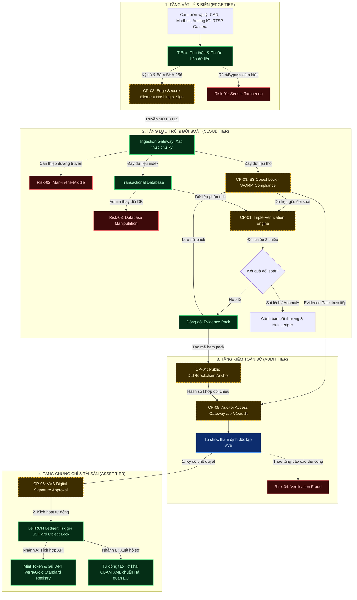

# QUY TRÌNH LUỒNG DỮ LIỆU & ĐIỂM KIỂM SOÁT CARBON LEDGER

> **TRIẾT LÝ CỐT LÕI: TIN VÀO HỒ SƠ, KHÔNG TIN VÀO CẤU HÌNH (TRUST THE DOSSIER, NOT THE SETUP)**
> 
> Mục tiêu tối thượng của khung kiến trúc LeTRON Carbon Ledger không phải là chứng minh hệ thống Cloud hay thiết bị T-Box bảo mật tuyệt đối, mà là đóng gói dữ liệu thành một **Tập hồ sơ bằng chứng tự xác thực (Self-Verifying Evidence Pack)**. Tập hồ sơ này chứa đầy đủ bằng chứng toán học, chữ ký số từ nguồn (ATECC608B), chữ ký số bên thứ ba độc lập (EVN, hóa đơn thuế) và mã băm on-chain. Nhờ đó, bất kỳ tổ chức thẩm định (VVB) nào cũng có thể tự chạy script xác thực ngoại tuyến (offline) để thẩm duyệt kết quả phát thải mà không cần phải đặt giả định tin tưởng vào cấu hình vận hành của LeTRON hay doanh nghiệp.

---

### I. Sơ đồ Luồng Nghiệp vụ & Kỹ thuật (Workflow Diagram)

Sơ đồ sử dụng chuẩn ký hiệu và phối màu của hệ thống LS Auditor để phân tách rõ ràng giữa các tác nhân (Actors), hệ thống (Systems), các rủi ro rò rỉ (Risks), và các điểm kiểm soát trọng yếu (Control Points - CP).



---

### II. Chi Tiết Các Điểm Kiểm Soát Trọng Yếu (Critical Control Points)

Để bảo chứng giá trị pháp lý cho sổ cái carbon trước các tổ chức kiểm toán quốc tế, **8 điểm kiểm soát (`CP-01` đến `CP-08`)** được thiết kế đồng bộ trong quy trình, bao gồm 2 lớp bảo vệ mới nhằm ngăn chặn tấn công **giả lập telemetry từ bên trong chính thiết bị T-Box**:

| Mã Kiểm Soát | Tên Điểm Kiểm Soát | Mô Tả Kỹ Thuật | Vai Trò Đối Với Bằng Chứng |
| :--- | :--- | :--- | :--- |
| **`CP-01`** | **Triple-Verification Engine** | Đối soát 3 chiều tự động giữa Nhập lượng năng lượng tiêu thụ (Input), Sản lượng thực tế (Output) và Bằng chứng bối cảnh hình ảnh/GPS (Context). | Phát hiện sớm các bất thường, gian lận số liệu cảm biến hoặc lỗi thất thoát vận hành. |
| **`CP-02`** | **Edge Secure Element Hashing & Sign** | Sử dụng chip bảo mật phần cứng chuyên dụng (ATECC608B) trên thiết bị biên (T-Box) để băm dữ liệu thô (SHA-256) và ký số bằng Private Key thiết bị ngay tại nguồn. | Chống chối bỏ nguồn gốc dữ liệu, đảm bảo dữ liệu không bị thay đổi trong quá trình truyền tải. |
| **`CP-03`** | **S3 Object Lock (WORM)** | Cấu hình lưu trữ dữ liệu thô ở chế độ **Compliance Mode** trên Amazon S3, chặn hoàn toàn các lệnh sửa/xóa kể cả với tài khoản Admin tối cao. | Đảm bảo tính bất biến tuyệt đối của bằng chứng sơ cấp phục vụ thẩm định kéo dài 10-20 năm. |
| **`CP-04`** | **Public DLT Anchor** | Ghi nhận dấu vân tay số (SHA-256 hash) của toàn bộ Evidence Pack lên mạng lưới blockchain công cộng. | Thiết lập bằng chứng mốc thời gian (Proof of Existence) độc lập, không thể giả mạo. |
| **`CP-05`** | **Auditor Access Gateway** | Cổng giao tiếp API chuyên biệt `/api/v1/audit` cấp quyền đọc trực tiếp dữ liệu thô từ S3 WORM cho kiểm toán viên, không thông qua DB ứng dụng. | Loại bỏ rủi ro "giao diện ảo" - nơi doanh nghiệp hiển thị số liệu đẹp trên màn hình nhưng thực tế không khớp dữ liệu gốc. |
| **`CP-06`** | **VVB Digital Signature Approval** | Chốt phê duyệt kiểm định bằng chữ ký số riêng biệt của VVB để kích hoạt tự động khóa cứng S3 và gọi API phát hành chứng chỉ. | Ngăn chặn việc phát hành chứng chỉ khi chưa có xác nhận pháp lý chính thức từ tổ chức kiểm toán độc lập. |
| **`CP-07`** | **Firmware Remote Attestation** | 3 lớp phối hợp: ① **Secure Boot** (U-Boot/UEFI) xác thực mã băm Kernel + Root FS trước khi khởi động; ② **AWS Greengrass v2** xác thực chữ ký số từng Component Agent trước khi chạy; ③ **Custom Attestation Agent** gửi Measured Boot Report lên AWS IoT Core để Cloud so khớp với Golden Hash đã ký duyệt — nếu sai lệch, Cloud thu hồi Device Certificate và cách ly thiết bị. | Phát hiện và vô hiệu hóa T-Box bị chỉnh sửa firmware để nhúng chương trình giả lập telemetry bên trong, ngay cả khi ATECC608B vẫn ký hợp lệ. |
| **`CP-08`** | **Sensor Serial Binding** | Mỗi cảm biến vật lý được gán `sensor_id` duy nhất tại thời điểm lắp đặt và đăng ký với Cloud. Mỗi gói SSP phải đính kèm `sensor_id` hợp lệ đã đăng ký. | Chặn việc firmware giả lập bịa đặt giá trị cảm biến không gắn liền với thiết bị vật lý đã đăng ký. |

---

### III. Phân Tích Rủi Ro Rò Rỉ & Kiểm Soát Triệt Tiêu (Risk & Mitigation)

1. **`Risk-01` (Bypass/Gian lận cảm biến vật lý):**
   * *Mô tả:* Doanh nghiệp tác động vật lý lên cảm biến (ví dụ: ngắt dây cảm biến tải trọng, che camera AI, spoof tín hiệu GPS giả).
   * *Kiểm soát triệt tiêu:* Trực tiếp bị phát hiện bởi **`CP-01`**. AI Năng lượng sẽ nhận thấy xe tiêu hao nhiên liệu lớn hoặc lò hơi tiêu thụ nhiều điện năng nhưng tải trọng bằng 0 hoặc số mét vải dệt ra bằng 0 $\rightarrow$ Lập tức kích hoạt Cảnh báo và từ chối đóng gói kỳ báo cáo.
2. **`Risk-02` (Tấn công trung gian Man-in-the-Middle):**
   * *Mô tả:* Hacker chặn đường truyền Internet giữa T-Box và Cloud để tiêm dữ liệu phát thải giả.
   * *Kiểm soát triệt tiêu:* Trực tiếp bị phát hiện bởi **`CP-02`**. Ingestion Gateway trên Cloud sẽ đối soát chữ ký số của gói tin đầu vào với mã Public Key đã đăng ký của T-Box. Nếu chữ ký không khớp hoặc mã băm SHA-256 bị sai lệch, gói tin bị loại bỏ ngay lập tức.
3. **`Risk-03` (Thao túng cơ sở dữ liệu nội bộ):**
   * *Mô tả:* Quản trị viên hệ thống của doanh nghiệp đăng nhập vào Database ứng dụng và điều chỉnh giảm lượng phát thải carbon nhằm đạt chỉ số đẹp.
   * *Kiểm soát triệt tiêu:* Triệt tiêu bởi **`CP-03`** và **`CP-04`**. Khi VVB thực hiện thẩm định qua **`CP-05`**, cổng Gateway sẽ đối sánh trực tiếp dữ liệu đang hiển thị với tệp tin bất biến trong S3 WORM và mã băm neo trên Blockchain. Mọi sai lệch sẽ ngay lập tức được hiển thị trong Báo cáo bất thường (Integrity Report).
4. **`Risk-04` (Gian lận thẩm định thủ công):**
   * *Mô tả:* Kiểm toán viên và doanh nghiệp thông đồng bỏ qua các lỗi sai lệch để phê duyệt cấp chứng chỉ carbon.
   * *Kiểm soát triệt tiêu:* Triệt tiêu nhờ tính minh bạch của mã băm công khai trên DLT. Mọi bên thứ ba (như Hải quan EU hoặc sàn giao dịch Verra) đều có thể sử dụng mã băm của Evidence Pack được công bố để tự kiểm tra tính toàn vẹn độc lập, nâng cao uy tín cho chứng chỉ được cấp.
5. **`Risk-05` (Giả lập Telemetry từ bên trong T-Box):**
   * *Mô tả:* Firmware của T-Box bị chỉnh sửa hoặc được cài sẵn chương trình giả lập để thay thế dữ liệu cảm biến thật bằng số liệu đẹp trước khi ký số. Chữ ký số vẫn hợp lệ vì ATECC608B ký lên dữ liệu giả đã qua xử lý.
   * *Kiểm soát triệt tiêu:* Triệt tiêu bởi **`CP-07`** (Firmware Attestation) và **`CP-08`** (Sensor Binding) cùng phối hợp với **`CP-01`** (Triple-Verification). Khi firmware bị chỉnh sửa, mã băm Measured Boot sẽ sai lệch → Cloud từ chối toàn bộ dữ liệu. Ngay cả khi vượt qua được, `sensor_id` giả sẽ không khớp với registry → gói tin bị loại bỏ. Tầng CP-01 phát hiện thêm mâu thuẫn giữa số liệu SSP và bằng chứng Camera AI/External API.

---

### IV. Quy Trình Khử Hiện Trường (Zero Site-Visit Protocol)

Để đạt mục tiêu thẩm định trực tuyến 100%, hệ thống giải quyết vấn đề lòng tin bằng cơ chế **Tam giác Bảo chứng Bằng chứng (Verification Triangle)**:

1. **Bảo chứng Thiết bị (Device Level Trust):** Liên kết dữ liệu thô (SSP) trực tiếp với danh tính phần cứng vật lý tại nguồn:
   * **Mật mã hóa Silicon (ATECC608B):** Khóa Private Key được tạo ngẫu nhiên trong vùng bảo mật cứng của chip khi xuất xưởng, hoàn toàn bị khóa đọc và không thể sao chép bằng bất kỳ can thiệp phần mềm nào.
   * **Ký số ECDSA (secp256r1):** Việc ký số được thực hiện biệt lập ngay trên chip bảo mật thông qua bus I2C/SPI của T-Box. Khóa bí mật không bao giờ lộ diện ra ngoài RAM hệ thống.
   * **Chuỗi tin cậy PKI:** Xác thực gói tin trên Cloud bằng cách đối chiếu chữ ký số và Chứng chỉ Thiết bị được ký bởi LeTRON Root CA, chặn đứng 100% rủi ro giả lập gói tin API (API Spoofing).
   * **Firmware Remote Attestation (CP-07):** Thực hiện theo chuỗi 3 lớp phối hợp:
     * **Lớp 1 — Secure Boot (Bootloader):** U-Boot hoặc UEFI đo mã băm Kernel + Root Filesystem trước khi khởi động userspace. Kernel bị chỉnh sửa → Halt thiết bị ngay tại phần cứng, không cho phép bất kỳ phần mềm nào chạy.
     * **Lớp 2 — AWS Greengrass v2 (Component Integrity):** Greengrass tự động xác thực chữ ký số và mã băm SHA-256 của từng Component Agent (telemetry collector, sensor reader...) trước khi chạy. Component bị sửa đổi → bị từ chối deploy, thiết bị thông báo lỗi lên AWS IoT Core.
     * **Lớp 3 — Custom Attestation Agent (Cloud Cross-check):** Sau khi Greengrass online, một Attestation Agent nhỏ gửi Measured Boot Report (kết quả đo từ Secure Boot) lên Cloud. Cloud so khớp với **Golden Hash** của firmware phiên bản chính thức đã được LeTRON ký duyệt. Nếu sai lệch → Cloud thu hồi Device Certificate thông qua AWS IoT Core → toàn bộ dữ liệu từ thiết bị bị từ chối.
   * **Sensor Serial Binding (CP-08):** Mỗi cảm biến vật lý được gán `sensor_id` duy nhất khi lắp đặt hiện trường và đăng ký với Cloud. Dữ liệu trong gói SSP phải chứa `sensor_id` hợp lệ để Cloud xác nhận giá trị đo lường gắn liền với thiết bị đã kiểm định, chứ không phải giá trị bịa đặt bởi firmware độc hại.
2. **Mắt thần AI (Visual AI Proof):** Thay thế hoàn toàn việc kiểm toán viên đến tận nơi bằng bằng chứng hình ảnh được bảo chứng mật mã học:
   * **Tùy chọn phần cứng camera:**
     * **Phương án A (Edge AI Camera):** Camera IP có chip NPU tích hợp (như Hikvision DeepinView, Dahua AI Series, AXIS) chạy object detection/counting trực tiếp trên camera, không cần gửi stream về T-Box.
     * **Phương án B (Greengrass ML Inference):** Camera RTSP/ONVIF stream về T-Box → T-Box chạy model AI qua **AWS IoT Greengrass ML Inference Component** → Kết quả được ký số bởi ATECC608B.
   * **Cơ chế kích hoạt kiện (Event-driven Trigger):** Không ghi hình liên tục mà chỉ bắt được kọch bản đo lường thực tế:
     * **Đội xe:** Cảm biến cửa thùng mở/đóng → chụp nội dung thùng xe.
     * **Nhà máy dệt:** Pulse Counter đếm đủ N mét vải → camera chụp cuộn thành phẩm.
     * **Lò hơi:** Nhiệt độ đạt ngưỡng vận hành → camera ghi xác nhận lò đang đốt thực sự.
   * **Bảo chứng tính toàn vẹn hình ảnh (Media Integrity):** Hình ảnh được băm **SHA-256 ngay tại nguồn** (trên camera hoặc T-Box) trước khi nén và truyền đi. Metadata được nhúng sẵn: `device_id`, `sensor_trigger_event`, `gps`, `utc_timestamp`. Toàn bộ gói media được đẩy vào **S3 WORM** cùng hạ tầng với raw data → bất biến.
   * **Đầu ra AI trong Triple-Verification (CP-01):** Kết quả model (ví dụ: `object_count = 47 cuộn vải`) được đưa vào **Engine CP-01** làm tầng "Context Evidence" để đối chiếu chéo với số đọc từ Pulse Counter và đồng hồ điện. Số liệu mâu thuẫn → kích hoạt Exception Alert tự động.
3. **Đối chiếu ngoại biên độc lập (External Cross-Check):** Kết nối API đối soát chéo với các thực thể bên thứ ba độc lập như hóa đơn điện lực (EVN), hóa đơn nước, hoặc lịch sử nạp năng lượng tại trạm sạc công cộng.

---

### V. Khung Đăng Ký Lĩnh Vực Động (Dynamic Domain Profile Registry)

Bộ máy đối soát chéo `CP-01` và giao diện Auditor Access Gateway `CP-05` tự động thích ứng với các domain mới bằng cách nạp cấu hình JSON động dạng:

```json
{
  "domain_id": "LPTEX-TEXTILE-DYEING-V1",
  "domain_name": "Nhuộm hoàn tất vải - LPTex",
  "inputs": [
    { "key": "boiler_gas_m3", "type": "energy", "interface": "Modbus-RTU" }
  ],
  "outputs": [
    { "key": "dyed_fabric_meters", "type": "production", "interface": "Pulse-Counter" }
  ],
  "context_evidence": [
    { "key": "conveyor_camera_rtsp", "type": "media_verification", "engine": "AI-Object-Counter" }
  ],
  "verification_rules": [
    {
      "rule_id": "RULE-DYE-01",
      "formula": "boiler_gas_m3 / dyed_fabric_meters",
      "operator": "<=",
      "threshold": 0.15,
      "error_message": "Cảnh báo: Tiêu hao gas lò hơi vượt định mức dệt nhuộm"
    }
  ]
}
```
Nhờ cơ chế này, khi phát sinh domain mới (nhà máy, kho bãi, nông nghiệp), hệ thống chỉ cần đăng ký Profile JSON mà không cần viết lại mã nguồn cốt lõi hoặc giao diện cổng audit.
