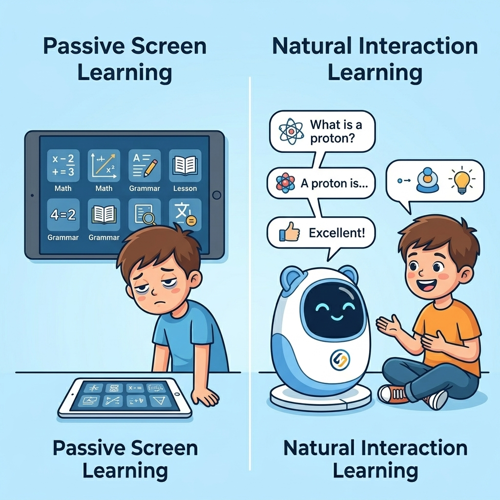
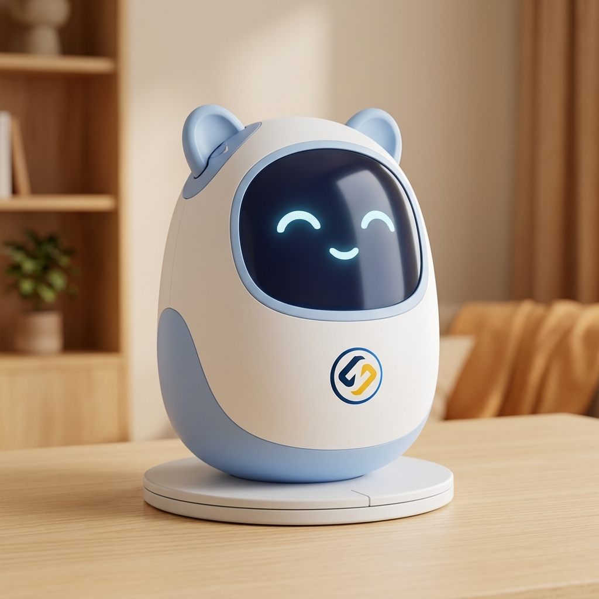
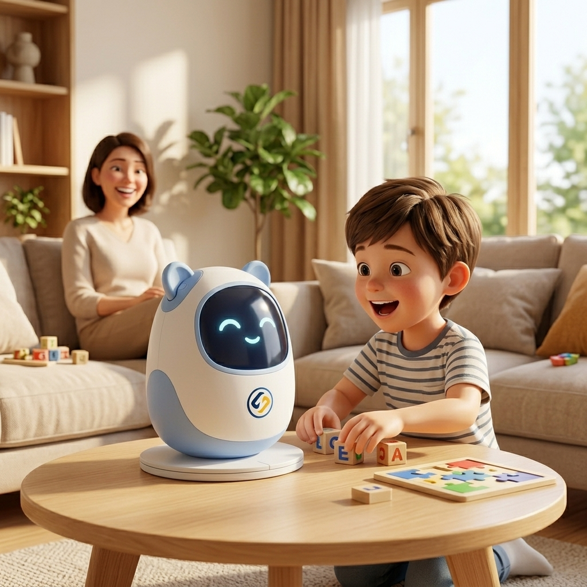
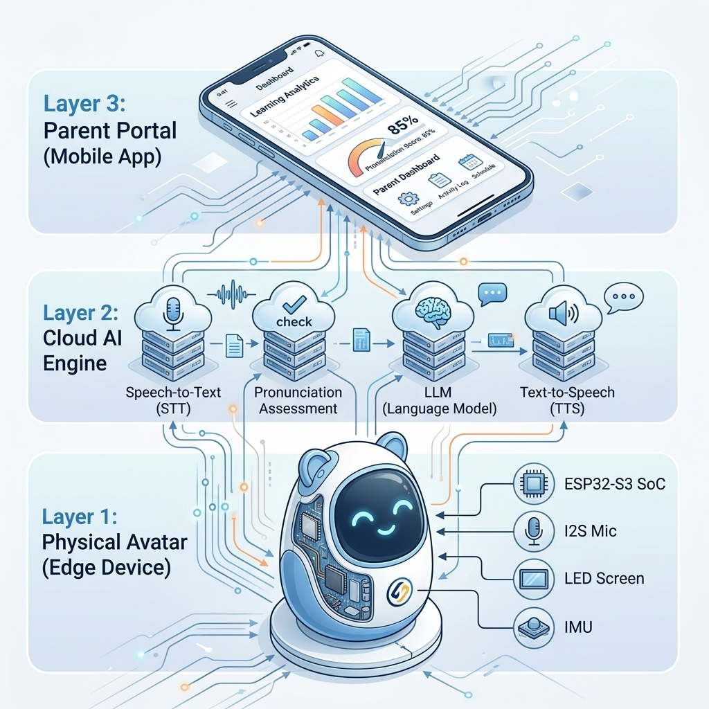
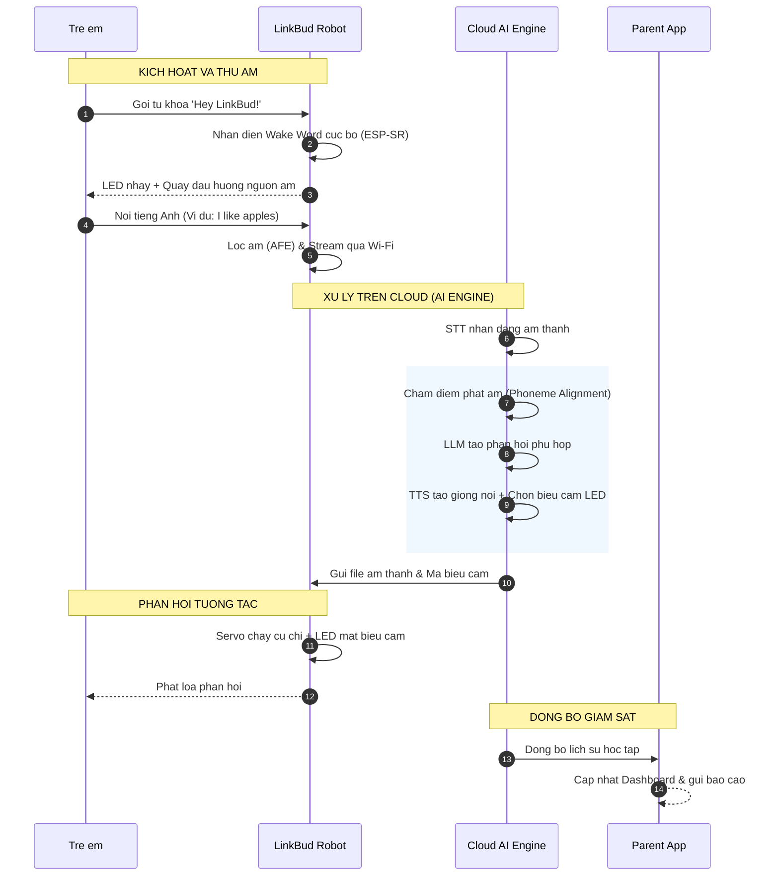
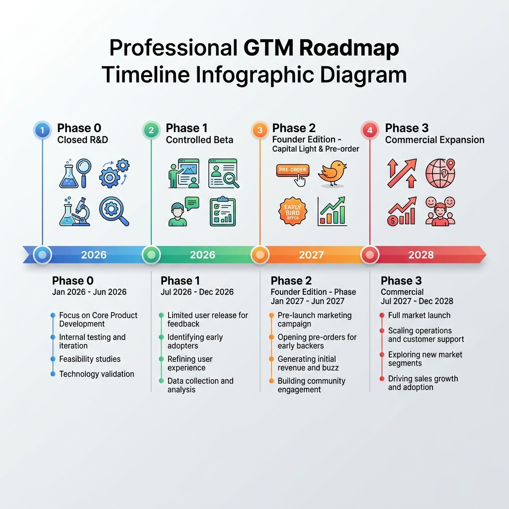

  <!-- Khối Metadata -->
  

    
Business Model & Strategic Concept

    

      

        Project Name:LinkBud (AI Companion Robot)
      

      

        Project Sponsor:Le Duc Anh
      

      

        Status:Concept Exploration
      

    

  
<!-- QUAN TRỌNG: KHÔNG ĐỂ KHOẢNG TRẮNG Ở ĐÂY -->

    <!-- Khối Branding Badge -->
    

      
      

        

          LINK STRATEGY
        

        
AI ROBOTICS DIVISION

      

    

  

# DỰ ÁN: AI ENGLISH COMPANION ROBOT (LINKBUD)

BUSINESS MODEL & STRATEGIC CONCEPT (V0.1)

---

## 1. TẦM NHÌN CHIẾN LƯỢC & BÀI TOÁN THỊ TRƯỜNG (VISION & MARKET NEED)

Dự án **AI English Companion Robot (LinkBud)** hướng đến xây dựng một nền tảng học tiếng Anh tương tác toàn diện dành cho trẻ em. Sản phẩm là sự kết hợp tối ưu giữa thiết bị robot vật lý (Physical Avatar), AI giao tiếp tự nhiên tích hợp chỉnh sửa phát âm thời gian thực, và ứng dụng giám sát tiến trình dành cho phụ huynh.

> **Triết lý cốt lõi:** Phát triển một **người bạn đồng hành vật lý** sinh động giúp trẻ xây dựng thói quen giao tiếp tiếng Anh tự nhiên hàng ngày tại gia đình.

### Bài toán thị trường & Nỗi đau cốt lõi (Market Need & Core Problem)

Hầu hết trẻ em tại Việt Nam học tiếng Anh nhiều năm vẫn gặp khó khăn khi giao tiếp tự tin do thiếu môi trường thực hành, thiếu cơ chế phản hồi sửa lỗi tức thì, và nhanh chán khi học qua màn hình thụ động.

> **Nỗi đau cốt lõi (Pain Point):** Nhu cầu thực tế không nằm ở việc thiếu học liệu, mà là **thiếu một môi trường tương tác thực tế bền bỉ và cơ chế giúp trẻ duy trì thói quen luyện nói hàng ngày.**

---

## 2. MÔ TẢ & ĐỊNH VỊ SẢN PHẨM (PRODUCT DESCRIPTION & POSITIONING)

Giải pháp của LinkBud dịch chuyển mô hình học tập từ thụ động qua màn hình sang tương tác tự nhiên thông qua người bạn vật lý:

Trong mô hình này:

* **Robot** đóng vai trò là một người bạn, người đồng hành tạo ra sự tương tác vật lý thân thiện và gần gũi.
* **AI Engine** đóng vai trò là một giáo viên thông minh, liên tục đánh giá, cá nhân hóa nội dung và dẫn dắt bài học một cách tự nhiên mà không gây áp lực cho trẻ.
* **Định vị cốt lõi (AI Learning Companion):** Một thiết bị hỗ trợ học tập có nhân cách, có cảm xúc và tương tác thông minh; không phải là robot công nghiệp đắt đỏ, đồ chơi giải trí đơn thuần, hay chỉ là giao diện ChatGPT được tích hợp vào vỏ bọc nhựa.

### a. Phác thảo Thiết kế & Ngoại quan (Physical Design & Form Factor)

* **Thiết kế liền khối, không cổ:** Thân robot có hình dáng dạng kén hoặc quả trứng tròn trịa, tối giản và siêu bền bỉ, loại bỏ hoàn toàn phần cổ cơ khí dễ bị tổn thương khi rơi rớt.
* **Cấu trúc đặt cố định, xoay toàn thân (đế xoay 360°):** Không sử dụng bánh xe di chuyển để tránh việc trẻ đẩy robot rơi khỏi bàn. Thay vào đó, toàn bộ thân robot đặt trên một đế xoay phẳng vững chãi, cho phép robot tự xoay 360 độ về phía người nói.
* **Kích thước nhỏ gọn:** Cao khoảng 18cm, rộng 12cm, nặng ~450g; vừa vặn để trẻ ôm bằng hai tay hoặc đặt trên bàn học, tủ đầu giường.
* **Thiết kế nhân vật & Tai biểu cảm (Character Design):** Sinh vật nhỏ đáng yêu có hai chiếc tai silicon mềm ở phía trên đầu, có tích hợp động cơ servo siêu êm để vẫy tai/vểnh tai biểu cảm.
* **Chất liệu an toàn tuyệt đối:** Nhựa ABS cấp thực phẩm (Food-grade ABS) phủ một lớp mịn chống bám vân tay, các góc cạnh được bo tròn hoàn toàn để chống va đập và an toàn khi trẻ ôm ấp.

### b. Kịch bản Tương tác Đa giác quan (Interaction Model)

* **Kích hoạt tự nhiên (Wake-up):** Trẻ chỉ cần gọi *"Hey LinkBud!"*. Robot lập tức xoay nhẹ toàn bộ thân trên đế xoay về hướng phát âm (nhờ thuật toán định hướng nguồn âm Beamforming của cụm 2 micro kỹ thuật số) và hiển thị đôi mắt LED chớp nhẹ biểu thị sự lắng nghe.
* **Đồng bộ biểu cảm cơ - điện tử (Physical-LED Synchronization):**
  * *Lắng nghe:* Tai hơi vểnh lên, mắt LED hiển thị dạng sóng âm dao động nhẹ.
  * *Suy nghĩ:* Thân hơi lắc nhẹ lưỡng lự sang hai bên, mắt LED hiển thị chuyển động xoay tròn hoặc dấu hỏi nhỏ.
  * *Hào hứng (khi trẻ phát âm đúng/trả lời hay):* Tai vẫy nhanh liên tục, thân xoay nhẹ vui sướng, mắt LED chuyển thành hình trái tim hoặc mặt cười tít.
* **Tương tác vật lý (Physical Touch):** Tích hợp cảm biến gia tốc IMU để nhận biết khi bị trẻ nhấc bổng lên, nghiêng ngửa hoặc lắc nhẹ, từ đó kích hoạt các câu thoại tinh nghịch như: *"Whoa, I'm flying!"* hoặc *"A bit dizzy here, buddy!"*.

### c. Phương pháp Giáo dục Phản xạ (Pedagogical Framework)

* **Gamified Role-play (Nhập vai trò chơi):** AI dẫn dắt trẻ vào các chuyến phiêu lưu giả tưởng (ví dụ: làm phi hành gia thám hiểm vũ trụ, làm đầu bếp gọi món ăn). Trẻ học tiếng Anh bằng cách đưa ra các quyết định trong trò chơi thông qua hội thoại.
* **Sửa lỗi không phán xét (Positive Reinforcement):** Thay vì nói *"Wrong"* hoặc sửa lỗi ngữ pháp một cách máy móc, LinkBud sẽ lặp lại câu nói của trẻ một cách chính xác trong câu trả lời tiếp theo hoặc hướng dẫn nhẹ nhàng: *"I think you mean 'apples', right? Let's say it together: ap-ples!"*.
* **Cá nhân hóa theo nhịp độ (Adaptive Pacing):** Thuật toán tự động điều chỉnh tốc độ nói của robot (TTS) chậm lại nếu phát hiện trẻ hay ngập ngừng, đồng thời chuyển đổi từ vựng sang mức đơn giản hơn nếu trẻ gặp khó khăn.

---

## 3. PHÂN KHÚC KHÁCH HÀNG & ĐỊNH VỊ GIÁ TRỊ (TARGET MARKET & VALUE PROPOSITION)

### a. Chân dung Khách hàng (User & Buyer Personas)

| Đặc điểm                    | Buyer Persona: Chị Mai Vy (Mẹ - 32 tuổi)                                                                          | User Persona: Bé Gia Minh (Con - 6 tuổi)                                                                            |
| :------------------------------ | :------------------------------------------------------------------------------------------------------------------- | :-------------------------------------------------------------------------------------------------------------------- |
| **Vai trò & Bối cảnh** | Trưởng nhóm Marketing bận rộn; thu nhập khá (25-35M/tháng); không đủ thời gian & tự tin tự kèm con.   | Học sinh lớp 1; tò mò, hiếu động; thích đồ chơi thông minh và trò chơi nhập vai.                      |
| **Nỗi đau & Rào cản** | Gia sư bản xứ quá đắt; con nhanh chán học qua ứng dụng iPad thụ động và thiếu tương tác cảm xúc. | Áp lực học giáo trình khô khan; sợ phát âm sai bị phán xét hoặc người lớn la mắng.                   |
| **Mục tiêu mong đợi** | Con tự giác luyện nói 15-20 phút/ngày tại nhà hiệu quả, phát âm chuẩn với chi phí hợp lý.           | Có "người bạn" cùng chơi và hội thoại tự nhiên về chủ đề yêu thích không bị áp lực chấm điểm. |

### b. Định vị Giá trị (Value Proposition)

* **Đối với trẻ em:** Mang lại một người bạn học cùng không áp lực, học thông qua các cuộc trò chuyện tự nhiên và trò chơi tương tác sinh động.
* **Đối với phụ huynh:** Cung cấp giải pháp tối ưu hóa thời gian luyện nói của con với chi phí hợp lý hơn nhiều so với việc thuê gia sư, đồng thời dễ dàng đo lường sự tiến bộ của con qua hệ thống báo cáo chi tiết.
* **Đối với các đối tác giáo dục (Trung tâm/Trường học):** Là công cụ marketing độc đáo giúp nâng cao trải nghiệm học viên và gia tăng tỷ lệ tái đăng ký học (retention rate).

## 4. KIẾN TRÚC SẢN PHẨM & LUỒNG NGHIỆP VỤ

Kiến trúc sản phẩm LinkBud được thiết kế theo mô hình **Edge-Cloud Hybrid** gồm 3 tầng tích hợp chặt chẽ, tối ưu hóa giữa khả năng tương tác tức thời ở biên (Edge) và sức mạnh xử lý trí tuệ nhân tạo trên đám mây (Cloud):

### a. Các Tầng Kiến Trúc (Architecture Layers)

* **Layer 1 — Physical Avatar (Edge / Thiết bị):** SoC ESP32-S3, cụm 2 Micro Beamforming, IC Amp & Loa 3W, ma trận LED biểu cảm, IMU, motor servo vẫy tai. Đóng vai trò nhận diện wake-word, lọc nhiễu, truyền nhận luồng âm thanh thời gian thực và thực thi các phản hồi vật lý.
* **Layer 2 — Learning & AI Engine (Cloud / Trí tuệ nhân tạo):** Tích hợp dịch vụ STT, chấm điểm phát âm âm vị, LLM thích ứng thông minh và công nghệ TTS giọng nói trẻ em tự nhiên. Đóng vai trò làm bộ não xử lý hội thoại và cá nhân hóa lộ trình học tập.
* **Layer 3 — Parent Portal (App / Giám sát):** Database đồng bộ, Mobile App (iOS/Android) và hệ thống notification. Đóng vai trò cung cấp dashboard kết quả học tập trực quan, lưu trữ các file ghi âm của con và gợi ý bài học đồng hành cho bố mẹ.

### b. Sơ đồ Luồng Nghiệp Vụ Hội Thoại & Học Tập (Business Flow Diagram)

Quy trình tương tác khép kín từ khi trẻ gọi Robot cho đến khi phụ huynh nhận báo cáo tiến độ được mô tả qua sơ đồ dưới đây:

## 5. CÁC TÍNH NĂNG CHÍNH (KEY FEATURES)

Hệ thống LinkBud tích hợp đồng bộ giữa 4 nhóm tính năng cốt lõi để tối ưu trải nghiệm và kiểm soát chi phí:

### a. Tính năng Cơ khí (Mechanical Features)

* **Vỏ bọc an toàn:** Nhựa ABS cấp thực phẩm, bo tròn chống va đập, an toàn tuyệt đối khi trẻ ôm.
* **Chuyển động sinh động:** Đế xoay 360 độ hướng về phía trẻ và tai silicon vẫy biểu cảm linh hoạt.
* **Servo siêu êm:** Động cơ giảm âm cao cấp, chuyển động mượt mà không gây tiếng ồn ảnh hưởng micro.
* **Khớp giảm chấn:** Cấu trúc treo bên trong bảo vệ bo mạch khi rơi ở độ cao dưới 1.2m.

### b. Tính năng Biên (Edge/Embedded Features)

* **Xử lý âm thanh:** Lọc nhiễu và định hướng nguồn âm (Beamforming) trực tiếp trên ESP32-S3.
* **Kích hoạt nhanh:** Thuật toán nhận diện Wake Word cục bộ tức thì với điện năng cực thấp.
* **LED cảm xúc:** Đồng bộ trạng thái biểu cảm (vui, buồn, tò mò) lên ma trận LED theo thời gian thực.
* **Cảm biến IMU:** Nhận biết hành động nhấc, nghiêng, lắc để phản hồi các câu thoại tinh nghịch.
* **Cập nhật OTA:** Cơ chế tự động cập nhật firmware an toàn qua Wi-Fi khi sạc pin ban đêm.

### c. Tính năng Cloud (Cloud & AI Features)

* **LLM thích ứng:** Động cơ hội thoại tự điều chỉnh độ khó từ vựng/ngữ pháp theo trình độ của trẻ.
* **TTS thân thiện:** Giọng đọc AI tự nhiên, ấm áp, gần gũi như bạn bè cùng trang lứa.
* **Đánh giá phát âm:** Phân tích âm vị và sửa lỗi phát âm tức thì cho trẻ.
* **Content Guardrails:** Bộ lọc tự động ngăn chặn nội dung không phù hợp lứa tuổi.

### d. Tính năng Giám sát (Monitoring & Parent Portal)

* **Parent Dashboard:** Mobile App theo dõi thời lượng học, từ vựng tích lũy và điểm số phát âm.
* **Audio Memories:** Gửi ghi âm hội thoại thú vị của con về app phụ huynh.
* **Gợi ý đồng hành:** Đề xuất chủ đề giao tiếp thực tế hàng ngày để bố mẹ luyện tập cùng con.
* **Báo cáo định kỳ:** Báo cáo tuần về tiến độ và lộ trình học tập của trẻ.

## 6. MÔ HÌNH KINH DOANH & PHÂN TÍCH TÀI CHÍNH (BUSINESS MODEL & FINANCIALS)

Để đảm bảo sức khỏe tài chính và sự bền vững của dự án, mô hình kinh doanh được đa dạng hóa qua 4 nguồn doanh thu kết hợp cấu trúc quản trị chi phí chặt chẽ:

### a. Các Dòng Doanh Thu (Revenue Streams)

* **Dòng doanh thu 1 — Bán thiết bị phần cứng (Hardware Sales):** Đặt mục tiêu có biên lợi nhuận gộp rõ ràng ngay từ đầu.
  * *COGS sản xuất thực tế:* ~600.000 VNĐ (sử dụng in 3D vỏ nhựa PETG và dán bo mạch PCBA tự động).
  * *Giá bán lẻ mục tiêu:* **2.500.000 VNĐ**.
  * *Chiến lược:* Tuyệt đối không bán lỗ phần cứng để lấy người dùng nhằm bảo vệ dòng tiền hoạt động ban đầu.
* **Dòng doanh thu 2 — Thuê bao định kỳ (Software Subscription):** Thu phí dịch vụ AI nâng cao gồm: thư viện bài học cập nhật liên tục, phân tích phát âm chuyên sâu hàng ngày và hệ thống dashboard chi tiết gửi phụ huynh (Tặng kèm Giftcode 1 tháng dịch vụ khi mua máy, bắt đầu thu phí từ tháng thứ 2).
  * *Mức phí dự kiến:* **79.000 VNĐ / tháng** (hoặc gói **790.000 VNĐ / năm**).
* **Dòng doanh thu 3 — Gói trường học (School/Center Package):** Bán trọn gói thiết bị số lượng lớn kèm tài khoản quản lý lớp học (Dashboard dành cho giáo viên và giáo trình tương thích).
* **Dòng doanh thu 4 — Nền tảng Robot OEM (OEM Robot Platform):** Bán/cho thuê giải pháp phần cứng & firmware đã tối ưu cho đối tác thiết kế robot chuyên dụng (robot lễ tân, hỗ trợ showroom, chăm sóc khách hàng).

### b. Dự Toán Khoản Đầu Tư Ban Đầu (CapEx Estimation)

Dự toán CapEx tối thiểu cho giai đoạn R&D và sản xuất thử nghiệm quy mô nhỏ (100 - 500 robot) mà không cần làm khuôn ép nhựa (Zero-Mold Strategy):

| Khoản Mục Đầu Tư                               | Chi Tiết Kỹ Thuật / Số Lượng                                                                      | Thành Tiền (VNĐ)  |
| :-------------------------------------------------- | :------------------------------------------------------------------------------------------------------ | :------------------- |
| **Máy in 3D FDM CoreXY**                     | 02x Máy Bambu Lab P1S Combo AMS (Để chạy song song dự phòng và đảm bảo tiến độ in 500 vỏ) | 44.000.000           |
| **Thiết kế & Mạch mẫu (PCB Prototyping)** | Thiết kế Gerber, gia công PCB & SMT mẫu (3 đợt kiểm thử)                                        | 15.000.000           |
| **Linh kiện & Thiết bị R&D**               | Mua chip thử nghiệm, module cảm biến, thiết bị đo kiểm R&D                                      | 10.000.000           |
| **Chứng nhận & Đo kiểm điện từ**       | Test cơ bản về tương thích điện từ và an toàn pin                                            | 5.000.000            |
| **TỔNG CỘNG CAPEX**                         |                                                                                                         | **74.000.000** |

*Khấu hao CapEx phân bổ trên 500 sản phẩm Founder Edition đầu tiên: **~148.000 VNĐ / thiết bị**.*

### c. Dự Toán Chi Phí Vận Hành (OpEx & Cost-per-User)

Chi phí biến đổi quan trọng nhất là chi phí dịch vụ Cloud & API AI tính trên một người dùng hoạt động hàng tháng (Monthly Active User - MAU). Giả định một trẻ tương tác trung bình **10 phút/ngày (~300 phút/tháng)**:

| Dịch Vụ API                            | Nhà Cung Cấp / Công Nghệ          | Chi Phí Gốc (VNĐ/Tháng) | Giải Pháp Tối Ưu Chi Phí                                                   |
| :--------------------------------------- | :------------------------------------ | :-------------------------- | :------------------------------------------------------------------------------ |
| **Speech-to-Text (STT)**           | OpenAI Whisper API                    | ~45.000                     | Tự host mô hình Whisper-Small trên VPS riêng khi đạt quy mô lớn.       |
| **LLM Engine (Hội thoại)**       | GPT-4o-mini                           | ~12.500                     | Sử dụng cache prompt, dùng DeepSeek API hoặc LLama-3-8B tự host.           |
| **Text-to-Speech (TTS)**           | Google Cloud / Azure TTS              | ~20.000                     | Chuyển sang dùng các engine TTS mã nguồn mở đã tinh chỉnh giọng nói. |
| **Pronunciation Assessment**       | Speechace API                         | ~37.500                     | Tích hợp thuật toán so khớp âm thanh cục bộ hoặc API gói lớn.        |
| **Hạ tầng WebSocket/Core Cloud** | Server realtime kết nối âm thanh   | ~5.000                      | Tối ưu hóa giao thức truyền tải tối giản.                               |
| **TỔNG OPEX / MAU**               | **Chi phí API chưa tối ưu** | **~120.000**          | **Chi phí sau tối ưu: ~40.000 VNĐ / MAU / tháng**                    |

> [!WARNING]
> Nếu chi phí API không được tối ưu xuống mức **~40.000 VNĐ / tháng**, mức phí thuê bao **79.000 VNĐ / tháng** sẽ không đủ bù đắp chi phí vận hành Cloud. Việc tối ưu hóa mô hình AI (sử dụng cache, giới hạn quota nói 10 phút/ngày và tự host mô hình mã nguồn mở) là **điều kiện bắt buộc** để dự án có lãi.

### d. Dự Kiến Doanh Thu & Biên Lợi Nhuận Thực Tế (Baseline: Bán 500 thiết bị Founder Edition trong 1 năm)

Trong thực tế, lô hàng 500 sản phẩm đầu tiên (Founder Edition) của một dự án phần cứng tích hợp phần mềm đòi hỏi quản trị tài chính chặt chẽ do quy mô sản xuất nhỏ (COGS cao), chi phí tìm kiếm khách hàng ban đầu lớn (CAC cao), tỷ lệ lỗi bảo hành và chi phí vận hành của đội ngũ sáng lập. Để duy trì biên lợi nhuận ròng ở mức an toàn 25%, giá bán lẻ phần cứng được xác định là **2.500.000 VNĐ**.

**Giả định thực tế cho Lô 500 thiết bị:**

* **Vốn chủ sở hữu đầu tư ban đầu (Equity):** **100.000.000 VNĐ** (bao gồm 74M CapEx thiết bị/R&D và 26M vốn lưu động dự phòng). Vốn lưu động sản xuất còn lại được bù đắp trực tiếp thông qua dòng tiền trả trước từ khách hàng (Pre-order).
* **Tặng kèm Giftcode miễn phí 1 tháng** dịch vụ đi kèm khi mua máy. Từ tháng thứ 2, tỷ lệ chuyển đổi thuê bao trả phí thực tế đạt **50%** (tương đương 250 users hoạt động có phí).
* Thời gian duy trì thuê bao trả phí trung bình trong năm đầu đạt **4 tháng / user**.
* **COGS thực tế đợt đầu:** **750.000 VNĐ / thiết bị** (do chi phí in 3D thủ công, hoàn thiện bề mặt và lắp ráp thủ công tốn nhân công, cùng với linh kiện nhập lô nhỏ giá cao).
* **CAC thực tế (Chi phí Ads, Reviewer, KOC):** **400.000 VNĐ / khách hàng mua máy** (sản phẩm mới chưa có độ nhận diện thương hiệu).
* **Tỷ lệ bảo hành lỗi phần cứng/đổi trả:** **5%** (do lắp ráp thủ công đợt đầu).
* **Chi phí nhân sự & vận hành tối thiểu:** **150.000 VNĐ / máy** (chi phí hỗ trợ kỹ thuật, đóng gói, khấu hao vận hành nhóm phát triển).

**Phân Tích Dòng Tiền Lô Đầu Tiên:**

| Hạng Mục                                            | Công Thức / Chi Tiết Tính Toán            | Số Tiền (VNĐ)        |
| :---------------------------------------------------- | :--------------------------------------------- | :---------------------- |
| **I. DOANH THU**                                |                                                |                         |
| 1. Doanh thu Phần cứng                              | 500 thiết bị × 2.500.000 VNĐ               | 1.250.000.000           |
| 2. Doanh thu Thuê bao                                | 250 users × 79.000 VNĐ × 4 tháng           | 79.000.000              |
| **TỔNG DOANH THU THỰC TẾ (TR)**              | **Doanh thu phần cứng + Thuê bao**    | **1.329.000.000** |
|                                                       |                                                |                         |
| **II. CHI PHÍ**                                |                                                |                         |
| 1. Chi phí sản xuất trực tiếp (COGS)             | 500 × 750.000 VNĐ                            | 375.000.000             |
| 2. Chi phí Marketing (CAC)                           | 500 × 400.000 VNĐ                            | 200.000.000             |
| 3. Khấu hao đầu tư ban đầu (CapEx)              | Khấu hao toàn bộ cho lô đầu              | 74.000.000              |
| 4. Chi phí Vận hành API Cloud                      | 1.500 user-tháng × 40.000 VNĐ               | 60.000.000              |
| 5. Đóng gói, Vận chuyển & Phí Cổng thanh toán | 500 × 80.000 VNĐ + 3% Tổng doanh thu        | 79.870.000              |
| 6. Chi phí Bảo hành & Đổi trả (5% lỗi)         | 25 thiết bị × 750.000 VNĐ                  | 18.750.000              |
| 7. Chi phí Nhân sự & Core Team (1 năm)            | Chi phí cố định tối thiểu duy trì nhóm | 150.000.000             |
| **TỔNG CHI PHÍ THỰC TẾ (TC)**               | **Tổng các khoản chi phí trên**     | **997.620.000**   |
|                                                       |                                                |                         |
| **III. CHỈ SỐ HIỆU QUẢ**                    |                                                |                         |
| 1. Vốn đầu tư ban đầu (Equity)                  | Vốn chủ sở hữu tự có góp ban đầu      | 100.000.000             |
| 2. Lợi nhuận ròng dự kiến (Net Profit)           | TR - TC                                        | 309.402.000             |
| 3. Biên lợi nhuận ròng (Net Margin)               | Net Profit / TR                                | 25%                     |
| **4. TỶ SUẤT LỢI NHUẬN / VỐN (ROE)**       | **Net Profit / Equity**                  | **309%**          |

> [!NOTE]
> Mức giá 2.500.000 VNĐ đảm bảo dự án tự bù đắp được chi phí vận hành R&D và giữ biên lợi nhuận ròng an toàn 25% ngay từ đợt đầu. Khi chuyển sang Phase 3 (quy mô >3.000 thiết bị), biên lợi nhuận và hiệu quả sử dụng vốn sẽ tiếp tục tối ưu nhờ chuyển sang khuôn ép nhựa (COGS giảm về ~450.000 VNĐ) và tối ưu chi phí tiếp cận khách hàng (CAC giảm về ~150.000 VNĐ).

## 7. CHIẾN LƯỢC ĐƯA SẢN PHẨM RA THỊ TRƯỜNG (GO-TO-MARKET - GTM)

Lộ trình đưa sản phẩm ra thị trường theo 4 giai đoạn cuốn chiếu để kiểm soát tài chính và kỹ thuật:

* **Phase 0 — Closed R&D:** Thử nghiệm nội bộ, kiểm tra kỹ thuật và tối ưu hóa firmware/AI cùng đội ngũ phát triển.
* **Phase 1 — Controlled Beta:** Triển khai 10–20 gia đình thực tế để tinh chỉnh trải nghiệm người dùng và kiểm thử phần cứng.
* **Phase 2 — Founder Edition (Thương mại hóa nhẹ vốn / Capital-Light):**
  * *Mô hình:* Nhận đặt hàng trước (Pre-order) cọc 50-100% để tự tài trợ vốn lưu động.
  * *Sản xuất:* Chế tạo theo lô nhỏ (20 máy) bằng máy in 3D Bambu Lab P1S để tránh tồn kho.
  * *Marketing:* Xây dựng kênh content tự nhiên (TikTok/Reels) thu hút khách hàng sớm với chi phí tiếp cận tối ưu.
* **Phase 3 — Commercial Expansion:** Hợp tác phân phối diện rộng qua các trường học, trung tâm Anh ngữ và đối tác thiết bị giáo dục.

## 8. CHIẾN LƯỢC QUẢN TRỊ RỦI RO (RISK STRATEGY)

| Rủi ro                                                                        | Tác động | Giải pháp Giảm thiểu                                                                                                                                                                                                           |
| :----------------------------------------------------------------------------- | :---------- | :--------------------------------------------------------------------------------------------------------------------------------------------------------------------------------------------------------------------------------- |
| **Risk 1: Trẻ nhanh chán**                                             | Cao         | Áp dụng hệ thống Gamification chặt chẽ, nhiệm vụ hàng ngày (Daily Mission) và vòng lặp phần thưởng kích thích sự tò mò.                                                                                       |
| **Risk 2: Phụ huynh không thấy rõ hiệu quả**                       | Trung bình | Cung cấp Báo cáo tiến bộ định kỳ (Weekly Report) đi kèm bằng chứng cụ thể về đoạn hội thoại và phát âm của con qua Dashboard.                                                                               |
| **Risk 3: AI phản hồi không phù hợp với lứa tuổi**               | Cao         | Thiết lập hệ thống kiểm soát nội dung (Guardrails), giới hạn chủ đề (Whitelist Topics) và áp dụng các mô hình ngôn ngữ đã lọc dữ liệu an toàn cho trẻ em (Child-safe Models).                           |
| **Risk 4: Rủi ro pháp lý & bảo mật thông tin trẻ em**             | Cao         | Thực hiện thiết kế bảo mật ngay từ đầu (Privacy-by-design), tuân thủ kiểm soát truy cập nghiêm ngặt và luôn thu thập thỏa thuận đồng ý (Consent) từ phụ huynh trước khi xử lý dữ liệu giọng nói. |
| **Risk 5: Độ trễ phản hồi lớn (Latency)**                          | Cao         | Tối ưu hóa kiến trúc Hybrid (Wake Word và hiệu ứng LED xử lý local, API LLM/TTS được tinh gọn trên Cloud) kết hợp cấu trúc dữ liệu truyền tải tối giản.                                                   |
| **Risk 6: Nhận diện sai giọng trẻ em Việt phát âm chưa chuẩn**  | Trung bình | Tinh chỉnh (Fine-tuning) mô hình STT với tệp giọng nói của trẻ em bản địa từ sớm và ứng dụng Prompt Engineering hỗ trợ đối chiếu âm vị (Phoneme alignment) để chấm điểm chuẩn xác.                  |
| **Risk 7: Nghẽn cổ chai sản xuất in 3D khi đơn hàng tăng nhanh** | Trung bình | Chuyển giao file thiết kế sang các xưởng in 3D công nghiệp (Outsourcing SLA/MJF) hoặc các farm in 3D công suất lớn trong nước khi số lượng pre-order vượt quá công suất in văn phòng.                     |
| **Risk 8: Phụ huynh thiếu tin tưởng khi đặt hàng Pre-order**      | Cao         | Tập trung xây dựng cộng đồng phụ huynh đồng hành sớm, chia sẻ kết quả học tập và video thực hành thực tế của trẻ để tạo hiệu ứng truyền miệng tự nhiên (Social Proof).                             |
| **Risk 9: Khách hàng ngừng gia hạn thuê bao (SaaS Churn)**          | Thấp       | Giá bán phần cứng 2.500.000 VNĐ đã tích hợp sẵn biên lợi nhuận gộp phần cứng ~70% (COGS 750.000 VNĐ), đảm bảo thu hồi vốn và có lãi ròng ngay từ thời điểm bán đứt thiết bị.                    |

## 9. DỰ TOÁN BẢNG CHI TIẾT NGUYÊN VẬT LIỆU (BASIC BOM & COGS ESTIMATION)

Để đạt được mục tiêu COGS tối ưu trong khoảng **450.000 – 750.000 VNĐ / thiết bị** và giảm thiểu tối đa chi phí đầu tư khuôn ban đầu (CapEx), dự toán BOM cơ bản sử dụng phương pháp **in 3D thủ công** cho phần cứng được xây dựng cụ thể như sau:

| Nhóm Linh Kiện                       | Chi Tiết Linh Kiện                  | Mô Tả & Thông Số Kỹ Thuật                                                                        | Đơn Giá Dự Kiến (VNĐ)  |
| :------------------------------------- | :------------------------------------ | :----------------------------------------------------------------------------------------------------- | :--------------------------- |
| **Vi điều khiển / SoC**       | ESP32-S3-WROOM-1-N8R8                 | Dual-core, tích hợp Wi-Fi/BLE, 8MB Octal PSRAM để xử lý audio                                    | 60.000 – 80.000             |
| **Âm thanh (Audio)**            | Cụm 2 Micro kỹ thuật số I2S & Loa | 2x Micro I2S (MSM261S/INMP441) + Loa 3W 4Ω + IC Amp I2S MAX98357A                                     | 70.000 – 100.000            |
| **Hiển thị (Màn hình Face)** | Màn hình màu LCD IPS (SPI)         | Màn hình tròn GC9A01 (1.28") hoặc ST7789 (1.54"-2.0") hiển thị biểu cảm động LVGL mượt mà | 55.000 – 80.000             |
| **Cơ cấu chuyển động**      | Động cơ Servo & Trục khớp        | 2x Micro-servo giảm âm cao cấp (Pan/Tilt đầu, vẫy tai) + Trục truyền động                    | 65.000 – 105.000            |
| **Cảm biến (Sensors)**         | IMU 6-axis                            | Cảm biến gia tốc & góc quay MPU6050 để nhận diện tương tác vật lý                         | 15.000 – 25.000             |
| **Quản lý Nguồn**             | Pin & Mạch sạc bảo vệ             | Pin sạc Li-Po 2500mAh + IC quản lý nguồn sạc Type-C (TP4056/Boost converter)                      | 70.000 – 105.000            |
| **Vỏ & Cơ khí (In 3D)**       | Nhựa in 3D & Xử lý bề mặt        | Nhựa PLA/PETG/ABS in 3D FDM + công xử lý nguội bề mặt thủ công                                | 100.000 – 150.000           |
| **Gia công PCBA**               | PCB & SMT Assembly                    | Bo mạch PCB 2 lớp & chi phí dán linh kiện linh hoạt SMT                                          | 50.000 – 80.000             |
| **Đóng gói & Phụ kiện**     | Hộp giấy & Cáp sạc                | Hộp carton in offset + Khay chống sốc + Sách HDSD + Cáp sạc Type-C                               | 25.000 – 40.000             |
| **TỔNG CỘNG COGS**             |                                       | **Ước lượng chi phí sản xuất phần cứng cho mỗi thiết bị**                            | **510.000 – 765.000** |

  

    © 2026 <b style="color: #003366 !important;">Link Strategy</b>. All rights reserved. 
    <b>Version:</b> 1.0.0 | <b>Last Updated:</b> 08/06/2026
  
<!-- QUAN TRỌNG: KHÔNG ĐỂ KHOẢNG TRẮNG Ở ĐÂY -->

    

      

        
LINK STRATEGY

        
AI ROBOTICS

      

      
    

  

