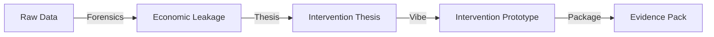

# LS Auditor: The Forensic Standard for Business Intervention

[](https://astral.sh/uv)
[](https://www.python.org/)
[](05_AUDITOR_CAPABILITY.md)

**LS Auditor** là môi trường thực thi chẩn đoán hệ thống chuyên dụng. Chúng tôi chuyển hóa dữ liệu hỗn độn thành bằng chứng kinh tế không thể chối cãi, thiết lập nền tảng cho các quyết định can thiệp hệ thống có tính cam kết (ROI-driven).

---

## ⚡ Core Capabilities

Hệ thống cung cấp 6 năng lực tác chiến được chuẩn hóa cho Auditor:

- **AI Forensic Engine**: Truy vấn trực tiếp SQL, JSON, Log. Tự động "Hardening" dữ liệu thô thành đặc tả kỹ thuật.
- **Tactical Intelligence**: Benchmark vận hành doanh nghiệp so với tiêu chuẩn ngành. Định chuẩn mức độ lãng phí thực tế.
- **Economic Leakage Analysis**: Phân tích Business Data để chỉ điểm chính xác các lỗ hổng dòng tiền và quy trình.
- **Architecture Recovery**: Đọc hiểu và phục hồi kiến trúc hệ thống cũ, tối ưu hóa tài sản hiện có thay vì tái đầu tư lãng phí.
- **Vibe Prototyping**: Phát triển nhanh các mẫu giải pháp can thiệp để xác thực hiệu quả và tạo tính khẩn cấp (Urgency).
- **Pain-Led Marketing**: Chuyển hóa tri thức Audit thành công cụ tiếp thị trực tiếp (Direct Marketing) và thu hút khách hàng tiềm năng thông qua nội dung chẩn đoán chuyên sâu.

---

## 🛠 Quick Start

Thiết lập môi trường làm việc trong chưa đầy 60 giây:

```powershell
# 1. Cài đặt quản trị uv
powershell -ExecutionPolicy ByPass -c "irm https://astral.sh/uv/install.ps1 | iex"

# 2. Khởi tạo Workspace
uv sync

# 3. Kiểm tra registry
uv run ls-auditor registry inspect

# 4. Khởi tạo case Material Planning
uv run ls-auditor init-case --case-id material-planning --template material-planning
```

---

## 🧰 CLI Assistant Commands

Production MVP cung cấp các command chuẩn JSON để Agent và Auditor phối hợp:

```powershell
uv run ls-auditor validate --input <file> --schema <schema.json> --out <validation.json>
uv run ls-auditor normalize --input <file> --spec <normalize.json> --out <normalized.parquet>
uv run ls-auditor join --spec <join.json> --out <unified.parquet>
uv run ls-auditor compute --dataset <unified.parquet> --metric-spec <metric.json> --out <leakage.json>
uv run ls-auditor rule-test --dataset <unified.parquet> --rules <rules.json> --out <rule_test.json>
uv run ls-auditor trace --finding <finding.json> --out-dir <Evidence_Packs>
uv run ls-auditor inspect-parquet --input <unified.parquet>
uv run ls-auditor chart --dataset <unified.parquet> --out <chart.md>
uv run ls-auditor assemble-report --case-dir <case_dir> --out <FINAL_AUDIT_REPORT.md>
```

Mọi command trả JSON qua `stdout`; log/cảnh báo kỹ thuật đi qua `stderr`.

---

## 📊 Operational Flow



---

## 📂 Output Structure (Evidence Pack)

Hệ thống đảm bảo mọi phát hiện đều được đóng gói theo tiêu chuẩn chuyên nghiệp:

```text
Evidence_Pack_ID/
├── artifacts/
│   ├── raw_data_extract.csv      # Dấu vết dữ liệu gốc
│   ├── anomaly_report.json       # Phân tích sai lệch
│   └── visual_process.mmd        # Sơ đồ quy trình thực tế
├── FINDING.md                    # Mô tả sai lệch & Giá trị thiệt hại
└── INTERVENTION_THESIS.md        # Luận đề can thiệp & ROI dự kiến
```

Case workspace mặc định:

```text
Projects/<case_id>/
├── raw/
├── working/
│   └── templates/
├── artifacts/
├── Evidence_Packs/
└── FINAL_AUDIT_REPORT.md
```

---

## ⚖️ Standards

- **Evidence Discipline**: Không có bằng chứng, không có kết luận.
- **Pain Sensitivity**: Ưu tiên các lỗi hệ thống gây thiệt hại kinh tế trực tiếp.
- **Generic Excellence**: Xây dựng giải pháp có khả năng nhân rộng.

---
*© 2026 Link Strategy - The Sovereign Standard for Business Clarity*
