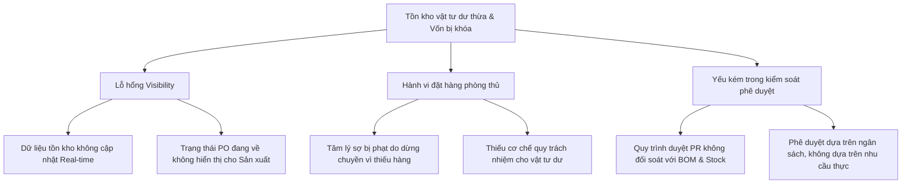

# CASE STUDY: Material Planning & Inventory Governance Audit

**Chủ đề:** Từ Kế hoạch Sản xuất đến Tồn kho chết - Chẩn đoán hành vi "Order phòng thủ" và rò rỉ vốn lưu động.

---

## I. Tóm lược bối cảnh (Executive Summary)

Trong các nhà máy sản xuất, tồn kho dư thừa thường không đến từ những sai sót mua hàng đơn lẻ, mà là kết quả của một **Lỗi hệ thống (Systemic Failure)**. Khi kế hoạch sản xuất, dữ liệu tồn kho và quy trình mua hàng không được đồng bộ hóa theo thời gian thực, các bộ phận sản xuất sẽ hình thành tâm lý "tự bảo vệ" bằng cách đặt hàng dư thừa để tránh rủi ro thiếu hụt vật tư.

**Hậu quả:**
- Khóa vốn lưu động trong tồn kho chết (Dead stock).
- Gia tăng rủi ro lỗi thời (Obsolete risk) và hư hỏng vật tư.
- Làm mờ trách nhiệm giải trình giữa Sản xuất - Mua hàng - Kho.

---

## II. Luận đề Audit (Audit Thesis)

> "Do sự đứt gãy thông tin giữa nhu cầu sản xuất thực tế và kế hoạch cung ứng, các phòng ban hình thành hành vi đặt hàng phòng vệ (Defensive Ordering). Hành vi này tạo ra lớp đệm tồn kho (Buffer) phi mã, gây rò rỉ kinh tế nghiêm trọng và làm suy yếu năng lực quản trị của nhà máy."

---

## III. Phương pháp luận chẩn đoán (Forensics Methodology)

Auditor thực hiện đối soát chéo 4 nhóm dữ liệu cốt lõi để nhận diện sai lệch:

### 1. Phân tích Hành vi đặt hàng (Ordering Behavior)
- **Câu hỏi chốt:** Có sự chênh lệch lớn giữa Lượng yêu cầu (Requested) và Lượng tiêu thụ thực tế (Actual Consumed) không?
- **Metric:** `Request-to-Consumption Ratio`. Tỷ lệ > 1.2x là dấu hiệu của hành vi tạo buffer.

### 2. Phân tích Tương quan Kế hoạch (Planning Alignment)
- **Câu hỏi chốt:** Mua hàng dựa trên Kế hoạch sản xuất (Production Plan) hay dựa trên Request thủ công của các bộ phận?
- **Metric:** `Plan Adherence Score`. Đo lường mức độ khớp lệnh giữa BOM Requirement và PO thực tế.

### 3. Chẩn đoán Tồn kho chết (Inventory Aging)
- **Câu hỏi chốt:** Vật tư nào vẫn được mua thêm dù lượng tồn kho hiện tại đủ dùng cho > 90 ngày?
- **Metric:** `Days of Inventory on Hand (DIOH)`. Cảnh báo đỏ cho các mã hàng có DIOH vượt ngưỡng chính sách.

---

## IV. Cây nguyên nhân gốc rễ (Root Cause Tree)

---

## V. Lộ trình can thiệp (Intervention Roadmap)

Sau khi Audit phát hiện rò rỉ, Auditor đề xuất lộ trình can thiệp 30-60-90 ngày:

### 1. Giai đoạn 30 ngày: Thiết lập Clarity
- Triển khai Dashboard tồn kho dư và hàng chậm luân chuyển.
- **Action:** Đóng băng (Freeze) các yêu cầu mua mới đối với vật tư có DIOH > 90 ngày.
- **Artifact:** Báo cáo Exception định kỳ hàng tuần cho Ban Giám đốc.

### 2. Giai đoạn 60 ngày: Cải tiến Logic phê duyệt
- Tích hợp kiểm tra tồn kho tự động vào quy trình phê duyệt PR.
- **Action:** Bắt buộc giải trình đối với các yêu cầu vượt định mức BOM > 5%.
- **Artifact:** Hệ thống Approval Gate dựa trên dữ liệu thực tế.

### 3. Giai đoạn 90 ngày: Quản trị tự động (Governance)
- Chuyển đổi mô hình đặt hàng sang Demand-based Planning (Lập kế hoạch dựa trên nhu cầu).
- **Action:** Áp dụng cơ chế Min-Max và Reorder Point tự động cho các nhóm vật tư chiến lược.
- **Artifact:** Quy trình Material Governance Review hàng tháng.

---

## VI. Kết luận & Giá trị kinh doanh (ROI)

Case study này chứng minh năng lực của LS Auditor trong việc không chỉ tìm ra lỗi sai giao dịch, mà còn chẩn đoán được **bệnh lý vận hành** của doanh nghiệp. Kết quả can thiệp giúp giải phóng 15-30% vốn lưu động bị khóa trong kho và thiết lập kỷ luật quản trị mới cho nhà máy.

---
*Reference: [05_AUDITOR_CAPABILITY.md](../../../05_AUDITOR_CAPABILITY.md)*
