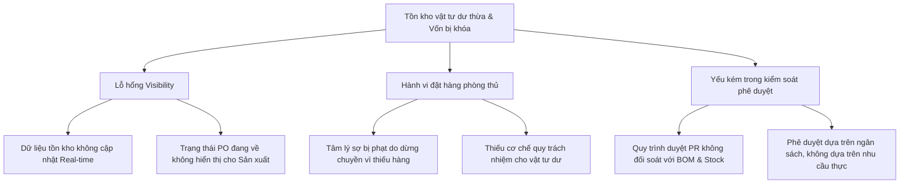

# CASE STUDY: Material Planning & Inventory Governance Audit

**Chủ đề:** Từ Kế hoạch Sản xuất đến Tồn kho chết - Chẩn đoán hành vi "Order phòng thủ" và rò rỉ vốn lưu động.

---

## I. Tóm lược bối cảnh (Executive Summary)

Trong các nhà máy sản xuất, tồn kho dư thừa thường không đến từ những sai sót mua hàng đơn lẻ, mà là kết quả của một **Lỗi hệ thống (Systemic Failure)**. Khi kế hoạch sản xuất, dữ liệu tồn kho và quy trình mua hàng không được đồng bộ hóa theo thời gian thực, các bộ phận sản xuất sẽ hình thành tâm lý "tự bảo vệ" bằng cách đặt hàng dư thừa để tránh rủi ro thiếu hụt vật tư.

**Hậu quả:**
- Khóa vốn lưu động trong tồn kho chết (Dead stock).
- Gia tăng rủi ro lỗi thời (Obsolete risk) và hư hỏng vật tư.
- Làm mờ trách nhiệm giải trình giữa Sản xuất - Mua hàng - Kho.

---

## II. Luận đề Audit (Audit Thesis)

> "Do sự đứt gãy thông tin giữa nhu cầu sản xuất thực tế và kế hoạch cung ứng, các phòng ban hình thành hành vi đặt hàng phòng vệ (Defensive Ordering). Hành vi này tạo ra lớp đệm tồn kho (Buffer) phi mã, gây rò rỉ kinh tế nghiêm trọng và làm suy yếu năng lực quản trị của nhà máy."

---

## III. Phương pháp luận chẩn đoán (Forensics Methodology)

Auditor thực hiện đối soát chéo 4 nhóm dữ liệu cốt lõi để nhận diện sai lệch:

### 1. Phân tích Hành vi đặt hàng (Ordering Behavior)
- **Câu hỏi chốt:** Có sự chênh lệch lớn giữa Lượng yêu cầu (Requested) và Lượng tiêu thụ thực tế (Actual Consumed) không?
- **Metric:** `Request-to-Consumption Ratio`. Tỷ lệ > 1.2x là dấu hiệu của hành vi tạo buffer.

### 2. Phân tích Tương quan Kế hoạch (Planning Alignment)
- **Câu hỏi chốt:** Mua hàng dựa trên Kế hoạch sản xuất (Production Plan) hay dựa trên Request thủ công của các bộ phận?
- **Metric:** `Plan Adherence Score`. Đo lường mức độ khớp lệnh giữa BOM Requirement và PO thực tế.

### 3. Chẩn đoán Tồn kho chết (Inventory Aging)
- **Câu hỏi chốt:** Vật tư nào vẫn được mua thêm dù lượng tồn kho hiện tại đủ dùng cho > 90 ngày?
- **Metric:** `Days of Inventory on Hand (DIOH)`. Cảnh báo đỏ cho các mã hàng có DIOH vượt ngưỡng chính sách.

---


## IV. Cây nguyên nhân gốc rễ (Root Cause Tree)



---

## V. Lộ trình can thiệp (Intervention Roadmap)

Sau khi Audit phát hiện rò rỉ, Auditor đề xuất lộ trình can thiệp 30-60-90 ngày:

### 1. Giai đoạn 30 ngày: Thiết lập Clarity
- Triển khai Dashboard tồn kho dư và hàng chậm luân chuyển.
- **Action:** Đóng băng (Freeze) các yêu cầu mua mới đối với vật tư có DIOH > 90 ngày.
- **Artifact:** Báo cáo Exception định kỳ hàng tuần cho Ban Giám đốc.

### 2. Giai đoạn 60 ngày: Cải tiến Logic phê duyệt
- Tích hợp kiểm tra tồn kho tự động vào quy trình phê duyệt PR.
- **Action:** Bắt buộc giải trình đối với các yêu cầu vượt định mức BOM > 5%.
- **Artifact:** Hệ thống Approval Gate dựa trên dữ liệu thực tế.

### 3. Giai đoạn 90 ngày: Quản trị tự động (Governance)
- Chuyển đổi mô hình đặt hàng sang Demand-based Planning (Lập kế hoạch dựa trên nhu cầu).
- **Action:** Áp dụng cơ chế Min-Max và Reorder Point tự động cho các nhóm vật tư chiến lược.
- **Artifact:** Quy trình Material Governance Review hàng tháng.

---

## VI. Kết luận & Giá trị kinh doanh (ROI)

Case study này chứng minh năng lực của LS Auditor trong việc không chỉ tìm ra lỗi sai giao dịch, mà còn chẩn đoán được **bệnh lý vận hành** của doanh nghiệp. Kết quả can thiệp giúp giải phóng 15-30% vốn lưu động bị khóa trong kho và thiết lập kỷ luật quản trị mới cho nhà máy.


## VII. Hướng dẫn thực hiện bài tập Audit

Trong bài này, bạn đóng vai **Auditor trainee**. Bạn không cần viết code. Việc của bạn là đọc hồ sơ, đặt yêu cầu rõ cho Antigravity, kiểm tra kết quả trả về và phản biện những kết luận chưa đủ bằng chứng.

### Bước 1: Mở case làm việc

Mở Antigravity trong workspace này và gửi yêu cầu:

**PROMPT**

> Hãy khởi tạo case audit `material-planning` từ folder `Training/handbook/material-planning`, sau đó chuẩn bị nơi lưu kết quả làm bài.

Sau khi gửi prompt, kiểm tra Antigravity có báo đã khởi tạo case `material-planning`. Nếu Antigravity hỏi có ghi đè kết quả cũ không, chọn không ghi đè trừ khi giảng viên yêu cầu.

### Bước 2: Hiểu hồ sơ đầu vào

Đọc các nguồn sau trong folder bài tập:

- `policies/`: quy trình chính thức, approval matrix, workaround.
- `interview/`: lời phỏng vấn và mâu thuẫn vận hành.
- `data/`: dữ liệu mô phỏng và data dictionary.
- `compliance/`: tiêu chí tham khảo nếu cần.

Trước khi gửi prompt, tự ghi nhanh 3 nghi vấn ban đầu: quy trình nào có thể bị bypass, dữ liệu nào có thể không đáng tin, bộ phận nào có động cơ đặt dư. Sau đó gửi prompt:

**PROMPT**

> Hãy chạy workflow `.agents/workflows/auditor/discovery_workflow.md` cho case Material Planning. Đối chiếu SOP, workaround và interview notes để lập bản đồ quy trình, điểm kiểm soát và mâu thuẫn vận hành.

Kết quả bạn cần kiểm tra:

- process map;
- bảng control points;
- danh sách điểm quy trình khác giữa SOP và thực tế;
- giả thuyết ban đầu về defensive ordering.

Nếu kết quả chỉ mô tả lại SOP mà không chỉ ra mâu thuẫn thực tế, yêu cầu Antigravity làm lại phần Discovery.

### Bước 3: Kiểm tra và chuẩn bị dữ liệu

Dữ liệu nằm trực tiếp trong:

```text
Training/handbook/material-planning/data/
```

Bảng cần dùng:

- `production_plan.csv`
- `bom.csv`
- `purchase_requests.csv`
- `purchase_orders.csv`
- `inventory_balance.csv`
- `material_consumption.csv`

Gửi prompt:

**PROMPT**

> Hãy chạy workflow `.agents/workflows/auditor/data_preparation_workflow.md` cho case Material Planning. Kiểm tra chất lượng dữ liệu trong folder `data/`, giải thích từng bảng bằng ngôn ngữ audit, kiểm tra key join và chuẩn bị bảng phân tích hợp nhất cho bài audit.

Kết quả bạn cần kiểm tra:

- log chất lượng dữ liệu;
- bảng phân tích hợp nhất;
- ghi chú các vấn đề dữ liệu có thể ảnh hưởng kết luận.

Nếu có lỗi dữ liệu, yêu cầu Antigravity nói rõ lỗi đó làm yếu kết luận nào.

### Bước 4: Tìm ngoại lệ và lượng hóa rò rỉ

Gửi prompt:

**PROMPT**

> Hãy chạy workflow `.agents/workflows/auditor/audit_execution_workflow.md` cho case Material Planning. Phân tích dữ liệu để tìm defensive ordering, over-purchase, dead stock risk, emergency buying và split PO. Lượng hóa leakage, nhưng chỉ gọi là candidate exception nếu chưa có bằng chứng đầy đủ.

Bắt buộc kiểm tra 6 câu hỏi:

1. PR nào request vượt nhu cầu BOM?
2. PO nào mua vượt PR hoặc vượt nhu cầu sản xuất?
3. Vật tư nào tồn kho trên 90 ngày nhưng vẫn được mua thêm?
4. PO urgent nào có giá cao hơn target price?
5. Có cụm PO nào bị chia nhỏ dưới ngưỡng phê duyệt không?
6. Vật tư nào được request nhiều nhưng tiêu thụ thực tế thấp?

Kết quả bạn cần kiểm tra:

- danh sách candidate exceptions;
- leakage analysis;
- risk register;
- ít nhất 3 finding đủ mạnh để đóng bằng chứng.

Không chấp nhận danh sách exception nếu thiếu `pr_id`, `po_id`, `plan_id` hoặc `material_id`.

### Bước 5: Đóng Evidence Pack

Chọn ít nhất 3 candidate exceptions quan trọng nhất. Với từng exception, gửi prompt riêng và thay `[finding_id]` bằng mã finding cụ thể:

**PROMPT**

> Hãy đóng Evidence Pack cho `[finding_id]` trong case Material Planning. Evidence Pack phải chỉ rõ giao dịch, dữ liệu nguồn, logic tính leakage, control bị lỗi và giới hạn của kết luận.

Mỗi Evidence Pack phải có:

- ID giao dịch liên quan (`pr_id`, `po_id`, `plan_id`, `material_id`);
- dữ liệu nguồn hoặc extract;
- cách tính leakage;
- mô tả control bị lỗi;
- giới hạn hoặc giả định của kết luận.

Không chấp nhận finding nếu không truy được về dòng dữ liệu nguồn. Nếu bằng chứng còn yếu, giữ ở mức nghi vấn và không đưa vào final report như finding xác nhận.

### Bước 6: Tổng hợp nguyên nhân và giải pháp

Gửi prompt:

**PROMPT**

> Hãy chạy workflow `.agents/workflows/auditor/solution_packaging_workflow.md` cho case Material Planning. Tổng hợp các exception thành nguyên nhân gốc rễ, sau đó đề xuất intervention thesis, solution proposal và lộ trình 30-60-90 ngày.

Bạn cần kiểm tra hệ thống có tổng hợp đúng các lỗi hệ thống không:

- ERP stock không đủ tin cậy nên planner đặt buffer.
- Approval routing yếu với PR nhỏ nhưng DIOH cao.
- Purchasing xử lý urgent qua email trước khi ERP hoàn chỉnh.
- Warehouse dùng bảng trắng/Zalo ngoài hệ thống.
- Finance review tồn kho quá muộn so với thời điểm PO được tạo.

Kết quả bạn cần kiểm tra:

- problem classification;
- intervention thesis;
- solution proposal;
- lộ trình 30-60-90 ngày.

Nếu phần nguyên nhân chỉ đổ lỗi cho cá nhân, yêu cầu Antigravity viết lại theo lỗi hệ thống và control gap.

### Bước 7: Tạo báo cáo cuối cùng

Gửi prompt:

**PROMPT**

> Hãy chạy workflow `.agents/workflows/auditor/final_report_workflow.md` cho case Material Planning. Tổng hợp toàn bộ kết quả thành final audit report. Báo cáo phải có executive summary, finding trọng yếu, evidence, root cause, recommendation và ROI hypothesis.

Báo cáo cuối cùng phải trả lời rõ:

- tổng leakage ước tính;
- top material/item gây rủi ro lớn nhất;
- control gap gây defensive ordering;
- bằng chứng cho từng finding trọng yếu;
- đề xuất can thiệp và ROI hypothesis.

Trước khi chấp nhận báo cáo, kiểm tra mọi con số leakage trong báo cáo có thể truy ngược về Evidence Pack hoặc dữ liệu nguồn.

### Tiêu chí hoàn thành

Bài làm đạt yêu cầu khi Antigravity tạo hoặc hiển thị đủ:

- process map;
- control point table;
- data quality log;
- leakage analysis;
- candidate exceptions;
- risk register;
- ít nhất 3 Evidence Packs;
- intervention thesis;
- final audit report.

Nguyên tắc cuối: kết luận nào không có bằng chứng thì phải giữ ở mức nghi vấn, không được đưa vào final report như finding xác nhận.

---

---
*Reference: [05_AUDITOR_CAPABILITY.md](../../../05_AUDITOR_CAPABILITY.md)*
