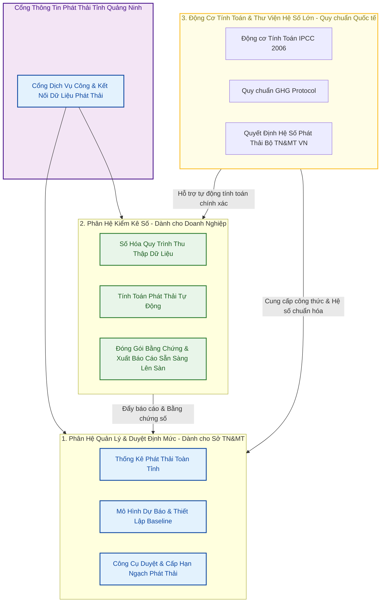

# ĐỀ XUẤT GIẢI PHÁP CÔNG NGHỆ: HỆ THỐNG SỐ HÓA KIỂM KÊ VÀ QUẢN LÝ HẠN NGẠCH PHÁT THẢI TỈNH QUẢNG NINH
### *Đơn vị xây dựng giải pháp: Link Strategy (LS)*

---

## I. BỐI CẢNH VÀ THÁCH THỨC CỦA CƠ QUAN QUẢN LÝ (DONRE)
Trong lộ trình hướng tới Net Zero và vận hành thí điểm sàn giao dịch tín chỉ carbon tại Việt Nam, Sở TN&MT Quảng Ninh đối mặt với 3 thách thức lớn trong công tác quản lý nhà nước:
1.  **Thiếu công cụ giám sát tập trung:** Việc thống kê phát thải của các doanh nghiệp trọng điểm hiện nay chủ yếu dựa trên báo cáo giấy hoặc file Excel thủ công, rất khó đối soát, kiểm tra tính xác thực và tốn nhiều thời gian.
2.  **Khó khăn trong việc thẩm định và phê duyệt định mức (Hạn ngạch):** Việc tính toán và cấp hạn ngạch phát thải cho từng ngành/doanh nghiệp đòi hỏi đối chiếu phức tạp với cơ sở dữ liệu quốc gia và quốc tế (IPCC).
3.  **Áp lực chuyển đổi cho Doanh nghiệp địa phương:** Các doanh nghiệp (đặc biệt là khối FDI và sản xuất xuất khẩu) đang lúng túng trong quy trình kiểm kê phát thải để đáp ứng các tiêu chuẩn xuất khẩu (CBAM) và sẵn sàng tham gia sàn giao dịch carbon.

---

## II. HỆ THỐNG GIẢI PHÁP CÔNG NGHỆ CỦA LINK STRATEGY (LS)
Link Strategy (LS) đề xuất giải pháp kiến trúc phần mềm tích hợp gồm 2 phân hệ cốt lõi: **Phân hệ Quản lý Nhà nước (dành cho Sở TN&MT)** và **Phân hệ Hỗ trợ Kiểm kê (dành cho Doanh nghiệp)**.

---

## III. CHI TIẾT CÁC PHÂN HỆ PHẦN MỀM

### 1. Phân hệ dành cho Sở TN&MT (Bộ công cụ Phê duyệt & Giám sát)
*   **Hệ thống giám sát định mức phát thải (Emission Quota Dashboard):** Trực quan hóa tổng lượng phát thải của tỉnh theo ngành (Vận tải, Công nghiệp nặng, Năng lượng, Chất thải) và theo địa bàn huyện/thị xã.
*   **Công cụ thiết lập và duyệt Đường cơ sở (Baseline & Quota Allocator):** Cho phép Sở TN&MT nhập các chỉ tiêu phát thải mục tiêu của tỉnh để tự động tính toán, phân bổ và phê duyệt hạn ngạch phát thải cho từng doanh nghiệp trọng điểm hàng năm.
*   **Hệ thống Thẩm định Báo cáo tự động:** Tự động kiểm tra tính bất thường của số liệu doanh nghiệp gửi lên thông qua các thuật toán đối chiếu chéo (Cross-reconciliation) giữa dữ liệu tiêu thụ năng lượng đầu vào và sản lượng đầu ra.

### 2. Phân hệ dành cho Doanh nghiệp (Nền tảng chuẩn bị lên sàn Carbon)
*   **Chuẩn hóa dữ liệu đầu vào (Digital Ingestion):** Hướng dẫn doanh nghiệp số hóa các nguồn dữ liệu phát thải (tiêu thụ điện, xăng dầu, nguyên vật liệu đầu vào, lượng chất thải) thay thế cho việc nhập liệu Excel thủ công dễ sai sót.
*   **Động cơ tính toán phát thải thông minh (Calculation Engine):** 
    *   Tự động áp dụng hệ số phát thải chuẩn quốc gia theo **Quyết định của Bộ TN&MT Việt Nam** đối với điện lưới và nhiên liệu nội địa.
    *   Tự động áp dụng hướng dẫn chuyên sâu của **IPCC 2006** và **GHG Protocol** đối với các hoạt động đặc thù.
*   **Đóng gói Bằng chứng số phục vụ Kiểm toán (Auditable Evidence Pack):** Tạo ra hồ sơ phát thải có cấu trúc rõ ràng, liên kết trực tiếp giữa số liệu báo cáo và hóa đơn/chỉ số công tơ đầu vào. Đây là điều kiện bắt buộc để doanh nghiệp được các tổ chức kiểm toán quốc tế (TÜV/SGS) phê duyệt trước khi đưa tín chỉ carbon lên sàn giao dịch.

---

## IV. NỀN TẢNG DẪN CHỨNG KHOA HỌC SẴN CÓ CỦA LINK STRATEGY (LS)
Link Strategy đã xây dựng và tích hợp thành công toàn bộ cơ sở tri thức khoa học và pháp lý quốc tế vào nhân lõi tính toán của phần mềm, bao gồm:
1.  **IPCC 2006 Guidelines (Đầy đủ 5 Volumes):** Đã được LS số hóa thành các quy tắc và công thức lập trình để tính toán phát thải cho mọi ngành nghề.
2.  **GHG Protocol & Scope 2 Guidance:** Đã được lập trình hóa để phân bổ chính xác nguồn điện tự dùng (Solar/Wind) và điện lưới quốc gia.
3.  **Quyết định Công bố Hệ số Phát thải của Bộ TN&MT Việt Nam:** Tích hợp đầy đủ danh mục hệ số phát thải nội địa để đảm bảo tính hợp pháp tối cao của báo cáo khi nộp cho cơ quan quản lý.

---

## V. ĐỀ XUẤT LỘ TRÌNH HỢP TÁC VỚI SỞ TN&MT QUẢNG NINH
Để chuẩn bị cho chuyến thăm sắp tới của Lãnh đạo Sở TN&MT Quảng Ninh tại văn phòng LS, chúng tôi đề xuất chương trình làm việc xoay quanh:
1.  **Trình diễn Live Demo:** LS trình diễn trực quan cách thức phần mềm tự động thu thập dữ liệu năng lượng, áp dụng hệ số phát thải Việt Nam (MONRE) và quốc tế (IPCC) để tính toán hạn ngạch và phê duyệt phát thải theo thời gian thực.
2.  **Thảo luận Chương trình Thí điểm Cấp tỉnh:** Đề xuất phối hợp thí điểm áp dụng phần mềm của LS để hỗ trợ một nhóm doanh nghiệp trọng điểm tại Quảng Ninh kiểm kê khí nhà kính, xây dựng mô hình mẫu chuẩn bị sẵn sàng cho sàn giao dịch carbon.
