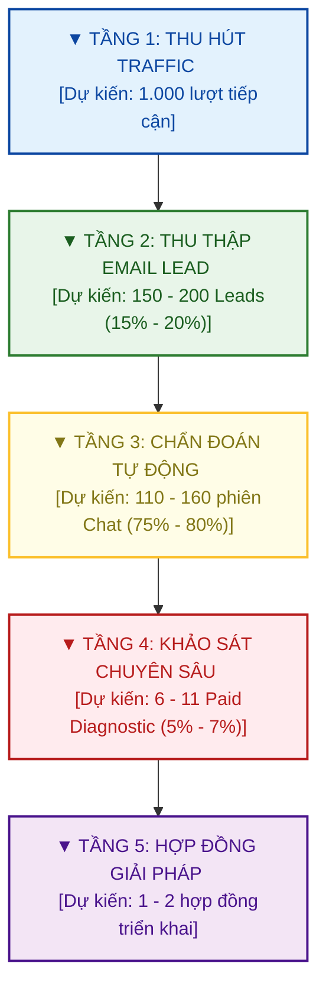

# CHIẾN LƯỢC TRUYỀN THÔNG & PHỄU CHUYỂN ĐỔI SỐ TỰ ĐỘNG (GTM)
## **Dự án: LS Auditor Support System (LS-ASS)**

Tài liệu này xác lập chiến lược tiếp cận thị trường (Go-To-Market - GTM) và phễu chuyển đổi số tự động hóa của Link Strategy để tiếp cận cấp quản trị C-Suite (CFO/CEO) trong các doanh nghiệp quy mô vừa và lớn.

---

## I. PHỄU CHUYỂN ĐỔI SỐ TỰ ĐỘNG

### 1. Mô hình Phễu chuyển đổi tự động (Automated Conversion Funnel)
Để giảm thiểu tối đa chi phí vận hành (OpEx) và loại bỏ rào cản phòng thủ tâm lý của khách hàng, Link Strategy sử dụng **công cụ tương tác chẩn đoán tự động** làm hạt nhân đầu phễu. Khách hàng được tự do chẩn đoán, nhận thức rủi ro một cách an toàn và riêng tư trước khi quyết định làm việc với chuyên gia con người của LS.

### 2. Định hướng Giai đoạn 12-24 tháng đầu (Survival & Deal Acquisition)
Tập trung toàn lực vào mục tiêu sống sót và tính lặp lại (Survival & Repeatability). Ưu tiên số một là giảm ma sát niềm tin (reduce trust friction) để chinh phục thành công **3 - 5 hợp đồng triển khai thực tế (Intervention Contracts)** đầu tiên làm bảo chứng năng lực, chưa tập trung vào mở rộng quy mô inbound hay xây dựng tệp khán giả đại trà.

---

## II. PHÂN KHÚC KHÁCH HÀNG MỤC TIÊU & NỖI ĐAU CỐT LÕI

| Đối tượng | Vai trò | Nỗi đau cốt lõi (Pain Points) | Động lực chuyển đổi (Drivers) |
|---|---|---|---|
| **CFO** (Giám đốc Tài chính) | Người gác cổng ngân sách | - Dòng tiền kẹt ở tồn kho, nợ xấu. - Mua sắm phình to, vượt hạn mức duyệt. - Dữ liệu báo cáo tài chính bị chậm, lệch. | - Giảm chi phí vận hành (OpEx). - Tối ưu hóa vốn lưu động. - Báo cáo đối soát tự động, tin cậy. |
| **CEO / Founder** (Giám đốc Điều hành) | Người quyết định tối cao | - Biên lợi nhuận mỏng dần dù doanh thu tăng. - Nhân viên tự phát chạy quy trình ngoài hệ thống (Zalo, Excel). - Hệ thống phần mềm cũ (ERP, CRM) chạy kém hiệu quả. | - Bảo vệ biên lợi nhuận. - Nâng cao năng suất nhân sự. - Chuẩn hóa vận hành để mở rộng quy mô (scale). |
| **COO** (Giám đốc Vận hành) | Người thực thi hiện trường | - Máy móc downtime, hao hụt nguyên vật liệu. - Giao hàng trễ hẹn, vi phạm cam kết SLA. - Quy trình phê duyệt bằng tay chậm chạp. | - Giảm lãng phí vận hành. - Giám sát tiến độ đơn hàng thời gian thực. - Tự động hóa kiểm soát phê duyệt. |

---

## III. KIẾN TRÚC PHỄU CHUYỂN ĐỔI SỐ TỰ ĐỘNG

### Tầng 1: Tạo lưu lượng truy cập (Traffic Generation)
*   **Kênh chính:** LinkedIn cá nhân của các Founder/Partners, Facebook và các group cộng đồng quản trị doanh nghiệp.
*   **Nội dung bài viết:** Xây dựng theo định hướng nội dung tại [LS_Content_Strategy.md](file:///d:/BusinessAnalyze/LS/LS_Auditor_System/docs/LS_Content_Strategy.md).
*   **CTA chính:** Hướng dẫn truy cập Landing Page để tự chẩn đoán lỗi vận hành miễn phí qua hệ thống chẩn đoán tự động.

### Tầng 2: Nam châm thu hút & Thu thập Email Lead (Lead Magnet & Landing Page)
*   Khách hàng điền thông tin cơ bản (Họ tên, Chức vụ, Email công việc, Tên công ty) để bắt đầu phiên chẩn đoán tự động hoặc sử dụng các công cụ chấm điểm tự chẩn đoán tương tác (Interactive Diagnostic Assets) như **ERP Graveyard Score** (mức độ phế thải hệ thống) hoặc **Shadow Operation Scanner** (tần suất bypass quy trình).

*   **Cầu nối Nuôi dưỡng (Email Nurturing Sequence):**
    Hệ thống tự động kích hoạt chuỗi email nuôi dưỡng định kỳ:
    *   **Email 1 (Ngay lập tức):** Gửi tài liệu checklist/playbook hoặc kết quả chấm điểm rủi ro.
    *   **Email 2 (Sau 2 ngày):** Case study thực tế: Cách một chuỗi bán lẻ/sản xuất thu hồi 1.5 tỷ thất thoát nhờ kiểm toán dữ liệu.
    *   **Email 3 (Sau 4 ngày):** Hướng dẫn cấu trúc dữ liệu thô cần thiết để tự chẩn đoán.
    *   **Email 4 (Sau 7 ngày):** Lời mời trực tiếp từ hệ thống đối soát: *"Hãy thử chẩn đoán nhanh để phác thảo bản đồ rủi ro vận hành doanh nghiệp của bạn."*

### Tầng 3: Chẩn đoán tự động qua AI Auditor Agent (AI Agent Chat Session)
*   Khách hàng trò chuyện trực tiếp với AI Agent chuyên gia kiểm toán vận hành trên môi trường Web bảo mật. Khách hàng tự do chia sẻ kịch bản vận hành thực tế mà không lo ngại rò rỉ dữ liệu hoặc bị phán xét.
*   **Nguyên tắc vận hành (AI Forensic Guide):** AI Agent không đưa ra giải pháp đầy đủ cuối cùng để thay thế tư vấn viên chuyên nghiệp (tránh thu hút nhóm "free-riders"). AI chỉ đóng vai trò chẩn đoán, phát hiện lỗ hổng và mô hình hóa rủi ro để tạo sự hoài nghi định lượng (**Quantified Suspicion**).
*   **Hệ thống AI xử lý tự động:** Nhận diện lỗ hổng kiểm soát, tự động vẽ sơ đồ Mermaid, tính toán giả thuyết thất thoát và xuất file PDF gửi trực tiếp qua email khách hàng.

### Tầng 4: Dự án chẩn đoán có phí (Paid Diagnostic Project)
*   Từ kết quả báo cáo chẩn đoán tự động, Link Strategy tiếp cận đề xuất ký NDA bảo mật và triển khai **Dự án chẩn đoán dữ liệu có phí (Paid Diagnostic Project)**.
*   Đội ngũ LS dùng công cụ **LS-ASS** nội bộ để đối soát dữ liệu thật để xuất ra **Báo cáo kiểm toán bằng bằng chứng (Evidence Pack)**.

### Tầng 5: Hợp đồng triển khai giải pháp can thiệp (Solution/Intervention Contract)
*   Dựa trên các bằng chứng rò rỉ dòng tiền thực tế được phát hiện ở Tầng 4, Link Strategy đề xuất ký hợp đồng dịch vụ triển khai giải pháp can thiệp công nghệ để tự động chặn các điểm lỗi.
*   **Chi tiết công nghệ:** Tùy biến tích hợp các giải pháp tự động hóa nâng cao (như quy trình tự động hóa AI, cảm biến IoT, mô hình học máy ML hoặc thị giác máy tính CV) tùy theo lỗi hệ thống thực tế.
*   Mọi giải pháp đều cam kết chỉ số ROI cụ thể dựa trên số tiền thất thoát thực tế thu hồi được.

---

## IV. DỰ BÁO HIỆU QUẢ CHUYỂN ĐỔI (FORECAST & PERFORMANCE METRICS)

Áp dụng phễu chuyển đổi tự động dự kiến mang lại các cải tiến hiệu suất vượt trội so với mô hình gọi điện truyền thống:

### 1. Dự báo Chỉ số Phễu chuyển đổi (Quy mô 1.000 lượt Traffic ban đầu)

| Chỉ số phễu | Mô hình Cũ (Gọi điện 15 phút) | Mô hình Mới (Chẩn đoán tự động) | So sánh & Ý nghĩa chiến lược |
|---|---|---|---|
| **Tỷ lệ khởi chạy (Opt-in Rate)** | ~2% - 3% (20 - 30 lượt hẹn) | **~15% - 20%** (150 - 200 lượt chẩn đoán) | **Tăng gấp 6 lần.** Loại bỏ ma sát đặt lịch, đáp ứng nhu cầu tương tác ngay lập tức. |
| **Tỷ lệ hoàn thành (Completion Rate)** | ~50% (Rụng lịch do quên/bận) | **~75% - 80%** (110 - 160 lượt tương tác) | Trải nghiệm phản hồi tức thì giúp duy trì sự chú ý cao. |
| **Tỷ lệ ký NDA (Paid Diagnostic)** | ~10% (2 - 3 dự án) | **~5% - 7%** (6 - 11 dự án) | Tỷ lệ chốt trực tiếp thấp hơn người, nhưng sản lượng tuyệt đối tăng gấp 3-4 lần. |
| **Chi phí thu thập lead (Cost per SQL)** | Cao (Tốn nhân sự nuôi dưỡng) | **Giảm 60% - 70%** | Tự động hóa khâu chẩn đoán ban đầu giúp giảm chi phí nhân sự tối đa. |

### 2. Dự báo Hành vi Khách hàng & Tốc độ Vận hành
*   **Tâm lý chia sẻ an toàn:** Khách hàng (CFO/CEO) có xu hướng mô tả chi tiết lỗi quy trình thực tế khi tương tác với một công cụ tự chẩn đoán bảo mật và riêng tư hơn là một chuyên gia tư vấn lạ.
*   **Thời gian phản hồi (Time-to-Value):** Rút ngắn chu kỳ ra Giả thuyết Thất thoát từ **10-15 ngày xuống còn vài phút**. Khách hàng nhận ngay bản báo cáo PDF cá nhân hóa sau khi kết thúc phiên chẩn đoán.
*   **Tích lũy tài nguyên dữ liệu:** Mọi dữ liệu thu thập qua biểu mẫu chẩn đoán được chuẩn hóa cấu trúc tự động, giúp Link Strategy có bộ dữ liệu phản ánh chính xác các "bệnh trạng" phổ biến của thị trường để cải tiến Rule Pack liên tục.

### 3. Bộ KPI đo lường độ tích lũy niềm tin (Strategic Trust Metrics)
Bên cạnh phễu chuyển đổi truyền thống, Link Strategy tập trung đo lường:
*   **Repeat Audience Rate:** Tỷ lệ độc giả quay lại đọc và tương tác với các bài phân tích sâu của Founder trên LinkedIn/YouTube.
*   **Narrative Penetration:** Tần suất khách hàng chủ động sử dụng thuật ngữ như "Shadow Operations" hay "Software Graveyard" khi liên hệ thảo luận chiến lược.
*   **Trust Density:** Tổng thời gian khách hàng tương tác sâu với các tài nguyên động và công cụ chẩn đoán tự động.
