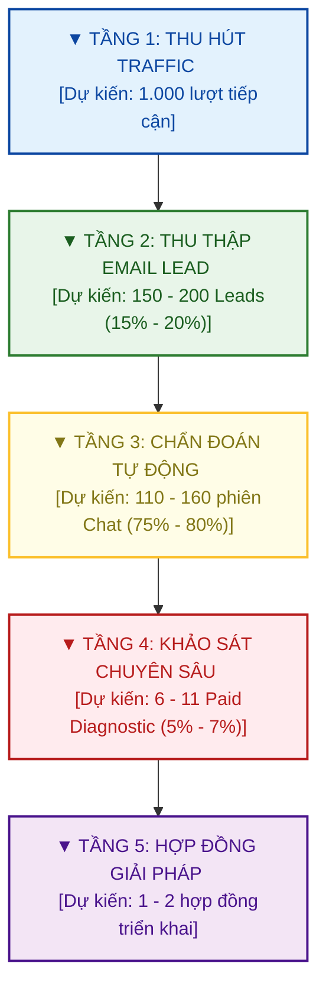

# CHIẾN LƯỢC TRUYỀN THÔNG & PHỄU CHUYỂN ĐỔI SỐ TỰ ĐỘNG (GTM)
## **Dự án: LS Auditor Support System (LS-ASS)**

Tài liệu này xác lập chiến lược tiếp cận thị trường (Go-To-Market - GTM) và phễu chuyển đổi tự động hóa bằng AI của Link Strategy để tiếp cận cấp quản trị C-Suite (CFO/CEO) trong các doanh nghiệp quy mô vừa và lớn.

---

## I. TẦM NHÌN CHIẾN LƯỢC & ĐỊNH VỊ THƯƠNG HIỆU

### 1. Triết lý "Tư vấn từ Thất thoát đến Giải pháp" (Leakage-Led Consulting)
Link Strategy không bán dịch vụ kiểm toán truyền thống (không bắt lỗi cá nhân hay làm dày hồ sơ thủ tục). Chúng tôi định vị là đơn vị **"Khai thác dòng tiền bị kẹt"** và **"Giải cứu giá trị hệ thống phần mềm cũ"**. 
*   **Cái nêm thương mại (Commercial Wedge):** Thất thoát tài chính thực tế (Leakage) là thứ duy nhất thu hút sự chú ý tức thì của CFO/CEO.
*   **Giá trị giải pháp (Intervention Value):** Sử dụng các giải pháp công nghệ tiên tiến (Data, IoT, Machine Learning, Computer Vision, AI Agent) để thu hồi dòng tiền thất thoát đó.

### 2. Mô hình Phễu tự động hóa bằng AI (AI-Driven Conversion Funnel)
Để giảm thiểu tối đa chi phí vận hành (OpEx) và loại bỏ rào cản phòng thủ tâm lý của khách hàng, Link Strategy sử dụng **AI Auditor Agent** làm hạt nhân tương tác đầu phễu. Khách hàng được tự do chẩn đoán, nhận thức rủi ro một cách an toàn và riêng tư trước khi quyết định làm việc với chuyên gia con người của LS.

---

## II. PHÂN KHÚC KHÁCH HÀNG MỤC TIÊU & NỖI ĐAU CỐT LÕI

| Đối tượng | Vai trò | Nỗi đau cốt lõi (Pain Points) | Động lực chuyển đổi (Drivers) |
|---|---|---|---|
| **CFO** (Giám đốc Tài chính) | Người gác cổng ngân sách | - Dòng tiền kẹt ở tồn kho, nợ xấu.<br>- Mua sắm phình to, vượt hạn mức duyệt.<br>- Dữ liệu báo cáo tài chính bị chậm, lệch. | - Giảm chi phí vận hành (OpEx).<br>- Tối ưu hóa vốn lưu động.<br>- Báo cáo đối soát tự động, tin cậy. |
| **CEO / Founder** (Giám đốc Điều hành) | Người quyết định tối cao | - Biên lợi nhuận mỏng dần dù doanh thu tăng.<br>- Nhân viên tự phát chạy quy trình ngoài hệ thống (Zalo, Excel).<br>- Hệ thống phần mềm cũ (ERP, CRM) chạy kém hiệu quả. | - Bảo vệ biên lợi nhuận.<br>- Nâng cao năng suất nhân sự.<br>- Chuẩn hóa vận hành để mở rộng quy mô (scale). |
| **COO** (Giám đốc Vận hành) | Người thực thi hiện trường | - Máy móc downtime, hao hụt nguyên vật liệu.<br>- Giao hàng trễ hẹn, vi phạm cam kết SLA.<br>- Quy trình phê duyệt bằng tay chậm chạp. | - Giảm lãng phí vận hành.<br>- Giám sát tiến độ đơn hàng thời gian thực.<br>- Tự động hóa kiểm soát phê duyệt. |

---

## III. KIẾN TRÚC PHỄU CHUYỂN ĐỔI SỐ TỰ ĐỘNG



### Tầng 1: Tạo lưu lượng truy cập (Traffic Generation)
*   **Kênh chính:** LinkedIn cá nhân của các Founder/Partners, Facebook và các group cộng đồng quản trị doanh nghiệp.
*   **Nội dung bài viết:** Tập trung viết các Case Study thực tế về rò rỉ dòng tiền vận hành, bóc tách lỗi hệ thống.
*   **CTA chính:** Hướng dẫn truy cập Landing Page để trò chuyện trực tiếp với **AI Auditor Agent** để chẩn bệnh vận hành miễn phí.

### Tầng 2: Nam châm thu hút & Thu thập Email Lead (Lead Magnet & Landing Page)
*   Khách hàng điền thông tin cơ bản (Họ tên, Chức vụ, Email công việc, Tên công ty) để bắt đầu phiên chẩn đoán tự động của AI Auditor Agent hoặc tải tài liệu *"Checklist 10 Điểm Rò Rỉ Tiền Mặt Doanh Nghiệp Thường Gặp"*.

*   **Cầu nối Nuôi dưỡng (Email Nurturing Sequence):**
    Hệ thống tự động kích hoạt chuỗi email nuôi dưỡng định kỳ:
    *   **Email 1 (Ngay lập tức):** Gửi tài liệu checklist/playbook đã đăng ký tải.
    *   **Email 2 (Sau 2 ngày):** Case study thực tế: Cách một chuỗi bán lẻ/sản xuất thu hồi 1.5 tỷ thất thoát nhờ kiểm toán dữ liệu.
    *   **Email 3 (Sau 4 ngày):** Hướng dẫn cấu trúc dữ liệu thô cần thiết để tự chẩn đoán.
    *   **Email 4 (Sau 7 ngày):** Lời mời trực tiếp từ AI Auditor Agent: *"Hãy thử 5 phút chat với tôi để phác thảo bản đồ rủi ro vận hành doanh nghiệp của bạn."*

### Tầng 3: Chẩn đoán tự động qua AI Auditor Agent (AI Agent Chat Session)
*   Khách hàng trò chuyện trực tiếp với AI Agent chuyên gia kiểm toán vận hành trên môi trường Web bảo mật.
*   Khách hàng tự do chia sẻ kịch bản vận hành thực tế mà không lo ngại rò rỉ dữ liệu hoặc bị phán xét.
*   **Hệ thống AI xử lý tự động:** Nhận diện lỗ hổng kiểm soát, tự động vẽ sơ đồ Mermaid, tính toán giả thuyết thất thoát và xuất file PDF gửi trực tiếp qua email khách hàng.

### Tầng 4: Dự án chẩn đoán có phí (Paid Diagnostic Project)
*   Từ kết quả báo cáo chẩn đoán của AI Agent, Link Strategy tiếp cận đề xuất ký NDA bảo mật và triển khai **Dự án chẩn đoán dữ liệu có phí (Paid Diagnostic Project)**.
*   Đội ngũ LS dùng công cụ **LS-ASS** nội bộ để đối soát dữ liệu thật để xuất ra **Báo cáo kiểm toán bằng bằng chứng (Evidence Pack)**.

### Tầng 5: Hợp đồng triển khai giải pháp can thiệp (Solution/Intervention Contract)
*   Dựa trên các bằng chứng rò rỉ dòng tiền thực tế được phát hiện ở Tầng 4, Link Strategy đề xuất ký hợp đồng dịch vụ triển khai giải pháp can thiệp công nghệ để tự động chặn các điểm lỗi.
*   Mọi giải pháp đều cam kết chỉ số ROI cụ thể dựa trên số tiền thất thoát thực tế thu hồi được.

---

## IV. KỊCH BẢN HỘI THOẠI MẪU CỦA AI AUDITOR AGENT

Dưới đây là thiết kế kịch bản trò chuyện mẫu chứng minh năng lực chẩn đoán logic của AI Agent:

*   **Khách hàng:** *"Chào Agent, tôi là CEO của một chuỗi bán lẻ thời trang quy mô doanh thu 200 tỷ/năm. Chúng tôi đang dùng ERP Odoo nhưng nhân viên bán hàng tại shop thường xuyên tự ý giảm giá (discount) cho người quen mà hệ thống không chặn được, cuối tháng đối soát rất lệch."*
*   **AI Auditor Agent:** 
    > *"Chào anh/chị. Tôi đã ghi nhận thông tin doanh nghiệp bán lẻ thời trang quy mô 200 tỷ, sử dụng Odoo ERP và đang gặp rủi ro rò rỉ giảm giá (Discount Leakage) tại cửa hàng.*
    > 
    > *Dựa trên mô tả của anh/chị, tôi xác định đây là lỗ hổng kiểm soát loại **Bỏ qua quyền phê duyệt (Approval Bypass)**. Hệ thống Odoo của anh/chị có thể chưa được cấu hình chặn cứng hạn mức chiết khấu tại POS, hoặc nhân viên đang dùng chung tài khoản quản lý để phê duyệt.*
    >
    > *Dưới đây là sơ đồ rủi ro vận hành thực tế tôi phác thảo cho anh/chị:*
    > 
    > ```mermaid
    > graph TD
    >     A[Nhân viên POS nhập đơn hàng] --> B{Có áp mã giảm giá?}
    >     B -->|Có| C[Hệ thống Odoo không chặn cứng hạn mức]
    >     C --> D[Áp discount sai chính sách]
    >     D --> E[Thất thoát biên lợi nhuận thực tế]
    >     E --> F[Đối soát cuối tháng lệch dữ liệu]
    > ```
    >
    > *Với quy mô 200 tỷ/năm, nếu tỷ lệ discount sai chính sách chiếm khoảng 1.5% doanh thu, chuỗi của anh/chị đang bị **thất thoát khoảng 3 tỷ VNĐ/năm** trực tiếp vào dòng tiền.*
    > 
    > *Để giúp anh/chị chẩn đoán sâu hơn: Anh/chị có thể export file nhật ký giao dịch bán hàng (POS sales logs) trong 1 tháng gần nhất ra Excel được không? Tôi có thể hướng dẫn anh/chị cách kiểm tra chéo ngay."*
*   **Khách hàng:** *"Chúng tôi xuất được file POS log, nhưng dữ liệu này bảo mật nên tôi không thể tải lên đây."*
*   **AI Auditor Agent:**
    > *"Tôi hoàn toàn hiểu mối quan ngại về bảo mật dữ liệu của anh/chị. Dữ liệu tài chính là tài sản tối mật.*
    >
    > *Để giải quyết vấn đề này, tôi đã tạo sẵn một file PDF **Giả thuyết Thất thoát (Account Thesis)** chi tiết dành riêng cho doanh nghiệp bán lẻ quy mô 200 tỷ, kèm theo danh mục 5 cột dữ liệu tối thiểu cần kiểm tra và mẫu thỏa thuận bảo mật NDA mẫu.*
    >
    > *Tôi đã gửi tài liệu này qua email đăng ký của anh/chị. Anh/chị có thể tham khảo mẫu NDA và phản hồi lại email để chuyên gia của Link Strategy hỗ trợ chẩn đoán an toàn trên môi trường offline."*

---

## V. KẾ HOẠCH HÀNH ĐỘNG 90 NGÀY ĐẦU TIÊN (90-DAY ACTION PLAN)

> [!IMPORTANT]
> **Tháng 1: Xây dựng Tài sản Số cốt lõi**
> - Biên soạn tài liệu Lead Magnet: *"Checklist 10 Điểm Rò Rỉ Tiền Mặt Doanh Nghiệp Thường Gặp"*.
> - Thiết lập Landing Page tối giản có tích hợp cổng đăng ký email.
> - Xây dựng chuỗi 4 email nuôi dưỡng tự động trên Mailchimp/SendGrid.

> [!TIP]
> **Tháng 2: Phát triển AI Agent & Chạy truyền thông**
> - Thiết lập System Prompt và kịch bản chat chi tiết cho **AI Auditor Agent** kết nối qua OpenAI Assistants API.
> - Tích hợp khung chat (Web Widget) của AI Agent trực tiếp lên Landing Page.
> - Xuất bản tối thiểu 2 bài viết phân tích Case Study nghiệp vụ/tuần trên LinkedIn của các Founders.
> - Mục tiêu: Thu hút 100 lead tải tài liệu, chuyển đổi 15-20 phiên chat hoàn chỉnh với AI Agent.

> [!NOTE]
> **Tháng 3: Thu hoạch thông tin & Ký hợp đồng**
> - Theo dõi dữ liệu phân tích hội thoại từ AI Agent để xác định các lead có điểm rủi ro vận hành cao (Hot Leads).
> - Gửi email chăm sóc cá nhân hóa kèm dự thảo hợp đồng dịch vụ chẩn đoán dữ liệu có phí (Paid Diagnostic).
> - Mục tiêu: Ký thành công ít nhất 1-2 hợp đồng Paid Diagnostic đầu tiên.

---

## VI. DỰ BÁO HIỆU QUẢ CHUYỂN ĐỔI (FORECAST & PERFORMANCE METRICS)

Áp dụng phễu chuyển đổi số tự động qua AI Agent dự kiến mang lại các cải tiến hiệu suất vượt trội so với mô hình gọi điện truyền thống:

### 1. Dự báo Chỉ số Phễu chuyển đổi (Quy mô 1.000 lượt Traffic ban đầu)

| Chỉ số phễu | Mô hình Cũ (Gọi điện 15 phút) | Mô hình Mới (AI Agent Chat) | So sánh & Ý nghĩa chiến lược |
|---|---|---|---|
| **Tỷ lệ khởi chạy (Opt-in Rate)** | ~2% - 3% (20 - 30 lượt hẹn) | **~15% - 20%** (150 - 200 lượt chat) | **Tăng gấp 6 lần.** Loại bỏ ma sát đặt lịch, đáp ứng nhu cầu tương tác ngay lập tức. |
| **Tỷ lệ hoàn thành (Completion Rate)** | ~50% (Rụng lịch do quên/bận) | **~75% - 80%** (110 - 160 cuộc chat) | Trải nghiệm phản hồi tức thì của AI giúp duy trì sự chú ý cao. |
| **Tỷ lệ ký NDA (Paid Diagnostic)** | ~10% (2 - 3 dự án) | **~5% - 7%** (6 - 11 dự án) | Tỷ lệ chốt trực tiếp thấp hơn người, nhưng sản lượng tuyệt đối tăng gấp 3-4 lần. |
| **Chi phí thu thập lead (Cost per SQL)** | Cao (Tốn nhân sự nuôi dưỡng) | **Giảm 60% - 70%** | Tự động hóa khâu chẩn đoán ban đầu giúp giảm chi phí nhân sự tối đa. |

### 2. Dự báo Hành vi Khách hàng & Tốc độ Vận hành
*   **Tâm lý chia sẻ an toàn:** Khách hàng (CFO/CEO) có xu hướng mô tả chi tiết lỗi quy trình thực tế khi tương tác với một AI Agent bảo mật, phi phán xét hơn là một chuyên gia tư vấn lạ.
*   **Thời gian phản hồi (Time-to-Value):** Rút ngắn chu kỳ ra Giả thuyết Thất thoát từ **10-15 ngày xuống còn 5 phút**. Khách hàng nhận ngay bản báo cáo PDF cá nhân hóa sau khi kết thúc phiên chat.
*   **Tích lũy tài nguyên dữ liệu:** Mọi dữ liệu thu thập qua chatbot được chuẩn hóa cấu trúc tự động, giúp Link Strategy có bộ dữ liệu phản ánh chính xác các "bệnh trạng" phổ biến của thị trường để cải tiến Rule Pack liên tục.
