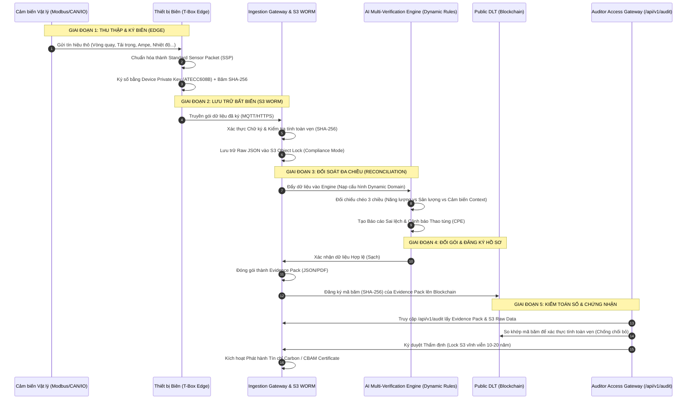

# LeTRON Carbon Ledger Service: Generic Trust Machine Framework
**Version:** 1.1.0  
**Status:** Architecture Specification (Updated with Zero Site-Visit & Dynamic Domain Schema)  
**Sponsor:** Link Strategy  

---

### I. Kiến Trúc Tổng Quan (End-to-End Generic Pipeline)

Khung kiến trúc của **LeTRON Carbon Ledger** được thiết kế để chuẩn hóa dữ liệu từ bất kỳ cảm biến vật lý nào tại hiện trường, biến dữ liệu đó thành hồ sơ bằng chứng bất biến, sẵn sàng cho kiểm toán số quốc tế (VVB) và phát hành chứng chỉ carbon.



---

### II. Giao Diện Thiết Bị Biên (Generic Edge-Sensor Interface)

Để áp dụng cho mọi trường hợp (Nhà máy, Đội xe, Trạm phát điện), Thiết bị Biên (T-Box/Industrial Gateway) đóng vai trò **Bộ chuyển đổi Vạn năng (Universal Adapter)** chuyển dịch các tín hiệu công nghiệp thành một định dạng chung.

#### 1. Các Giao thức Tích hợp Vật lý
* **Mobile Assets (Đội xe, Máy công trình):** Kết nối qua cổng **CAN Bus (J1939/OBD2)** để đọc vòng quay động cơ, lượng nhiên liệu, tốc độ và dữ liệu BMS pin.
* **Stationary Assets (Nhà máy dệt, Lò hơi, Kho bãi):** Kết nối qua **Modbus RTU/TCP (RS485/Ethernet)** để đọc dữ liệu từ đồng hồ đo điện đa năng, cảm biến lưu lượng hơi nước, cảm biến dòng chảy chất lỏng.
* **Legacy Sensors (Cảm biến đời cũ):** Kết nối qua cổng I/O Analog/Digital (dòng **4-20mA**, áp **0-10V**, hoặc bộ đếm xung **Pulse Counter** cho băng chuyền).
* **Context Sensors (Bằng chứng trực quan):** Kết nối camera IP qua giao thức **RTSP/ONVIF** để chụp ảnh/video hiện trường hàng hóa, sản phẩm đầu ra làm bằng chứng vật lý.

#### 2. Cấu trúc Gói dữ liệu Chuẩn hóa - Standard Sensor Packet (SSP)
Mọi dữ liệu cảm biến sau khi thu thập tại T-Box phải được cấu trúc hóa theo định dạng JSON chuẩn dưới đây để gửi về Cloud:

```json
{
  "metadata": {
    "device_id": "TBOX-FAC-BOILER-01",
    "facility_id": "LPTEX-FABRIC-DYEING-01",
    "timestamp": "2026-05-26T08:00:00.000Z",
    "firmware_version": "v2.1.0-secure",
    "packet_sequence": 140592
  },
  "sensor_payload": {
    "energy_input": {
      "metric_name": "electricity_consumption_kwh",
      "value": 142.50,
      "source_interface": "rs485-modbus-addr02"
    },
    "operational_output": {
      "metric_name": "steam_volume_m3",
      "value": 3.42,
      "source_interface": "analog-4-20ma-channel01"
    },
    "context_verification": {
      "gps": {
        "latitude": 10.8231,
        "longitude": 106.6297
      },
      "media_hash": "e3b0c44298fc1c149afbf4c8996fb92427ae41e4649b934ca495991b7852b855",
      "media_url": "https://s3.ap-southeast-1.amazonaws.com/evidence-temp/20260526/boiler-01.jpg"
    }
  },
  "security": {
    "hashing_algorithm": "SHA-256",
    "signature": "MEQCIFz/xG+o6K38S...",
    "secure_element_nonce": "902183921"
  }
}
```

---

### III. Khung Đăng Ký Lĩnh Vực Động (Dynamic Domain Profile Registry)

Để hỗ trợ thêm các domain mới (ví dụ: nông nghiệp, tòa nhà thông minh, kho lạnh) mà không cần cấu hình lại backend, hệ thống sử dụng cơ chế đăng ký bằng **JSON Schema**. Quy trình xử lý dữ liệu và giao diện cổng kiểm toán sẽ tự động điều chỉnh động theo cấu hình này.

```json
{
  "domain_id": "LPTEX-TEXTILE-DYEING-V1",
  "domain_name": "Nhuộm hoàn tất vải - LPTex",
  "inputs": [
    { "key": "boiler_gas_m3", "type": "energy", "interface": "Modbus-RTU" },
    { "key": "factory_electricity_kwh", "type": "energy", "interface": "Modbus-TCP" }
  ],
  "outputs": [
    { "key": "dyed_fabric_meters", "type": "production", "interface": "Pulse-Counter" }
  ],
  "context_evidence": [
    { "key": "conveyor_camera_rtsp", "type": "media_verification", "engine": "AI-Object-Counter" },
    { "key": "steam_temperature", "type": "ambient_sensor", "interface": "Analog-4-20mA" }
  ],
  "verification_rules": [
    {
      "rule_id": "RULE-DYE-01",
      "formula": "factory_electricity_kwh / dyed_fabric_meters",
      "operator": "<=",
      "threshold": 0.45,
      "error_message": "Cảnh báo: Tiêu hao điện vượt định mức sản xuất"
    },
    {
      "rule_id": "RULE-DYE-02",
      "formula": "AI-Object-Counter(conveyor_camera_rtsp) / dyed_fabric_meters",
      "operator": "between",
      "threshold": [0.95, 1.05],
      "error_message": "Cảnh báo: Sai lệch số cuộn vải giữa cảm biến và AI Camera"
    }
  ]
}
```

---

### IV. Quy Trình Khử Hiện Trường (Zero Site-Visit Protocol)

Để VVB đồng ý thực hiện kiểm định **100% Online**, hệ thống áp dụng **Tam giác Bảo chứng Bằng chứng (Verification Triangle)** để tạo ra các bằng chứng không thể bác bỏ:

```
                    [1] BẢO CHỨNG THIẾT BỊ (Device Level Trust)
                     - Chữ ký phần cứng mã khóa ATECC608B trên T-Box
                     - Chống giả lập dữ liệu phần mềm
                                 /\
                                /  \
                               /    \
                              /      \
                             /________\
                            /\        /\
                           /  \      /  \
                          /    \    /    \
                         /      \  /      \
                        /________\/________\
  [2] MẮT THẦN AI (Visual AI Proof)       [3] ĐỐI CHIẾU NGOẠI BIÊN (External Cross-Check)
  - Camera AI ghi hình khoảnh khắc         - Gọi API lấy hóa đơn lưới điện EVN
  - Event-driven Media băm SHA-256         - So khớp log trạm sạc điện công cộng
```

* **1. Chữ ký số từ nguồn (Device Level Trust):** Liên kết dữ liệu với danh tính vật lý của phần cứng Edge:
  * **Cách ly khóa bảo mật:** Sử dụng chip bảo mật phần cứng chuyên dụng (Secure Element như **ATECC608B**). Khóa Private Key được sinh tự ngẫu phần cứng và khóa cứng trong ô nhớ silicon (EEPROM Slot), không thể đọc hay trích xuất bằng bất kỳ lệnh phần mềm nào.
  * **Ký số biệt lập:** CPU của T-Box gửi mã băm SHA-256 của gói dữ liệu cảm biến thô qua bus I2C/SPI vào chip bảo mật $\rightarrow$ chip thực hiện ký số ECDSA (đường cong ellip secp256r1) biệt lập bên trong phần cứng rồi trả về chữ ký số độc bản. Private Key không bao giờ rời khỏi con chip bảo mật.
  * **Chuỗi tin cậy PKI:** Mỗi Public Key tương ứng được xác thực bởi Chứng chỉ Thiết bị (Device Certificate) do chính LeTRON Root CA ký số xác thực khi xuất xưởng, đảm bảo dữ liệu gửi lên Cloud bắt buộc xuất phát từ thiết bị phần cứng thật đã qua đăng ký, chặn đứng 100% tấn công giả lập dữ liệu phần mềm (API Spoofing).
* **2. Mắt thần AI (Visual AI Proof):** Thay thế hoàn toàn việc kiểm toán viên đến tận nơi bằng bằng chứng hình ảnh được bảo chứng mật mã học:
  * **Tùy chọn phần cứng camera:**
    * **Phương án A (Edge AI Camera):** Camera IP có chip NPU tích hợp (như Hikvision DeepinView, Dahua AI Series, AXIS) chạy object detection/counting trực tiếp trên camera, không cần gửi stream về T-Box.
    * **Phương án B (Greengrass ML Inference):** Camera RTSP/ONVIF stream về T-Box → T-Box chạy model AI qua **AWS IoT Greengrass ML Inference Component** → Kết quả được ký số bởi ATECC608B.
  * **Cơ chế kích hoạt kiện (Event-driven Trigger):** Không ghi hình liên tục mà chỉ bắt đúng khoảnh khắc đo lường thực tế:
    * **Đội xe:** Cảm biến cửa thùng mở/đóng → chụp nội dung thùng xe.
    * **Nhà máy dệt:** Pulse Counter đếm đủ N mét vải → camera chụp cuộn thành phẩm.
    * **Lò hơi:** Nhiệt độ đạt ngưỡng vận hành → camera ghi xác nhận lò đang đốt thực sự.
  * **Bảo chứng tính toàn vẹn hình ảnh (Media Integrity):** Hình ảnh được băm **SHA-256 ngay tại nguồn** (trên camera hoặc T-Box) trước khi nén và truyền đi. Metadata được nhúng sẵn: `device_id`, `sensor_trigger_event`, `gps`, `utc_timestamp`. Toàn bộ gói media được đẩy vào **S3 WORM** cùng hạ tầng với raw data → bất biến.
  * **Đầu ra AI trong Triple-Verification (CP-01):** Kết quả model (ví dụ: `object_count = 47 cuộn vải`) được đưa vào **Engine CP-01** làm tầng "Context Evidence" để đối chiếu chéo với số đọc từ Pulse Counter và đồng hồ điện. Số liệu mâu thuẫn → kích hoạt Exception Alert tự động.
* **3. Đối chiếu ngoại biên độc lập (External Cross-Check):** Tự động liên kết lấy dữ liệu hóa đơn hoặc số liệu tiêu thụ từ bên thứ ba (EVN, Cấp nước đô thị, Trạm sạc pin công cộng) để đối sánh chéo với số liệu cảm biến nội bộ.

---

### V. Giao Diện Kiểm Toán Động (Dynamic Auditor Portal)

Cổng Auditor Gateway `/api/v1/audit` tự động đọc cấu hình **Domain Profile JSON** của từng dự án để render giao diện kiểm toán trực tuyến:
* **Render biểu đồ tương thích:** Tự động hiển thị các cặp đồ thị đối sánh chéo (ví dụ: Tiêu thụ dầu lò hơi vs Nhiệt độ hơi vs Số mét vải dệt).
* **Bảng báo cáo ngoại lệ (CPE Dashboard):** Chỉ hiển thị các cảnh báo khi quy tắc đối soát chéo (Verification Rules) bị phá vỡ. Nếu các quy tắc chạy đạt 100% Pass, VVB có thể hoàn thành thẩm định trong vài phút bằng cách ký số phê duyệt (`CP-06`) ngay trên cổng.
